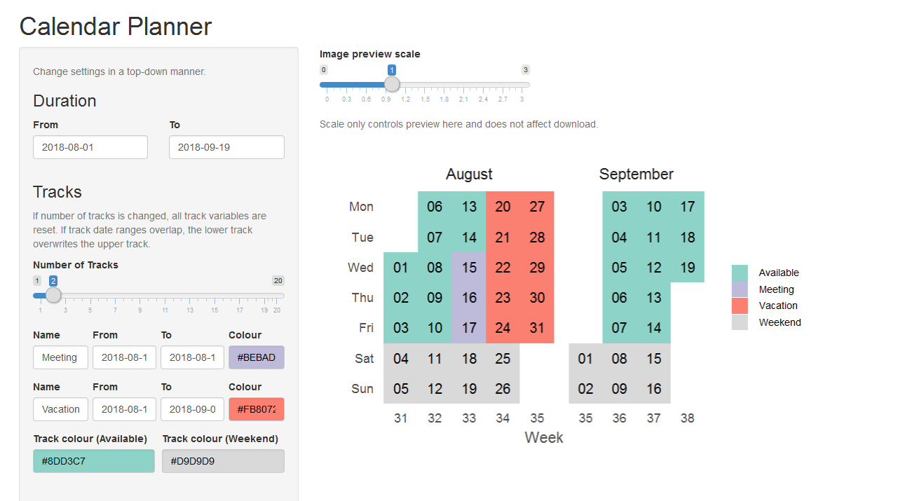

# Feedback loop {#feedback}

To create the feedback loop (to get information back from supervisors) I have began to develop a interactive shiny app within the same structure as the baseline dataset so that there is limited coding needed to create the tidypipes "cycle" of community engagement.


```r
library(knitr)
```

```
## Warning: package 'knitr' was built under R version 4.0.2
```

```r
knitr::include_graphics(path = "./img/preview.png")
```



As computational work takes over our regular management of time over the tradional hard copy "diary". I like this because important information can not be left in the "local cafe" however as I have used "gmail", "outlook" and there suites of applications and tools for calenders I have muddled everything up and missed appointments etc. 

There is alot of my development work in this section because I have attempted to combine these two packages in a way to document all the council emails and other work that I have undertaken as part of the `COVID19` pandemic in Australia.

To try and counter this I have developed a `tidypipes` workflow for my tasks, projects and other collarorations. See presentation [here](./assets/TidyPipes-calenderJUL2020.pptx).


