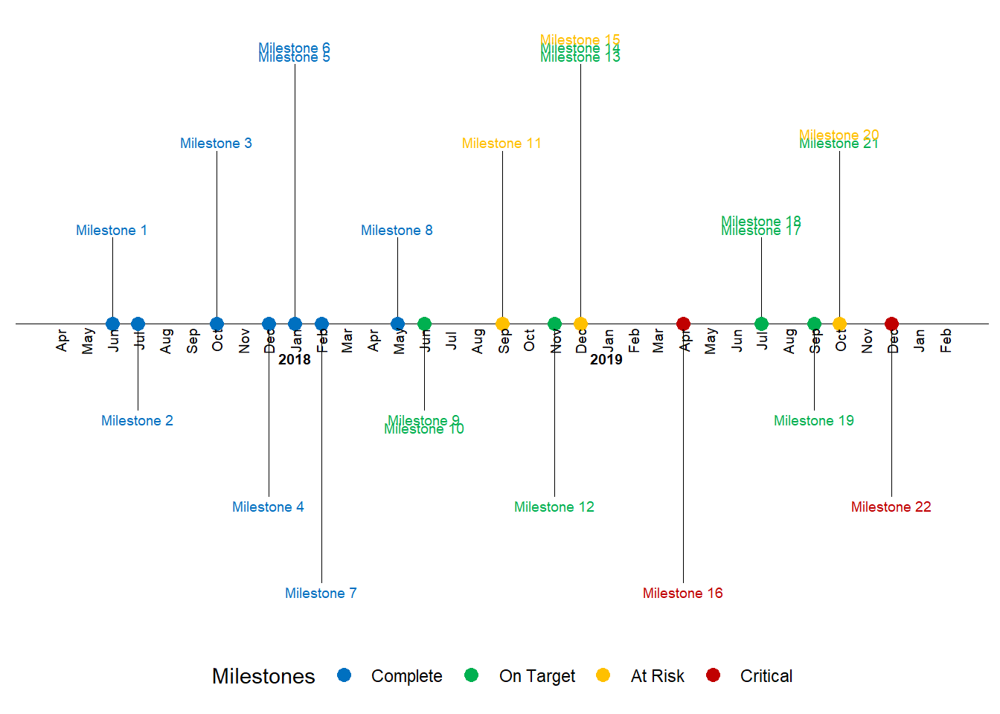

```{r include = FALSE}
library(readr)
library(dplyr)
library(ggplot2)
library(scales)
library(lubridate)
```

# Overall outputs {#outputs}

```{r message=FALSE, warning=FALSE, include=FALSE}
#### these are now as csv files for each datasheet entry
#orginal excel in Raw_data file...
#no conversion to csv to aviod same data issues...

datPhD <- readr::read_csv(here::here("./data/PhDProjects.csv"))
datCouncil <- readr::read_csv(here::here("./data/CouncilProjects.csv"))
datInvert <- readr::read_csv(here::here("./data/InvertProjects.csv"))

## Full tasks database
datBASE <- bind_rows(datPhD, datCouncil, datInvert) %>%
  filter(project != "NA") %>%
    mutate(month = as.factor(month))

levels(datBASE$month) <- c("january","february", "march", "april", "may" ,"june", "july", "august","september", "october", "november", "december")

# Now let’s load in some data
#milestones is the demo data
#actions is my data

df <- readr::read_csv(here::here('./data/milestones.csv'))

# df$status
# names(datBASE)

datBASE1 <- datBASE  %>%
    dplyr::select(startDate,month, year, milestone, status, shortName, project) %>%
                 mutate(date = as.Date(startDate, "%d/%m/%y"))
# ,
#                        month = as.numeric(as.character(month)),
#                        year = as.numeric(year),
#                        milestone = as.factor(milestone),
#                        status = as.factor(status))

# glimpse(datBASE1)
# df$date <- with(df, ymd(sprintf('%04d%02d%02d', year, month, 1)))
df <- datBASE1

# library(lubridate)
# dt <- data.frame(mon = c(10, 4), day = c(10, 4), year = c(2017, 2018))
# with(dt, ymd(paste(year, mon, day, sep = "-")))
#> [1] "2017-10-10" "2018-04-04"

# datBASE1$date <- with(datBASE1, ymd(sprintf('%04d%02d%02d', year, month, 1)))
df <- df[with(df, order(date)), ]
# head(df)
text_offset <- 0.05
```

The baseline dataset is generated by combining each final `...Project.csv` file in the data folder into a single dataset. There are three main output figures of interest currently:

## Timeline

<!--  -->

Timeline charts can be used in a lot of applications like tracking equipment or a process status changes, resource availability & scheduling, project timelines, documenting start and end times of events. The beauty of ggplot2 package is that the code can be easily customized, and more details can be added to the plots.

<!-- ```{r fig.height=6, fig.width=8, message=FALSE, warning=FALSE, include=FALSE}``` -->

## Activity

Workout timeline with a heat-map of calories burnt with activity type.

```{r message=FALSE, warning=FALSE, include=FALSE}
# names(datCouncil)
# 
# totalTIMELINE <- datBASE1 %>%
#                   dplyr::select(status, shortName, project, date,month)
# 
# ggplot(totalTIMELINE,aes(x = date, y = shortName, colour = month)) +
#   geom_point() +
#   facet_wrap(~project, scales = "free")

```


## Calendars

Calender information....'


```{r message=FALSE, warning=FALSE, include=FALSE}


```


## Plot simple

```{r}
# names(datBASE)
# datBASE$project

# ggplot(datBASE1, aes(x = date, y = shortName)) +
#   geom_point() + 
#   facet_wrap(~project, scales = "free")
```

## Final plot option 1

```{r}

```

See Ben Alex Keen's blog with the following output: 

```{r eval = F}
# timeline_plot <-filter(df, status != "NA" & project == "PhD") %>%
#   ggplot(aes(x=date,y=0, col=status, label=milestone)) +
#   labs(col="Milestones")+ 
#   # scale_color_manual(values=status_colors, labels=status_levels, drop = FALSE)+
#   theme_classic() +
#   geom_hline(yintercept=0, color = "black", size=0.3) #+
  # facet_wrap(~project)

# # Plot vertical segment lines for milestones
# timeline_plot<-timeline_plot+geom_segment(data=df[df$month_count == 1,], aes(y=position,yend=0,xend=date), color='black', size=0.2)
# 
# # Plot scatter points at zero and date
# timeline_plot<-timeline_plot+geom_point(aes(y=0), size=3)
# 
# # Don't show axes, appropriately position legend
# timeline_plot<-timeline_plot+theme(axis.line.y=element_blank(),
#                  axis.text.y=element_blank(),
#                  axis.title.x=element_blank(),
#                  axis.title.y=element_blank(),
#                  axis.ticks.y=element_blank(),
#                  axis.text.x =element_blank(),
#                  axis.ticks.x =element_blank(),
#                  axis.line.x =element_blank(),
#                  legend.position = "bottom"
#                 )
# 
# # Show text for each month
# timeline_plot<-timeline_plot+geom_text(data=month_df, aes(x=month_date_range,y=-0.1,label=month_format),size=2.5,vjust=0.5, color='black', angle=90)
# 
# # Show year text
# timeline_plot<-timeline_plot+geom_text(data=year_df, aes(x=year_date_range,y=-0.2,label=year_format, fontface="bold"),size=2.5, color='black')

# Show text for each milestone
timeline_plot<-timeline_plot+geom_text(aes(y=text_position,label=shortName),size=4)
timeline_plot
```

## Timeline {.tabset}

One of the tricky bits about timelines is the format of the date and time of each event. This is different for each event so therefore we have four columns to incorporate this information in the following from for this repository and database. This will also mean that some of the information in other formats will have to be converted into these dimension and any other elements defined in each dataset I am combining to make a overall timeline.

By integrating these stage with some `dataspice` code/approach's allows for me to generate metadata from each sheet of the excel file quickly using R. Here are the steps to do this.

```{r}
#dataspice from github
library(dataspice)

#each project needs to be imported and then saved as csv in raw_data file to document variable names etc correctly into the json dataset.
# raw_data <- 
project2 <- readxl::read_excel("./data/raw_data/Sem two planning.xlsx", sheet = 4)
project2
#date
data_actions <- readxl::read_excel("./data/raw_data/Sem two planning.xlsx", sheet = 1)
data_names <- readxl::read_excel("./data/raw_data/Sem two planning.xlsx", sheet = 3)
#time

#location

```


#### Past Outcomes

```{r}

```


### Action timeline

These sources of data are combined for my general timeline below. These summarised actions are also the flagged tasks from outlook calendar to catch up with this information but this can be automated in the future.

```{r}
# DT::datatable(emailsCalender1)
## handmade data
DT::datatable(data_actions)

# there should be an actions...
data_actions
```

### Future targets

```{r}

```

#### Plot current data

```{r}
library(ggplot2)
library(scales)
library(lubridate)

source("./R/importDATAscript.R")

# Now let’s load in some data
#milestones is the demo data
#actions is my data

df <- readr::read_csv('./data/milestones.csv')
df
```

#### Subset dataframe

to correct ggplot subset

```{r}
df$date <- with(df, ymd(sprintf('%04d%02d%02d', year, month, 1)))
df <- df[with(df, order(date)), ]
head(df)
text_offset <- 0.05

#factoring
status_levels <- c("Complete", "On Target", "At Risk", "Critical")

status_colors <- c("#0070C0", "#00B050", "#FFC000", "#C00000")

df$status <- factor(df$status, levels=status_levels, ordered=TRUE)

#direction
positions <- c(0.5, -0.5, 1.0, -1.0, 1.5, -1.5)
directions <- c(1, -1)

line_pos <- data.frame(
    "date"=unique(df$date),
    "position"=rep(positions, length.out=length(unique(df$date))),
    "direction"=rep(directions, length.out=length(unique(df$date)))
)

df <- merge(x=df, y=line_pos, by="date", all = TRUE)
df <- df[with(df, order(date, status)), ]

df$month_count <- ave(df$date==df$date, df$date, FUN=cumsum)
df$text_position <- (df$month_count * text_offset * df$direction) + df$position
head(df)

```

#### Counts

```{r}
text_offset <- 0.05

df$month_count <- ave(df$date==df$date, df$date, FUN=cumsum)
df$text_position <- (df$month_count * text_offset * df$direction) + df$position
head(df)
```

#### Buffering times


```{r}
month_buffer <- 2

month_date_range <- seq(min(df$date) - months(month_buffer), max(df$date) + months(month_buffer), by='month')
month_format <- format(month_date_range, '%b')
month_df <- data.frame(month_date_range, month_format)
```

### December/January only

```{r}
year_date_range <- seq(min(df$date) - months(month_buffer), max(df$date) + months(month_buffer), by='year')
year_date_range <- as.Date(
    intersect(
        ceiling_date(year_date_range, unit="year"),
        floor_date(year_date_range, unit="year")
    ),  origin = "1970-01-01"
)
year_format <- format(year_date_range, '%Y')
year_df <- data.frame(year_date_range, year_format)
```

#### Plot simple

```{r}
# names(datBASE)
# datBASE$project

ggplot(datBASE, aes(x = startDate, y = shortName)) +
  geom_point() + 
  facet_wrap(~project)
```

#### Final plot option 1

See Ben Alex Keen's blog with the following output: 

```{r}
timeline_plot<-ggplot(df,aes(x=date,y=0, col=status, label=milestone))
timeline_plot<-timeline_plot+labs(col="Milestones")
timeline_plot<-timeline_plot+scale_color_manual(values=status_colors, labels=status_levels, drop = FALSE)
timeline_plot<-timeline_plot+theme_classic()

# Plot horizontal black line for timeline
timeline_plot<-timeline_plot+geom_hline(yintercept=0, 
                color = "black", size=0.3)

# Plot vertical segment lines for milestones
timeline_plot<-timeline_plot+geom_segment(data=df[df$month_count == 1,], aes(y=position,yend=0,xend=date), color='black', size=0.2)

# Plot scatter points at zero and date
timeline_plot<-timeline_plot+geom_point(aes(y=0), size=3)

# Don't show axes, appropriately position legend
timeline_plot<-timeline_plot+theme(axis.line.y=element_blank(),
                 axis.text.y=element_blank(),
                 axis.title.x=element_blank(),
                 axis.title.y=element_blank(),
                 axis.ticks.y=element_blank(),
                 axis.text.x =element_blank(),
                 axis.ticks.x =element_blank(),
                 axis.line.x =element_blank(),
                 legend.position = "bottom"
                )

# Show text for each month
timeline_plot<-timeline_plot+geom_text(data=month_df, aes(x=month_date_range,y=-0.1,label=month_format),size=2.5,vjust=0.5, color='black', angle=90)
# Show year text
timeline_plot<-timeline_plot+geom_text(data=year_df, aes(x=year_date_range,y=-0.2,label=year_format, fontface="bold"),size=2.5, color='black')
# Show text for each milestone
timeline_plot<-timeline_plot+geom_text(aes(y=text_position,label=milestone),size=2.5)
print(timeline_plot)
```


### Individual projects

Each of my tasks come from a collection of overall projects I collaborate on and develop code with on timeframes that range from monthly to undefined. The current projects I have integrated into my timeline are:

### PhD

Over the duration of my PhD I have currently developed my thesis and publications to align with a 6 month hand-in date from the 1st July 2020.

```{r}
project1 <- readxl::read_excel("./data/raw_data/Sem two planning.xlsx", sheet = 3)

DT::datatable(head(project1))
```

```{r echo=FALSE, message=FALSE, warning=FALSE}
#if not installed
#install.packages("TimeProjection")
#install.packages("dplyr")
#install.packages("plyr")
#install.packages("ggplot2")

library(TimeProjection)
library(dplyr)
library(plyr)
library(ggplot2)
#change your start date here (this is valid currently only for full time accelerated entry students)
# phdcalendar("Oliver", "2015-11-30")
 

phdcalendar <- function (cname="Anthony Davidson" ,start.dt="2015-03-09")
{
library(TimeProjection)
library(dplyr)   
library(plyr)
library(ggplot2)
 
 
 start.date <- as.Date(start.dt,"%Y-%m-%d")
 
 end.date <-  seq(start.date, length=2, by="+3 year")[2] -1

 phd.length=  as.numeric(end.date-start.date) +1

 phd <- data.frame(dates=seq(start.date, end.date,"day"), item="", stringsAsFactors =FALSE)
 
#calendarHeat(phd$dates, phd$item, varname="PhD Oliver Twist")
 
phd$item[ which(phd$dates==start.date %m+% months(6))] <- "Introductory Seminar"

phd$item[ which(phd$dates==start.date %m+% months(12))] <- "Confirmation of Candidature"

#phd$item[ which(phd$dates==start.date %m+% months(12))] <- "Confirmation of Candidature"


#phd$item[ which(phd$dates==(start.date+1) %m+% months(6))] <- "Research Plan Review"
phd$item[ which( substr(phd$dates,6,15)=="03-31")] <- "Research Plan Review"

phd$item[ which( substr(phd$dates,6,15)=="09-30")] <- "Annual Progress Report"

phd$item[1] <- "Begin of Candidature"
phd$item[nrow(phd)] <- "Submission"

phd$item[ which(phd$dates==start.date %m+% months(24))] <- "Work in Progress Seminar"


  
cols <- c("pink", "blue", "grey", "orange", "red", "green","purple","yellow")# (in regards to items)
 
 
 
  tp = projectDate(phd$dates, drop = F)
    tp$values = phd$item
    tp$week = as.numeric(format(phd$dates, "%W"))
    tp$mweek = floor((day(phd$dates)- wday(phd$dates)) /7) 
    
    offset<- 0
    firstm <- month(phd$dates[1])
    firsty <- year(phd$dates[1])
    for (i in 1:nrow(tp))
    {
    
    
    if (tp$mday[i]==1 )  offset <- -tp$mweek[i]+1
    if (firstm==month(phd$dates[i]) & firsty == year(phd$dates[i]) ) offset <-    1
    tp$mweek[i]<-  tp$mweek[i] + offset
    
    }
    
    tp = ddply(tp, .(year, month), transform, monthweek = mweek)# 1 + 
        #week - min(week))
    
    tp$month <-as.factor(tp$month)
    levels(tp$month) <- month.abb[1:12]
                     
        
        
    ggplot(tp, aes(monthweek, weekday, fill = values)) + geom_tile(colour = "white") +        facet_grid(year ~ month) + scale_fill_manual(name="",values=cols[as.numeric(unique(as.factor(phd$item))) ]) + xlab("Week of Month") + ggtitle(paste("PhD candidature of",cname))

 
} 

 phdcalendar("Anthony", "2015-03-09")
```


#### Introduction

#### Methods

#### Conclusion

#### Discussion


### Previous achievements and tasks

```{r}

```


### Council tasks {.tabset}

Being nominated to represent the Graduate community on the University of Canberra Council in November 2019 was a great honour. At the time I did understand the impact of 

```{r}
project2 <- readxl::read_excel("./data/raw_data/Sem two planning.xlsx", sheet = 4)

DT::datatable(head(project2))
```

#### UC-Council

Generally it is regarded that there will be about a week (40hrs) of background reading and investigation before each council meeting. Under covid19 conditions I think this may be much greater.

Here are the general tasks and overall timetable of the Council obligations in 2020:

```{r}
dataCouncil <- readxl::read_excel("./data/raw_data/Sem two planning.xlsx", sheet = 3)

DT::datatable(head(dataCouncil))
```

#### UC-SRC

This is a short demo site to help with planning for the SRC for semester 2 2020.

```{r}


```

#### Supporting Reproducibility at UC

My Phd studies put me in a unique situation where I can apply the tools and computational development I have done with my PhD and conceptually test the framework for the application in the education sector. 

- `UCdown`
- `councilCOMOS`
- `UCSRC covid support`

### UC-Invertebrates {.tabset}

This work has its own repository so far.


```{r}
project3 <- readxl::read_excel("./data/raw_data/Sem two planning.xlsx", sheet = 5)

DT::datatable(head(project3))
```