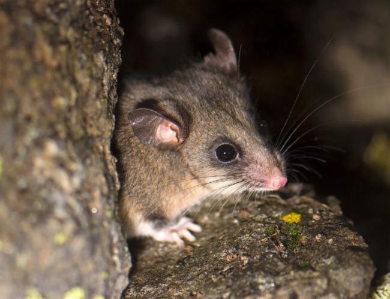
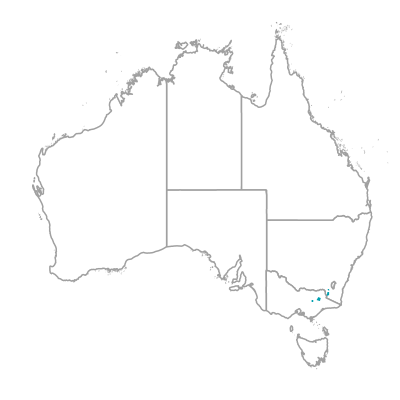
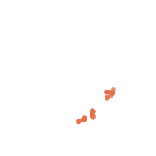
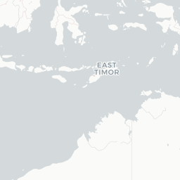
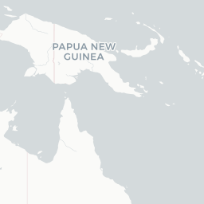

Burramys parvus : Mountain Pygmy-Possum | Atlas of Living Australia

Need help?

[Skip to content](#INSERT_CONTENT_ID_HERE)

[Contact us](https://www.ala.org.au/contact-us/)

[Sign up](https://auth.ala.org.au/userdetails/registration/createAccount) [Login](https://auth.ala.org.au/cas/login?service=https://bie.ala.org.au/species/urn:lsid:biodiversity.org.au:afd.taxon:3f17cf84-982a-48f2-9500-e44dcd30710a)

- [Search & analyse](# "Search & analyse")
- [Contribute](# "Contribute")
- [About](# "About")
- [Help](# "Help")

1.  [Home](http://www.ala.org.au)
2.  [Search the ALA](https://bie.ala.org.au/)
3.  Burramys parvus : Mountain Pygmy-Possum

1.  [ANIMALIA](https://bie.ala.org.au/species/urn%3Alsid%3Abiodiversity.org.au%3Aafd.taxon%3A4647863b-760d-4b59-aaa1-502c8cdf8d3c)
2.  [CHORDATA](https://bie.ala.org.au/species/urn%3Alsid%3Abiodiversity.org.au%3Aafd.taxon%3A065f1da4-53cd-40b8-a396-80fa5c74dedd)
3.  [VERTEBRATA](https://bie.ala.org.au/species/urn%3Alsid%3Abiodiversity.org.au%3Aafd.taxon%3A5d6076b1-b7c7-487f-9d61-0fea0111cc7e)
4.  [GNATHOSTOMATA](https://bie.ala.org.au/species/urn%3Alsid%3Abiodiversity.org.au%3Aafd.taxon%3Aef5515fd-a0a2-4e16-b61a-0f19f8900f76)
5.  [MAMMALIA](https://bie.ala.org.au/species/urn%3Alsid%3Abiodiversity.org.au%3Aafd.taxon%3Ae9e7db31-04df-41fb-bd8d-e0b0f3c332d6)
6.  [MARSUPIALIA](https://bie.ala.org.au/species/urn%3Alsid%3Abiodiversity.org.au%3Aafd.taxon%3A602afec4-950f-4961-9ad0-74793be8efbf)
7.  [DIPROTODONTIA](https://bie.ala.org.au/species/urn%3Alsid%3Abiodiversity.org.au%3Aafd.taxon%3Abd223248-af12-4ce9-9380-4f9a85be38db)
8.  [PHALANGERIDA](https://bie.ala.org.au/species/urn%3Alsid%3Abiodiversity.org.au%3Aafd.taxon%3Ae6733776-808c-4aff-9758-e33223c5029f)
9.  [BURRAMYOIDEA](https://bie.ala.org.au/species/urn%3Alsid%3Abiodiversity.org.au%3Aafd.taxon%3A7c7714e1-d3c3-45cf-accb-39ad56624879)
10. [BURRAMYIDAE](https://bie.ala.org.au/species/urn%3Alsid%3Abiodiversity.org.au%3Aafd.taxon%3A1f414d69-a258-4946-952c-3dabc93c1069)
11. [Burramys](https://bie.ala.org.au/species/urn%3Alsid%3Abiodiversity.org.au%3Aafd.taxon%3Aa90df6ef-afc2-41a2-ae0e-b7e0e9dd6e3d)
12. Burramys parvus

##### [JSON](https://bie-ws.ala.org.au/ws/species/urn:lsid:biodiversity.org.au:afd.taxon:3f17cf84-982a-48f2-9500-e44dcd30710a.json)

# Burramys parvus Broom, 1896

##### species

##### Accepted

##### **Name authority:** AFD

## Mountain Pygmy-Possum

- [Overview](#overview)
- [Gallery](#gallery)
- [Names](#names)
- [Classification](#classification)
- [Records](#records)
- [Literature](#literature)
- [Sequences](#sequences)
- [Data Partners](#data-partners)

[+](#gallery "More Photos")

### Conservation Status

- [AUSEndangered](https://collections.ala.org.au/public/show/dr656)
- [NSWEndangered](https://collections.ala.org.au/public/show/dr650)
- [VICnull](https://collections.ala.org.au/public/show/dr655)

### Lifespan, longevity, and ageing

Maximum longevity: 12 years Observations: Although these animals normally do not live more than 4 years in the wild, it has been reported that females can live up to 11 years (Ronald Nowak 1999). Other reports suggest a maximum longevity of 12 years (Fisher et al. 2001), which is plausible.

Rights holder: Joao Pedro de Magalhaes

Provided by: [Encyclopedia of Life](https://eol.org/pages/323837)

### Mountain pygmy possum: Brief Summary

The mountain pygmy possum (Burramys parvus) is a small, [mouse](http://en.wikipedia.org/wiki/Mouse)-sized (weighs 45 grams (1.6 oz)) [nocturnal](http://en.wikipedia.org/wiki/Nocturnal) [marsupial](http://en.wikipedia.org/wiki/Marsupial) of [Australia](http://en.wikipedia.org/wiki/Australia) found in dense alpine rock screes and boulder fields, mainly southern [Victoria](http://en.wikipedia.org/wiki/Victoria_%28Australia%29) and around [Mount Kosciuszko](http://en.wikipedia.org/wiki/Mount_Kosciuszko) in [Kosciuszko National Park](http://en.wikipedia.org/wiki/Kosciuszko_National_Park) in [New South Wales](http://en.wikipedia.org/wiki/New_South_Wales) at elevations from 1,300 to 2,230 metres (4,270 to 7,320 ft). At almost 14 cm (5.5 in), its prehensile tail is longer than its 11 cm (4.3 in) combined head and body length. Its diet consists of insects (such as the [bogong moth](http://en.wikipedia.org/wiki/Bogong_moth)), fleshy fruits, [nuts](http://en.wikipedia.org/wiki/Nut_%28fruit%29), [nectar](http://en.wikipedia.org/wiki/Nectar) and [seeds](http://en.wikipedia.org/wiki/Seed). Its body is covered in a thick [coat](http://en.wikipedia.org/wiki/Fur) of fine grey fur except for its stomach, which is cream coloured; its tail is hairless. On the underside of the female's body is a pouch containing four teats. This [possum](http://en.wikipedia.org/wiki/Phalangeriformes) is the [only](http://en.wikipedia.org/wiki/Monotypic_taxon) [extant](http://en.wikipedia.org/wiki/Extant_taxon) species in the genus [Burramys](http://en.wikipedia.org/wiki/Burramys). It is also the only Australian mammal restricted to alpine habitat.

Rights holder: Wikipedia authors and editors

Provided by: [Encyclopedia of Life](https://eol.org/pages/323837)

### Mountain pygmy possum

The **mountain pygmy possum** (*Burramys parvus*) is a small, [mouse](http://en.wikipedia.org/wiki/Mouse)-sized (weighs 45 grams (1.6 oz)) [nocturnal](http://en.wikipedia.org/wiki/Nocturnal) [marsupial](http://en.wikipedia.org/wiki/Marsupial) of [Australia](http://en.wikipedia.org/wiki/Australia) found in dense alpine rock screes and boulder fields, mainly southern [Victoria](http://en.wikipedia.org/wiki/Victoria_%28Australia%29) and around [Mount Kosciuszko](http://en.wikipedia.org/wiki/Mount_Kosciuszko) in [Kosciuszko National Park](http://en.wikipedia.org/wiki/Kosciuszko_National_Park) in [New South Wales](http://en.wikipedia.org/wiki/New_South_Wales) at elevations from 1,300 to 2,230 metres (4,270 to 7,320 ft).[\[1\]](#cite_note-iucn-1) At almost 14 cm (5.5 in), its prehensile tail is longer than its 11 cm (4.3 in) combined head and body length. Its diet consists of insects (such as the [bogong moth](http://en.wikipedia.org/wiki/Bogong_moth)), fleshy fruits, [nuts](http://en.wikipedia.org/wiki/Nut_%28fruit%29), [nectar](http://en.wikipedia.org/wiki/Nectar) and [seeds](http://en.wikipedia.org/wiki/Seed). Its body is covered in a thick [coat](http://en.wikipedia.org/wiki/Fur) of fine grey fur except for its stomach, which is cream coloured; its tail is hairless. On the underside of the female's body is a pouch containing four teats. This [possum](http://en.wikipedia.org/wiki/Phalangeriformes) is the [only](http://en.wikipedia.org/wiki/Monotypic_taxon) [extant](http://en.wikipedia.org/wiki/Extant_taxon) species in the genus *[Burramys](http://en.wikipedia.org/wiki/Burramys)*.[\[2\]](#cite_note-MSW3-2) It is also the only Australian mammal restricted to alpine habitat.[\[1\]](#cite_note-iucn-1)

## Contents

- [1 Introduction](#Introduction)
- [2 Physical description](#Physical_description)
- [3 Habitat and geographic range](#Habitat_and_geographic_range)
- [4 Foraging habits and behaviour](#Foraging_habits_and_behaviour)
- [5 Reproduction](#Reproduction)
- [6 Behaviour](#Behaviour)
- [7 Conservation status](#Conservation_status)
- [8 References](#References)

## Introduction

The mountain pygmy possum was first discovered in the fossil record in 1895 when a portion of the jaw and skull bones were found in the Wombeyan Caves in central New South Wales.[\[3\]](#cite_note-Broome,_L._2012-3) At the time, the species was believed to be extinct. It was not until 1966 that a living individual was found at a ski resort at Mount Hotham in Victoria.[\[4\]](#cite_note-animaldiversity.ummz.umich.edu-4) Since that time, the mountain pygmy possum has been located in three isolated, genetically distinct populations in the alpine regions of southern Australia.[\[3\]](#cite_note-Broome,_L._2012-3)

## Physical description

***Burramys parvus***, the mountain pygmy possum, is a small rodent-like marsupial. The mountain pygmy possum has an average weight of approximately 45 g and an average head and body length of 110 mm.[\[4\]](#cite_note-animaldiversity.ummz.umich.edu-4) The species is sexually dimorphic, with males being slightly larger than females. They have large, forward pointing eyes and short pointed snouts. Mountain pygmy possums exhibit [diprotodont](http://en.wikipedia.org/wiki/Diprotodont) dentition, with three upper incisors and two upper premolars. On the syndactylous hind feet, they possess an opposable hallux.[\[5\]](#cite_note-Turner,_V._1989_pp._1-27-5) In addition, the mountain pygmy possum has a pouch which opens anteriorly and contains 4 teats.[\[5\]](#cite_note-Turner,_V._1989_pp._1-27-5) Pygmy possums are covered in a layer of fine, dense fur. Their pelage is greyish-brown on the dorsal side, with a darker stripe along the midline of the back, and a pale cream colour on the ventral side. They typically have a darker grey ring surrounding the eyes. During breeding season, males become more tawny-orange on the abdomen and flanks.[\[6\]](#cite_note-environment.gov.au-6) The mountain pygmy possum has a long prehensile tail, averaging about 140 mm in length, which is sparsely haired.

## Habitat and geographic range

The mountain pygmy possum is endemic to the alpine regions of southern Australia. The species is currently restricted to three isolated mountain regions: (1) Mount Blue Cow in [Kosciuszko National Park](http://en.wikipedia.org/wiki/Kosciuszko_National_Park) in New South Wales, (2) Mount Bogong and Mount Higginbotham/Loch in the Bogong High Plains in Victoria, and (3) Mount Buller in Victoria.[\[7\]](#cite_note-7) The typical home ranges within these mountain ranges differ for males and females. Females tend to reside at higher elevations of approximately 1400–2228 m near patches of block streams and other deep boulder formations. The home range of a female mountain pygmy possum is correlated with the density of [Bogong moths](http://en.wikipedia.org/wiki/Bogong_moths), the pygmy possum’s preferred food source, which varies at different elevations. Females at higher elevations have smaller home ranges due to a relatively greater abundance of Bogong moths, whereas females residing at lower elevations typically have much larger home ranges as the quantity of moths declines.[\[8\]](#cite_note-Broome,_L._2001-8) Male mountain pygmy possums reside at low elevations, generally between 1200-1300m, of these mountain ranges.[\[3\]](#cite_note-Broome,_L._2012-3) Male home ranges are largest during the breeding season, between November and December, when they migrate to female nesting sites, and decline thereafter.[\[8\]](#cite_note-Broome,_L._2001-8)

## Foraging habits and behaviour

Mountain pygmy possums prefer to feed on Bogong moths which make up about a third of their diet. This moth species (*Agrotis infusa*) migrates to the high alpine mountainous regions during the spring and summer months. During these months, mountain pygmy possums utilise Bogong moths as their principal food source. In the autumn months, Bogong moths depart from the mountain ranges and mountain pygmy possums must supplement their diets with fruits and seeds. *Burramys parvis* species will supplement their diet with the mountain plum pine from the fruit-bearing conifer *[Podocarpus lawrencei](http://en.wikipedia.org/wiki/Podocarpus_lawrencei)* as well as seeds from the snow beard-heaths *[Leucopogon](http://en.wikipedia.org/wiki/Leucopogon)* spp. and blackberry *[Rubus](http://en.wikipedia.org/wiki/Rubus)* spp.[\[9\]](#cite_note-ReferenceA-9) Upon finding food, the mountain pygmy possum will first smell the food source before picking it up with its incisors. It will then transfer the item to its forelimbs so that it may manipulate the food and tear off pieces of flesh.[\[5\]](#cite_note-Turner,_V._1989_pp._1-27-5)

## Reproduction

Mountain pygmy possums have an annual reproductive cycle. Although females are [polyestrous](http://en.wikipedia.org/wiki/Estrous_cycle#Frequency), the need for sufficient fat reserves during hibernation limits females to one litter per year. In order to ensure adequate fat reserves, female mountain pygmy possums will synchronise reproduction for the spring months, when Bogong moths are abundant.[\[4\]](#cite_note-animaldiversity.ummz.umich.edu-4) The breeding season typically occurs during the Austral spring months of October and November. During this time, males migrate to the higher elevation nesting sites of females to mate.[\[9\]](#cite_note-ReferenceA-9) Mountain pygmy possums then have an internal gestation period of 14–16 days after which the altricial young will enter the forward-facing pouch of the female. A female mountain pygmy possum has four teats, and a litter is usually three to four offspring. The young remain in the pouch for approximately 3 weeks, after which they remain at the nest for another 3–4 weeks.[\[5\]](#cite_note-Turner,_V._1989_pp._1-27-5) The offspring are then weaned at around 9–10 weeks.[\[6\]](#cite_note-environment.gov.au-6) The mating system that occurs in *Burramys parvus* is resource defence polygyny. A philopatric group of females typically share a nest space within deep boulder crevices. The nest sites are generally areas of high densities of migrating Bogong moths. Shortly after mating season, females will drive the male pygmy possums from the nest. The male mountain pygmy possums do not participate in parental care. Additionally, juvenile males are driven from the nest shortly after weaning.[\[8\]](#cite_note-Broome,_L._2001-8) As noted in all species of Burramyids, mountain pygmy possums become sexually mature by one year of age.[\[5\]](#cite_note-Turner,_V._1989_pp._1-27-5)

## Behaviour

Mountain pygmy possums are nocturnal creatures, preferring to sleep during the day and forage at night. While all other members of the family [Burramyidae](http://en.wikipedia.org/wiki/Burramyidae) are arboreal, the mountain pygmy possum is a terrestrial species. The preferred habitat of these pygmy possums is within deep boulderfields in alpine regions of Southern Australia. The females tend to stay in familial groups of up to 10 related individuals. Females also tend to be relatively sedentary and exhibit high nest site fidelity.[\[5\]](#cite_note-Turner,_V._1989_pp._1-27-5)

Male mountain pygmy possums, on the other hand, tend to be solitary, leaving nesting sites as juveniles to take residence in lower elevations of the mountain ranges.[\[10\]](#cite_note-10) For this reason, male mountain pygmy possums generally suffer higher mortality than females as the boulderfields appear to offer some protection from predation.[\[5\]](#cite_note-Turner,_V._1989_pp._1-27-5) *Burramys parvus* is noted to be the only small mammal in Australia that hibernates seasonally for long periods of time. All other members of *Burramyidae* are capable of opportunistic hibernation.[\[8\]](#cite_note-Broome,_L._2001-8)

Adult mountain pygmy possums enter hibernation for a period of up to seven months, whereas juveniles generally hibernate for about five months.[\[8\]](#cite_note-Broome,_L._2001-8) Both males and females rely heavily on Bogong moths as an energy rich food and for the fattening period which occurs prior to hibernation. Mountain pygmy possums are also noted to cache seeds and berries which they will feed on during periods when they awaken from torpor.[\[5\]](#cite_note-Turner,_V._1989_pp._1-27-5) During the months of hibernation, *Burramys parvus* is noted to awaken from torpor for periods of two to three days at a time during which the animal will feed on cached food resources. These periods of arousal typically occur when the ambient temperature is 4–7 ˚C. During the hibernating period, the mountain pygmy possum is capable of reducing its temperature to 2 ˚C.[\[11\]](#cite_note-11) Individuals in torpid periods will curl their bodies up, tucking their heads into their chest or abdomen in order to retain body heat. In addition, females have been observed sharing nests constructed from moss and snow grass.[\[5\]](#cite_note-Turner,_V._1989_pp._1-27-5) Both males and females are noted to hibernate under an insulating layer of snow.[\[8\]](#cite_note-Broome,_L._2001-8)

During the breeding season in the spring and summer months, older, heavier mountain pygmy possums typically occupy the highest quality habitats. While males are generally tolerant of one another during most of the year, they can act aggressively toward each other during the breeding season. Aggression is noted in both males and females in the form of tail biting.[\[9\]](#cite_note-ReferenceA-9) Females are observed to act very aggressively towards both males and females when defending nesting sites, especially when offspring are present. Additionally, females are aggressive to adult males following the breeding season as well as to juvenile males post-weaning.[\[9\]](#cite_note-ReferenceA-9)

## Conservation status

As of 2008, the mountain pygmy possum has been declared by the IUCN Redlist as [Critically endangered](http://en.wikipedia.org/wiki/Critically_endangered). Population estimates totalled less than 2000 individuals from the three combined isolated populations in 2000. Current population estimates indicate that these numbers have severely declined in the last decade. The most recent study conducted in 2006 at Mount Buller tallied only 30 adults.[\[6\]](#cite_note-environment.gov.au-6) As of 2007, the number of females recorded at Mount Blue Cow had Kosciuzsko with a total of 60 individuals.[\[6\]](#cite_note-environment.gov.au-6)

The biggest threats to the mountain pygmy possum populations include [habitat destruction](http://en.wikipedia.org/wiki/Habitat_destruction) and fragmentation, [climate change](http://en.wikipedia.org/wiki/Climate_change), predation by [feral cats](http://en.wikipedia.org/wiki/Feral_cat) and [red foxes](http://en.wikipedia.org/wiki/Red_fox), and threats to the [Bogong moth](http://en.wikipedia.org/wiki/Bogong_moth). The construction of [ski resorts](http://en.wikipedia.org/wiki/Ski_resort) in the alpine regions in which the mountain pygmy possums inhabit has been one of the greatest factors attributed to population decline. At Mount Higginbotham, a major road constructed to the Mount Hotham ski resort prevented male mountain pygmy possums from migrating to the female nesting sites during the breeding season. This physical barrier was noted to markedly increase winter mortality in the Mount Higginbotham population. In response to this, an underground tunnel was constructed which provided male pygmy possums with an alternative migratory route.[\[12\]](#cite_note-12)

Climate change is another serious threat to the mountain pygmy possum. *Burramys parvus* is the only Australian mammal which is completely restricted to the alpine regions. The species is well adapted to the seasonal availability of Bogong moths and other food resources.[\[3\]](#cite_note-Broome,_L._2012-3) Although data from New South Wales and Victoria are still pending, preliminary models suggest that reduced survival of mountain pygmy possums can be related to declining snow cover and shorter winters.[\[3\]](#cite_note-Broome,_L._2012-3) Studies conducted at Kosciuszko National Park revealed that the period of snow cover was diminished by an average of 10 days and snow melt occurred approximately 15 days earlier. Linda Broome and her group of researchers determined that, while hibernation sites appeared well insulated despite lack of snow, snow cover provides additional protection to the mountain pygmy possums during the coldest months. This added layer of insulation is believed to promote prolonged torpor and decrease waking intervals which can deplete energy stores and decrease possum survival.[\[3\]](#cite_note-Broome,_L._2012-3) As a suggested solution to this environmental disturbance, Broome and her colleagues proposed moving the remaining populations of mountain pygmy possums from their alpine habitats to lower elevation temperate rainforests. This solution is based on previous husbandry efforts, which showed that mountain pygmy possums did not require a period of hibernation at environmental temperatures above 12 ˚C.[\[3\]](#cite_note-Broome,_L._2012-3)

A third negative impact on the mountain pygmy population is high levels of predation by red foxes (*Vulpes vulpes*) and feral cats. In order to control the level of predation, threat abatement plans are in place. These threat abatement plans identify the necessary actions required to protect all species affected by predation of red foxes and feral cats.[\[6\]](#cite_note-environment.gov.au-6)

Research has also extended to identify the threats impacting the survival of the Bogong moth. This moth species is the preferred food source of mountain pygmy possums. Their arrival during the spring months acts as a seasonal indicator signalling the end of hibernation for the possums. In addition, Bogong moths are rich in protein and fat and they provide mountain pygmy possums with the necessary energy reserves to sustain the seven month hibernation period.[\[3\]](#cite_note-Broome,_L._2012-3)

Lastly, the Foundation for National Parks and Wildlife has implemented captive breeding programmes under the support and guidance of Linda Broome and her colleagues.[\[13\]](#cite_note-13) In addition, Zoos Victoria has also become involved in the effort to sustain the remaining populations of mountain pygmy possums. The Zoos Victoria started a captive breeding programme for *B. parvus* in 2007 in the Healesville Sanctuary. The programme currently cares for a population of 45 mountain pygmy possums. Their overall goal is to down-list the mountain pygmy possum to a lower-threat category on the IUCN Redlist.[\[14\]](#cite_note-14)

## References

1.  ^ [***a***](#cite_ref-iucn_1-0) [***b***](#cite_ref-iucn_1-1) [***c***](#cite_ref-iucn_1-2) Menkhorst, P.; Broome, L. & Driessen, M. (2008). ["*Burramys parvus*"](http://www.iucnredlist.org/details/3339/0). *[The IUCN Red List of Threatened Species](http://en.wikipedia.org/wiki/The_IUCN_Red_List_of_Threatened_Species)*. [IUCN](http://en.wikipedia.org/wiki/IUCN). **2008**: e.T3339A9775825. [doi](http://en.wikipedia.org/wiki/Digital_object_identifier):10.2305/IUCN.UK.2008.RLTS.T3339A9775825.en. Retrieved 12 January 2018..mw-parser-output cite.citation{font-style:inherit}.mw-parser-output q{quotes:"""""'"'"}.mw-parser-output code.cs1-code{color:inherit;background:inherit;border:inherit;padding:inherit}.mw-parser-output .cs1-lock-free a{background:url("//upload.wikimedia.org/wikipedia/commons/thumb/6/65/Lock-green.svg/9px-Lock-green.svg.png")no-repeat;background-position:right .1em center}.mw-parser-output .cs1-lock-limited a,.mw-parser-output .cs1-lock-registration a{background:url("//upload.wikimedia.org/wikipedia/commons/thumb/d/d6/Lock-gray-alt-2.svg/9px-Lock-gray-alt-2.svg.png")no-repeat;background-position:right .1em center}.mw-parser-output .cs1-lock-subscription a{background:url("//upload.wikimedia.org/wikipedia/commons/thumb/a/aa/Lock-red-alt-2.svg/9px-Lock-red-alt-2.svg.png")no-repeat;background-position:right .1em center}.mw-parser-output .cs1-subscription,.mw-parser-output .cs1-registration{color:#555}.mw-parser-output .cs1-subscription span,.mw-parser-output .cs1-registration span{border-bottom:1px dotted;cursor:help}.mw-parser-output .cs1-hidden-error{display:none;font-size:100%}.mw-parser-output .cs1-visible-error{font-size:100%}.mw-parser-output .cs1-subscription,.mw-parser-output .cs1-registration,.mw-parser-output .cs1-format{font-size:95%}.mw-parser-output .cs1-kern-left,.mw-parser-output .cs1-kern-wl-left{padding-left:0.2em}.mw-parser-output .cs1-kern-right,.mw-parser-output .cs1-kern-wl-right{padding-right:0.2em} Database entry includes justification for why this species is listed as critically endangered
2.  **[^](#cite_ref-MSW3_2-0)** [Groves, C. P.](http://en.wikipedia.org/wiki/Colin_Groves) (2005). ["Order Diprotodontia"](http://www.departments.bucknell.edu/biology/resources/msw3/browse.asp?id=11000019). In [Wilson, D.E.](http://en.wikipedia.org/wiki/Don_E._Wilson); Reeder, D. M. [*Mammal Species of the World: A Taxonomic and Geographic Reference*](http://www.google.com/books?id=JgAMbNSt8ikC&pg=PA44) (3rd ed.). Johns Hopkins University Press. p. 44. [ISBN](http://en.wikipedia.org/wiki/International_Standard_Book_Number) [978-0-8018-8221-0](http://en.wikipedia.org/wiki/Special:BookSources/978-0-8018-8221-0). [OCLC](http://en.wikipedia.org/wiki/OCLC) 62265494.
3.  ^ [***a***](#cite_ref-Broome,_L._2012_3-0) [***b***](#cite_ref-Broome,_L._2012_3-1) [***c***](#cite_ref-Broome,_L._2012_3-2) [***d***](#cite_ref-Broome,_L._2012_3-3) [***e***](#cite_ref-Broome,_L._2012_3-4) [***f***](#cite_ref-Broome,_L._2012_3-5) [***g***](#cite_ref-Broome,_L._2012_3-6) [***h***](#cite_ref-Broome,_L._2012_3-7) Broome, L. (2012). ["A brief review of the life history of, and threats to, *Burramys parvus* with a prehistory-based proposal for ensuring that it has a future"](http://hdl.handle.net/10765/93839). *Wildlife and Climate Change*. **1**: 114–126.
4.  ^ [***a***](#cite_ref-animaldiversity.ummz.umich.edu_4-0) [***b***](#cite_ref-animaldiversity.ummz.umich.edu_4-1) [***c***](#cite_ref-animaldiversity.ummz.umich.edu_4-2) Bender, J. (2013, December 2). [*Burramys parvus* mountain pygmy possum](http://animaldiversity.ummz.umich.edu/accounts/Burramys_parvus/#physical_description). Animal Diversity
5.  ^ [***a***](#cite_ref-Turner,_V._1989_pp._1-27_5-0) [***b***](#cite_ref-Turner,_V._1989_pp._1-27_5-1) [***c***](#cite_ref-Turner,_V._1989_pp._1-27_5-2) [***d***](#cite_ref-Turner,_V._1989_pp._1-27_5-3) [***e***](#cite_ref-Turner,_V._1989_pp._1-27_5-4) [***f***](#cite_ref-Turner,_V._1989_pp._1-27_5-5) [***g***](#cite_ref-Turner,_V._1989_pp._1-27_5-6) [***h***](#cite_ref-Turner,_V._1989_pp._1-27_5-7) [***i***](#cite_ref-Turner,_V._1989_pp._1-27_5-8) Turner, V., & McKay, G. (1989). "Burramyidaea", pp. 1–27 in V. Turner, & G. McKay, *Fauna of Australia* . Canberra: Academic Press.
6.  ^ [***a***](#cite_ref-environment.gov.au_6-0) [***b***](#cite_ref-environment.gov.au_6-1) [***c***](#cite_ref-environment.gov.au_6-2) [***d***](#cite_ref-environment.gov.au_6-3) [***e***](#cite_ref-environment.gov.au_6-4) Australian Government Department of the Environment. (2 December 2013). [*Burramys parvus* – Mountain pygmy possum](http://www.environment.gov.au/cgi-bin/sprat/public/publicspecies.pl?taxon_id=267#description).
7.  **[^](#cite_ref-7)** Mitrovski, P.; Heinze, D. A.; Broome, L.; Hoffmann, A. A.; Weeks, A. R. (2006). "High levels of variation despite genetic fragmentation in populations of the endangered mountain pygmy-possum, *Burramys parvus*, in alpine Australia". *Molecular Ecology*. **16** (1): 75–87. [doi](http://en.wikipedia.org/wiki/Digital_object_identifier):10.1111/j.1365-294X.2006.03125.x. [PMID](http://en.wikipedia.org/wiki/PubMed_Identifier) 17181722.
8.  ^ [***a***](#cite_ref-Broome,_L._2001_8-0) [***b***](#cite_ref-Broome,_L._2001_8-1) [***c***](#cite_ref-Broome,_L._2001_8-2) [***d***](#cite_ref-Broome,_L._2001_8-3) [***e***](#cite_ref-Broome,_L._2001_8-4) [***f***](#cite_ref-Broome,_L._2001_8-5) Broome, L. S. (2001). "Density, home range, seasonal movements and habitat use of the mountain pygmy-possum *Burramys parvus* (Marsupialia: Burramyidae) at Mount Blue Cow, Kosciuszko National Park". *Austral Ecology*. **26** (3): 275–292. [doi](http://en.wikipedia.org/wiki/Digital_object_identifier):10.1046/j.1442-9993.2001.01114.x.
9.  ^ [***a***](#cite_ref-ReferenceA_9-0) [***b***](#cite_ref-ReferenceA_9-1) [***c***](#cite_ref-ReferenceA_9-2) [***d***](#cite_ref-ReferenceA_9-3) Broome, L. S. (2001). "Intersite differences in population demography of Mountain Pygmy-possums *Burramys parvus* Broom (1986–1998)". *Biological Conservation*. **102** (3): 309–323. [doi](http://en.wikipedia.org/wiki/Digital_object_identifier):10.1016/S0006-3207(01)00105-7.
10. **[^](#cite_ref-10)** Parker, J. (2 December 2013). [Possum Dreaming](http://www.abc.net.au/science/articles/2000/05/01/2686592.htm). *ABC Science*
11. **[^](#cite_ref-11)** Kortner, G.; Geiser, F. (1998). "Ecology of natural hibernation in the marsupial mountain pygmy-possum (*Burramys parvus*)". *Oecologia*. **113** (2): 170–178. [doi](http://en.wikipedia.org/wiki/Digital_object_identifier):10.1007/s004420050365. [JSTOR](http://en.wikipedia.org/wiki/JSTOR) 4221837\. [PMID](http://en.wikipedia.org/wiki/PubMed_Identifier) 28308194.
12. **[^](#cite_ref-12)** van der Ree, R.; Heinze, D.; McCarthy, M.; Mansergh, I. (2009). ["Wildlife Tunnel Enhances Population Viability"](http://www.ecologyandsociety.org/vol14/iss2/art7/). *Ecology and Society*: 1–10.
13. **[^](#cite_ref-13)** Foundation for National Parks and Wildlife. (2 December 2013). [Mountain Pygmy-Possum Captive Breeding](http://fnpw.org.au/plants-a-wildlife/land-mammals/mountain-pygmy-possum/mountain-pygmy-possum-captive-breeding) [Archived](https://web.archive.org/web/20131212043725/http://fnpw.org.au/plants-a-wildlife/land-mammals/mountain-pygmy-possum/mountain-pygmy-possum-captive-breeding) 12 December 2013 at the [Wayback Machine](http://en.wikipedia.org/wiki/Wayback_Machine)..
14. **[^](#cite_ref-14)** Zoos Victoria. (2 December 2013). [Healesville Sanctuary: Mountain pygmy-possum](http://www.zoo.org.au/healesville/animals/mountain-pygmy-possum) Retrieved 4 November 2017.

- [v](http://en.wikipedia.org/wiki/Template:Diprotodontia)
- [t](http://en.wikipedia.org/wiki/Template_talk:Diprotodontia)
- e

Extant [Diprotodontia](http://en.wikipedia.org/wiki/Diprotodontia) species

- Kingdom [Animalia](http://en.wikipedia.org/wiki/Animal)
- Phylum [Chordata](http://en.wikipedia.org/wiki/Chordata)
- Class [Mammalia](http://en.wikipedia.org/wiki/Mammalia)
- Infraclass [Marsupialia](http://en.wikipedia.org/wiki/Marsupialia)

Suborder [Vombatiformes](http://en.wikipedia.org/wiki/Vombatiformes)

[Phascolarctidae](http://en.wikipedia.org/wiki/Phascolarctidae)*[Phascolarctos](http://en.wikipedia.org/wiki/Phascolarctos)*

- [Koala (*P. cinereus*)](http://en.wikipedia.org/wiki/Koala)

[Vombatidae](http://en.wikipedia.org/wiki/Wombat)  
(Wombats)*[Vombatus](http://en.wikipedia.org/wiki/Common_wombat)*

- [Common wombat (*V. ursinus*)](http://en.wikipedia.org/wiki/Common_wombat)

*[Lasiorhinus](http://en.wikipedia.org/wiki/Lasiorhinus)*

- [Southern hairy-nosed wombat (*L. latifrons*)](http://en.wikipedia.org/wiki/Southern_hairy-nosed_wombat)
- [Northern hairy-nosed wombat (*L. krefftii*)](http://en.wikipedia.org/wiki/Northern_hairy-nosed_wombat)

Suborder [Phalangeriformes (Possums)](http://en.wikipedia.org/wiki/Phalangeriformes) (cont. below)

[Phalangeridae](http://en.wikipedia.org/wiki/Phalangeridae)  
(including [Cuscuses](http://en.wikipedia.org/wiki/Cuscus))*[Ailurops](http://en.wikipedia.org/wiki/Bear_cuscus)*  
(Bear cuscuses)

- [Talaud bear cuscus (*A. melanotis*)](http://en.wikipedia.org/wiki/Talaud_bear_cuscus)
- [Sulawesi bear cuscus (*A. ursinus*)](http://en.wikipedia.org/wiki/Sulawesi_bear_cuscus)

*[Phalanger](http://en.wikipedia.org/wiki/Phalanger)*

- [Gebe Cuscus (*P. alexandrae*)](http://en.wikipedia.org/wiki/Gebe_cuscus)
- [Mountain cuscus (*P. carmelitae*)](http://en.wikipedia.org/wiki/Mountain_cuscus)
- [Ground cuscus (*P. gymnotis*)](http://en.wikipedia.org/wiki/Ground_cuscus)
- [Eastern common cuscus (*P. intercastellanus*)](http://en.wikipedia.org/wiki/Eastern_common_cuscus)
- [Woodlark cuscus (*P. lullulae*)](http://en.wikipedia.org/wiki/Woodlark_cuscus)
- [Blue-eyed cuscus (*P. matabiru*)](http://en.wikipedia.org/wiki/Blue-eyed_cuscus)
- [Telefomin cuscus (*P. matanim*)](http://en.wikipedia.org/wiki/Telefomin_cuscus)
- [Southern common cuscus (*P. mimicus*)](http://en.wikipedia.org/wiki/Southern_common_cuscus)
- [Northern common cuscus (*P. orientalis*)](http://en.wikipedia.org/wiki/Northern_common_cuscus)
- [Ornate cuscus (*P. ornatus*)](http://en.wikipedia.org/wiki/Ornate_cuscus)
- [Rothschild's cuscus (*P. rothschildi*)](http://en.wikipedia.org/wiki/Rothschild%27s_cuscus)
- [Silky cuscus (*P. sericeus*)](http://en.wikipedia.org/wiki/Silky_cuscus)
- [Stein's cuscus (*P. vestitus*)](http://en.wikipedia.org/wiki/Stein%27s_cuscus)

*[Spilocuscus](http://en.wikipedia.org/wiki/Spilocuscus)*

- [Admiralty Island cuscus (*S. kraemeri*)](http://en.wikipedia.org/wiki/Admiralty_Island_cuscus)
- [Common spotted cuscus (*S. maculatus*)](http://en.wikipedia.org/wiki/Common_spotted_cuscus)
- [Waigeou cuscus (*S. papuensis*)](http://en.wikipedia.org/wiki/Waigeou_cuscus)
- [Black-spotted cuscus (*S. rufoniger*)](http://en.wikipedia.org/wiki/Black-spotted_cuscus)
- [Blue-eyed spotted cuscus (*S. wilsoni*)](http://en.wikipedia.org/wiki/Blue-eyed_spotted_cuscus)

*[Strigocuscus](http://en.wikipedia.org/wiki/Strigocuscus)*

- [Sulawesi dwarf cuscus (*S. celebensis*)](http://en.wikipedia.org/wiki/Sulawesi_dwarf_cuscus)
- [Banggai cuscus (*S. pelegensis*)](http://en.wikipedia.org/wiki/Banggai_cuscus)

*[Trichosurus](http://en.wikipedia.org/wiki/Brushtail_possum)*  
(Brushtail possums)

- [Northern brushtail possum (*T. arnhemensis*)](http://en.wikipedia.org/wiki/Northern_brushtail_possum)
- [Short-eared possum (*T. caninus*)](http://en.wikipedia.org/wiki/Short-eared_possum)
- [Mountain brushtail possum (*T. cunninghami*)](http://en.wikipedia.org/wiki/Mountain_brushtail_possum)
- [Coppery brushtail possum (*T. johnstonii*)](http://en.wikipedia.org/wiki/Coppery_brushtail_possum)
- [Common brushtail possum (*T. vulpecula*)](http://en.wikipedia.org/wiki/Common_brushtail_possum)

*[Wyulda](http://en.wikipedia.org/wiki/Scaly-tailed_possum)*

- [Scaly-tailed possum (*W. squamicaudata*)](http://en.wikipedia.org/wiki/Scaly-tailed_possum)

[Burramyidae](http://en.wikipedia.org/wiki/Pygmy_possum)  
(Pygmy possums)*[Burramys](http://en.wikipedia.org/wiki/Burramys)*

- Mountain pygmy possum (*B. parvus*)

*[Cercartetus](http://en.wikipedia.org/wiki/Cercartetus)*

- [Long-tailed pygmy possum (*C. caudatus*)](http://en.wikipedia.org/wiki/Long-tailed_pygmy_possum)
- [Southwestern pygmy possum (*C. concinnus*)](http://en.wikipedia.org/wiki/Southwestern_pygmy_possum)
- [Tasmanian pygmy possum (*C. lepidus*)](http://en.wikipedia.org/wiki/Tasmanian_pygmy_possum)
- [Eastern pygmy possum (*C. nanus*)](http://en.wikipedia.org/wiki/Eastern_pygmy_possum)

Suborder [Phalangeriformes (Possums)](http://en.wikipedia.org/wiki/Phalangeriformes) (cont. above)

[Tarsipedidae](http://en.wikipedia.org/wiki/Honey_possum)*[Tarsipes](http://en.wikipedia.org/wiki/Honey_possum)*

- [Honey possum (*T. rostratus*)](http://en.wikipedia.org/wiki/Honey_possum)

[Petauridae](http://en.wikipedia.org/wiki/Petauridae)*[Dactylopsila](http://en.wikipedia.org/wiki/Dactylopsila)*

- [Great-tailed triok (*D. megalura*)](http://en.wikipedia.org/wiki/Great-tailed_triok)
- [Long-fingered triok (*D. palpator*)](http://en.wikipedia.org/wiki/Long-fingered_triok)
- [Tate's triok (*D. tatei*)](http://en.wikipedia.org/wiki/Tate%27s_triok)
- [Striped possum (*D. trivirgata*)](http://en.wikipedia.org/wiki/Striped_possum)

*[Gymnobelideus](http://en.wikipedia.org/wiki/Leadbeater%27s_possum)*

- [Leadbeater's possum (*G. leadbeateri*)](http://en.wikipedia.org/wiki/Leadbeater%27s_possum)

*[Petaurus](http://en.wikipedia.org/wiki/Petaurus)*

- [Northern glider (*P. abidi*)](http://en.wikipedia.org/wiki/Northern_glider)
- [Yellow-bellied glider (*P. australis*)](http://en.wikipedia.org/wiki/Yellow-bellied_glider)
- [Biak glider (*P. biacensis*)](http://en.wikipedia.org/wiki/Biak_glider)
- [Sugar glider (*P. breviceps*)](http://en.wikipedia.org/wiki/Sugar_glider)
- [Mahogany glider (*P. gracilis*)](http://en.wikipedia.org/wiki/Mahogany_glider)
- [Squirrel glider (*P. norfolcensis*)](http://en.wikipedia.org/wiki/Squirrel_glider)

[Pseudocheiridae](http://en.wikipedia.org/wiki/Pseudocheiridae)*[Hemibelideus](http://en.wikipedia.org/wiki/Lemur-like_ringtail_possum)*

- [Lemur-like ringtail possum (*H. lemuroides*)](http://en.wikipedia.org/wiki/Lemur-like_ringtail_possum)

*[Petauroides](http://en.wikipedia.org/wiki/Greater_glider)*

- [Greater glider (*P. volans*)](http://en.wikipedia.org/wiki/Greater_glider)

*[Petropseudes](http://en.wikipedia.org/wiki/Rock-haunting_ringtail_possum)*

- [Rock-haunting ringtail possum (*P. dahli*)](http://en.wikipedia.org/wiki/Rock-haunting_ringtail_possum)

*[Pseudocheirus](http://en.wikipedia.org/wiki/Common_ringtail_possum)*

- [Common ringtail possum (*P. peregrinus*)](http://en.wikipedia.org/wiki/Common_ringtail_possum)

*[Pseudochirulus](http://en.wikipedia.org/wiki/Pseudochirulus)*

- [Lowland ringtail possum (*P. canescens*)](http://en.wikipedia.org/wiki/Lowland_ringtail_possum)
- [Weyland ringtail possum (*P. caroli*)](http://en.wikipedia.org/wiki/Weyland_ringtail_possum)
- [Cinereus ringtail possum (*P. cinereus*)](http://en.wikipedia.org/wiki/Cinereus_ringtail_possum)
- [Painted ringtail possum (*P. forbesi*)](http://en.wikipedia.org/wiki/Painted_ringtail_possum)
- [Herbert River ringtail possum (*P. herbertensis*)](http://en.wikipedia.org/wiki/Herbert_River_ringtail_possum)
- [Masked ringtail possum (*P. larvatus*)](http://en.wikipedia.org/wiki/Masked_ringtail_possum)
- [Pygmy ringtail possum (*P. mayeri*)](http://en.wikipedia.org/wiki/Pygmy_ringtail_possum)
- [Vogelkop ringtail possum (*P. schlegeli*)](http://en.wikipedia.org/wiki/Vogelkop_ringtail_possum)

*[Pseudochirops](http://en.wikipedia.org/wiki/Pseudochirops)*

- [D'Albertis' ringtail possum (*P. albertisii*)](http://en.wikipedia.org/wiki/D%27Albertis%27_ringtail_possum)
- [Green ringtail possum (*P. archeri*)](http://en.wikipedia.org/wiki/Green_ringtail_possum)
- [Plush-coated ringtail possum (*P. corinnae*)](http://en.wikipedia.org/wiki/Plush-coated_ringtail_possum)
- [Reclusive ringtail possum (*P. coronatus*)](http://en.wikipedia.org/wiki/Reclusive_ringtail_possum)
- [Coppery ringtail possum (*P. cupreus*)](http://en.wikipedia.org/wiki/Coppery_ringtail_possum)

[Acrobatidae](http://en.wikipedia.org/wiki/Acrobatidae)*[Acrobates](http://en.wikipedia.org/wiki/Feathertail_glider)*

- [Feathertail glider (*A. pygmaeus*)](http://en.wikipedia.org/wiki/Feathertail_glider)

*[Distoechurus](http://en.wikipedia.org/wiki/Feather-tailed_possum)*

- [Feather-tailed possum (*D. pennatus*)](http://en.wikipedia.org/wiki/Feather-tailed_possum)

Suborder [Macropodiformes](http://en.wikipedia.org/wiki/Macropodiformes) (cont. below)

[Macropodidae](http://en.wikipedia.org/wiki/Macropodidae)  
(includes [Wallabies](http://en.wikipedia.org/wiki/Wallaby))*[Lagostrophus](http://en.wikipedia.org/wiki/Banded_hare-wallaby)*

- [Banded hare-wallaby (*L. fasciatus*)](http://en.wikipedia.org/wiki/Banded_hare-wallaby)

*[Dendrolagus](http://en.wikipedia.org/wiki/Tree-kangaroo)*  
(Tree-kangaroos)

- [Grizzled tree-kangaroo (*D. inustus*)](http://en.wikipedia.org/wiki/Grizzled_tree-kangaroo)
- [Lumholtz's tree-kangaroo (*D. lumholtzi*)](http://en.wikipedia.org/wiki/Lumholtz%27s_tree-kangaroo)
- [Bennett's tree-kangaroo (*D. bennettianus*)](http://en.wikipedia.org/wiki/Bennett%27s_tree-kangaroo)
- [Ursine tree-kangaroo (*D. ursinus*)](http://en.wikipedia.org/wiki/Ursine_tree-kangaroo)
- [Matschie's tree-kangaroo (*D. matschiei*)](http://en.wikipedia.org/wiki/Matschie%27s_tree-kangaroo)
- [Doria's tree-kangaroo (*D. dorianus*)](http://en.wikipedia.org/wiki/Doria%27s_tree-kangaroo)
- [Ifola tree-kangaroo (*D. notatus*)](http://en.wikipedia.org/wiki/Ifola_tree-kangaroo)
- [Goodfellow's tree-kangaroo (*D. goodfellowi*)](http://en.wikipedia.org/wiki/Goodfellow%27s_tree-kangaroo)
- [Lowlands tree-kangaroo (*D. spadix*)](http://en.wikipedia.org/wiki/Lowlands_tree-kangaroo)
- [Golden-mantled tree-kangaroo (*D. pulcherrimus*)](http://en.wikipedia.org/wiki/Golden-mantled_tree-kangaroo)
- [Seri's tree-kangaroo (*D. stellarum*)](http://en.wikipedia.org/wiki/Seri%27s_tree-kangaroo)
- [Dingiso (*D. mbaiso*)](http://en.wikipedia.org/wiki/Dingiso)
- [Tenkile (*D. scottae*)](http://en.wikipedia.org/wiki/Tenkile)

*[Dorcopsis](http://en.wikipedia.org/wiki/Dorcopsis_%28genus%29)*

- [Brown dorcopsis (*D. muelleri*)](http://en.wikipedia.org/wiki/Brown_dorcopsis)
- [White-striped dorcopsis (*D. hageni*)](http://en.wikipedia.org/wiki/White-striped_dorcopsis)
- [Black dorcopsis (*D. atrata*)](http://en.wikipedia.org/wiki/Black_dorcopsis)
- [Gray dorcopsis (*D. luctuosa*)](http://en.wikipedia.org/wiki/Gray_dorcopsis)

*[Dorcopsulus](http://en.wikipedia.org/wiki/Dorcopsulus)*

- [Small dorcopsis (*D. vanheurni*)](http://en.wikipedia.org/wiki/Small_dorcopsis)
- [Macleay's dorcopsis (*D. macleayi*)](http://en.wikipedia.org/wiki/Macleay%27s_dorcopsis)

*[Lagorchestes](http://en.wikipedia.org/wiki/Lagorchestes)*

- [Spectacled hare-wallaby (*L. conspicillatus*)](http://en.wikipedia.org/wiki/Spectacled_hare-wallaby)
- [Rufous hare-wallaby (*L. hirsutus*)](http://en.wikipedia.org/wiki/Rufous_hare-wallaby)

*[Macropus](http://en.wikipedia.org/wiki/Macropus)*  
(includes [Kangaroos](http://en.wikipedia.org/wiki/Kangaroo)  
and [Wallaroos](http://en.wikipedia.org/wiki/Wallaroo))

- Subgenus *Notamacropus*: [Agile wallaby (*M. agilis*)](http://en.wikipedia.org/wiki/Agile_wallaby)
- [Black-striped wallaby (*M. dorsalis*)](http://en.wikipedia.org/wiki/Black-striped_wallaby)
- [Tammar wallaby (*M. eugenii*)](http://en.wikipedia.org/wiki/Tammar_wallaby)
- [Western brush wallaby (*M. irma*)](http://en.wikipedia.org/wiki/Western_brush_wallaby)
- [Parma wallaby (*M. parma*)](http://en.wikipedia.org/wiki/Parma_wallaby)
- [Pretty-faced wallaby (*M. parryi*)](http://en.wikipedia.org/wiki/Pretty-faced_wallaby)
- [Red-necked wallaby (*M. rufogriseus*)](http://en.wikipedia.org/wiki/Red-necked_wallaby)

- Subgenus *Osphranter*: [Antilopine kangaroo (*M. antilopinus*)](http://en.wikipedia.org/wiki/Antilopine_kangaroo)
- [Black wallaroo (*M. bernardus*)](http://en.wikipedia.org/wiki/Black_wallaroo)
- [Common wallaroo (*M. robustus*)](http://en.wikipedia.org/wiki/Common_wallaroo)
- [Red kangaroo (*M. rufus*)](http://en.wikipedia.org/wiki/Red_kangaroo)

- Subgenus *Macropus*: [Western grey kangaroo (*M. fuliginosus*)](http://en.wikipedia.org/wiki/Western_grey_kangaroo)
- [Eastern grey kangaroo (*M. giganteus*)](http://en.wikipedia.org/wiki/Eastern_grey_kangaroo)

*[Onychogalea](http://en.wikipedia.org/wiki/Nail-tail_wallaby)*  
(Nail-tail wallabies)

- [Bridled nail-tail wallaby (*O. fraenata*)](http://en.wikipedia.org/wiki/Bridled_nail-tail_wallaby)
- [Northern nail-tail wallaby (*O. unguifera*)](http://en.wikipedia.org/wiki/Northern_nail-tail_wallaby)

*[Petrogale](http://en.wikipedia.org/wiki/Rock-wallaby)*  
(Rock-wallabies)

- *P. brachyotis* species-group: [Short-eared rock-wallaby (*P. brachyotis*)](http://en.wikipedia.org/wiki/Short-eared_rock-wallaby)
- [Wilkins' rock-wallaby (*P. wilkinsi*)](http://en.wikipedia.org/wiki/Eastern_short-eared_rock-wallaby)
- [Monjon (*P. burbidgei*)](http://en.wikipedia.org/wiki/Monjon)
- [Nabarlek (*P. concinna*)](http://en.wikipedia.org/wiki/Nabarlek)

- *P. xanthopus* species-group: [Proserpine rock-wallaby (*P. persephone*)](http://en.wikipedia.org/wiki/Proserpine_rock-wallaby)
- [Rothschild's rock-wallaby (*P. rothschildi*)](http://en.wikipedia.org/wiki/Rothschild%27s_rock-wallaby)
- [Yellow-footed rock-wallaby (*P. xanthopus*)](http://en.wikipedia.org/wiki/Yellow-footed_rock-wallaby)

- *P. lateralis/penicillata* species-group: [Allied rock-wallaby (*P. assimilis*)](http://en.wikipedia.org/wiki/Allied_rock-wallaby)
- [Cape York rock-wallaby (*P. coenensis*)](http://en.wikipedia.org/wiki/Cape_York_rock-wallaby)
- [Godman's rock-wallaby (*P. godmani*)](http://en.wikipedia.org/wiki/Godman%27s_rock-wallaby)
- [Herbert's rock-wallaby (*P. herberti*)](http://en.wikipedia.org/wiki/Herbert%27s_rock-wallaby)
- [Unadorned rock-wallaby (*P. inornata*)](http://en.wikipedia.org/wiki/Unadorned_rock-wallaby)
- [Black-flanked rock-wallaby (*P. lateralis*)](http://en.wikipedia.org/wiki/Black-flanked_rock-wallaby)
- [Mareeba rock-wallaby (*P. mareeba*)](http://en.wikipedia.org/wiki/Mareeba_rock-wallaby)
- [Brush-tailed rock-wallaby (*P. penicillata*)](http://en.wikipedia.org/wiki/Brush-tailed_rock-wallaby)
- [Purple-necked rock-wallaby (*P. purpureicollis*)](http://en.wikipedia.org/wiki/Purple-necked_rock-wallaby)
- [Mount Claro rock-wallaby (*P. sharmani*)](http://en.wikipedia.org/wiki/Mount_Claro_rock-wallaby)

*[Setonix](http://en.wikipedia.org/wiki/Quokka)*

- [Quokka (*S. brachyurus*)](http://en.wikipedia.org/wiki/Quokka)

*[Thylogale](http://en.wikipedia.org/wiki/Pademelon)*  
(Pademelons)

- [Tasmanian pademelon (*T. billardierii*)](http://en.wikipedia.org/wiki/Tasmanian_pademelon)
- [Brown's pademelon (*T. browni*)](http://en.wikipedia.org/wiki/Brown%27s_pademelon)
- [Dusky pademelon (*T. brunii*)](http://en.wikipedia.org/wiki/Dusky_pademelon)
- [Calaby's pademelon (*T. calabyi*)](http://en.wikipedia.org/wiki/Calaby%27s_pademelon)
- [Mountain pademelon (*T. lanatus*)](http://en.wikipedia.org/wiki/Mountain_pademelon)
- [Red-legged pademelon (*T. stigmatica*)](http://en.wikipedia.org/wiki/Red-legged_pademelon)
- [Red-necked pademelon (*T. thetis*)](http://en.wikipedia.org/wiki/Red-necked_pademelon)

*[Wallabia](http://en.wikipedia.org/wiki/Swamp_wallaby)*

- [Swamp wallaby (*W. bicolor*)](http://en.wikipedia.org/wiki/Swamp_wallaby)

Suborder [Macropodiformes](http://en.wikipedia.org/wiki/Macropodiformes) (cont. above)

[Potoroidae](http://en.wikipedia.org/wiki/Potoroidae)*[Aepyprymnus](http://en.wikipedia.org/wiki/Rufous_rat-kangaroo)*

- [Rufous rat-kangaroo (*A. rufescens*)](http://en.wikipedia.org/wiki/Rufous_rat-kangaroo)

*[Bettongia](http://en.wikipedia.org/wiki/Bettong)*  
(Bettongs)

- [Eastern bettong (*B. gaimardi*)](http://en.wikipedia.org/wiki/Eastern_bettong)
- [Boodie (*B. lesueur*)](http://en.wikipedia.org/wiki/Boodie)
- [Woylie (*B. penicillata*)](http://en.wikipedia.org/wiki/Woylie)
- [Northern bettong (*B. tropica*)](http://en.wikipedia.org/wiki/Northern_bettong)

*[Potorous](http://en.wikipedia.org/wiki/Potoroo)*  
(Potoroos)

- [Long-footed potoroo (*P. longipes*)](http://en.wikipedia.org/wiki/Long-footed_potoroo)
- [Long-nosed potoroo (*P. tridactylus*)](http://en.wikipedia.org/wiki/Long-nosed_potoroo)
- [Gilbert's potoroo (*. gilbertii*)](http://en.wikipedia.org/wiki/Gilbert%27s_potoroo)

[Hypsiprymnodontidae](http://en.wikipedia.org/wiki/Hypsiprymnodontidae)*[Hypsiprymnodon](http://en.wikipedia.org/wiki/Musky_rat-kangaroo)*

- [Musky rat-kangaroo (*H. moschatus*)](http://en.wikipedia.org/wiki/Musky_rat-kangaroo)

[Taxon identifiers](http://en.wikipedia.org/wiki/Help:Taxon_identifiers)

- [Wikidata](http://en.wikipedia.org/wiki/Wikidata): [Q819469](https://www.wikidata.org/wiki/Q819469)
- [Wikispecies](http://en.wikipedia.org/wiki/Wikispecies): [Burramys parvus](https://species.wikimedia.org/wiki/Burramys_parvus)
- [ADW](http://en.wikipedia.org/wiki/Animal_Diversity_Web): [Burramys_parvus](http://animaldiversity.org/accounts/Burramys_parvus)
- [ARKive](http://en.wikipedia.org/wiki/ARKive): [burramys-parvus](http://www.arkive.org/mountain-pygmy-possum/burramys-parvus/)
- [EoL](http://en.wikipedia.org/wiki/Encyclopedia_of_Life): [323837](http://eol.org/pages/323837)
- [Fossilworks](http://en.wikipedia.org/wiki/Fossilworks): [234546](http://fossilworks.org/bridge.pl?a=taxonInfo&taxon_no=234546)
- [GBIF](http://en.wikipedia.org/wiki/Global_Biodiversity_Information_Facility): [2440237](https://www.gbif.org/species/2440237)
- [iNaturalist](http://en.wikipedia.org/wiki/INaturalist): [42803](https://www.inaturalist.org/taxa/42803)
- IRMNG: [11238947](http://www.irmng.org/aphia.php?p=taxdetails&id=11238947)
- [ITIS](http://en.wikipedia.org/wiki/Integrated_Taxonomic_Information_System): [609815](https://www.itis.gov/servlet/SingleRpt/SingleRpt?search_topic=TSN&search_value=609815)
- [IUCN](http://en.wikipedia.org/wiki/IUCN_Red_List): [3339](http://www.iucnredlist.org/details/3339/0)
- [MSW](http://en.wikipedia.org/wiki/Mammal_Species_of_the_World): [11000019](http://www.departments.bucknell.edu/biology/resources/msw3/browse.asp?s=y&id=11000019)
- [NCBI](http://en.wikipedia.org/wiki/National_Center_for_Biotechnology_Information): [38600](https://www.ncbi.nlm.nih.gov/Taxonomy/Browser/wwwtax.cgi?mode=Info&id=38600)
- [SPRAT](http://en.wikipedia.org/wiki/Species_Profile_and_Threats_Database): [267](http://www.environment.gov.au/cgi-bin/sprat/public/publicspecies.pl?taxon_id=267)

Retrieved from "[https://en.wikipedia.org/w/index.php?title=Mountain\_pygmy\_possum&oldid=858251340](https://en.wikipedia.org/w/index.php?title=Mountain_pygmy_possum&oldid=858251340)"

[Categories](http://en.wikipedia.org/wiki/Help:Category):

- [IUCN Red List critically endangered species](http://en.wikipedia.org/wiki/Category:IUCN_Red_List_critically_endangered_species)
- [EDGE species](http://en.wikipedia.org/wiki/Category:EDGE_species)
- [Endangered fauna of Australia](http://en.wikipedia.org/wiki/Category:Endangered_fauna_of_Australia)
- [Lazarus taxa](http://en.wikipedia.org/wiki/Category:Lazarus_taxa)
- [Mammals of New South Wales](http://en.wikipedia.org/wiki/Category:Mammals_of_New_South_Wales)
- [Mammals of Victoria (Australia)](http://en.wikipedia.org/wiki/Category:Mammals_of_Victoria_%28Australia%29)
- [Marsupials of Australia](http://en.wikipedia.org/wiki/Category:Marsupials_of_Australia)
- [Possums](http://en.wikipedia.org/wiki/Category:Possums)
- [Pleistocene first appearances](http://en.wikipedia.org/wiki/Category:Pleistocene_first_appearances)
- [Taxa named by Robert Broom](http://en.wikipedia.org/wiki/Category:Taxa_named_by_Robert_Broom)
- [Mammals described in 1896](http://en.wikipedia.org/wiki/Category:Mammals_described_in_1896)

Hidden categories:

- [Webarchive template wayback links](http://en.wikipedia.org/wiki/Category:Webarchive_template_wayback_links)
- [Use dmy dates from March 2011](http://en.wikipedia.org/wiki/Category:Use_dmy_dates_from_March_2011)
- [Articles with 'species' microformats](http://en.wikipedia.org/wiki/Category:Articles_with_%27species%27_microformats)

Rights holder: Wikipedia authors and editors

Provided by: [Encyclopedia of Life](https://eol.org/pages/323837)

### Description

The mountain pygmy possum was discovered as a fossil by Robert Broome in 1894. He named the species Burramys parvus, meaning small rock mouse, although it is not a mouse at all (Broome and Mansergh 1994). Dentition studies revealed a plagiaulacoid premolar, like that characteristic of the family Potoroidae. From this observation, it was questioned whether the pygmy possum was actually a tiny kangaroo (Ride 1970). For seventy years, B. parvus was considered a fossil, until again found in a Victorian alps ski lodge in 1966 by accident (Ride 1970). Another interesting aspect of B. parvus life history is hibernation. Burramys parvus hibernates in the cold alps winter. It puts on large amounts of fat, which serves as energy during the reduced metabolic and body temperature state of torpor. During torpor, B. parvus rolls itself into a ball and tucks its tail around the body. Although energetically costly to rewarm the body, B. parvus occasionally arises during hibernation to feed on the seeds cached in its burrow (Broome and Mansergh 1994). The hibernation period lasts for 6 months, from February through July.

Rights holder: The Regents of the University of Michigan and its licensors

Provided by: [Encyclopedia of Life](https://eol.org/pages/323837)

### Description

Perception Channels: tactile ; chemical

Rights holder: The Regents of the University of Michigan and its licensors

Provided by: [Encyclopedia of Life](https://eol.org/pages/323837)

### Description

The Mountain Pygmy Possum lives in the Australian alps, where the ski industry has been growing since the mid 1950's. Leveling and grooming of land for ski trails has greatly affected the amount of available habitat for B. parvus. While B. parvus oftens makes its home in ski lodge foundations, the dispersal of males to and from the natal site has become increasingly difficult. Also problematic is the destruction of trees and shrubs, which B. parvus uses for food. Sufficient field data were collected in 1979 by Ken Norris, an Australian zoologist, and his associates to place a threatened label on B. parvus. A debate between tourism economists and wildlife conservationists soon developed (Broome and Mansergh 1994). Since these debates, measures have been taken to decrease the amount of habitat fragmentation and destruction by the ski industry. For the B. parvus habitats in established ski resorts, underground tunnels with simulated B. parvus habitat substrate have been constructed to aid in dispersal between intact habitat and ski resort habitat (Mansergh and Scotts 1992). These tunnels have become respected at the ski resorts by tourists and government officials alike. Future management plans to save B. parvus include protecting undestroyed lands and buffer lands surrounding the ski areas, continuing to devise tunneling systems for already affected B. parvus populations, monitoring effects of snow grooming on B. parvus habitats and populations, and making the public more aware of the vulnerability of this animal (Broome and Mansergh 1994).

The present habitat of B. parvus is less than 10 square kilometers. The present population of B. parvus is no more than 2600 adults (Strahan 1995).

IUCN Red List of Threatened Species: critically endangered

Rights holder: The Regents of the University of Michigan and its licensors

Provided by: [Encyclopedia of Life](https://eol.org/pages/323837)

### Description

Ski industries sometimes feel their land acquistion opportunities are being thwarted by efforts aimed at conservation of B. parvus habitats. Recent conservation efforts (tunnel building) for B. parvus have been tolerated and accepted by established ski resorts. However, it has become increasingly difficult for new entrepeneurs in the industry to find unprotected portions of B. parvus habitat to develop.

Rights holder: The Regents of the University of Michigan and its licensors

Provided by: [Encyclopedia of Life](https://eol.org/pages/323837)

### Description

Conservationists consider Burramys parvus economically important to research. The confined habitat and home ranges of B. parvus make it ideal for studies on wildlife managment, especially those with rapidly declining population. By establishing broad range methods to effectively treat animal populations, less monetary funds will be required for species specific method development.

Rights holder: The Regents of the University of Michigan and its licensors

Provided by: [Encyclopedia of Life](https://eol.org/pages/323837)

### Description

The mountain pygmy possum is best described as an omnivore-insectivore-granivore- frugivore. While eating habits of B. parvus are diverse, the diversity of prey is low, making B. parvus a specialized feeder, according to the season. During the 'active season' from October-April, B. parvus' diet contains high energy food. During this period, B. parvus is an omnivore and insectivore, feeding heavily upon the Bogong moth (Agrotis infusa), which migrates yearly to the Australian alps for breeding. The yearly migration of the moth provides a predictable, energy rich and abundant food supply for B. parvus. Studies conducted by Mansergh and associates (1990) reveal that the Bogong moth constitutes over 33% of the total 'active season' diet of B. parvus. A later study by Smith and associates (1992) reported that the moth may actually be the only dietary item during the reproductive season (October-December) of B. parvus. It has been found that females take a higher percentage of Bogong moths than males, due to the concurrent breeding season and additional nutritional supplements required to raise offspring (Smith and Broome 1992). Other insects, consumed in sparse quantities, are caterpillars, millipedes, beetles and spiders (Broome and Mansergh 1994). As the active season progresses, the abundance of Bogong moths decreases, leading to a dietary switch from moths to seeds and berries. The mountain pygmy possum prefers the seeds of habitat specific species such as Mountain Plum-pine, Rambling Bramble, and Snow Beard-heath, during the months of January-April (Broome and Mansergh 1994).

During the 'non-active', or hibernation season, B. parvus caches seeds and berries, which constitute over 75% of their diet from May-October (Broome and Mansergh 1994). The mountain pygmy possum is the only marsupial found to cache non-perishable food items (Menkhorst 1995).

Burramys parvus is well adapted to its specialized diet. The mountain pygmy possum has agile forelimbs that permit manipulation of seeds, berries and insects. The hard coats of seeds and insect exoskeletons are easily opened with a plagiaulacoid premolar. Burramys parvus uses its procumbent lower incisors to scoop out the interior of the seed or insect.

Rights holder: The Regents of the University of Michigan and its licensors

Provided by: [Encyclopedia of Life](https://eol.org/pages/323837)

### Description

The mountain pygmy possum, Burramys parvus, lives in the alps of Victoria and New South Wales, Australia. More specifically, it is found atop the Mount Bogong, Mount Loch and Mount Higginbotham mountain ranges of Victoria. In New South Wales, it is found predominantly in the mountain ranges of Kosciusko National Park, which include Mount Townsend, Mount Kosciusko, and Mount Blue Cow (Broome and Mansergh 1994). Burramys parvus ranges in elevation from 1400m to 2230m (Strahan 1995).

Biogeographic Regions: australian (Native )

Rights holder: The Regents of the University of Michigan and its licensors

Provided by: [Encyclopedia of Life](https://eol.org/pages/323837)

### Description

Burramys parvus lives in a cold, wet climate. Snow is possible year round, but is most frequent between June and September. When snow is not blanketing the ground, rain and powerful winds are typical. The New South Wales and Victorian alps annual rainfall is greater than 1500mm. The altitude of the alps causes temperatures to be low, seldom exceeding 10 degrees celsius from May to September (Broome and Mansergh 1994). The habitat of this species can be described as a boulderfield. Recurrent wetting and freezing of water on the rock surfaceshas led to fragmentation of boulders. These fragments provide necessary protection from the harsh climatic conditions and alpine predators. Burramys parvus often has been found nesting among the crevices. Plants establish in shallow fragments, providing the mountain pygmy possum with plentiful resources (Strahan 1995). These plants are typically low shrubs with grasses intermixed (Strahan 1983).

Terrestrial Biomes: tundra ; mountains

Rights holder: The Regents of the University of Michigan and its licensors

Provided by: [Encyclopedia of Life](https://eol.org/pages/323837)

### Description

Average lifespan  
Status: wild: 4.0 years.

Average lifespan  
Status: captivity: 7.0 years.

Rights holder: The Regents of the University of Michigan and its licensors

Provided by: [Encyclopedia of Life](https://eol.org/pages/323837)

### Description

Burramys parvus is a small, rodentlike marsupial. Both sexes are about 110mm in head and body length, with males being slightly longer and heavier than females. The tail of B. parvus is prehensile, ranging from 140mm in females to 148mm in males (Strahan 1983). The fur is fine, but dense. The dorsal side is grey, with a darker section at the back and head midline. The ventral surface is light cream, with males developing a bright fawn-orange in breeding season. The forepaws are dexterous, easily able to manipulate food, while on the hindfoot the hallux aids in climbing (Broome and Mansergh 1994).

Other Physical Features: endothermic ; bilateral symmetry

Average mass: 45 g.

Average basal metabolic rate: 0.205 W.

Rights holder: The Regents of the University of Michigan and its licensors

Provided by: [Encyclopedia of Life](https://eol.org/pages/323837)

### Reproduction

Burramys parvus follows a low fecundity, high longevity life strategy. The mountain pygmy possum has a non-breeding season from January-April, when it gain sweight for the coming winter and the young disperse. The inactive season, from May-September, is hibernation season for B. parvus. From September through December, B. parvus is in an active season of breeding. B. parvus females are polyestrous but limited to one litter per year by the need to store fat reserves for hibernation. Without sufficient fat, the females die. In response to fat reserve limitations, B. parvus synchronizes its reproduction with spring, when nutrient rich Bogong moths are abundant. Breeding occurs annually for many consecutive years. Reproducing females have been found up to 12 years of age, which makes them one of the longest lived small terrestrial mammals.

Studies have successfully mapped out the reproductive timeline of the mountain pygmy possum (Mansergh and Scotts 1990). Mating occurs between late September and mid October. Female estrous lasts ~20 days. After fertilization, a gestation period of 13-16 days ensues, followed by birth in the last week of October of four altricial young (Mansergh and Scotts 1990). The young have well developed forelimbs and heads for traveling from the cloaca to the pouch. The female cleans a trail for the young to the pouch, where the young attach to a teat (Broome and Mansergh 1994). Frequently the female bear smore than four young, leading to more offspring than teats. Under these circumstances, the 'slowest' young will not have a teat when it arrives in the pouch, and will die. The lactation period lasts 30 days, with a subsequent nesting period of 30-35 days (Strahan 1995). The young are fully weaned and independent after 65 days. Young disperse between January and March (Lee and Cockburn 1985). At approximately 1 year of age, the young begin mating. Only 50% of the reproducing young will survive, due to the inability of younger B. parvus to maintain fat reserves for hibernation (Mansergh et al. 1990). By their second summer, young are fully capable of sustaining themselves for both activities (Strahan 1995).

Key Reproductive Features: gonochoric/gonochoristic/dioecious (sexes separate); sexual

Average gestation period: 15 days.

Average number of offspring: 3.5.

Average age at sexual or reproductive maturity (male)  
Sex: male: 320 days.

Average age at sexual or reproductive maturity (female)  
Sex: female: 320 days.

Rights holder: The Regents of the University of Michigan and its licensors

Provided by: [Encyclopedia of Life](https://eol.org/pages/323837)

### Online Resources

- [ALA occurrences](https://biocache.ala.org.au/occurrences/search?taxa=Burramys%20parvus)
- [GBIF](https://www.gbif.org/species/search?q=Burramys%20parvus)
- [Encyclopaedia of Life](https://eol.org/search?q=Burramys%20parvus&show_all=true)
- [Biodiversity Heritage Library](https://www.biodiversitylibrary.org/search?searchTerm=Burramys%20parvus#/names)
- [Google search](https://www.google.com.au/search?q=Burramys%20parvus)
- [Google scholar](https://scholar.google.com.au/scholar?q=Burramys%20parvus)

### Compiled distribution map

Compiled distribution map provided by [Australia - Species of National Environmental Significance Database (Public Grids)](http://www.environment.gov.au/science/erin/databases-maps/snes)

### Occurrence records map (948 records)

[+](# "Zoom in")[-](# "Zoom out")

[Leaflet](http://leafletjs.com "A JS library for interactive maps") | Atlas of Living Australia, Map data © [OpenStreetMap](https://www.openstreetmap.org/copyright), imagery © [CartoDB](https://cartodb.com/attributions)

[View interactive map](https://spatial.ala.org.au?q=lsid:urn:lsid:biodiversity.org.au:afd.taxon:3f17cf84-982a-48f2-9500-e44dcd30710a "Analyse data for this taxon using advance map tools") [View records](https://biocache.ala.org.au/occurrences/search?q=lsid:urn:lsid:biodiversity.org.au:afd.taxon:3f17cf84-982a-48f2-9500-e44dcd30710a#tab_recordsView "View a list of the records for this taxon")

- [Record a sighting](https://www.ala.org.au/home/record-a-sighting/)
- [Receive alerts when new records are added](#)

### Datasets

**11** datasets have provided data to the Atlas of Living Australia for this species.

[Browse the list of datasets](#data-partners) and find organisations you can join if you are interested in participating in a survey for species like Burramys parvus Broom, 1896

### Advisory List of Threatened Vertebrate Fauna in Victoria 2013

|     |     |
| --- | --- |
| VIC Advisory List | Critically Endangered |

Provided by: [Advisory List of Threatened Vertebrate Fauna in Victoria 2013](https://lists.ala.org.au/speciesListItem/list/dr967)

### Museums Field Guide apps species profiles – vertebrates

|     |     |
| --- | --- |
| Brief description | Tail longer than body, grey fur above, pale grey underneath. |
| Description | Body fur grey, tail coiled and longer than the body. Body up to 11 cm, tail up to 14 cm. |
| Biology | Mountain Pygmy Possums hibernate under snow during winter. They were thought to be extinct until they were rediscovered in 1966. |
| Habitat | Alpine areas above 1400 m, usually where Mountain Plum-pines grow. |
| Native status | Native to Australia |
| Diet | Omnivore |
| Colours | brown grey |
| Distribution | Isolated populations in New South Wales and north-eastern Victoria. |
| Habitat types | Terrestrial |
| Commercial species | False |

Provided by: [Museums Field Guide apps species profiles – vertebrates](https://lists.ala.org.au/speciesListItem/list/dr1146)

### Victoria : Conservation Status

|     |     |
| --- | --- |
| vernacular | Mountain Pygmy-possum |
| status | Endangered |
| sourceStatus | Critically Endangered |

Provided by: [Victoria : Conservation Status](https://lists.ala.org.au/speciesListItem/list/dr655)

### Victoria : Conservation Status

|     |     |
| --- | --- |
| vernacular | Mountain Pygmy-possum |
| status | null |
| sourceStatus | Listed under FFG Act |

Provided by: [Victoria : Conservation Status](https://lists.ala.org.au/speciesListItem/list/dr655)

### New South Wales : Conservation Status

|     |     |
| --- | --- |
| vernacular name | Mountain Pygmy-possum |
| status | Endangered |
| sourceStatus | Endangered |

Provided by: [New South Wales : Conservation Status](https://lists.ala.org.au/speciesListItem/list/dr650)

### EPBC Act Threatened Species

|     |     |
| --- | --- |
| S P R A T\_listed\_ I D | 267 |
| Current_ S P R A T_ I D | -   |
| vernacular name | Mountain Pygmy-possum |
| Current_ Scientific_ Name\_in\_ S P R A T | -   |
| status | Endangered |
| kingdom | Animalia |
| _class | Mammalia |
| family | Burramyidae |
| genus | Burramys |
| specificEpithet | parvus |

Provided by: [EPBC Act Threatened Species](https://lists.ala.org.au/speciesListItem/list/dr656)

[Sign up](https://auth.ala.org.au/userdetails/registration/createAccount) [Login](https://auth.ala.org.au/cas/login?service=https://bie.ala.org.au/species/urn:lsid:biodiversity.org.au:afd.taxon:3f17cf84-982a-48f2-9500-e44dcd30710a)

#### [Record a Sighting](https://www.ala.org.au/home/record-a-sighting/)

Upload your observations, identify species, and contribute to the ALA.

#### [Explore the Spatial Portal](https://spatial.ala.org.au/)

Visualise and analyse relationships between species, location and environment.

- [Search & analyse](# "Search & analyse")
    - [Search species](https://bie.ala.org.au/ "Search species")
    - [Search & download records](https://biocache.ala.org.au/search#tab_simpleSearch "Search & download records")
    - [Search datasets](https://collections.ala.org.au/datasets "Search datasets")
    - [Spatial analysis (Spatial Portal)](https://spatial.ala.org.au/ "Spatial analysis (Spatial Portal)")
    - [Explore your area](https://biocache.ala.org.au/explore/your-area "Explore your area")
    - [Explore natural history collections](https://collections.ala.org.au/ "Explore natural history collections")
    - [Explore regions](https://regions.ala.org.au/ "Explore regions")
    - [Browse Australian iconic species](https://lists.ala.org.au/iconic-species?fq=kvp+group%3ABirds "Browse Australian iconic species")
    - [Download predefined datasets](https://downloads.ala.org.au/;jsessionid=1C9E9863308C4B095E1B5DDAABA61B91 "Download predefined datasets")
    - [Browse specimen images](https://specimens.ala.org.au/ "Browse specimen images")

- [Contribute](# "Contribute")
    - [Share your dataset](https://support.ala.org.au/support/solutions/articles/6000195493-how-to-submit-a-data-set "Share your dataset")
    - [Upload species list](https://lists.ala.org.au/public/speciesLists "Upload species list")
    - [Record a sighting](https://www.ala.org.au/home/record-a-sighting/ "Record a sighting")
    - [Transcribe & digitise (DigiVol)](https://digivol.ala.org.au/ "Transcribe & digitise (DigiVol)")
    - [Discover citizen science projects](https://biocollect.ala.org.au/acsa?hub=ala-cs#isCitizenScience%3Dtrue%26isWorldWide%3Dfalse%26max%3D20%26sort%3DdateCreatedSort "Discover citizen science projects")
    - [Download mobile apps](https://www.ala.org.au/who-we-are-3/downloadable-tools/ala-mobile-app/ "Download mobile apps")

- [About](https://www.ala.org.au/about-ala/ "About")
    - [About us](https://www.ala.org.au/about-ala/ "About us")
    - [News & media](https://www.ala.org.au/blog/ "News & media")
    - [Publications](https://www.ala.org.au/publications/)
    - [Contact us](https://www.ala.org.au/contact-us/ "Contact us")
    - [International Living Atlases](https://living-atlases.gbif.org/ "International Living Atlases")
    - [Education resources](https://www.ala.org.au/education-resources/ "Education resources")
    - [Indigenous ecological knowledge](https://www.ala.org.au/indigenous-ecological-knowledge/ "Indigenous ecological knowledge")
    - [All sites, services & tools](https://www.ala.org.au/sites-and-services/ "All sites, services & tools")

- [Tools](# "Tools")
    - [BioCollect](https://www.ala.org.au/biocollect/ "BioCollect")
    - [Zoatrack](https://zoatrack.org/ "Zoatrack")
    - [Phylolink](https://phylolink.ala.org.au/ "Phylolink")
    - [Sandbox](https://sandbox.ala.org.au/ "Sandbox")
    - [ALA dashboard](https://dashboard.ala.org.au/ "ALA dashboard")
    - [MERIT](https://fieldcapture.ala.org.au/ "MERIT")
    - [Flora of Australia](https://profiles.ala.org.au/opus/foa "Flora of Australia")
    - [Sensitive Data Service](https://sds.ala.org.au/ "Sensitive Data Service")
    - [Fishmap](https://fish.ala.org.au/ "Fishmap")
    - [ALA4R](https://support.ala.org.au/support/solutions/folders/6000233099 "ALA4R")

- [Community hubs](# "Community hubs")
    - [AVH: Australasian Virtual Herbarium](https://avh.ala.org.au/ "AVH: Australasian Virtual Herbarium")
    - [OZCAM: Online Zoological Collections…](https://ozcam.ala.org.au/ "OZCAM: Online Zoological Collections...")
    - [ASBP: Australian Seed Bank Partnership](https://asbp.ala.org.au/ "ASBP: Australian Seed Bank Partnership")
    - [MDBA: Murray-Darling Basin Authority](https://mdba.ala.org.au/ "MDBA: Murray-Darling Basin Authority")

- [ALA for…](# "ALA for...")
    - [ALA for researchers](https://www.ala.org.au/ala-for-researchers "ALA for researchers")
    - [ALA for government and land managers](https://www.ala.org.au/ala-for-government-and-land-managers-2/ "ALA for government and land managers")
    - [ALA for community and schools](https://www.ala.org.au/ala-for-community-and-schools-2/ "ALA for community and schools")

- [News & media](https://www.ala.org.au/blog/ "News & media")
- [Help](https://support.ala.org.au/support/home "Support")
- [Developer tools & documentation](https://support.ala.org.au/support/solutions/folders/6000233596 "Developer tools & documentation")
- [All sites, services & tools](https://www.ala.org.au/sites-and-services/ "All sites, services & tools")

#### The ALA is made possible by contributions from its partners, is supported by [NCRIS](https://www.education.gov.au/national-collaborative-research-infrastructure-strategy-ncris), is hosted by [CSIRO](https://csiro.au/), and is the Australian node of [GBIF](https://www.gbif.org/en/).

                

#### Acknowledgement of Traditional Owners and Country

The Atlas of Living Australia acknowledges Australia’s Traditional Owners and pays respect to the past and present Elders of the nation’s Aboriginal and Torres Strait Islander communities. We honour and celebrate the spiritual, cultural and customary connections of Traditional Owners to country and the biodiversity that forms part of that country.

This work is licensed under a [Creative Commons Attribution 3.0 Australia License](https://creativecommons.org/licenses/by/3.0/au/) 

- [Copyright](https://www.ala.org.au/terms-of-use/#cy "copyright")
- [Terms of Use](https://www.ala.org.au/terms-of-use/ "Terms of Use")
- [System Status](https://status.ala.org.au/ "System Status")