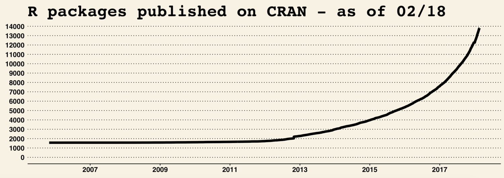
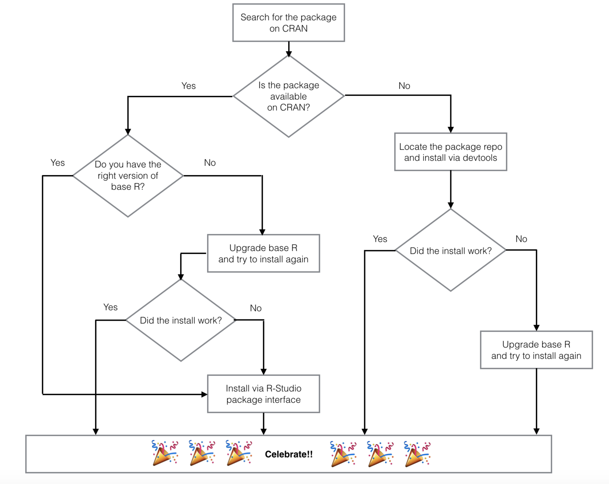
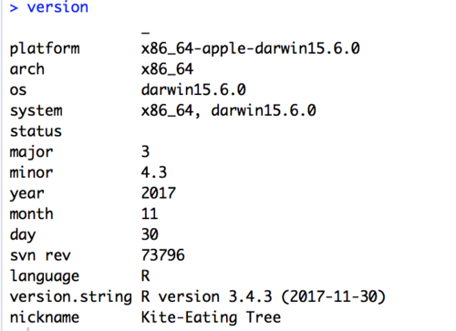
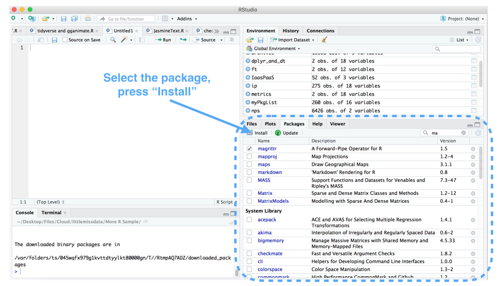

R Package Install Troubleshooting — Little Miss Data

One of the reasons why I love R is that I feel like I’m constantly finding out about cool new packages through an ever-growing community of users and teachers. 

To understand the current state of R packages on [CRAN](https://cran.r-project.org/), I ran some code provided by [Gergely Daróczi on Github](https://gist.github.com/daroczig/3cf06d6db4be2bbe3368) .  As of today there have been almost 14,000 R packages published on CRAN and the rate of publishing appears to be growing at an almost exponential trend.  Additionally, there are even more packages available on sources like [Github](https://github.com/), [Bioconductor](https://www.bioconductor.org/), [Bitbucket](http://www.bitbucket.org/%E2%80%8E) and more. 



Last week, I was heading out on  a trip.  I excitedly planned my air time to do some fun new R tutorials.  The night before the flight I attempted to install all required packages or files so that I wasn't struggling with slow plane wifi.  Unfortunately the following packages kept giving me install issues: quanteda, magrittr and emo.  As per usual, I executed the install.packages() command to install the packages.

```
install.packages("magittr")
install.packages("emo")
install.packages("quanteda")
```

I recieved the following sad warnings:

```
Warning in install.packages :

  package ‘magittr’ is not available (for R version 3.3.3)

Warning in install.packages :

  package ‘emo’ is not available (for R version 3.3.3)

Warning in install.packages :

  package ‘quanteda’ is not available (for R version 3.3.3)

```


## R- [why are you making me think?](http://www.uxbooth.com/articles/10-usability-lessons-from-steve-krugs-dont-make-me-think/)

Why?  Why is my loving R betraying me and making me overthink the install of some packages?  It’s 11 at night before my early AM flight.  I really do NOT want to be reading through stack overflow for package install troubleshooting help at the moment.  Adding insult to injury, the warning messages are not super helpful.

I know it’s lazy, but given how many tools us data people use every day I feel like we shouldn't have to think very hard about installing packages.  We should be thinking about the data and analysis.  

## A Cry for help

So I haphazardedly try a bunch of stuff, nothing works and I have a lightbulb moment!  The lovely women at [R-Ladies Austin](https://www.meetup.com/rladies-austin/) were just telling me that if I ask a help question on twitter with the [#rstats](https://twitter.com/hashtag/rstats) tag someone may take pity on me and answer.  Having nothing to loose I give it a shot and luckily as I slept the help piled in! 

So what did I do wrong?  Well umm.. what didn't I do wrong?  I had the wrong version of R for one package, I made a typo on another and I was trying to install a package from CRAN that was on github only.  This all seems pretty silly, but how would I guess these mistakes from the error messages above?  And the more important question is how can I pay forward the help I got to prevent others from making the same mistakes?

## Approaching package issues systematically

To help other poor souls that don't want to think too hard when struggling to install packages referenced in tutorials or other media, I've put together a simple flow chart.  The basic troubleshooting guide can be followed in the flow chart. However additional detailed instructions and links can be found below the image.  



## Additional instructions for Package Install troubleshooting flow chart

**Is the package available on CRAN? **

- Unfortunately CRAN does not have a search but you can usually find the package by googling "CRAN R &lt;package name&gt;"
    

**Do you have the right version of base R? **

- To identify your R version, execute the command "Version" and the output will indicate your installed base R version. In the screenshot, I have version 3.4.3
    
- To install a new version of R, visit [the download page](https://cran.r-project.org/mirrors.html)
    



**Did the install work?**

- If the install worked, you will get a message along the lines of "The downloaded binary packages are in &lt;filepath&gt; "
    

**Install via R-Studio package interface**

- This is a very handy tip which prevents silly typos. The tip was given by [Albert Kim](https://twitter.com/rudeboybert) in reply to my #rstats tweet. He documents this in his awesome book: [Modern Dive An Introduction to Statistical and Data Sciences via R.](http://moderndive.com/2-getting-started.html#package-installation)
    



**Locate the package repo and install via devtools**

- Typically the easiest way to locate the package repo is by googling "r package &lt;package name&gt;". In the case of the emo R package I found it here: [https://github.com/hadley/emo](https://github.com/hadley/emo)
    
- Install the package from the repo via [devtools](https://cran.r-project.org/web/packages/devtools/README.html). This simply involves installing and loading the devtools package and then executing the appropriate "install_" command from the docs. In the case of the emo package, the following code will work.
    

```
install.packages("devtools")
library(devtools)
install_github("hadley/emo")
```

```
# OR MAC and Linux users can simply do:
# devtools::install_github("hadley/emo")
```

## Thank you

Thank you for taking the time to read this guide.  I certainly hope that it will help people spend less time thinking about package install debugging and leave more time for fun data analysis and exploration.  Please feel free to let me know your thoughts in the comments or on [twitter](https://twitter.com/LittleMissData).  Thanks!

## Update Nov 3 2018

As pointed out by Julia in the comments, if all of the above fails, please check to see if the package is in [bioconductor](https://www.bioconductor.org/install/).

Written by Laura Ellis

[Previous<br>#### Happy International Women's Day!<br>visualization, R, tutorial<br>Laura Ellis<br>March 8, 2018<br>R, map, dataviz, tutorial](https://www.littlemissdata.com/blog/2018/iwd2018)[Next<br>#### Data Storytelling<br>visualization, tutorial, free data<br>Laura Ellis<br>February 11, 2018<br>tutorial, map, flourish, visualization, review](https://www.littlemissdata.com/blog/data-storytelling)