tidyverse - Google Search

tidyverse

[All](https://www.google.com/search?q=tidyverse&source=lmns&bih=937&biw=1920&rlz=1C1GCEB_enAU867AU867&hl=en&ved=2ahUKEwiHxsDKltDoAhWxN3IKHbkKBooQ_AUoAHoECAEQAA)Images[Videos](https://www.google.com/search?q=tidyverse&source=lmns&tbm=vid&bih=937&biw=1920&rlz=1C1GCEB_enAU867AU867&hl=en&ved=2ahUKEwiHxsDKltDoAhWxN3IKHbkKBooQ_AUoAnoECAEQAg)[News](https://www.google.com/search?q=tidyverse&source=lmns&tbm=nws&bih=937&biw=1920&rlz=1C1GCEB_enAU867AU867&hl=en&ved=2ahUKEwiHxsDKltDoAhWxN3IKHbkKBooQ_AUoA3oECAEQAw)[Shopping](https://www.google.com/search?q=tidyverse&source=lmns&tbm=shop&bih=937&biw=1920&rlz=1C1GCEB_enAU867AU867&hl=en&ved=2ahUKEwiHxsDKltDoAhWxN3IKHbkKBooQ_AUoBHoECAEQBA)More

[Settings](https://www.google.com/preferences)

Tools

[Collections](https://www.google.com/save?&bih=937&biw=1920&rlz=1C1GCEB_enAU867AU867&hl=en&ved=2ahUKEwiHxsDKltDoAhWxN3IKHbkKBooQ7XV6BAgBEBA)

- [SafeSearch](https://www.google.com/preferences)

Size

Color

Usage Rights

Type

Time

[ data science](https://www.google.com/search?q=tidyverse&tbm=isch&chips=q:tidyverse,g_1:data+science:RE7A1gwX1HY%3D&bih=937&biw=1920&rlz=1C1GCEB_enAU867AU867&hl=en&ved=2ahUKEwiHxsDKltDoAhWxN3IKHbkKBooQ4lYoAHoECAEQFQ)

[ rstudio](https://www.google.com/search?q=tidyverse&tbm=isch&chips=q:tidyverse,g_1:rstudio:-uWAfbNICdA%3D&bih=937&biw=1920&rlz=1C1GCEB_enAU867AU867&hl=en&ved=2ahUKEwiHxsDKltDoAhWxN3IKHbkKBooQ4lYoAXoECAEQFw)

[ ggplot2](https://www.google.com/search?q=tidyverse&tbm=isch&chips=q:tidyverse,g_1:ggplot2:DbY04aZgtOU%3D&bih=937&biw=1920&rlz=1C1GCEB_enAU867AU867&hl=en&ved=2ahUKEwiHxsDKltDoAhWxN3IKHbkKBooQ4lYoAnoECAEQGQ)

[ hex](https://www.google.com/search?q=tidyverse&tbm=isch&chips=q:tidyverse,g_1:hex:eUlpBkeN4l0%3D&bih=937&biw=1920&rlz=1C1GCEB_enAU867AU867&hl=en&ved=2ahUKEwiHxsDKltDoAhWxN3IKHbkKBooQ4lYoA3oECAEQGw)

[workflow](https://www.google.com/search?q=tidyverse&tbm=isch&chips=q:tidyverse,g_1:workflow&bih=937&biw=1920&rlz=1C1GCEB_enAU867AU867&hl=en&ved=2ahUKEwiHxsDKltDoAhWxN3IKHbkKBooQ4lYoBHoECAEQHQ)

[beautiful](https://www.google.com/search?q=tidyverse&tbm=isch&chips=q:tidyverse,g_1:beautiful&bih=937&biw=1920&rlz=1C1GCEB_enAU867AU867&hl=en&ved=2ahUKEwiHxsDKltDoAhWxN3IKHbkKBooQ4lYoBXoECAEQHg)

[regression](https://www.google.com/search?q=tidyverse&tbm=isch&chips=q:tidyverse,g_1:regression&bih=937&biw=1920&rlz=1C1GCEB_enAU867AU867&hl=en&ved=2ahUKEwiHxsDKltDoAhWxN3IKHbkKBooQ4lYoBnoECAEQHw)

[documentation](https://www.google.com/search?q=tidyverse&tbm=isch&chips=q:tidyverse,g_1:documentation&bih=937&biw=1920&rlz=1C1GCEB_enAU867AU867&hl=en&ved=2ahUKEwiHxsDKltDoAhWxN3IKHbkKBooQ4lYoB3oECAEQIA)

[weather](https://www.google.com/search?q=tidyverse&tbm=isch&chips=q:tidyverse,g_1:weather&bih=937&biw=1920&rlz=1C1GCEB_enAU867AU867&hl=en&ved=2ahUKEwiHxsDKltDoAhWxN3IKHbkKBooQ4lYoCHoECAEQIQ)

[ icon](https://www.google.com/search?q=tidyverse&tbm=isch&chips=q:tidyverse,g_1:icon:mbPhmg_RQB0%3D&bih=937&biw=1920&rlz=1C1GCEB_enAU867AU867&hl=en&ved=2ahUKEwiHxsDKltDoAhWxN3IKHbkKBooQ4lYoCXoECAEQIg)

[data analysis](https://www.google.com/search?q=tidyverse&tbm=isch&chips=q:tidyverse,g_1:data+analysis&bih=937&biw=1920&rlz=1C1GCEB_enAU867AU867&hl=en&ved=2ahUKEwiHxsDKltDoAhWxN3IKHbkKBooQ4lYoCnoECAEQJA)

[summary](https://www.google.com/search?q=tidyverse&tbm=isch&chips=q:tidyverse,g_1:summary&bih=937&biw=1920&rlz=1C1GCEB_enAU867AU867&hl=en&ved=2ahUKEwiHxsDKltDoAhWxN3IKHbkKBooQ4lYoC3oECAEQJQ)

[ dplyr](https://www.google.com/search?q=tidyverse&tbm=isch&chips=q:tidyverse,g_1:dplyr:6hGFEqK5Knw%3D&bih=937&biw=1920&rlz=1C1GCEB_enAU867AU867&hl=en&ved=2ahUKEwiHxsDKltDoAhWxN3IKHbkKBooQ4lYoDHoECAEQJg)

[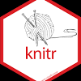 knitr](https://www.google.com/search?q=tidyverse&tbm=isch&chips=q:tidyverse,g_1:knitr:DHSc2LkuXHU%3D&bih=937&biw=1920&rlz=1C1GCEB_enAU867AU867&hl=en&ved=2ahUKEwiHxsDKltDoAhWxN3IKHbkKBooQ4lYoDXoECAEQKA)

[ shiny](https://www.google.com/search?q=tidyverse&tbm=isch&chips=q:tidyverse,g_1:shiny:dJhFZJ8O4tg%3D&bih=937&biw=1920&rlz=1C1GCEB_enAU867AU867&hl=en&ved=2ahUKEwiHxsDKltDoAhWxN3IKHbkKBooQ4lYoDnoECAEQKg)

[statistical computing functionality](https://www.google.com/search?q=tidyverse&tbm=isch&chips=q:tidyverse,g_1:statistical+computing+functionality&bih=937&biw=1920&rlz=1C1GCEB_enAU867AU867&hl=en&ved=2ahUKEwiHxsDKltDoAhWxN3IKHbkKBooQ4lYoD3oECAEQLA)

[ggmap](https://www.google.com/search?q=tidyverse&tbm=isch&chips=q:tidyverse,g_1:ggmap&bih=937&biw=1920&rlz=1C1GCEB_enAU867AU867&hl=en&ved=2ahUKEwiHxsDKltDoAhWxN3IKHbkKBooQ4lYoEHoECAEQLQ)

[randomforest](https://www.google.com/search?q=tidyverse&tbm=isch&chips=q:tidyverse,g_1:randomforest&bih=937&biw=1920&rlz=1C1GCEB_enAU867AU867&hl=en&ved=2ahUKEwiHxsDKltDoAhWxN3IKHbkKBooQ4lYoEXoECAEQLg)

[fivethirtyeight](https://www.google.com/search?q=tidyverse&tbm=isch&chips=q:tidyverse,g_1:fivethirtyeight&bih=937&biw=1920&rlz=1C1GCEB_enAU867AU867&hl=en&ved=2ahUKEwiHxsDKltDoAhWxN3IKHbkKBooQ4lYoEnoECAEQLw)

[ julia](https://www.google.com/search?q=tidyverse&tbm=isch&chips=q:tidyverse,g_1:julia:rz6wvFj4oxY%3D&bih=937&biw=1920&rlz=1C1GCEB_enAU867AU867&hl=en&ved=2ahUKEwiHxsDKltDoAhWxN3IKHbkKBooQ4lYoE3oECAEQMA)

[single label](https://www.google.com/search?q=tidyverse&tbm=isch&chips=q:tidyverse,g_1:single+label&bih=937&biw=1920&rlz=1C1GCEB_enAU867AU867&hl=en&ved=2ahUKEwiHxsDKltDoAhWxN3IKHbkKBooQ4lYoFHoECAEQMg)

[layout](https://www.google.com/search?q=tidyverse&tbm=isch&chips=q:tidyverse,g_1:layout&bih=937&biw=1920&rlz=1C1GCEB_enAU867AU867&hl=en&ved=2ahUKEwiHxsDKltDoAhWxN3IKHbkKBooQ4lYoFXoECAEQMw)

[thank you](https://www.google.com/search?q=tidyverse&tbm=isch&chips=q:tidyverse,g_1:thank+you&bih=937&biw=1920&rlz=1C1GCEB_enAU867AU867&hl=en&ved=2ahUKEwiHxsDKltDoAhWxN3IKHbkKBooQ4lYoFnoECAEQNA)

[logistic regression](https://www.google.com/search?q=tidyverse&tbm=isch&chips=q:tidyverse,g_1:logistic+regression&bih=937&biw=1920&rlz=1C1GCEB_enAU867AU867&hl=en&ved=2ahUKEwiHxsDKltDoAhWxN3IKHbkKBooQ4lYoF3oECAEQNQ)

[longitudinal data](https://www.google.com/search?q=tidyverse&tbm=isch&chips=q:tidyverse,g_1:longitudinal+data&bih=937&biw=1920&rlz=1C1GCEB_enAU867AU867&hl=en&ved=2ahUKEwiHxsDKltDoAhWxN3IKHbkKBooQ4lYoGHoECAEQNg)

[presentation](https://www.google.com/search?q=tidyverse&tbm=isch&chips=q:tidyverse,g_1:presentation&bih=937&biw=1920&rlz=1C1GCEB_enAU867AU867&hl=en&ved=2ahUKEwiHxsDKltDoAhWxN3IKHbkKBooQ4lYoGXoECAEQNw)

[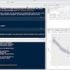 r code](https://www.google.com/search?q=tidyverse&tbm=isch&chips=q:tidyverse,g_1:r+code:02WiEK9zfcs%3D&bih=937&biw=1920&rlz=1C1GCEB_enAU867AU867&hl=en&ved=2ahUKEwiHxsDKltDoAhWxN3IKHbkKBooQ4lYoGnoECAEQOA)

[timeline](https://www.google.com/search?q=tidyverse&tbm=isch&chips=q:tidyverse,g_1:timeline&bih=937&biw=1920&rlz=1C1GCEB_enAU867AU867&hl=en&ved=2ahUKEwiHxsDKltDoAhWxN3IKHbkKBooQ4lYoG3oECAEQOg)

[output](https://www.google.com/search?q=tidyverse&tbm=isch&chips=q:tidyverse,g_1:output&bih=937&biw=1920&rlz=1C1GCEB_enAU867AU867&hl=en&ved=2ahUKEwiHxsDKltDoAhWxN3IKHbkKBooQ4lYoHHoECAEQOw)

[multiple point](https://www.google.com/search?q=tidyverse&tbm=isch&chips=q:tidyverse,g_1:multiple+point&bih=937&biw=1920&rlz=1C1GCEB_enAU867AU867&hl=en&ved=2ahUKEwiHxsDKltDoAhWxN3IKHbkKBooQ4lYoHXoECAEQPA)

[A Collection of R Packages for Data ... analyticsvidhya.com](https://www.analyticsvidhya.com/blog/2019/05/beginner-guide-tidyverse-most-powerful-collection-r-packages-data-science/)

[Getting Started with tidyverse in R ... storybench.org](https://www.storybench.org/getting-started-with-tidyverse-in-r/)

[Tidyverse data wrangling | Introduction ... hbctraining.github.io](https://hbctraining.github.io/Intro-to-R/lessons/08_intro_tidyverse.html)

[Easily install and load packages ... github.com](https://github.com/tidyverse/tidyverse)

[Transitioning into the tidyverse (part 2) rebeccabarter.com](http://www.rebeccabarter.com/blog/2019-08-05_base_r_to_tidyverse_pt2/)

[Tidyverse tidyverse.org](https://www.tidyverse.org/packages/)

[Tidyverse tidyverse.org](https://www.tidyverse.org/)

[Tidyverse with R via Homebrew macOS 10.14 medium.com](https://medium.com/@kadek/how-to-install-the-tidyverse-r-via-homebrew-macos-10-14-d749d2136cf1)

[R Tidyverse | Centre for Statistics in ... seec.uct.ac.za](http://www.seec.uct.ac.za/r-tidyverse)

[Databases in the tidyverse beanumber.github.io](https://beanumber.github.io/tidy-databases/tidy_databases_slides.html)

[What is the tidyverse? · R Views rviews.rstudio.com](https://rviews.rstudio.com/2017/06/08/what-is-the-tidyverse/)

[Get to Know Tidyverse | Vertabelo Academy academy.vertabelo.com](https://academy.vertabelo.com/course/tidyverse)

[data with tidyverse uw-madison-datascience.github.io](https://uw-madison-datascience.github.io/2019-09-11-uwmadison-dc/slides/dplyr/dplyr.html)

[1 Introduction | R for Data Science r4ds.had.co.nz](https://r4ds.had.co.nz/introduction.html)

[The Lesser Known Stars of the Tidyverse slideshare.net](https://www.slideshare.net/EmilyRobinson52/the-lesser-known-stars-of-the-tidyverse)

[Tidyverse tidyverse.org](https://www.tidyverse.org/)

[Pivoting data from columns to rows (and ... storybench.org](https://www.storybench.org/pivoting-data-from-columns-to-rows-and-back-in-the-tidyverse/)

[Data Cleaning with R and the Tidyverse ... towardsdatascience.com](https://towardsdatascience.com/data-cleaning-with-r-and-the-tidyverse-detecting-missing-values-ea23c519bc62)

[Exploring the Tidyverse | Steven M ... stevenmortimer.com](https://stevenmortimer.com/presentations/exploring-the-tidyverse/)

[SmartCat | Tidyverse smartcat.io](https://www.smartcat.io/technologies/tidyverse/)

[Tidyverse tidyverse.org](https://www.tidyverse.org/)

[A Collection of R Packages for Data ... analyticsvidhya.com](https://www.analyticsvidhya.com/blog/2019/05/beginner-guide-tidyverse-most-powerful-collection-r-packages-data-science/)

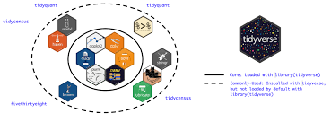

[tidyverse friendly packages ... github.com](https://github.com/tidyverse/tidyverse.org/issues/13)

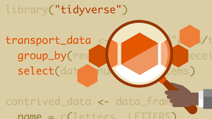

[What is the tidyverse? | LinkedIn ... linkedin.com](https://www.linkedin.com/learning/learning-the-r-tidyverse/what-is-the-tidyverse)

Related searches

[ tidyverse logo](https://www.google.com/search?q=tidyverse+logo&tbm=isch&bih=937&biw=1920&rlz=1C1GCEB_enAU867AU867&hl=en&ved=2ahUKEwiHxsDKltDoAhWxN3IKHbkKBooQrNwCKAB6BAgBEE0)[ tidyverse cheat sheet](https://www.google.com/search?q=tidyverse+cheat+sheet&tbm=isch&bih=937&biw=1920&rlz=1C1GCEB_enAU867AU867&hl=en&ved=2ahUKEwiHxsDKltDoAhWxN3IKHbkKBooQrNwCKAF6BAgBEE8)[ hex-tidyverse](https://www.google.com/search?q=hex-tidyverse&tbm=isch&bih=937&biw=1920&rlz=1C1GCEB_enAU867AU867&hl=en&ved=2ahUKEwiHxsDKltDoAhWxN3IKHbkKBooQrNwCKAJ6BAgBEFE)

[i class="fa fa-rocket ">&lt;/i&gt; To the ... dicook.org](http://www.dicook.org/files/rstudio/)

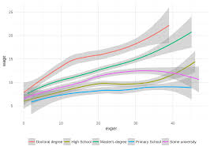

[Teaching the tidyverse to beginners ... brodrigues.co](https://www.brodrigues.co/blog/2017-12-17-teaching_tidyverse/)

[Tidyverse tidyverse.org](https://www.tidyverse.org/)

[Tidyverse Cheat Sheet For Beginners ... datacamp.com](https://www.datacamp.com/community/blog/tidyverse-cheat-sheet-beginners)

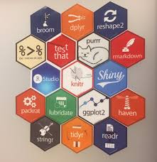

[Spatial data and the tidyverse robinlovelace.net](https://www.robinlovelace.net/presentations/spatial-tidyverse.html)

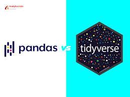

[Python's Pandas vs R's Tidyverse: Who ... analyticsindiamag.com](https://analyticsindiamag.com/pythons-pandas-vs-rs-tidyverse-who-wins/)

[R Packages - RStudio rstudio.com](https://rstudio.com/products/rpackages/)

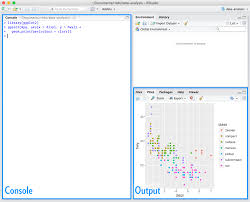

[1 Introduction | R for Data Science r4ds.had.co.nz](https://r4ds.had.co.nz/introduction.html)

[A Collection of R Packages for Data ... analyticsvidhya.com](https://www.analyticsvidhya.com/blog/2019/05/beginner-guide-tidyverse-most-powerful-collection-r-packages-data-science/)

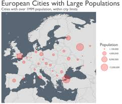

[Tidyverse practice: mapping large ... r-bloggers.com](https://www.r-bloggers.com/tidyverse-practice-mapping-large-european-cities/)

[Add "Master of the tidyverse" sticker ... github.com](https://github.com/rstudio/hex-stickers/issues/9)

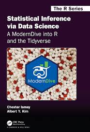

[Statistical Inference via Data Science moderndive.com](https://moderndive.com/)

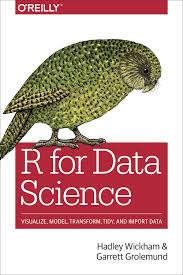

[Tidyverse tidyverse.org](https://www.tidyverse.org/)

[Tidyverse (dplyr, readr ... youtube.com](https://www.youtube.com/watch?v=NtfHcNlwSEY)

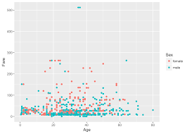

[Introduction to the Tidyverse: Tutorial ... datacamp.com](https://www.datacamp.com/community/tutorials/tidyverse-tutorial-r)

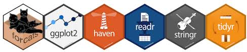

[R Basics | The Tidyverse! statseducation.com](http://statseducation.com/Introduction-to-R/modules/getting%20started/tidyverse/)

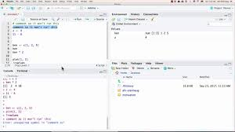

[Rstudio (R Tidyverse ... youtube.com](https://www.youtube.com/watch?v=lTTJPRwnONE)

[Working with Data in the Tidyverse ... r-bloggers.com](https://www.r-bloggers.com/new-course-working-with-data-in-the-tidyverse/)

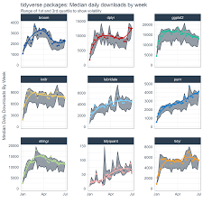

[Tidy Time Series Analysis, Part 1 business-science.io](https://www.business-science.io/timeseries-analysis/2017/07/02/tidy-timeseries-analysis.html)

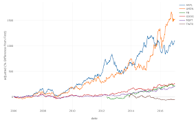

[quantitative financial analysis for ... blog.exploratory.io](https://blog.exploratory.io/introduction-to-tidyquant-quantitative-financial-analysis-for-tidyverse-habitats-e5f72a023ce2)

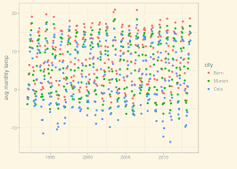

[R for SQListas (1): Welcome to the ... datasciencecentral.com](https://www.datasciencecentral.com/profiles/blogs/r-for-sqlistas-1-welcome-to-the-tidyverse)

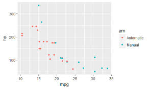

[Grid search in the tidyverse drsimonj.svbtle.com](https://drsimonj.svbtle.com/grid-search-in-the-tidyverse)

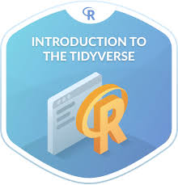

[Introduction to the Tidyverse | DataCamp datacamp.com](https://www.datacamp.com/courses/introduction-to-the-tidyverse)

Related searches

[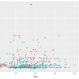 tidyverse examples](https://www.google.com/search?q=tidyverse+examples&tbm=isch&bih=937&biw=1920&rlz=1C1GCEB_enAU867AU867&hl=en&ved=2ahUKEwiHxsDKltDoAhWxN3IKHbkKBooQrNwCKAB6BQgBEIQB)[ tidyverse png](https://www.google.com/search?q=tidyverse+png&tbm=isch&bih=937&biw=1920&rlz=1C1GCEB_enAU867AU867&hl=en&ved=2ahUKEwiHxsDKltDoAhWxN3IKHbkKBooQrNwCKAF6BQgBEIYB)[ icon tidyverse](https://www.google.com/search?q=icon+tidyverse&tbm=isch&bih=937&biw=1920&rlz=1C1GCEB_enAU867AU867&hl=en&ved=2ahUKEwiHxsDKltDoAhWxN3IKHbkKBooQrNwCKAJ6BQgBEIgB)

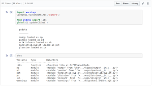

[The Tidyverse For Python - Gordon - Medium medium.com](https://medium.com/@gorafle/tidyverse-for-python-e0e821c646b7)

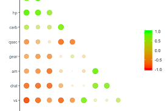

[Simple Correlation Analysis in R using ... paulvanderlaken.com](https://paulvanderlaken.com/2018/09/10/simpler-correlation-analysis-in-r-using-tidyverse-principles/)

[tidyverse Archives - MilanoR milanor.net](http://www.milanor.net/blog/tag/tidyverse/)

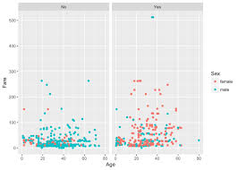

[DataCamp on Twitter: "Tutorial: Getting ... twitter.com](https://twitter.com/datacamp/status/1043757289520476161)

[Tidyverse Fundamentals with R ... r-bloggers.com](https://www.r-bloggers.com/new-skill-track-tidyverse-fundamentals-with-r/)

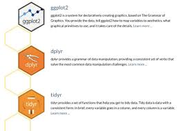

[Intro to R-tidyverse and R-plotly ... coconomics.wordpress.com](https://coconomics.wordpress.com/2018/08/09/intro-to-r-tidyverse-and-r-plotly/)

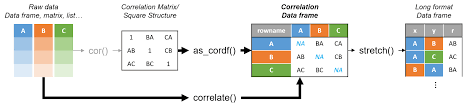

[Frequency Table Using Tidyverse ... community.rstudio.com](https://community.rstudio.com/t/creating-frequency-table-using-tidyverse/2190)

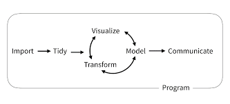

[Master the R/Tidyverse ... infrafrontier.eu](https://www.infrafrontier.eu/programming-r-master-rtidyverse)

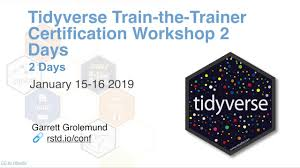

[Tidyverse Train-the-Trainer ... youtube.com](https://www.youtube.com/watch?v=x5jnTIjZ2Kc)

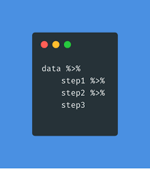

[What is a Tidyverse-centric approach ... rfortherestofus.com](https://rfortherestofus.com/2019/06/what-is-a-tidyverse-centric-approach/)

[the tidyverse:: vulstats.ucsd.edu](http://vulstats.ucsd.edu/labs/R_Lessons/Lab1-Data/tidyverse.pdf)

[conduct preliminary data analysis ... towardsdatascience.com](https://towardsdatascience.com/how-to-use-jupyter-to-conduct-preliminary-data-analysis-for-health-sciences-r-tidyverse-edition-8c3260976cf2)

[Tidyverse tidyverse.org](https://www.tidyverse.org/)

[the tidyverse:: vulstats.ucsd.edu](http://vulstats.ucsd.edu/labs/R_Lessons/Lab1-Data/tidyverse.pdf)

[The tidyverse | LinkedIn Learning ... linkedin.com](https://www.linkedin.com/learning/learning-r-2/the-tidyverse)

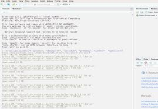

[Modern R with the tidyverse b-rodrigues.github.io](https://b-rodrigues.github.io/modern_R/)

[Visualization in R using ggplot2 and ... rolv.io](https://www.rolv.io/event-details/visualization-in-r-using-ggplot2-and-tidyverse)

[Pew Research Center survey data in R medium.com](https://medium.com/pew-research-center-decoded/using-tidyverse-tools-with-pew-research-center-survey-data-in-r-bdfe61de0909)

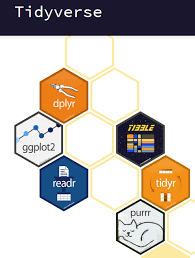

[RPubs - Tidyverse Basics rpubs.com](https://rpubs.com/aelhabr/tidyverse-basics)

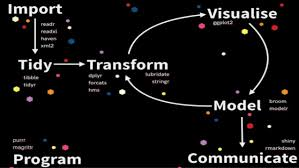

[The Lesser Known Stars of the Tidyverse slideshare.net](https://www.slideshare.net/EmilyRobinson52/the-lesser-known-stars-of-the-tidyverse)

[Counting Arguments in the Tidyverse ... jumpingrivers.com](https://www.jumpingrivers.com/blog/counting-arguments-in-the-tidyverse/)

[Using the tidyverse for more than data ... brodrigues.co](https://www.brodrigues.co/blog/2018-12-21-tidyverse_pi/)

[R and Tidyverse Tutorial - YouTube youtube.com](https://www.youtube.com/watch?v=JtQfXY0lIzc)

Related searches

[tidyverse workflow](https://www.google.com/search?q=tidyverse+workflow&tbm=isch&bih=937&biw=1920&rlz=1C1GCEB_enAU867AU867&hl=en&ved=2ahUKEwiHxsDKltDoAhWxN3IKHbkKBooQrNwCKAB6BQgBELsB)[tidyverse graphs](https://www.google.com/search?q=tidyverse+graphs&tbm=isch&bih=937&biw=1920&rlz=1C1GCEB_enAU867AU867&hl=en&ved=2ahUKEwiHxsDKltDoAhWxN3IKHbkKBooQrNwCKAF6BQgBEL0B)[tidyverse r cheat sheet](https://www.google.com/search?q=tidyverse+r+cheat+sheet&tbm=isch&bih=937&biw=1920&rlz=1C1GCEB_enAU867AU867&hl=en&ved=2ahUKEwiHxsDKltDoAhWxN3IKHbkKBooQrNwCKAJ6BQgBEL8B)

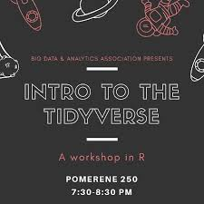

[The Tidyverse is the most powerful ... facebook.com](https://www.facebook.com/bdaaosu/posts/2535043039912379:0)

[Modeling with Data in the Tidyverse ... r-bloggers.com](https://www.r-bloggers.com/new-course-modeling-with-data-in-the-tidyverse/)

[dplyr rename() - For Renaming Columns ... honingds.com](https://honingds.com/blog/dplyr-rename/)

[Working with Data in the Tidyverse ... facebook.com](https://www.facebook.com/726282547396228/photos/working-with-data-in-the-tidyverse-in-this-course-youll-learn-to-work-with-data-/2399393040085162/)

[Introduction à R et au tidyverse juba.github.io](https://juba.github.io/tidyverse/06-tidyverse.html)

[Teaching the tidyverse to R novices ... medium.com](https://medium.com/@jaheppler/teaching-the-tidyverse-to-r-novices-7747e8ce14e)

[An optimal task for the tidyverse lynda.com](https://www.lynda.com/R-tutorials/optimal-task-tidyverse/614304/716680-4.html)

[The Lesser Known Stars of the Tidyverse slideshare.net](https://www.slideshare.net/EmilyRobinson52/the-lesser-known-stars-of-the-tidyverse)

[Counting Arguments in the Tidyverse | R ... r-bloggers.com](https://www.r-bloggers.com/counting-arguments-in-the-tidyverse/)

[Python And R for Data Wrangling ... towardsdatascience.com](https://towardsdatascience.com/python-and-r-for-data-wrangling-examples-for-both-including-speed-up-considerations-f2ec2bb53a86)

[Data transformations rworkshop.uni.lu](https://rworkshop.uni.lu/lectures/lecture05_dplyr.html)

[Tidy Data and tidyr -- Pt 2 Intro to ... youtube.com](https://www.youtube.com/watch?v=1ELALQlO-yM)

[Tidyverse users: gather/spread are on ... win-vector.com](http://www.win-vector.com/blog/2019/03/tidyverse-users-gather-spread-are-on-the-way-out/)

[Base R, the tidyverse, and data.table ... wetlandscapes.com](https://wetlandscapes.com/blog/a-comparison-of-r-dialects/)

[Why Learn the Tidyverse academy.vertabelo.com](https://academy.vertabelo.com/blog/why-learn-tidyverse/)

[What is a Tidyverse-centric approach ... rfortherestofus.com](https://rfortherestofus.com/2019/06/what-is-a-tidyverse-centric-approach/)

[RStudio Cheatsheets - RStudio rstudio.com](https://rstudio.com/resources/cheatsheets/)

[A tidyverse functions quiz with {learnr ... rostrum.blog](https://www.rostrum.blog/2019/03/18/tidyverse-quiz/)

[Data and visualization 📉 datasciencebox.org](https://datasciencebox.org/slides/u1_d02-data-and-viz/u1_d02-data-and-viz.html)

[The Lesser Known Stars of the Tidyverse slideshare.net](https://www.slideshare.net/EmilyRobinson52/the-lesser-known-stars-of-the-tidyverse)

[Transitioning into the tidyverse (part 1) rebeccabarter.com](http://www.rebeccabarter.com/blog/2019-08-05_base_r_to_tidyverse/)

[Tidyverse for Data Preprocessing ... packtpub.com](https://www.packtpub.com/data/harness-the-power-of-tidyverse-for-data-preprocessing-and-visualisation-in-r-video)

[Categorical Data in the Tidyverse ... r-bloggers.com](https://www.r-bloggers.com/new-course-categorical-data-in-the-tidyverse/)

Related searches

[tidyverse meme](https://www.google.com/search?q=tidyverse+meme&tbm=isch&bih=937&biw=1920&rlz=1C1GCEB_enAU867AU867&hl=en&ved=2ahUKEwiHxsDKltDoAhWxN3IKHbkKBooQrNwCKAB6BQgBEPMB)[tidyverse stickers](https://www.google.com/search?q=tidyverse+stickers&tbm=isch&bih=937&biw=1920&rlz=1C1GCEB_enAU867AU867&hl=en&ved=2ahUKEwiHxsDKltDoAhWxN3IKHbkKBooQrNwCKAF6BQgBEPUB)[dplyr](https://www.google.com/search?q=dplyr&tbm=isch&bih=937&biw=1920&rlz=1C1GCEB_enAU867AU867&hl=en&ved=2ahUKEwiHxsDKltDoAhWxN3IKHbkKBooQrNwCKAJ6BQgBEPcB)

[The Tidyverse in Action evamaerey.github.io](https://evamaerey.github.io/tidyverse_in_action/tidyverse_in_action.html)

[Master the R/Tidyverse ... phenogenomics.cz](https://www.phenogenomics.cz/2020/01/programing-in-r-course-master-the-r-tidyverse/)

[Tidyverse – Towards Data Science towardsdatascience.com](https://towardsdatascience.com/tagged/tidyverse)

[An illustration of tidyverse' gather ... data-se.netlify.com](https://data-se.netlify.com/2019/01/15/an-illustration-of-tidyverse-gather-spread/)

[Install tidyverse on Rstudio - YouTube youtube.com](https://www.youtube.com/watch?v=38AV_M0QxCs)

[seascapemodels seascapemodels.org](https://www.seascapemodels.org/rstats/2016/10/28/simulations-with-purrr.html)

[Teach the tidyverse to beginners ... varianceexplained.org](http://varianceexplained.org/r/teach-tidyverse/)

Wait while more content is being loaded

[Centre for Statistics in Ecology, the Environment](http://www.seec.uct.ac.za/r-tidyverse)

[R Tidyverse | Centre for Statistics in Ecology, the Environment](http://www.seec.uct.ac.za/r-tidyverse)

Images may be subject to copyright. [Learn More](https://support.google.com/legal/answer/3463239?hl=en)

Related images

[See more](https://www.google.com/search?q=tidyverse&tbm=isch&tbs=rimg%3ACboHvCs5y5OsImBmLI984QzEKzXiuLriSQVg0TTxrhu_1-tvEJ18cTNotMkYO2ju9gD3EtlPz0hHD3x5yH32tb0pxqs0rZ4DMgwH-_1CuaOVajKUJmwfa3Z4BSa_1ZYvav5Ng-9-USUrRvUiKgqEglmLI984QzEKxHY9PAnnF562yoSCTXiuLriSQVgEa1KNKwXZrq0KhIJ0TTxrhu_1-tsR-PriJXixLfsqEgnEJ18cTNotMhE9sbghphX-OCoSCUYO2ju9gD3EEZXJA8B9bAtBKhIJtlPz0hHD3x4RGzAeijSZTGsqEglyH32tb0pxqhEKxj4cQE_1lnyoSCc0rZ4DMgwH-EQs-O2T7-curKhIJ_1CuaOVajKUIRluJcCT_1ygDYqEglmwfa3Z4BSaxHwtHdpDM-XGioSCfZYvav5Ng-9EV5mF6yH0M7gKhIJ-USUrRvUiKgRt09ZSBg9zwZhGFQ3MviEM2A&bih=937&biw=1920&rlz=1C1GCEB_enAU867AU867&hl=en&ved=0CAIQrnZqFwoTCKDxts6W0OgCFQAAAAAdAAAAABAX)

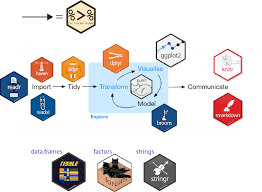

[Data plotting rworkshop.uni.lu](https://rworkshop.uni.lu/lectures/lecture07_plotting.html)

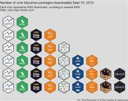

[core tidyverse downloads isotype plot evamaerey.github.io](https://evamaerey.github.io/little_flipbooks_library/ggtextures/ggtextures)

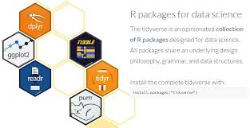

[Introducing R/Tidyverse to Clinical Statistical Programming mbswonline.com](http://www.mbswonline.com/upload/presentation_6-22-2018-14-25-55.introducing%20r_tidyverse%20to%20clinical%20statistical%20programming.pdf)

[How to Install the Tidyverse with R via Homebrew macOS 10.14 medium.com](https://medium.com/@kadek/how-to-install-the-tidyverse-r-via-homebrew-macos-10-14-d749d2136cf1)

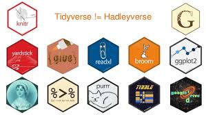

[The Lesser Known Stars of the Tidyverse slideshare.net](https://www.slideshare.net/EmilyRobinson52/the-lesser-known-stars-of-the-tidyverse)

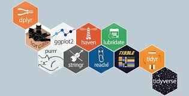

[Introduction to Tidyverse - A Collection of R Packages for Data ... pinterest.com](https://www.pinterest.com/pin/424816177349289484/)

[Getting Started with tidyverse in R - Storybench storybench.org](https://www.storybench.org/getting-started-with-tidyverse-in-r/)

[Manipulating, analyzing and exporting data with tidyverse uw-madison-datascience.github.io](https://uw-madison-datascience.github.io/2019-09-11-uwmadison-dc/slides/dplyr/dplyr.html)

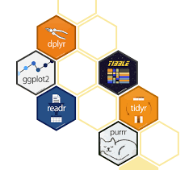

[Transitioning into the tidyverse (part 2) rebeccabarter.com](http://www.rebeccabarter.com/blog/2019-08-05_base_r_to_tidyverse_pt2/)

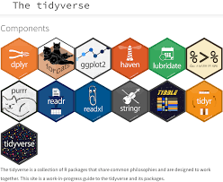

[Tidyverse data wrangling | Introduction to R hbctraining.github.io](https://hbctraining.github.io/Intro-to-R/lessons/08_intro_tidyverse.html)

[Add list of domain-specific tidyverse friendly packages to ... github.com](https://github.com/tidyverse/tidyverse.org/issues/13)

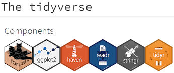

[Exploring the Tidyverse | Steven M. Mortimer stevenmortimer.com](https://stevenmortimer.com/presentations/exploring-the-tidyverse/)

[See more](https://www.google.com/search?q=tidyverse&tbm=isch&tbs=rimg%3ACboHvCs5y5OsImBmLI984QzEKzXiuLriSQVg0TTxrhu_1-tvEJ18cTNotMkYO2ju9gD3EtlPz0hHD3x5yH32tb0pxqs0rZ4DMgwH-_1CuaOVajKUJmwfa3Z4BSa_1ZYvav5Ng-9-USUrRvUiKgqEglmLI984QzEKxHY9PAnnF562yoSCTXiuLriSQVgEa1KNKwXZrq0KhIJ0TTxrhu_1-tsR-PriJXixLfsqEgnEJ18cTNotMhE9sbghphX-OCoSCUYO2ju9gD3EEZXJA8B9bAtBKhIJtlPz0hHD3x4RGzAeijSZTGsqEglyH32tb0pxqhEKxj4cQE_1lnyoSCc0rZ4DMgwH-EQs-O2T7-curKhIJ_1CuaOVajKUIRluJcCT_1ygDYqEglmwfa3Z4BSaxHwtHdpDM-XGioSCfZYvav5Ng-9EV5mF6yH0M7gKhIJ-USUrRvUiKgRt09ZSBg9zwZhGFQ3MviEM2A&bih=937&biw=1920&rlz=1C1GCEB_enAU867AU867&hl=en&ved=0CBsQuIIBahcKEwig8bbOltDoAhUAAAAAHQAAAAAQFw)

[Help](https://support.google.com/websearch/?visit_id=1-636354266020939771-215785992&rd=2&hl=en&ved=2ahUKEwiHxsDKltDoAhWxN3IKHbkKBooQ8KwCegQIAhAB#topic=3378866)Send feedback[Privacy](https://policies.google.com/privacy?hl=en&gl=AU&ved=2ahUKEwiHxsDKltDoAhWxN3IKHbkKBooQ8awCegQIAhAD)[Terms](https://policies.google.com/terms?hl=en&gl=AU&ved=2ahUKEwiHxsDKltDoAhWxN3IKHbkKBooQ8qwCegQIAhAE)