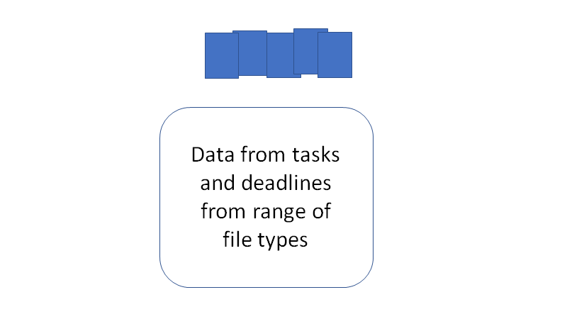

# Introduction {.tabset}

Navigating the path between graduate studies and an academic career is a difficult task at the best of times. One of the key steps in becoming a establish researcher in the current academic environment. 

To do this efficiently, time management is one key aspect, however when there are so many little projects running it can be hard to know what to work on. 

This document is to record the method to proposing my 6month timeline for my PhD completion, as well as, showing the key aspects of the `tidyPipes` approach to research and the draft project plan for the invertebrate work I am proposing to do with Ben Kefford's lab.

