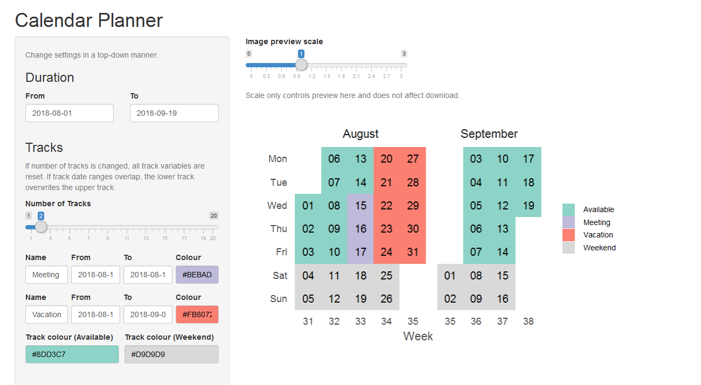

## Visualisation {.tabset}

*Creating timeline charts in R (Generating Timeline charts)*


We will use *ggplot* function from *ggplot2* package to generate timeline charts. The following functions are used to add layers of details to the chart. Workout timeline with a heat-map of calories burnt with activity type

Timeline charts can be used in a lot of applications like tracking equipment or a process status changes, resource availability & scheduling, project timelines, documenting start and end times of events. The beauty of ggplot2 package is that the code can be easily customized, and more details can be added to the plots.

To do this I have created a calendar for each key project/impact/aspect of short-term timeline, objectives, as well as, my career and life projection. To begin with I need to create timelines and other project goals under covid19. I have put this into a single dataset called `dat` here.

These figures can be generated using `ggplot` and other `tidyverse` approaches due to the implantation of the `dataspice` packages above.


### Individual projects

Each of my tasks come from a collection of overall projects I collaborate on and develop code with on timeframes that range from monthly to undefined. The current projects I have integrated into my timeline are:

### PhD

Over the duration of my PhD I have currently developed my thesis and publications to align with a 6 month hand-in date from the 1st July 2020.


```r
project1 <- readxl::read_excel("./data/Sem two planning.xlsx", sheet = 3)

DT::datatable(head(project1))
```

<!--html_preserve--><div id="htmlwidget-45d5530504942eede4b4" style="width:100%;height:auto;" class="datatables html-widget"></div>
<script type="application/json" data-for="htmlwidget-45d5530504942eede4b4">{"x":{"filter":"none","data":[["1","2","3","4","5","6"],["phd20200701001","phd20200701013","phd20200701002","phd20200701003","phd20200701004","phd20200701005"],["FullPhDleft","ScholarShip_end","MethodsPhD","DiscussionPhDleft","tidyPipesPhD","natureleft"],["july","june","august","september","october","november"],["2020-07-01T00:00:00Z","2020-07-07T00:00:00Z","2020-08-01T00:00:00Z","2020-09-01T00:00:00Z","2020-10-01T00:00:00Z","2020-11-01T00:00:00Z"],["2020-12-31T00:00:00Z","2020-07-09T00:00:00Z","2020-08-03T00:00:00Z","2020-03-06T00:00:00Z","2019-10-08T00:00:00Z","2019-05-11T00:00:00Z"],["1899-12-31T09:00:00Z",null,"1899-12-31T09:00:00Z","1899-12-31T09:00:00Z","1899-12-31T09:00:00Z","1899-12-31T09:00:00Z"],["1899-12-31T15:00:00Z",null,"1899-12-31T15:00:00Z","1899-12-31T15:00:00Z","1899-12-31T15:00:00Z","1899-12-31T15:00:00Z"],["Just the full length of time I need to finish my PhD project",null,null,null,null,null],[null,null,null,null,null,null],[null,null,null,null,null,null],[null,null,null,null,null,null]],"container":"<table class=\"display\">\n  <thead>\n    <tr>\n      <th> <\/th>\n      <th>eventCode<\/th>\n      <th>shortName<\/th>\n      <th>month<\/th>\n      <th>startDate<\/th>\n      <th>finishDate<\/th>\n      <th>startTime<\/th>\n      <th>endTime<\/th>\n      <th>description<\/th>\n      <th>src<\/th>\n      <th>ucX<\/th>\n      <th>week<\/th>\n    <\/tr>\n  <\/thead>\n<\/table>","options":{"order":[],"autoWidth":false,"orderClasses":false,"columnDefs":[{"orderable":false,"targets":0}]}},"evals":[],"jsHooks":[]}</script><!--/html_preserve-->


#### Introduction

#### Methods

#### Conclusion

#### Discussion


### Previous achievements and tasks


### Council tasks {.tabset}

Being nominated to represent the Graduate community on the University of Canberra Council in November 2019 was a great honour. At the time I did understand the impact of 


```r
project2 <- readxl::read_excel("./data/Sem two planning.xlsx", sheet = 4)

DT::datatable(head(project2))
```

<!--html_preserve--><div id="htmlwidget-9a5a1b055ec88471d373" style="width:100%;height:auto;" class="datatables html-widget"></div>
<script type="application/json" data-for="htmlwidget-9a5a1b055ec88471d373">{"x":{"filter":"none","data":[["1","2","3","4","5","6"],["scr20200701001","scr20200701002","scr20200701003","scr20200701004","scr20200701005","scr20200701006"],["WorldRefDay","Oweek","ReasonStatement","SSAFsurvey","TownHall2","openDay"],["june","july","august","august","august","august"],["20/06/2020","44039","44044","44044","44044","44044"],["20/06/2020","44043",null,null,null,null],["1899-12-31T09:00:00Z","1899-12-31T09:00:00Z","1899-12-31T09:00:00Z","1899-12-31T09:00:00Z","1899-12-31T09:00:00Z","1899-12-31T09:00:00Z"],["1899-12-31T15:00:00Z","1899-12-31T22:00:00Z","1899-12-31T15:00:00Z","1899-12-31T15:00:00Z","1899-12-31T15:00:00Z","1899-12-31T15:00:00Z"],["World Refugee Day","O week for semester two","Statement of reasons due (late Aug)","SSAF Survey","Town HAll","Open Day 22nd"],[null,null,null,null,null,null],[null,null,null,null,null,null],[null,null,null,null,null,null]],"container":"<table class=\"display\">\n  <thead>\n    <tr>\n      <th> <\/th>\n      <th>eventCode<\/th>\n      <th>shortName<\/th>\n      <th>month<\/th>\n      <th>startDate<\/th>\n      <th>finishDate<\/th>\n      <th>startTime<\/th>\n      <th>endTime<\/th>\n      <th>description<\/th>\n      <th>src<\/th>\n      <th>ucX<\/th>\n      <th>week<\/th>\n    <\/tr>\n  <\/thead>\n<\/table>","options":{"order":[],"autoWidth":false,"orderClasses":false,"columnDefs":[{"orderable":false,"targets":0}]}},"evals":[],"jsHooks":[]}</script><!--/html_preserve-->

#### UC-Council

Generally it is regarded that there will be about a week (40hrs) of background reading and investigation before each council meeting. Under covid19 conditions I think this may be much greater.

Here are the general tasks and overall timetable of the Council obligations in 2020:


```r
dataCouncil <- readxl::read_excel("./data/Sem two planning.xlsx", sheet = 3)

DT::datatable(head(dataCouncil))
```

<!--html_preserve--><div id="htmlwidget-32e4f460953c8e60aac7" style="width:100%;height:auto;" class="datatables html-widget"></div>
<script type="application/json" data-for="htmlwidget-32e4f460953c8e60aac7">{"x":{"filter":"none","data":[["1","2","3","4","5","6"],["phd20200701001","phd20200701013","phd20200701002","phd20200701003","phd20200701004","phd20200701005"],["FullPhDleft","ScholarShip_end","MethodsPhD","DiscussionPhDleft","tidyPipesPhD","natureleft"],["july","june","august","september","october","november"],["2020-07-01T00:00:00Z","2020-07-07T00:00:00Z","2020-08-01T00:00:00Z","2020-09-01T00:00:00Z","2020-10-01T00:00:00Z","2020-11-01T00:00:00Z"],["2020-12-31T00:00:00Z","2020-07-09T00:00:00Z","2020-08-03T00:00:00Z","2020-03-06T00:00:00Z","2019-10-08T00:00:00Z","2019-05-11T00:00:00Z"],["1899-12-31T09:00:00Z",null,"1899-12-31T09:00:00Z","1899-12-31T09:00:00Z","1899-12-31T09:00:00Z","1899-12-31T09:00:00Z"],["1899-12-31T15:00:00Z",null,"1899-12-31T15:00:00Z","1899-12-31T15:00:00Z","1899-12-31T15:00:00Z","1899-12-31T15:00:00Z"],["Just the full length of time I need to finish my PhD project",null,null,null,null,null],[null,null,null,null,null,null],[null,null,null,null,null,null],[null,null,null,null,null,null]],"container":"<table class=\"display\">\n  <thead>\n    <tr>\n      <th> <\/th>\n      <th>eventCode<\/th>\n      <th>shortName<\/th>\n      <th>month<\/th>\n      <th>startDate<\/th>\n      <th>finishDate<\/th>\n      <th>startTime<\/th>\n      <th>endTime<\/th>\n      <th>description<\/th>\n      <th>src<\/th>\n      <th>ucX<\/th>\n      <th>week<\/th>\n    <\/tr>\n  <\/thead>\n<\/table>","options":{"order":[],"autoWidth":false,"orderClasses":false,"columnDefs":[{"orderable":false,"targets":0}]}},"evals":[],"jsHooks":[]}</script><!--/html_preserve-->

#### UC-SRC

This is a short demo site to help with planning for the SRC for semester 2 2020.


#### Supporting Reproducibility at UC

My Phd studies put me in a unique situation where I can apply the tools and computational development I have done with my PhD and conceptually test the framework for the application in the education sector. 

- `UCdown`
- `councilCOMOS`
- `UCSRC covid support`

### UC-Invertebrates {.tabset}

This work has its own repository so far.


```r
project3 <- readxl::read_excel("./data/Sem two planning.xlsx", sheet = 5)
```

```
## New names:
## * `` -> ...1
```

```r
DT::datatable(head(project3))
```

<!--html_preserve--><div id="htmlwidget-d1d104b83447816be240" style="width:100%;height:auto;" class="datatables html-widget"></div>
<script type="application/json" data-for="htmlwidget-d1d104b83447816be240">{"x":{"filter":"none","data":[["1","2","3","4","5","6"],["ACTIVITIES",null,null,null,null,null],["World Refugee Day",null,null,null,null,null],["O week",null,null,null,null,null],["Statement of reasons due (late Aug)","SSAF Survey","Town HAll","Open Day 22nd","Nicks 21st Birthday",null],["SSAF Bids Due","Graduation","SSAF Committeess","RUOKDay",null,null],["NAIDOC","Mental Health Day/Month",null,null,null,null],["Exams","Results",null,null,null,null],["Council Report","SSAF Acquittal",null,null,null,null]],"container":"<table class=\"display\">\n  <thead>\n    <tr>\n      <th> <\/th>\n      <th>...1<\/th>\n      <th>Jun<\/th>\n      <th>July<\/th>\n      <th>Aug<\/th>\n      <th>Sept<\/th>\n      <th>Oct<\/th>\n      <th>Nov<\/th>\n      <th>Dec<\/th>\n    <\/tr>\n  <\/thead>\n<\/table>","options":{"order":[],"autoWidth":false,"orderClasses":false,"columnDefs":[{"orderable":false,"targets":0}]}},"evals":[],"jsHooks":[]}</script><!--/html_preserve-->

## Feedback loop

To create the feedback loop (to get information back from supervisors) I have began to develop a interactive shiny app within the same structure as the baseline dataset so that there is limited coding needed to create the tidypipes "cycle" of community engagement.


```r
library(knitr)
```

```
## Warning: package 'knitr' was built under R version 4.0.2
```

```r
knitr::include_graphics(path = "./img/preview.png")
```



As computational work takes over our regular management of time over the tradional hard copy "diary". I like this because important information can not be left in the "local cafe" however as I have used "gmail", "outlook" and there suites of applications and tools for calenders I have muddled everything up and missed appointments etc. 

There is alot of my development work in this section because I have attempted to combine these two packages in a way to document all the council emails and other work that I have undertaken as part of the `COVID19` pandemic in Australia.

To try and counter this I have developed a `tidypipes` workflow for my tasks, projects and other collarorations. See presentation [here](./assets/TidyPipes-calenderJUL2020.pptx).


