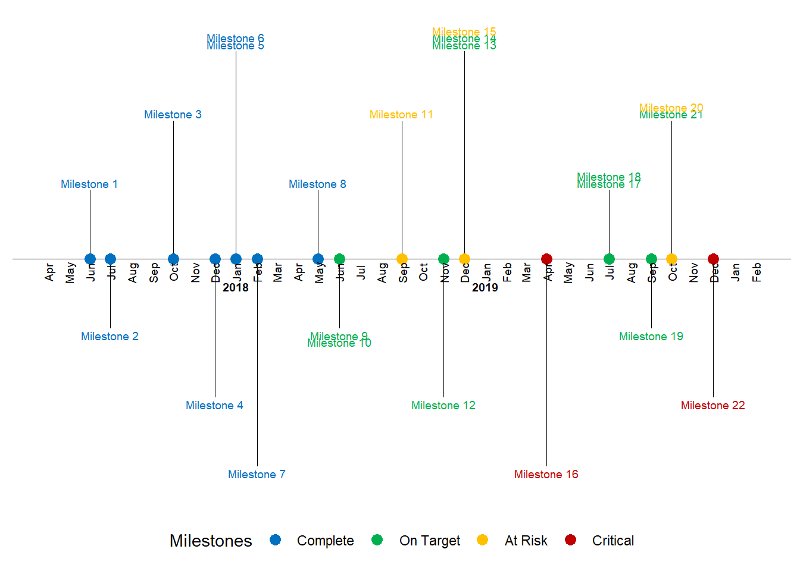

# Overall outputs {#outputs}


The baseline dataset is generated by combining each final `...Project.csv` file in the data folder into a single dataset. There are three main output figures of interest currently:

## Timeline

<!--  -->

Timeline charts can be used in a lot of applications like tracking equipment or a process status changes, resource availability & scheduling, project timelines, documenting start and end times of events. The beauty of ggplot2 package is that the code can be easily customized, and more details can be added to the plots.


## Activity

Workout timeline with a heat-map of calories burnt with activity type.


## Calendars

Calender information....


## Plot simple


```r
# names(datBASE)
# datBASE$project

ggplot(datBASE1, aes(x = date, y = shortName)) +
  geom_point() + 
  facet_wrap(~project, scales = "free")
```


## Final plot option 1


See Ben Alex Keen's blog with the following output: 


```r
timeline_plot <-filter(df, status != "NA" & project == "PhD") %>%
  ggplot(aes(x=date,y=0, col=status, label=milestone)) +
  labs(col="Milestones")+ 
  # scale_color_manual(values=status_colors, labels=status_levels, drop = FALSE)+
  theme_classic() +
  geom_hline(yintercept=0, color = "black", size=0.3) #+
  # facet_wrap(~project)

# # Plot vertical segment lines for milestones
# timeline_plot<-timeline_plot+geom_segment(data=df[df$month_count == 1,], aes(y=position,yend=0,xend=date), color='black', size=0.2)
# 
# # Plot scatter points at zero and date
# timeline_plot<-timeline_plot+geom_point(aes(y=0), size=3)
# 
# # Don't show axes, appropriately position legend
# timeline_plot<-timeline_plot+theme(axis.line.y=element_blank(),
#                  axis.text.y=element_blank(),
#                  axis.title.x=element_blank(),
#                  axis.title.y=element_blank(),
#                  axis.ticks.y=element_blank(),
#                  axis.text.x =element_blank(),
#                  axis.ticks.x =element_blank(),
#                  axis.line.x =element_blank(),
#                  legend.position = "bottom"
#                 )
# 
# # Show text for each month
# timeline_plot<-timeline_plot+geom_text(data=month_df, aes(x=month_date_range,y=-0.1,label=month_format),size=2.5,vjust=0.5, color='black', angle=90)
# 
# # Show year text
# timeline_plot<-timeline_plot+geom_text(data=year_df, aes(x=year_date_range,y=-0.2,label=year_format, fontface="bold"),size=2.5, color='black')

# Show text for each milestone
timeline_plot<-timeline_plot+geom_text(aes(y=text_position,label=shortName),size=4)
timeline_plot
```

## Timeline {.tabset}

One of the tricky bits about timelines is the format of the date and time of each event. This is different for each event so therefore we have four columns to incorporate this information in the following from for this repository and database. This will also mean that some of the information in other formats will have to be converted into these dimension and any other elements defined in each dataset I am combining to make a overall timeline.

By integrating these stage with some `dataspice` code/approach's allows for me to generate metadata from each sheet of the excel file quickly using R. Here are the steps to do this.


```r
#dataspice from github
library(dataspice)

#each project needs to be imported and then saved as csv in raw_data file to document variable names etc correctly into the json dataset.
# raw_data <- 
project2 <- readxl::read_excel("./data/raw_data/Sem two planning.xlsx", sheet = 4)
project2
```

<div data-pagedtable="false">
  <script data-pagedtable-source type="application/json">
{"columns":[{"label":["eventCode"],"name":[1],"type":["chr"],"align":["left"]},{"label":["shortName"],"name":[2],"type":["chr"],"align":["left"]},{"label":["month"],"name":[3],"type":["chr"],"align":["left"]},{"label":["startDate"],"name":[4],"type":["chr"],"align":["left"]},{"label":["finishDate"],"name":[5],"type":["chr"],"align":["left"]},{"label":["startTime"],"name":[6],"type":["S3: POSIXct"],"align":["right"]},{"label":["endTime"],"name":[7],"type":["S3: POSIXct"],"align":["right"]},{"label":["description"],"name":[8],"type":["chr"],"align":["left"]},{"label":["src"],"name":[9],"type":["lgl"],"align":["right"]},{"label":["ucX"],"name":[10],"type":["lgl"],"align":["right"]},{"label":["week"],"name":[11],"type":["lgl"],"align":["right"]}],"data":[{"1":"scr20200701001","2":"WorldRefDay","3":"june","4":"20/06/2020","5":"20/06/2020","6":"1899-12-31 09:00:00","7":"1899-12-31 15:00:00","8":"World Refugee Day","9":"NA","10":"NA","11":"NA"},{"1":"scr20200701002","2":"Oweek","3":"july","4":"44039","5":"44043","6":"1899-12-31 09:00:00","7":"1899-12-31 22:00:00","8":"O week for semester two","9":"NA","10":"NA","11":"NA"},{"1":"scr20200701003","2":"ReasonStatement","3":"august","4":"44044","5":"NA","6":"1899-12-31 09:00:00","7":"1899-12-31 15:00:00","8":"Statement of reasons due (late Aug)","9":"NA","10":"NA","11":"NA"},{"1":"scr20200701004","2":"SSAFsurvey","3":"august","4":"44044","5":"NA","6":"1899-12-31 09:00:00","7":"1899-12-31 15:00:00","8":"SSAF Survey","9":"NA","10":"NA","11":"NA"},{"1":"scr20200701005","2":"TownHall2","3":"august","4":"44044","5":"NA","6":"1899-12-31 09:00:00","7":"1899-12-31 15:00:00","8":"Town HAll","9":"NA","10":"NA","11":"NA"},{"1":"scr20200701006","2":"openDay","3":"august","4":"44044","5":"NA","6":"1899-12-31 09:00:00","7":"1899-12-31 15:00:00","8":"Open Day 22nd","9":"NA","10":"NA","11":"NA"},{"1":"scr20200701007","2":"nic21st","3":"august","4":"44044","5":"NA","6":"<NA>","7":"1899-12-31 15:00:00","8":"Nicks 21st Birthday","9":"NA","10":"NA","11":"NA"},{"1":"scr20200701008","2":"SSAFbids","3":"september","4":"44075","5":"NA","6":"1899-12-31 09:00:00","7":"1899-12-31 15:00:00","8":"SSAF Bids Due","9":"NA","10":"NA","11":"NA"},{"1":"scr20200701009","2":"Grad","3":"september","4":"44075","5":"NA","6":"1899-12-31 09:00:00","7":"1899-12-31 15:00:00","8":"Graduation","9":"NA","10":"NA","11":"NA"},{"1":"scr20200701010","2":"SSAFFunds","3":"september","4":"44075","5":"NA","6":"<NA>","7":"<NA>","8":"SSAF Committeess","9":"NA","10":"NA","11":"NA"},{"1":"scr20200701011","2":"RUOKDay","3":"september","4":"44075","5":"NA","6":"<NA>","7":"<NA>","8":"RUOKDay","9":"NA","10":"NA","11":"NA"},{"1":"scr20200701012","2":"NAIDOC","3":"october","4":"44105","5":"NA","6":"<NA>","7":"<NA>","8":"NAIDOC","9":"NA","10":"NA","11":"NA"},{"1":"scr20200701013","2":"mentalHealth","3":"october","4":"44105","5":"NA","6":"<NA>","7":"<NA>","8":"Mental Health Day/Month","9":"NA","10":"NA","11":"NA"},{"1":"scr20200701014","2":"Exams","3":"november","4":"44136","5":"NA","6":"<NA>","7":"<NA>","8":"Exams","9":"NA","10":"NA","11":"NA"},{"1":"scr20200701015","2":"Results","3":"november","4":"44136","5":"NA","6":"<NA>","7":"<NA>","8":"Results","9":"NA","10":"NA","11":"NA"},{"1":"scr20200701016","2":"councilReport","3":"december","4":"44166","5":"NA","6":"<NA>","7":"<NA>","8":"Council Report","9":"NA","10":"NA","11":"NA"},{"1":"scr20200701017","2":"SSAFacq","3":"december","4":"44166","5":"NA","6":"<NA>","7":"<NA>","8":"SSAF Acquittal","9":"NA","10":"NA","11":"NA"},{"1":"scr20200701018","2":"disabilityDay","3":"december","4":"43902","5":"43902","6":"<NA>","7":"<NA>","8":"International disability day","9":"NA","10":"NA","11":"NA"},{"1":"scr20200701019","2":"NA","3":"NA","4":"NA","5":"NA","6":"<NA>","7":"<NA>","8":"NA","9":"NA","10":"NA","11":"NA"},{"1":"council20200701001","2":"NA","3":"NA","4":"NA","5":"NA","6":"<NA>","7":"<NA>","8":"NA","9":"NA","10":"NA","11":"NA"},{"1":"council20200701002","2":"NA","3":"NA","4":"NA","5":"NA","6":"<NA>","7":"<NA>","8":"NA","9":"NA","10":"NA","11":"NA"},{"1":"council20200701003","2":"NA","3":"NA","4":"NA","5":"NA","6":"<NA>","7":"<NA>","8":"NA","9":"NA","10":"NA","11":"NA"}],"options":{"columns":{"min":{},"max":[10]},"rows":{"min":[10],"max":[10]},"pages":{}}}
  </script>
</div>

```r
#date
data_actions <- readxl::read_excel("./data/raw_data/Sem two planning.xlsx", sheet = 1)
```

```
## New names:
## * `` -> ...7
## * `` -> ...8
## * `` -> ...9
## * `` -> ...10
## * `` -> ...11
## * ...
```

```r
data_names <- readxl::read_excel("./data/raw_data/Sem two planning.xlsx", sheet = 3)
#time

#location
```


#### Past Outcomes


### Action timeline

These sources of data are combined for my general timeline below. These summarised actions are also the flagged tasks from outlook calendar to catch up with this information but this can be automated in the future.


```r
# DT::datatable(emailsCalender1)
## handmade data
DT::datatable(data_actions)
```

<!--html_preserve--><div id="htmlwidget-d566725b1dd6baf47457" style="width:100%;height:auto;" class="datatables html-widget"></div>
<script type="application/json" data-for="htmlwidget-d566725b1dd6baf47457">{"x":{"filter":"none","data":[["1","2","3","4","5","6","7","8","9","10","11","12","13","14","15","16","17","18","19","20","21","22","23","24","25","26","27","28","29","30","31","32","33","34","35","36","37","38","39","40","41","42","43","44","45","46","47","48","49","50","51","52","53","54","55","56","57","58","59","60","61","62","63","64","65","66","67","68","69","70","71","72","73","74","75","76","77","78","79","80","81","82","83","84","85","86","87","88","89","90","91","92","93","94","95","96","97","98","99","100","101","102","103","104","105","106","107","108","109","110","111","112","113","114","115","116","117","118","119","120","121","122","123","124","125","126","127","128","129","130","131","132","133","134","135","136","137","138","139","140","141","142","143","144","145","146","147","148","149","150","151","152","153","154","155","156","157","158","159","160","161","162","163","164","165","166","167","168","169","170","171","172","173","174","175","176","177","178","179","180","181","182","183","184","185","186","187","188","189","190","191","192","193","194","195","196","197","198","199","200","201","202","203","204","205","206","207","208","209","210","211","212","213","214","215","216","217","218","219","220","221","222","223","224","225","226","227","228","229","230","231","232","233","234","235","236","237","238","239","240","241","242","243","244","245","246","247","248"],[1,2,3,4,5,6,7,8,9,10,11,12,13,14,15,16,17,18,19,20,21,22,23,24,25,26,27,28,29,30,31,1,2,3,4,5,6,7,8,9,10,11,12,13,14,15,16,17,18,19,20,21,22,23,24,25,26,27,28,29,30,31,1,2,3,4,5,6,7,8,9,10,11,12,13,14,15,16,17,18,19,20,21,22,23,24,25,26,27,28,29,30,31,1,2,3,4,5,6,7,8,9,10,11,12,13,14,15,16,17,18,19,20,21,22,23,24,25,26,27,28,29,30,31,1,2,3,4,5,6,7,8,9,10,11,12,13,14,15,16,17,18,19,20,21,22,23,24,25,26,27,28,29,30,31,1,2,3,4,5,6,7,8,9,10,11,12,13,14,15,16,17,18,19,20,21,22,23,24,25,26,27,28,29,30,31,1,2,3,4,5,6,7,8,9,10,11,12,13,14,15,16,17,18,19,20,21,22,23,24,25,26,27,28,29,30,31,1,2,3,4,5,6,7,8,9,10,11,12,13,14,15,16,17,18,19,20,21,22,23,24,25,26,27,28,29,30,31],[null,null,"Academic Board (Majid/Josh)","Academic Integrity Mtg (Lola/Hamish/Nick)                               Student Equity &amp; Advisory Group (TBD)",null,null,null,null,null,null,"Grades Released","WT Census",null,null,null,null,"UEC (Josephine)",null,null,"World Refugee Day",null,null,null,null,null,"Council (Emma/Anthony)",null,null,null,null,null,null,null,null,null,null,null,null,null,"URC",null,null,null,null,null,"UEC (Josephine)","UAC (Josephine)",null,null,null,null,null,null,null,null,null,null,"Orientation Sem 2",null,null,null,null,null,null,"Wk 1",null,"Academic Board (Majid/Josh)",null,null,null,null,null,null,null,null,null,null,null,null,null,null,null,"council reading","council reading","council reading","council reading","council reading","council reading","council reading","Council (Emma/Anthony)",null,null,null,null,"urc reading","URC","Census Date",null,null,null,null,"UEC (Josephine)","UAC (Josephine) RUOK Day",null,null,null,null,null,null,null,null,null,null,null,null,null,null,null,null,null,null,null,"Academic Board (Josh/Majid)",null,null,null,null,null,null,null,null,null,null,"Mental Health Day",null,null,null,null,null,null,null,null,null,null,null,"URC","Council (Emma/Anthony)",null,null,null,null,"UEC (Josephine)","UAC (Josephine)",null,null,null,null,null,null,null,null,null,null,null,null,null,null,null,null,null,null,null,null,null,null,null,null,null,null,null,null,null,null,null,null,null,null,null,null,null,null,null,null,"NAIDOC WEEK",null,null,null,null,null,null,null,null,null,"Academic Board (Josh/Majid)",null,null,null,null,null,null,null,null,null,null,null,null,null,null,"UEC (Josephine)",null,null,null,null,null,null,null,null,"Council (Emma/Anthony)",null,null,null,null,null,null,null,null,null,null,null,null,null,null,null,null,null,null,null,null],["june","june","june","june","june","june","june","june","june","june","june","june","june","june","june","june","june","june","june","june","june","june","june","june","june","june","june","june","june","june","june","july","july","july","july","july","july","july","july","july","july","july","july","july","july","july","july","july","july","july","july","july","july","july","july","july","july","july","july","july","july","july","august","august","august","august","august","august","august","august","august","august","august","august","august","august","august","august","august","august","august","august","august","august","august","august","august","august","august","august","august","august","august","september","september","september","september","september","september","september","september","september","september","september","september","september","september","september","september","september","september","september","september","september","september","september","september","september","september","september","september","september","september","september","october","october","october","october","october","october","october","october","october","october","october","october","october","october","october","october","october","october","october","october","october","october","october","october","october","october","october","october","october","october","october","october","october","october","october","october","october","october","october","october","october","october","october","october","october","october","october","october","october","october","october","october","october","october","october","october","october","october","october","october","october","october","november","november","november","november","november","november","november","november","november","november","november","november","november","november","november","november","november","november","november","november","november","november","november","november","november","november","november","november","november","november","november","december","december","december","december","december","december","december","december","december","december","december","december","december","december","december","december","december","december","december","december","december","december","december","december","december","december","december","december","december","december","december"],[null,null,"Majid; Josh","Lola; Hamish; Nick",null,null,null,null,null,null,"students","census",null,null,null,null,"Josephine",null,null,"census",null,null,null,null,null,"Anthony; Emma",null,null,null,null,null,null,null,null,null,null,null,null,null,null,null,null,null,null,null,null,null,null,null,null,null,null,null,null,null,null,null,null,null,null,null,null,null,null,null,null,null,null,null,null,null,null,null,null,null,null,null,null,null,null,null,null,null,null,null,null,null,null,null,null,null,null,null,null,null,null,null,null,null,null,null,null,null,null,null,null,null,null,null,null,null,null,null,null,null,null,null,null,null,null,null,null,null,null,null,null,null,null,null,null,null,null,null,null,null,null,null,null,null,null,null,null,null,null,null,null,null,null,null,null,null,null,null,null,null,null,null,null,null,null,null,null,null,null,null,null,null,null,null,null,null,null,null,null,null,null,null,null,null,null,null,null,null,null,null,null,null,null,null,null,null,null,null,null,null,null,null,null,null,null,null,null,null,null,null,null,null,null,null,null,null,null,null,null,null,null,null,null,null,null,null,null,null,null,null,null,null,null,null,null,null,null,null,null,null,null,null,null,null,null,null,null,null,null,null,null,null,null],[null,null,null,null,null,null,null,null,null,null,null,null,null,null,null,null,null,null,null,null,null,null,null,null,null,null,null,null,null,null,null,null,null,null,null,null,null,null,null,null,null,null,null,null,null,null,null,null,null,null,null,null,null,null,null,null,null,null,null,null,null,null,null,null,null,null,null,null,null,null,null,null,null,null,null,null,null,null,null,null,null,null,null,null,null,null,null,null,null,null,null,null,null,null,null,null,null,null,null,null,null,null,null,null,null,null,null,null,null,null,null,null,null,null,null,null,null,null,null,null,null,null,null,null,null,null,null,null,null,null,null,null,null,null,null,null,null,null,null,null,null,null,null,null,null,null,null,null,null,null,null,null,null,null,null,null,null,null,null,null,null,null,null,null,null,null,null,null,null,null,null,null,null,null,null,null,null,null,null,null,null,null,null,null,null,null,null,null,null,null,null,null,null,null,null,null,null,null,null,null,null,null,null,null,null,null,null,null,null,null,null,null,null,null,null,null,null,null,null,null,null,null,null,null,null,null,null,null,null,null,null,null,null,null,null,null,null,null,null,null,null,null,null,null,null,null,null,null],[null,null,null,null,null,null,null,null,null,null,null,null,null,null,null,null,null,null,null,null,null,null,null,null,null,null,null,null,null,null,null,null,null,null,null,null,null,null,null,null,null,null,null,null,null,null,null,null,null,null,null,null,null,null,null,null,null,null,null,null,null,null,null,null,null,null,null,null,null,null,null,null,null,null,null,null,null,null,null,null,null,null,null,null,null,null,null,null,null,null,null,null,null,null,null,null,null,null,null,null,null,null,null,null,null,null,null,null,null,null,null,null,null,null,null,null,null,null,null,null,null,null,null,null,null,null,null,null,null,null,null,null,null,null,null,null,null,null,null,null,null,null,null,null,null,null,null,null,null,null,null,null,null,null,null,null,null,null,null,null,null,null,null,null,null,null,null,null,null,null,null,null,null,null,null,null,null,null,null,null,null,null,null,null,null,null,null,null,null,null,null,null,null,null,null,null,null,null,null,null,null,null,null,null,null,null,null,null,null,null,null,null,null,null,null,null,null,null,null,null,null,null,null,null,null,null,null,null,null,null,null,null,null,null,null,null,null,null,null,null,null,null,null,null,null,null,null,null],[null,null,null,null,null,null,null,null,null,null,null,null,null,null,null,null,null,null,null,null,null,null,null,null,null,null,null,null,null,null,null,null,null,null,null,null,null,null,null,null,null,null,null,null,null,null,null,null,null,null,null,null,null,null,null,null,null,null,null,null,null,null,null,null,null,null,null,null,null,null,null,null,null,null,null,null,null,null,null,null,null,null,null,null,null,null,null,null,null,null,null,null,null,null,null,null,null,null,null,null,null,null,null,null,null,null,null,null,null,null,null,null,null,null,null,null,null,null,null,null,null,null,null,null,null,null,null,null,null,null,null,null,null,null,null,null,null,null,null,null,null,null,null,null,null,null,null,null,null,null,null,null,null,null,null,null,null,null,null,null,null,null,null,null,null,null,null,null,null,null,null,null,null,null,null,null,null,null,null,null,null,null,null,null,null,null,null,null,null,null,null,null,null,null,null,null,null,null,null,null,null,null,null,null,null,null,null,null,null,null,null,null,null,null,null,null,null,null,null,null,null,null,null,null,null,null,null,null,null,null,null,null,null,null,null,null,null,null,null,null,null,null,null,null,null,null,null,null],[null,null,null,null,null,null,null,null,null,null,null,null,null,null,null,null,null,null,null,null,null,null,null,null,null,null,null,null,null,null,null,null,null,null,null,null,null,null,null,null,null,null,null,null,null,null,null,null,null,null,null,null,null,null,null,null,null,null,null,null,null,null,null,null,null,null,null,null,null,null,null,null,null,null,null,null,null,null,null,null,null,null,null,null,null,null,null,null,null,null,null,null,null,null,null,null,null,null,null,null,null,null,null,null,null,null,null,null,null,null,null,null,null,null,null,null,null,null,null,null,null,null,null,null,null,null,null,null,null,null,null,null,null,null,null,null,null,null,null,null,null,null,null,null,null,null,null,null,null,null,null,null,null,null,null,null,null,null,null,null,null,null,null,null,null,null,null,null,null,null,null,null,null,null,null,null,null,null,null,null,null,null,null,null,null,null,null,null,null,null,null,null,null,null,null,null,null,null,null,null,null,null,null,null,null,null,null,null,null,null,null,null,null,null,null,null,null,null,null,null,null,null,null,null,null,null,null,null,null,null,null,null,null,null,null,null,null,null,null,null,null,null,null,null,null,null,null,null],[null,null,null,null,null,null,null,null,null,null,null,null,null,null,null,null,null,null,null,null,null,null,null,null,null,null,null,null,null,null,null,null,null,null,null,null,null,null,null,null,null,null,null,null,null,null,null,null,null,null,null,null,null,null,null,null,null,null,null,null,null,null,null,null,null,null,null,null,null,null,null,null,null,null,null,null,null,null,null,null,null,null,null,null,null,null,null,null,null,null,null,null,null,null,null,null,null,null,null,null,null,null,null,null,null,null,null,null,null,null,null,null,null,null,null,null,null,null,null,null,null,null,null,null,null,null,null,null,null,null,null,null,null,null,null,null,null,null,null,null,null,null,null,null,null,null,null,null,null,null,null,null,null,null,null,null,null,null,null,null,null,null,null,null,null,null,null,null,null,null,null,null,null,null,null,null,null,null,null,null,null,null,null,null,null,null,null,null,null,null,null,null,null,null,null,null,null,null,null,null,null,null,null,null,null,null,null,null,null,null,null,null,null,null,null,null,null,null,null,null,null,null,null,null,null,null,null,null,null,null,null,null,null,null,null,null,null,null,null,null,null,null,null,null,null,null,null,null],[null,null,null,null,null,null,null,null,null,null,null,null,null,null,null,null,null,null,null,null,null,null,null,null,null,null,null,null,null,null,null,null,null,null,null,null,null,null,null,null,null,null,null,null,null,null,null,null,null,null,null,null,null,null,null,null,null,null,null,null,null,null,null,null,null,null,null,null,null,null,null,null,null,null,null,null,null,null,null,null,null,null,null,null,null,null,null,null,null,null,null,null,null,null,null,null,null,null,null,null,null,null,null,null,null,null,null,null,null,null,null,null,null,null,null,null,null,null,null,null,null,null,null,null,null,null,null,null,null,null,null,null,null,null,null,null,null,null,null,null,null,null,null,null,null,null,null,null,null,null,null,null,null,null,null,null,null,null,null,null,null,null,null,null,null,null,null,null,null,null,null,null,null,null,null,null,null,null,null,null,null,null,null,null,null,null,null,null,null,null,null,null,null,null,null,null,null,null,null,null,null,null,null,null,null,null,null,null,null,null,null,null,null,null,null,null,null,null,null,null,null,null,null,null,null,null,null,null,null,null,null,null,null,null,null,null,null,null,null,null,null,null,null,null,null,null,null,null],[null,null,null,null,null,null,null,null,null,null,null,null,null,null,null,null,null,null,null,null,null,null,null,null,null,null,null,null,null,null,null,null,null,null,null,null,null,null,null,null,null,null,null,null,null,null,null,null,null,null,null,null,null,null,null,null,null,null,null,null,null,null,null,null,null,null,null,null,null,null,null,null,null,null,null,null,null,null,null,null,null,null,null,null,null,null,null,null,null,null,null,null,null,null,null,null,null,null,null,null,null,null,null,null,null,null,null,null,null,null,null,null,null,null,null,null,null,null,null,null,null,null,null,null,null,null,null,null,null,null,null,null,null,null,null,null,null,null,null,null,null,null,null,null,null,null,null,null,null,null,null,null,null,null,null,null,null,null,null,null,null,null,null,null,null,null,null,null,null,null,null,null,null,null,null,null,null,null,null,null,null,null,null,null,null,null,null,null,null,null,null,null,null,null,null,null,null,null,null,null,null,null,null,null,null,null,null,null,null,null,null,null,null,null,null,null,null,null,null,null,null,null,null,null,null,null,null,null,null,null,null,null,null,null,null,null,null,null,null,null,null,null,null,null,null,null,null,null],[null,null,null,null,null,null,null,null,null,null,null,null,null,null,null,null,null,null,null,null,null,null,null,null,null,null,null,null,null,null,null,null,null,null,null,null,null,null,null,null,null,null,null,null,null,null,null,null,null,null,null,null,null,null,null,null,null,null,null,null,null,null,null,null,null,null,null,null,null,null,null,null,null,null,null,null,null,null,null,null,null,null,null,null,null,null,null,null,null,null,null,null,null,null,null,null,null,null,null,null,null,null,null,null,null,null,null,null,null,null,null,null,null,null,null,null,null,null,null,null,null,null,null,null,null,null,null,null,null,null,null,null,null,null,null,null,null,null,null,null,null,null,null,null,null,null,null,null,null,null,null,null,null,null,null,null,null,null,null,null,null,null,null,null,null,null,null,null,null,null,null,null,null,null,null,null,null,null,null,null,null,null,null,null,null,null,null,null,null,null,null,null,null,null,null,null,null,null,null,null,null,null,null,null,null,null,null,null,null,null,null,null,null,null,null,null,null,null,null,null,null,null,null,null,null,null,null,null,null,null,null,null,null,null,null,null,null,null,null,null,null,null,null,null,null,null,null,null],[null,null,null,null,null,null,null,null,null,null,null,null,null,null,null,null,null,null,null,null,null,null,null,null,null,null,null,null,null,null,null,null,null,null,null,null,null,null,null,null,null,null,null,null,null,null,null,null,null,null,null,null,null,null,null,null,null,null,null,null,null,null,null,null,null,null,null,null,null,null,null,null,null,null,null,null,null,null,null,null,null,null,null,null,null,null,null,null,null,null,null,null,null,null,null,null,null,null,null,null,null,null,null,null,null,null,null,null,null,null,null,null,null,null,null,null,null,null,null,null,null,null,null,null,null,null,null,null,null,null,null,null,null,null,null,null,null,null,null,null,null,null,null,null,null,null,null,null,null,null,null,null,null,null,null,null,null,null,null,null,null,null,null,null,null,null,null,null,null,null,null,null,null,null,null,null,null,null,null,null,null,null,null,null,null,null,null,null,null,null,null,null,null,null,null,null,null,null,null,null,null,null,null,null,null,null,null,null,null,null,null,null,null,null,null,null,null,null,null,null,null,null,null,null,null,null,null,null,null,null,null,null,null,null,null,null,null,null,null,null,null,null,null,null,null,null,null,null],[null,null,null,"z",null,null,null,null,null,null,null,null,null,null,null,null,null,null,null,null,null,null,null,null,null,null,null,null,null,null,null,null,null,null,null,null,null,null,null,null,null,null,null,null,null,null,null,null,null,null,null,null,null,null,null,null,null,null,null,null,null,null,null,null,null,null,null,null,null,null,null,null,null,null,null,null,null,null,null,null,null,null,null,null,null,null,null,null,null,null,null,null,null,null,null,null,null,null,null,null,null,null,null,null,null,null,null,null,null,null,null,null,null,null,null,null,null,null,null,null,null,null,null,null,null,null,null,null,null,null,null,null,null,null,null,null,null,null,null,null,null,null,null,null,null,null,null,null,null,null,null,null,null,null,null,null,null,null,null,null,null,null,null,null,null,null,null,null,null,null,null,null,null,null,null,null,null,null,null,null,null,null,null,null,null,null,null,null,null,null,null,null,null,null,null,null,null,null,null,null,null,null,null,null,null,null,null,null,null,null,null,null,null,null,null,null,null,null,null,null,null,null,null,null,null,null,null,null,null,null,null,null,null,null,null,null,null,null,null,null,null,null,null,null,null,null,null,null]],"container":"<table class=\"display\">\n  <thead>\n    <tr>\n      <th> <\/th>\n      <th>Day<\/th>\n      <th>action<\/th>\n      <th>month<\/th>\n      <th>person<\/th>\n      <th>notes<\/th>\n      <th>eventCode<\/th>\n      <th>...7<\/th>\n      <th>...8<\/th>\n      <th>...9<\/th>\n      <th>...10<\/th>\n      <th>...11<\/th>\n      <th>...12<\/th>\n      <th>...13<\/th>\n      <th>...14<\/th>\n    <\/tr>\n  <\/thead>\n<\/table>","options":{"columnDefs":[{"className":"dt-right","targets":1},{"orderable":false,"targets":0}],"order":[],"autoWidth":false,"orderClasses":false}},"evals":[],"jsHooks":[]}</script><!--/html_preserve-->

```r
# there should be an actions...
data_actions
```

<div data-pagedtable="false">
  <script data-pagedtable-source type="application/json">
{"columns":[{"label":["Day"],"name":[1],"type":["dbl"],"align":["right"]},{"label":["action"],"name":[2],"type":["chr"],"align":["left"]},{"label":["month"],"name":[3],"type":["chr"],"align":["left"]},{"label":["person"],"name":[4],"type":["chr"],"align":["left"]},{"label":["notes"],"name":[5],"type":["lgl"],"align":["right"]},{"label":["eventCode"],"name":[6],"type":["lgl"],"align":["right"]},{"label":["...7"],"name":[7],"type":["lgl"],"align":["right"]},{"label":["...8"],"name":[8],"type":["lgl"],"align":["right"]},{"label":["...9"],"name":[9],"type":["lgl"],"align":["right"]},{"label":["...10"],"name":[10],"type":["lgl"],"align":["right"]},{"label":["...11"],"name":[11],"type":["lgl"],"align":["right"]},{"label":["...12"],"name":[12],"type":["lgl"],"align":["right"]},{"label":["...13"],"name":[13],"type":["lgl"],"align":["right"]},{"label":["...14"],"name":[14],"type":["chr"],"align":["left"]}],"data":[{"1":"1","2":"NA","3":"june","4":"NA","5":"NA","6":"NA","7":"NA","8":"NA","9":"NA","10":"NA","11":"NA","12":"NA","13":"NA","14":"NA"},{"1":"2","2":"NA","3":"june","4":"NA","5":"NA","6":"NA","7":"NA","8":"NA","9":"NA","10":"NA","11":"NA","12":"NA","13":"NA","14":"NA"},{"1":"3","2":"Academic Board (Majid/Josh)","3":"june","4":"Majid; Josh","5":"NA","6":"NA","7":"NA","8":"NA","9":"NA","10":"NA","11":"NA","12":"NA","13":"NA","14":"NA"},{"1":"4","2":"Academic Integrity Mtg (Lola/Hamish/Nick)                               Student Equity & Advisory Group (TBD)","3":"june","4":"Lola; Hamish; Nick","5":"NA","6":"NA","7":"NA","8":"NA","9":"NA","10":"NA","11":"NA","12":"NA","13":"NA","14":"z"},{"1":"5","2":"NA","3":"june","4":"NA","5":"NA","6":"NA","7":"NA","8":"NA","9":"NA","10":"NA","11":"NA","12":"NA","13":"NA","14":"NA"},{"1":"6","2":"NA","3":"june","4":"NA","5":"NA","6":"NA","7":"NA","8":"NA","9":"NA","10":"NA","11":"NA","12":"NA","13":"NA","14":"NA"},{"1":"7","2":"NA","3":"june","4":"NA","5":"NA","6":"NA","7":"NA","8":"NA","9":"NA","10":"NA","11":"NA","12":"NA","13":"NA","14":"NA"},{"1":"8","2":"NA","3":"june","4":"NA","5":"NA","6":"NA","7":"NA","8":"NA","9":"NA","10":"NA","11":"NA","12":"NA","13":"NA","14":"NA"},{"1":"9","2":"NA","3":"june","4":"NA","5":"NA","6":"NA","7":"NA","8":"NA","9":"NA","10":"NA","11":"NA","12":"NA","13":"NA","14":"NA"},{"1":"10","2":"NA","3":"june","4":"NA","5":"NA","6":"NA","7":"NA","8":"NA","9":"NA","10":"NA","11":"NA","12":"NA","13":"NA","14":"NA"},{"1":"11","2":"Grades Released","3":"june","4":"students","5":"NA","6":"NA","7":"NA","8":"NA","9":"NA","10":"NA","11":"NA","12":"NA","13":"NA","14":"NA"},{"1":"12","2":"WT Census","3":"june","4":"census","5":"NA","6":"NA","7":"NA","8":"NA","9":"NA","10":"NA","11":"NA","12":"NA","13":"NA","14":"NA"},{"1":"13","2":"NA","3":"june","4":"NA","5":"NA","6":"NA","7":"NA","8":"NA","9":"NA","10":"NA","11":"NA","12":"NA","13":"NA","14":"NA"},{"1":"14","2":"NA","3":"june","4":"NA","5":"NA","6":"NA","7":"NA","8":"NA","9":"NA","10":"NA","11":"NA","12":"NA","13":"NA","14":"NA"},{"1":"15","2":"NA","3":"june","4":"NA","5":"NA","6":"NA","7":"NA","8":"NA","9":"NA","10":"NA","11":"NA","12":"NA","13":"NA","14":"NA"},{"1":"16","2":"NA","3":"june","4":"NA","5":"NA","6":"NA","7":"NA","8":"NA","9":"NA","10":"NA","11":"NA","12":"NA","13":"NA","14":"NA"},{"1":"17","2":"UEC (Josephine)","3":"june","4":"Josephine","5":"NA","6":"NA","7":"NA","8":"NA","9":"NA","10":"NA","11":"NA","12":"NA","13":"NA","14":"NA"},{"1":"18","2":"NA","3":"june","4":"NA","5":"NA","6":"NA","7":"NA","8":"NA","9":"NA","10":"NA","11":"NA","12":"NA","13":"NA","14":"NA"},{"1":"19","2":"NA","3":"june","4":"NA","5":"NA","6":"NA","7":"NA","8":"NA","9":"NA","10":"NA","11":"NA","12":"NA","13":"NA","14":"NA"},{"1":"20","2":"World Refugee Day","3":"june","4":"census","5":"NA","6":"NA","7":"NA","8":"NA","9":"NA","10":"NA","11":"NA","12":"NA","13":"NA","14":"NA"},{"1":"21","2":"NA","3":"june","4":"NA","5":"NA","6":"NA","7":"NA","8":"NA","9":"NA","10":"NA","11":"NA","12":"NA","13":"NA","14":"NA"},{"1":"22","2":"NA","3":"june","4":"NA","5":"NA","6":"NA","7":"NA","8":"NA","9":"NA","10":"NA","11":"NA","12":"NA","13":"NA","14":"NA"},{"1":"23","2":"NA","3":"june","4":"NA","5":"NA","6":"NA","7":"NA","8":"NA","9":"NA","10":"NA","11":"NA","12":"NA","13":"NA","14":"NA"},{"1":"24","2":"NA","3":"june","4":"NA","5":"NA","6":"NA","7":"NA","8":"NA","9":"NA","10":"NA","11":"NA","12":"NA","13":"NA","14":"NA"},{"1":"25","2":"NA","3":"june","4":"NA","5":"NA","6":"NA","7":"NA","8":"NA","9":"NA","10":"NA","11":"NA","12":"NA","13":"NA","14":"NA"},{"1":"26","2":"Council (Emma/Anthony)","3":"june","4":"Anthony; Emma","5":"NA","6":"NA","7":"NA","8":"NA","9":"NA","10":"NA","11":"NA","12":"NA","13":"NA","14":"NA"},{"1":"27","2":"NA","3":"june","4":"NA","5":"NA","6":"NA","7":"NA","8":"NA","9":"NA","10":"NA","11":"NA","12":"NA","13":"NA","14":"NA"},{"1":"28","2":"NA","3":"june","4":"NA","5":"NA","6":"NA","7":"NA","8":"NA","9":"NA","10":"NA","11":"NA","12":"NA","13":"NA","14":"NA"},{"1":"29","2":"NA","3":"june","4":"NA","5":"NA","6":"NA","7":"NA","8":"NA","9":"NA","10":"NA","11":"NA","12":"NA","13":"NA","14":"NA"},{"1":"30","2":"NA","3":"june","4":"NA","5":"NA","6":"NA","7":"NA","8":"NA","9":"NA","10":"NA","11":"NA","12":"NA","13":"NA","14":"NA"},{"1":"31","2":"NA","3":"june","4":"NA","5":"NA","6":"NA","7":"NA","8":"NA","9":"NA","10":"NA","11":"NA","12":"NA","13":"NA","14":"NA"},{"1":"1","2":"NA","3":"july","4":"NA","5":"NA","6":"NA","7":"NA","8":"NA","9":"NA","10":"NA","11":"NA","12":"NA","13":"NA","14":"NA"},{"1":"2","2":"NA","3":"july","4":"NA","5":"NA","6":"NA","7":"NA","8":"NA","9":"NA","10":"NA","11":"NA","12":"NA","13":"NA","14":"NA"},{"1":"3","2":"NA","3":"july","4":"NA","5":"NA","6":"NA","7":"NA","8":"NA","9":"NA","10":"NA","11":"NA","12":"NA","13":"NA","14":"NA"},{"1":"4","2":"NA","3":"july","4":"NA","5":"NA","6":"NA","7":"NA","8":"NA","9":"NA","10":"NA","11":"NA","12":"NA","13":"NA","14":"NA"},{"1":"5","2":"NA","3":"july","4":"NA","5":"NA","6":"NA","7":"NA","8":"NA","9":"NA","10":"NA","11":"NA","12":"NA","13":"NA","14":"NA"},{"1":"6","2":"NA","3":"july","4":"NA","5":"NA","6":"NA","7":"NA","8":"NA","9":"NA","10":"NA","11":"NA","12":"NA","13":"NA","14":"NA"},{"1":"7","2":"NA","3":"july","4":"NA","5":"NA","6":"NA","7":"NA","8":"NA","9":"NA","10":"NA","11":"NA","12":"NA","13":"NA","14":"NA"},{"1":"8","2":"NA","3":"july","4":"NA","5":"NA","6":"NA","7":"NA","8":"NA","9":"NA","10":"NA","11":"NA","12":"NA","13":"NA","14":"NA"},{"1":"9","2":"URC","3":"july","4":"NA","5":"NA","6":"NA","7":"NA","8":"NA","9":"NA","10":"NA","11":"NA","12":"NA","13":"NA","14":"NA"},{"1":"10","2":"NA","3":"july","4":"NA","5":"NA","6":"NA","7":"NA","8":"NA","9":"NA","10":"NA","11":"NA","12":"NA","13":"NA","14":"NA"},{"1":"11","2":"NA","3":"july","4":"NA","5":"NA","6":"NA","7":"NA","8":"NA","9":"NA","10":"NA","11":"NA","12":"NA","13":"NA","14":"NA"},{"1":"12","2":"NA","3":"july","4":"NA","5":"NA","6":"NA","7":"NA","8":"NA","9":"NA","10":"NA","11":"NA","12":"NA","13":"NA","14":"NA"},{"1":"13","2":"NA","3":"july","4":"NA","5":"NA","6":"NA","7":"NA","8":"NA","9":"NA","10":"NA","11":"NA","12":"NA","13":"NA","14":"NA"},{"1":"14","2":"NA","3":"july","4":"NA","5":"NA","6":"NA","7":"NA","8":"NA","9":"NA","10":"NA","11":"NA","12":"NA","13":"NA","14":"NA"},{"1":"15","2":"UEC (Josephine)","3":"july","4":"NA","5":"NA","6":"NA","7":"NA","8":"NA","9":"NA","10":"NA","11":"NA","12":"NA","13":"NA","14":"NA"},{"1":"16","2":"UAC (Josephine)","3":"july","4":"NA","5":"NA","6":"NA","7":"NA","8":"NA","9":"NA","10":"NA","11":"NA","12":"NA","13":"NA","14":"NA"},{"1":"17","2":"NA","3":"july","4":"NA","5":"NA","6":"NA","7":"NA","8":"NA","9":"NA","10":"NA","11":"NA","12":"NA","13":"NA","14":"NA"},{"1":"18","2":"NA","3":"july","4":"NA","5":"NA","6":"NA","7":"NA","8":"NA","9":"NA","10":"NA","11":"NA","12":"NA","13":"NA","14":"NA"},{"1":"19","2":"NA","3":"july","4":"NA","5":"NA","6":"NA","7":"NA","8":"NA","9":"NA","10":"NA","11":"NA","12":"NA","13":"NA","14":"NA"},{"1":"20","2":"NA","3":"july","4":"NA","5":"NA","6":"NA","7":"NA","8":"NA","9":"NA","10":"NA","11":"NA","12":"NA","13":"NA","14":"NA"},{"1":"21","2":"NA","3":"july","4":"NA","5":"NA","6":"NA","7":"NA","8":"NA","9":"NA","10":"NA","11":"NA","12":"NA","13":"NA","14":"NA"},{"1":"22","2":"NA","3":"july","4":"NA","5":"NA","6":"NA","7":"NA","8":"NA","9":"NA","10":"NA","11":"NA","12":"NA","13":"NA","14":"NA"},{"1":"23","2":"NA","3":"july","4":"NA","5":"NA","6":"NA","7":"NA","8":"NA","9":"NA","10":"NA","11":"NA","12":"NA","13":"NA","14":"NA"},{"1":"24","2":"NA","3":"july","4":"NA","5":"NA","6":"NA","7":"NA","8":"NA","9":"NA","10":"NA","11":"NA","12":"NA","13":"NA","14":"NA"},{"1":"25","2":"NA","3":"july","4":"NA","5":"NA","6":"NA","7":"NA","8":"NA","9":"NA","10":"NA","11":"NA","12":"NA","13":"NA","14":"NA"},{"1":"26","2":"NA","3":"july","4":"NA","5":"NA","6":"NA","7":"NA","8":"NA","9":"NA","10":"NA","11":"NA","12":"NA","13":"NA","14":"NA"},{"1":"27","2":"Orientation Sem 2","3":"july","4":"NA","5":"NA","6":"NA","7":"NA","8":"NA","9":"NA","10":"NA","11":"NA","12":"NA","13":"NA","14":"NA"},{"1":"28","2":"NA","3":"july","4":"NA","5":"NA","6":"NA","7":"NA","8":"NA","9":"NA","10":"NA","11":"NA","12":"NA","13":"NA","14":"NA"},{"1":"29","2":"NA","3":"july","4":"NA","5":"NA","6":"NA","7":"NA","8":"NA","9":"NA","10":"NA","11":"NA","12":"NA","13":"NA","14":"NA"},{"1":"30","2":"NA","3":"july","4":"NA","5":"NA","6":"NA","7":"NA","8":"NA","9":"NA","10":"NA","11":"NA","12":"NA","13":"NA","14":"NA"},{"1":"31","2":"NA","3":"july","4":"NA","5":"NA","6":"NA","7":"NA","8":"NA","9":"NA","10":"NA","11":"NA","12":"NA","13":"NA","14":"NA"},{"1":"1","2":"NA","3":"august","4":"NA","5":"NA","6":"NA","7":"NA","8":"NA","9":"NA","10":"NA","11":"NA","12":"NA","13":"NA","14":"NA"},{"1":"2","2":"NA","3":"august","4":"NA","5":"NA","6":"NA","7":"NA","8":"NA","9":"NA","10":"NA","11":"NA","12":"NA","13":"NA","14":"NA"},{"1":"3","2":"Wk 1","3":"august","4":"NA","5":"NA","6":"NA","7":"NA","8":"NA","9":"NA","10":"NA","11":"NA","12":"NA","13":"NA","14":"NA"},{"1":"4","2":"NA","3":"august","4":"NA","5":"NA","6":"NA","7":"NA","8":"NA","9":"NA","10":"NA","11":"NA","12":"NA","13":"NA","14":"NA"},{"1":"5","2":"Academic Board (Majid/Josh)","3":"august","4":"NA","5":"NA","6":"NA","7":"NA","8":"NA","9":"NA","10":"NA","11":"NA","12":"NA","13":"NA","14":"NA"},{"1":"6","2":"NA","3":"august","4":"NA","5":"NA","6":"NA","7":"NA","8":"NA","9":"NA","10":"NA","11":"NA","12":"NA","13":"NA","14":"NA"},{"1":"7","2":"NA","3":"august","4":"NA","5":"NA","6":"NA","7":"NA","8":"NA","9":"NA","10":"NA","11":"NA","12":"NA","13":"NA","14":"NA"},{"1":"8","2":"NA","3":"august","4":"NA","5":"NA","6":"NA","7":"NA","8":"NA","9":"NA","10":"NA","11":"NA","12":"NA","13":"NA","14":"NA"},{"1":"9","2":"NA","3":"august","4":"NA","5":"NA","6":"NA","7":"NA","8":"NA","9":"NA","10":"NA","11":"NA","12":"NA","13":"NA","14":"NA"},{"1":"10","2":"NA","3":"august","4":"NA","5":"NA","6":"NA","7":"NA","8":"NA","9":"NA","10":"NA","11":"NA","12":"NA","13":"NA","14":"NA"},{"1":"11","2":"NA","3":"august","4":"NA","5":"NA","6":"NA","7":"NA","8":"NA","9":"NA","10":"NA","11":"NA","12":"NA","13":"NA","14":"NA"},{"1":"12","2":"NA","3":"august","4":"NA","5":"NA","6":"NA","7":"NA","8":"NA","9":"NA","10":"NA","11":"NA","12":"NA","13":"NA","14":"NA"},{"1":"13","2":"NA","3":"august","4":"NA","5":"NA","6":"NA","7":"NA","8":"NA","9":"NA","10":"NA","11":"NA","12":"NA","13":"NA","14":"NA"},{"1":"14","2":"NA","3":"august","4":"NA","5":"NA","6":"NA","7":"NA","8":"NA","9":"NA","10":"NA","11":"NA","12":"NA","13":"NA","14":"NA"},{"1":"15","2":"NA","3":"august","4":"NA","5":"NA","6":"NA","7":"NA","8":"NA","9":"NA","10":"NA","11":"NA","12":"NA","13":"NA","14":"NA"},{"1":"16","2":"NA","3":"august","4":"NA","5":"NA","6":"NA","7":"NA","8":"NA","9":"NA","10":"NA","11":"NA","12":"NA","13":"NA","14":"NA"},{"1":"17","2":"NA","3":"august","4":"NA","5":"NA","6":"NA","7":"NA","8":"NA","9":"NA","10":"NA","11":"NA","12":"NA","13":"NA","14":"NA"},{"1":"18","2":"NA","3":"august","4":"NA","5":"NA","6":"NA","7":"NA","8":"NA","9":"NA","10":"NA","11":"NA","12":"NA","13":"NA","14":"NA"},{"1":"19","2":"NA","3":"august","4":"NA","5":"NA","6":"NA","7":"NA","8":"NA","9":"NA","10":"NA","11":"NA","12":"NA","13":"NA","14":"NA"},{"1":"20","2":"NA","3":"august","4":"NA","5":"NA","6":"NA","7":"NA","8":"NA","9":"NA","10":"NA","11":"NA","12":"NA","13":"NA","14":"NA"},{"1":"21","2":"council reading","3":"august","4":"NA","5":"NA","6":"NA","7":"NA","8":"NA","9":"NA","10":"NA","11":"NA","12":"NA","13":"NA","14":"NA"},{"1":"22","2":"council reading","3":"august","4":"NA","5":"NA","6":"NA","7":"NA","8":"NA","9":"NA","10":"NA","11":"NA","12":"NA","13":"NA","14":"NA"},{"1":"23","2":"council reading","3":"august","4":"NA","5":"NA","6":"NA","7":"NA","8":"NA","9":"NA","10":"NA","11":"NA","12":"NA","13":"NA","14":"NA"},{"1":"24","2":"council reading","3":"august","4":"NA","5":"NA","6":"NA","7":"NA","8":"NA","9":"NA","10":"NA","11":"NA","12":"NA","13":"NA","14":"NA"},{"1":"25","2":"council reading","3":"august","4":"NA","5":"NA","6":"NA","7":"NA","8":"NA","9":"NA","10":"NA","11":"NA","12":"NA","13":"NA","14":"NA"},{"1":"26","2":"council reading","3":"august","4":"NA","5":"NA","6":"NA","7":"NA","8":"NA","9":"NA","10":"NA","11":"NA","12":"NA","13":"NA","14":"NA"},{"1":"27","2":"council reading","3":"august","4":"NA","5":"NA","6":"NA","7":"NA","8":"NA","9":"NA","10":"NA","11":"NA","12":"NA","13":"NA","14":"NA"},{"1":"28","2":"Council (Emma/Anthony)","3":"august","4":"NA","5":"NA","6":"NA","7":"NA","8":"NA","9":"NA","10":"NA","11":"NA","12":"NA","13":"NA","14":"NA"},{"1":"29","2":"NA","3":"august","4":"NA","5":"NA","6":"NA","7":"NA","8":"NA","9":"NA","10":"NA","11":"NA","12":"NA","13":"NA","14":"NA"},{"1":"30","2":"NA","3":"august","4":"NA","5":"NA","6":"NA","7":"NA","8":"NA","9":"NA","10":"NA","11":"NA","12":"NA","13":"NA","14":"NA"},{"1":"31","2":"NA","3":"august","4":"NA","5":"NA","6":"NA","7":"NA","8":"NA","9":"NA","10":"NA","11":"NA","12":"NA","13":"NA","14":"NA"},{"1":"1","2":"NA","3":"september","4":"NA","5":"NA","6":"NA","7":"NA","8":"NA","9":"NA","10":"NA","11":"NA","12":"NA","13":"NA","14":"NA"},{"1":"2","2":"urc reading","3":"september","4":"NA","5":"NA","6":"NA","7":"NA","8":"NA","9":"NA","10":"NA","11":"NA","12":"NA","13":"NA","14":"NA"},{"1":"3","2":"URC","3":"september","4":"NA","5":"NA","6":"NA","7":"NA","8":"NA","9":"NA","10":"NA","11":"NA","12":"NA","13":"NA","14":"NA"},{"1":"4","2":"Census Date","3":"september","4":"NA","5":"NA","6":"NA","7":"NA","8":"NA","9":"NA","10":"NA","11":"NA","12":"NA","13":"NA","14":"NA"},{"1":"5","2":"NA","3":"september","4":"NA","5":"NA","6":"NA","7":"NA","8":"NA","9":"NA","10":"NA","11":"NA","12":"NA","13":"NA","14":"NA"},{"1":"6","2":"NA","3":"september","4":"NA","5":"NA","6":"NA","7":"NA","8":"NA","9":"NA","10":"NA","11":"NA","12":"NA","13":"NA","14":"NA"},{"1":"7","2":"NA","3":"september","4":"NA","5":"NA","6":"NA","7":"NA","8":"NA","9":"NA","10":"NA","11":"NA","12":"NA","13":"NA","14":"NA"},{"1":"8","2":"NA","3":"september","4":"NA","5":"NA","6":"NA","7":"NA","8":"NA","9":"NA","10":"NA","11":"NA","12":"NA","13":"NA","14":"NA"},{"1":"9","2":"UEC (Josephine)","3":"september","4":"NA","5":"NA","6":"NA","7":"NA","8":"NA","9":"NA","10":"NA","11":"NA","12":"NA","13":"NA","14":"NA"},{"1":"10","2":"UAC (Josephine) RUOK Day","3":"september","4":"NA","5":"NA","6":"NA","7":"NA","8":"NA","9":"NA","10":"NA","11":"NA","12":"NA","13":"NA","14":"NA"},{"1":"11","2":"NA","3":"september","4":"NA","5":"NA","6":"NA","7":"NA","8":"NA","9":"NA","10":"NA","11":"NA","12":"NA","13":"NA","14":"NA"},{"1":"12","2":"NA","3":"september","4":"NA","5":"NA","6":"NA","7":"NA","8":"NA","9":"NA","10":"NA","11":"NA","12":"NA","13":"NA","14":"NA"},{"1":"13","2":"NA","3":"september","4":"NA","5":"NA","6":"NA","7":"NA","8":"NA","9":"NA","10":"NA","11":"NA","12":"NA","13":"NA","14":"NA"},{"1":"14","2":"NA","3":"september","4":"NA","5":"NA","6":"NA","7":"NA","8":"NA","9":"NA","10":"NA","11":"NA","12":"NA","13":"NA","14":"NA"},{"1":"15","2":"NA","3":"september","4":"NA","5":"NA","6":"NA","7":"NA","8":"NA","9":"NA","10":"NA","11":"NA","12":"NA","13":"NA","14":"NA"},{"1":"16","2":"NA","3":"september","4":"NA","5":"NA","6":"NA","7":"NA","8":"NA","9":"NA","10":"NA","11":"NA","12":"NA","13":"NA","14":"NA"},{"1":"17","2":"NA","3":"september","4":"NA","5":"NA","6":"NA","7":"NA","8":"NA","9":"NA","10":"NA","11":"NA","12":"NA","13":"NA","14":"NA"},{"1":"18","2":"NA","3":"september","4":"NA","5":"NA","6":"NA","7":"NA","8":"NA","9":"NA","10":"NA","11":"NA","12":"NA","13":"NA","14":"NA"},{"1":"19","2":"NA","3":"september","4":"NA","5":"NA","6":"NA","7":"NA","8":"NA","9":"NA","10":"NA","11":"NA","12":"NA","13":"NA","14":"NA"},{"1":"20","2":"NA","3":"september","4":"NA","5":"NA","6":"NA","7":"NA","8":"NA","9":"NA","10":"NA","11":"NA","12":"NA","13":"NA","14":"NA"},{"1":"21","2":"NA","3":"september","4":"NA","5":"NA","6":"NA","7":"NA","8":"NA","9":"NA","10":"NA","11":"NA","12":"NA","13":"NA","14":"NA"},{"1":"22","2":"NA","3":"september","4":"NA","5":"NA","6":"NA","7":"NA","8":"NA","9":"NA","10":"NA","11":"NA","12":"NA","13":"NA","14":"NA"},{"1":"23","2":"NA","3":"september","4":"NA","5":"NA","6":"NA","7":"NA","8":"NA","9":"NA","10":"NA","11":"NA","12":"NA","13":"NA","14":"NA"},{"1":"24","2":"NA","3":"september","4":"NA","5":"NA","6":"NA","7":"NA","8":"NA","9":"NA","10":"NA","11":"NA","12":"NA","13":"NA","14":"NA"},{"1":"25","2":"NA","3":"september","4":"NA","5":"NA","6":"NA","7":"NA","8":"NA","9":"NA","10":"NA","11":"NA","12":"NA","13":"NA","14":"NA"},{"1":"26","2":"NA","3":"september","4":"NA","5":"NA","6":"NA","7":"NA","8":"NA","9":"NA","10":"NA","11":"NA","12":"NA","13":"NA","14":"NA"},{"1":"27","2":"NA","3":"september","4":"NA","5":"NA","6":"NA","7":"NA","8":"NA","9":"NA","10":"NA","11":"NA","12":"NA","13":"NA","14":"NA"},{"1":"28","2":"NA","3":"september","4":"NA","5":"NA","6":"NA","7":"NA","8":"NA","9":"NA","10":"NA","11":"NA","12":"NA","13":"NA","14":"NA"},{"1":"29","2":"NA","3":"september","4":"NA","5":"NA","6":"NA","7":"NA","8":"NA","9":"NA","10":"NA","11":"NA","12":"NA","13":"NA","14":"NA"},{"1":"30","2":"Academic Board (Josh/Majid)","3":"september","4":"NA","5":"NA","6":"NA","7":"NA","8":"NA","9":"NA","10":"NA","11":"NA","12":"NA","13":"NA","14":"NA"},{"1":"31","2":"NA","3":"september","4":"NA","5":"NA","6":"NA","7":"NA","8":"NA","9":"NA","10":"NA","11":"NA","12":"NA","13":"NA","14":"NA"},{"1":"1","2":"NA","3":"october","4":"NA","5":"NA","6":"NA","7":"NA","8":"NA","9":"NA","10":"NA","11":"NA","12":"NA","13":"NA","14":"NA"},{"1":"2","2":"NA","3":"october","4":"NA","5":"NA","6":"NA","7":"NA","8":"NA","9":"NA","10":"NA","11":"NA","12":"NA","13":"NA","14":"NA"},{"1":"3","2":"NA","3":"october","4":"NA","5":"NA","6":"NA","7":"NA","8":"NA","9":"NA","10":"NA","11":"NA","12":"NA","13":"NA","14":"NA"},{"1":"4","2":"NA","3":"october","4":"NA","5":"NA","6":"NA","7":"NA","8":"NA","9":"NA","10":"NA","11":"NA","12":"NA","13":"NA","14":"NA"},{"1":"5","2":"NA","3":"october","4":"NA","5":"NA","6":"NA","7":"NA","8":"NA","9":"NA","10":"NA","11":"NA","12":"NA","13":"NA","14":"NA"},{"1":"6","2":"NA","3":"october","4":"NA","5":"NA","6":"NA","7":"NA","8":"NA","9":"NA","10":"NA","11":"NA","12":"NA","13":"NA","14":"NA"},{"1":"7","2":"NA","3":"october","4":"NA","5":"NA","6":"NA","7":"NA","8":"NA","9":"NA","10":"NA","11":"NA","12":"NA","13":"NA","14":"NA"},{"1":"8","2":"NA","3":"october","4":"NA","5":"NA","6":"NA","7":"NA","8":"NA","9":"NA","10":"NA","11":"NA","12":"NA","13":"NA","14":"NA"},{"1":"9","2":"NA","3":"october","4":"NA","5":"NA","6":"NA","7":"NA","8":"NA","9":"NA","10":"NA","11":"NA","12":"NA","13":"NA","14":"NA"},{"1":"10","2":"Mental Health Day","3":"october","4":"NA","5":"NA","6":"NA","7":"NA","8":"NA","9":"NA","10":"NA","11":"NA","12":"NA","13":"NA","14":"NA"},{"1":"11","2":"NA","3":"october","4":"NA","5":"NA","6":"NA","7":"NA","8":"NA","9":"NA","10":"NA","11":"NA","12":"NA","13":"NA","14":"NA"},{"1":"12","2":"NA","3":"october","4":"NA","5":"NA","6":"NA","7":"NA","8":"NA","9":"NA","10":"NA","11":"NA","12":"NA","13":"NA","14":"NA"},{"1":"13","2":"NA","3":"october","4":"NA","5":"NA","6":"NA","7":"NA","8":"NA","9":"NA","10":"NA","11":"NA","12":"NA","13":"NA","14":"NA"},{"1":"14","2":"NA","3":"october","4":"NA","5":"NA","6":"NA","7":"NA","8":"NA","9":"NA","10":"NA","11":"NA","12":"NA","13":"NA","14":"NA"},{"1":"15","2":"NA","3":"october","4":"NA","5":"NA","6":"NA","7":"NA","8":"NA","9":"NA","10":"NA","11":"NA","12":"NA","13":"NA","14":"NA"},{"1":"16","2":"NA","3":"october","4":"NA","5":"NA","6":"NA","7":"NA","8":"NA","9":"NA","10":"NA","11":"NA","12":"NA","13":"NA","14":"NA"},{"1":"17","2":"NA","3":"october","4":"NA","5":"NA","6":"NA","7":"NA","8":"NA","9":"NA","10":"NA","11":"NA","12":"NA","13":"NA","14":"NA"},{"1":"18","2":"NA","3":"october","4":"NA","5":"NA","6":"NA","7":"NA","8":"NA","9":"NA","10":"NA","11":"NA","12":"NA","13":"NA","14":"NA"},{"1":"19","2":"NA","3":"october","4":"NA","5":"NA","6":"NA","7":"NA","8":"NA","9":"NA","10":"NA","11":"NA","12":"NA","13":"NA","14":"NA"},{"1":"20","2":"NA","3":"october","4":"NA","5":"NA","6":"NA","7":"NA","8":"NA","9":"NA","10":"NA","11":"NA","12":"NA","13":"NA","14":"NA"},{"1":"21","2":"NA","3":"october","4":"NA","5":"NA","6":"NA","7":"NA","8":"NA","9":"NA","10":"NA","11":"NA","12":"NA","13":"NA","14":"NA"},{"1":"22","2":"URC","3":"october","4":"NA","5":"NA","6":"NA","7":"NA","8":"NA","9":"NA","10":"NA","11":"NA","12":"NA","13":"NA","14":"NA"},{"1":"23","2":"Council (Emma/Anthony)","3":"october","4":"NA","5":"NA","6":"NA","7":"NA","8":"NA","9":"NA","10":"NA","11":"NA","12":"NA","13":"NA","14":"NA"},{"1":"24","2":"NA","3":"october","4":"NA","5":"NA","6":"NA","7":"NA","8":"NA","9":"NA","10":"NA","11":"NA","12":"NA","13":"NA","14":"NA"},{"1":"25","2":"NA","3":"october","4":"NA","5":"NA","6":"NA","7":"NA","8":"NA","9":"NA","10":"NA","11":"NA","12":"NA","13":"NA","14":"NA"},{"1":"26","2":"NA","3":"october","4":"NA","5":"NA","6":"NA","7":"NA","8":"NA","9":"NA","10":"NA","11":"NA","12":"NA","13":"NA","14":"NA"},{"1":"27","2":"NA","3":"october","4":"NA","5":"NA","6":"NA","7":"NA","8":"NA","9":"NA","10":"NA","11":"NA","12":"NA","13":"NA","14":"NA"},{"1":"28","2":"UEC (Josephine)","3":"october","4":"NA","5":"NA","6":"NA","7":"NA","8":"NA","9":"NA","10":"NA","11":"NA","12":"NA","13":"NA","14":"NA"},{"1":"29","2":"UAC (Josephine)","3":"october","4":"NA","5":"NA","6":"NA","7":"NA","8":"NA","9":"NA","10":"NA","11":"NA","12":"NA","13":"NA","14":"NA"},{"1":"30","2":"NA","3":"october","4":"NA","5":"NA","6":"NA","7":"NA","8":"NA","9":"NA","10":"NA","11":"NA","12":"NA","13":"NA","14":"NA"},{"1":"31","2":"NA","3":"october","4":"NA","5":"NA","6":"NA","7":"NA","8":"NA","9":"NA","10":"NA","11":"NA","12":"NA","13":"NA","14":"NA"},{"1":"1","2":"NA","3":"october","4":"NA","5":"NA","6":"NA","7":"NA","8":"NA","9":"NA","10":"NA","11":"NA","12":"NA","13":"NA","14":"NA"},{"1":"2","2":"NA","3":"october","4":"NA","5":"NA","6":"NA","7":"NA","8":"NA","9":"NA","10":"NA","11":"NA","12":"NA","13":"NA","14":"NA"},{"1":"3","2":"NA","3":"october","4":"NA","5":"NA","6":"NA","7":"NA","8":"NA","9":"NA","10":"NA","11":"NA","12":"NA","13":"NA","14":"NA"},{"1":"4","2":"NA","3":"october","4":"NA","5":"NA","6":"NA","7":"NA","8":"NA","9":"NA","10":"NA","11":"NA","12":"NA","13":"NA","14":"NA"},{"1":"5","2":"NA","3":"october","4":"NA","5":"NA","6":"NA","7":"NA","8":"NA","9":"NA","10":"NA","11":"NA","12":"NA","13":"NA","14":"NA"},{"1":"6","2":"NA","3":"october","4":"NA","5":"NA","6":"NA","7":"NA","8":"NA","9":"NA","10":"NA","11":"NA","12":"NA","13":"NA","14":"NA"},{"1":"7","2":"NA","3":"october","4":"NA","5":"NA","6":"NA","7":"NA","8":"NA","9":"NA","10":"NA","11":"NA","12":"NA","13":"NA","14":"NA"},{"1":"8","2":"NA","3":"october","4":"NA","5":"NA","6":"NA","7":"NA","8":"NA","9":"NA","10":"NA","11":"NA","12":"NA","13":"NA","14":"NA"},{"1":"9","2":"NA","3":"october","4":"NA","5":"NA","6":"NA","7":"NA","8":"NA","9":"NA","10":"NA","11":"NA","12":"NA","13":"NA","14":"NA"},{"1":"10","2":"NA","3":"october","4":"NA","5":"NA","6":"NA","7":"NA","8":"NA","9":"NA","10":"NA","11":"NA","12":"NA","13":"NA","14":"NA"},{"1":"11","2":"NA","3":"october","4":"NA","5":"NA","6":"NA","7":"NA","8":"NA","9":"NA","10":"NA","11":"NA","12":"NA","13":"NA","14":"NA"},{"1":"12","2":"NA","3":"october","4":"NA","5":"NA","6":"NA","7":"NA","8":"NA","9":"NA","10":"NA","11":"NA","12":"NA","13":"NA","14":"NA"},{"1":"13","2":"NA","3":"october","4":"NA","5":"NA","6":"NA","7":"NA","8":"NA","9":"NA","10":"NA","11":"NA","12":"NA","13":"NA","14":"NA"},{"1":"14","2":"NA","3":"october","4":"NA","5":"NA","6":"NA","7":"NA","8":"NA","9":"NA","10":"NA","11":"NA","12":"NA","13":"NA","14":"NA"},{"1":"15","2":"NA","3":"october","4":"NA","5":"NA","6":"NA","7":"NA","8":"NA","9":"NA","10":"NA","11":"NA","12":"NA","13":"NA","14":"NA"},{"1":"16","2":"NA","3":"october","4":"NA","5":"NA","6":"NA","7":"NA","8":"NA","9":"NA","10":"NA","11":"NA","12":"NA","13":"NA","14":"NA"},{"1":"17","2":"NA","3":"october","4":"NA","5":"NA","6":"NA","7":"NA","8":"NA","9":"NA","10":"NA","11":"NA","12":"NA","13":"NA","14":"NA"},{"1":"18","2":"NA","3":"october","4":"NA","5":"NA","6":"NA","7":"NA","8":"NA","9":"NA","10":"NA","11":"NA","12":"NA","13":"NA","14":"NA"},{"1":"19","2":"NA","3":"october","4":"NA","5":"NA","6":"NA","7":"NA","8":"NA","9":"NA","10":"NA","11":"NA","12":"NA","13":"NA","14":"NA"},{"1":"20","2":"NA","3":"october","4":"NA","5":"NA","6":"NA","7":"NA","8":"NA","9":"NA","10":"NA","11":"NA","12":"NA","13":"NA","14":"NA"},{"1":"21","2":"NA","3":"october","4":"NA","5":"NA","6":"NA","7":"NA","8":"NA","9":"NA","10":"NA","11":"NA","12":"NA","13":"NA","14":"NA"},{"1":"22","2":"NA","3":"october","4":"NA","5":"NA","6":"NA","7":"NA","8":"NA","9":"NA","10":"NA","11":"NA","12":"NA","13":"NA","14":"NA"},{"1":"23","2":"NA","3":"october","4":"NA","5":"NA","6":"NA","7":"NA","8":"NA","9":"NA","10":"NA","11":"NA","12":"NA","13":"NA","14":"NA"},{"1":"24","2":"NA","3":"october","4":"NA","5":"NA","6":"NA","7":"NA","8":"NA","9":"NA","10":"NA","11":"NA","12":"NA","13":"NA","14":"NA"},{"1":"25","2":"NA","3":"october","4":"NA","5":"NA","6":"NA","7":"NA","8":"NA","9":"NA","10":"NA","11":"NA","12":"NA","13":"NA","14":"NA"},{"1":"26","2":"NA","3":"october","4":"NA","5":"NA","6":"NA","7":"NA","8":"NA","9":"NA","10":"NA","11":"NA","12":"NA","13":"NA","14":"NA"},{"1":"27","2":"NA","3":"october","4":"NA","5":"NA","6":"NA","7":"NA","8":"NA","9":"NA","10":"NA","11":"NA","12":"NA","13":"NA","14":"NA"},{"1":"28","2":"NA","3":"october","4":"NA","5":"NA","6":"NA","7":"NA","8":"NA","9":"NA","10":"NA","11":"NA","12":"NA","13":"NA","14":"NA"},{"1":"29","2":"NA","3":"october","4":"NA","5":"NA","6":"NA","7":"NA","8":"NA","9":"NA","10":"NA","11":"NA","12":"NA","13":"NA","14":"NA"},{"1":"30","2":"NA","3":"october","4":"NA","5":"NA","6":"NA","7":"NA","8":"NA","9":"NA","10":"NA","11":"NA","12":"NA","13":"NA","14":"NA"},{"1":"31","2":"NA","3":"october","4":"NA","5":"NA","6":"NA","7":"NA","8":"NA","9":"NA","10":"NA","11":"NA","12":"NA","13":"NA","14":"NA"},{"1":"1","2":"NA","3":"november","4":"NA","5":"NA","6":"NA","7":"NA","8":"NA","9":"NA","10":"NA","11":"NA","12":"NA","13":"NA","14":"NA"},{"1":"2","2":"NA","3":"november","4":"NA","5":"NA","6":"NA","7":"NA","8":"NA","9":"NA","10":"NA","11":"NA","12":"NA","13":"NA","14":"NA"},{"1":"3","2":"NA","3":"november","4":"NA","5":"NA","6":"NA","7":"NA","8":"NA","9":"NA","10":"NA","11":"NA","12":"NA","13":"NA","14":"NA"},{"1":"4","2":"NA","3":"november","4":"NA","5":"NA","6":"NA","7":"NA","8":"NA","9":"NA","10":"NA","11":"NA","12":"NA","13":"NA","14":"NA"},{"1":"5","2":"NA","3":"november","4":"NA","5":"NA","6":"NA","7":"NA","8":"NA","9":"NA","10":"NA","11":"NA","12":"NA","13":"NA","14":"NA"},{"1":"6","2":"NA","3":"november","4":"NA","5":"NA","6":"NA","7":"NA","8":"NA","9":"NA","10":"NA","11":"NA","12":"NA","13":"NA","14":"NA"},{"1":"7","2":"NA","3":"november","4":"NA","5":"NA","6":"NA","7":"NA","8":"NA","9":"NA","10":"NA","11":"NA","12":"NA","13":"NA","14":"NA"},{"1":"8","2":"NAIDOC WEEK","3":"november","4":"NA","5":"NA","6":"NA","7":"NA","8":"NA","9":"NA","10":"NA","11":"NA","12":"NA","13":"NA","14":"NA"},{"1":"9","2":"NA","3":"november","4":"NA","5":"NA","6":"NA","7":"NA","8":"NA","9":"NA","10":"NA","11":"NA","12":"NA","13":"NA","14":"NA"},{"1":"10","2":"NA","3":"november","4":"NA","5":"NA","6":"NA","7":"NA","8":"NA","9":"NA","10":"NA","11":"NA","12":"NA","13":"NA","14":"NA"},{"1":"11","2":"NA","3":"november","4":"NA","5":"NA","6":"NA","7":"NA","8":"NA","9":"NA","10":"NA","11":"NA","12":"NA","13":"NA","14":"NA"},{"1":"12","2":"NA","3":"november","4":"NA","5":"NA","6":"NA","7":"NA","8":"NA","9":"NA","10":"NA","11":"NA","12":"NA","13":"NA","14":"NA"},{"1":"13","2":"NA","3":"november","4":"NA","5":"NA","6":"NA","7":"NA","8":"NA","9":"NA","10":"NA","11":"NA","12":"NA","13":"NA","14":"NA"},{"1":"14","2":"NA","3":"november","4":"NA","5":"NA","6":"NA","7":"NA","8":"NA","9":"NA","10":"NA","11":"NA","12":"NA","13":"NA","14":"NA"},{"1":"15","2":"NA","3":"november","4":"NA","5":"NA","6":"NA","7":"NA","8":"NA","9":"NA","10":"NA","11":"NA","12":"NA","13":"NA","14":"NA"},{"1":"16","2":"NA","3":"november","4":"NA","5":"NA","6":"NA","7":"NA","8":"NA","9":"NA","10":"NA","11":"NA","12":"NA","13":"NA","14":"NA"},{"1":"17","2":"NA","3":"november","4":"NA","5":"NA","6":"NA","7":"NA","8":"NA","9":"NA","10":"NA","11":"NA","12":"NA","13":"NA","14":"NA"},{"1":"18","2":"Academic Board (Josh/Majid)","3":"november","4":"NA","5":"NA","6":"NA","7":"NA","8":"NA","9":"NA","10":"NA","11":"NA","12":"NA","13":"NA","14":"NA"},{"1":"19","2":"NA","3":"november","4":"NA","5":"NA","6":"NA","7":"NA","8":"NA","9":"NA","10":"NA","11":"NA","12":"NA","13":"NA","14":"NA"},{"1":"20","2":"NA","3":"november","4":"NA","5":"NA","6":"NA","7":"NA","8":"NA","9":"NA","10":"NA","11":"NA","12":"NA","13":"NA","14":"NA"},{"1":"21","2":"NA","3":"november","4":"NA","5":"NA","6":"NA","7":"NA","8":"NA","9":"NA","10":"NA","11":"NA","12":"NA","13":"NA","14":"NA"},{"1":"22","2":"NA","3":"november","4":"NA","5":"NA","6":"NA","7":"NA","8":"NA","9":"NA","10":"NA","11":"NA","12":"NA","13":"NA","14":"NA"},{"1":"23","2":"NA","3":"november","4":"NA","5":"NA","6":"NA","7":"NA","8":"NA","9":"NA","10":"NA","11":"NA","12":"NA","13":"NA","14":"NA"},{"1":"24","2":"NA","3":"november","4":"NA","5":"NA","6":"NA","7":"NA","8":"NA","9":"NA","10":"NA","11":"NA","12":"NA","13":"NA","14":"NA"},{"1":"25","2":"NA","3":"november","4":"NA","5":"NA","6":"NA","7":"NA","8":"NA","9":"NA","10":"NA","11":"NA","12":"NA","13":"NA","14":"NA"},{"1":"26","2":"NA","3":"november","4":"NA","5":"NA","6":"NA","7":"NA","8":"NA","9":"NA","10":"NA","11":"NA","12":"NA","13":"NA","14":"NA"},{"1":"27","2":"NA","3":"november","4":"NA","5":"NA","6":"NA","7":"NA","8":"NA","9":"NA","10":"NA","11":"NA","12":"NA","13":"NA","14":"NA"},{"1":"28","2":"NA","3":"november","4":"NA","5":"NA","6":"NA","7":"NA","8":"NA","9":"NA","10":"NA","11":"NA","12":"NA","13":"NA","14":"NA"},{"1":"29","2":"NA","3":"november","4":"NA","5":"NA","6":"NA","7":"NA","8":"NA","9":"NA","10":"NA","11":"NA","12":"NA","13":"NA","14":"NA"},{"1":"30","2":"NA","3":"november","4":"NA","5":"NA","6":"NA","7":"NA","8":"NA","9":"NA","10":"NA","11":"NA","12":"NA","13":"NA","14":"NA"},{"1":"31","2":"NA","3":"november","4":"NA","5":"NA","6":"NA","7":"NA","8":"NA","9":"NA","10":"NA","11":"NA","12":"NA","13":"NA","14":"NA"},{"1":"1","2":"NA","3":"december","4":"NA","5":"NA","6":"NA","7":"NA","8":"NA","9":"NA","10":"NA","11":"NA","12":"NA","13":"NA","14":"NA"},{"1":"2","2":"UEC (Josephine)","3":"december","4":"NA","5":"NA","6":"NA","7":"NA","8":"NA","9":"NA","10":"NA","11":"NA","12":"NA","13":"NA","14":"NA"},{"1":"3","2":"NA","3":"december","4":"NA","5":"NA","6":"NA","7":"NA","8":"NA","9":"NA","10":"NA","11":"NA","12":"NA","13":"NA","14":"NA"},{"1":"4","2":"NA","3":"december","4":"NA","5":"NA","6":"NA","7":"NA","8":"NA","9":"NA","10":"NA","11":"NA","12":"NA","13":"NA","14":"NA"},{"1":"5","2":"NA","3":"december","4":"NA","5":"NA","6":"NA","7":"NA","8":"NA","9":"NA","10":"NA","11":"NA","12":"NA","13":"NA","14":"NA"},{"1":"6","2":"NA","3":"december","4":"NA","5":"NA","6":"NA","7":"NA","8":"NA","9":"NA","10":"NA","11":"NA","12":"NA","13":"NA","14":"NA"},{"1":"7","2":"NA","3":"december","4":"NA","5":"NA","6":"NA","7":"NA","8":"NA","9":"NA","10":"NA","11":"NA","12":"NA","13":"NA","14":"NA"},{"1":"8","2":"NA","3":"december","4":"NA","5":"NA","6":"NA","7":"NA","8":"NA","9":"NA","10":"NA","11":"NA","12":"NA","13":"NA","14":"NA"},{"1":"9","2":"NA","3":"december","4":"NA","5":"NA","6":"NA","7":"NA","8":"NA","9":"NA","10":"NA","11":"NA","12":"NA","13":"NA","14":"NA"},{"1":"10","2":"NA","3":"december","4":"NA","5":"NA","6":"NA","7":"NA","8":"NA","9":"NA","10":"NA","11":"NA","12":"NA","13":"NA","14":"NA"},{"1":"11","2":"Council (Emma/Anthony)","3":"december","4":"NA","5":"NA","6":"NA","7":"NA","8":"NA","9":"NA","10":"NA","11":"NA","12":"NA","13":"NA","14":"NA"},{"1":"12","2":"NA","3":"december","4":"NA","5":"NA","6":"NA","7":"NA","8":"NA","9":"NA","10":"NA","11":"NA","12":"NA","13":"NA","14":"NA"},{"1":"13","2":"NA","3":"december","4":"NA","5":"NA","6":"NA","7":"NA","8":"NA","9":"NA","10":"NA","11":"NA","12":"NA","13":"NA","14":"NA"},{"1":"14","2":"NA","3":"december","4":"NA","5":"NA","6":"NA","7":"NA","8":"NA","9":"NA","10":"NA","11":"NA","12":"NA","13":"NA","14":"NA"},{"1":"15","2":"NA","3":"december","4":"NA","5":"NA","6":"NA","7":"NA","8":"NA","9":"NA","10":"NA","11":"NA","12":"NA","13":"NA","14":"NA"},{"1":"16","2":"NA","3":"december","4":"NA","5":"NA","6":"NA","7":"NA","8":"NA","9":"NA","10":"NA","11":"NA","12":"NA","13":"NA","14":"NA"},{"1":"17","2":"NA","3":"december","4":"NA","5":"NA","6":"NA","7":"NA","8":"NA","9":"NA","10":"NA","11":"NA","12":"NA","13":"NA","14":"NA"},{"1":"18","2":"NA","3":"december","4":"NA","5":"NA","6":"NA","7":"NA","8":"NA","9":"NA","10":"NA","11":"NA","12":"NA","13":"NA","14":"NA"},{"1":"19","2":"NA","3":"december","4":"NA","5":"NA","6":"NA","7":"NA","8":"NA","9":"NA","10":"NA","11":"NA","12":"NA","13":"NA","14":"NA"},{"1":"20","2":"NA","3":"december","4":"NA","5":"NA","6":"NA","7":"NA","8":"NA","9":"NA","10":"NA","11":"NA","12":"NA","13":"NA","14":"NA"},{"1":"21","2":"NA","3":"december","4":"NA","5":"NA","6":"NA","7":"NA","8":"NA","9":"NA","10":"NA","11":"NA","12":"NA","13":"NA","14":"NA"},{"1":"22","2":"NA","3":"december","4":"NA","5":"NA","6":"NA","7":"NA","8":"NA","9":"NA","10":"NA","11":"NA","12":"NA","13":"NA","14":"NA"},{"1":"23","2":"NA","3":"december","4":"NA","5":"NA","6":"NA","7":"NA","8":"NA","9":"NA","10":"NA","11":"NA","12":"NA","13":"NA","14":"NA"},{"1":"24","2":"NA","3":"december","4":"NA","5":"NA","6":"NA","7":"NA","8":"NA","9":"NA","10":"NA","11":"NA","12":"NA","13":"NA","14":"NA"},{"1":"25","2":"NA","3":"december","4":"NA","5":"NA","6":"NA","7":"NA","8":"NA","9":"NA","10":"NA","11":"NA","12":"NA","13":"NA","14":"NA"},{"1":"26","2":"NA","3":"december","4":"NA","5":"NA","6":"NA","7":"NA","8":"NA","9":"NA","10":"NA","11":"NA","12":"NA","13":"NA","14":"NA"},{"1":"27","2":"NA","3":"december","4":"NA","5":"NA","6":"NA","7":"NA","8":"NA","9":"NA","10":"NA","11":"NA","12":"NA","13":"NA","14":"NA"},{"1":"28","2":"NA","3":"december","4":"NA","5":"NA","6":"NA","7":"NA","8":"NA","9":"NA","10":"NA","11":"NA","12":"NA","13":"NA","14":"NA"},{"1":"29","2":"NA","3":"december","4":"NA","5":"NA","6":"NA","7":"NA","8":"NA","9":"NA","10":"NA","11":"NA","12":"NA","13":"NA","14":"NA"},{"1":"30","2":"NA","3":"december","4":"NA","5":"NA","6":"NA","7":"NA","8":"NA","9":"NA","10":"NA","11":"NA","12":"NA","13":"NA","14":"NA"},{"1":"31","2":"NA","3":"december","4":"NA","5":"NA","6":"NA","7":"NA","8":"NA","9":"NA","10":"NA","11":"NA","12":"NA","13":"NA","14":"NA"}],"options":{"columns":{"min":{},"max":[10]},"rows":{"min":[10],"max":[10]},"pages":{}}}
  </script>
</div>

### Future targets


#### Plot current data


```r
library(ggplot2)
library(scales)
library(lubridate)

source("./R/importDATAscript.R")
```

```
## Warning: package 'readxl' was built under R version 4.0.2
```

```
## Parsed with column specification:
## cols(
##   eventCode = col_character(),
##   shortName = col_character(),
##   month = col_character(),
##   startDate = col_character(),
##   finishDate = col_character(),
##   startTime = col_time(format = ""),
##   endTime = col_time(format = ""),
##   description = col_character(),
##   project = col_character(),
##   individualsNEEDED = col_character(),
##   week = col_logical(),
##   year = col_double(),
##   milestone = col_character(),
##   status = col_character(),
##   PreCovidDATE = col_character(),
##   Tasks = col_character(),
##   Notes = col_character()
## )
```

```
## Parsed with column specification:
## cols(
##   eventCode = col_character(),
##   shortName = col_character(),
##   month = col_character(),
##   startDate = col_character(),
##   finishDate = col_character(),
##   startTime = col_time(format = ""),
##   endTime = col_time(format = ""),
##   description = col_character(),
##   project = col_character(),
##   individualsNEEDED = col_character(),
##   week = col_double(),
##   year = col_double(),
##   milestone = col_character(),
##   status = col_character()
## )
## Parsed with column specification:
## cols(
##   eventCode = col_character(),
##   shortName = col_character(),
##   month = col_character(),
##   startDate = col_character(),
##   finishDate = col_character(),
##   startTime = col_time(format = ""),
##   endTime = col_time(format = ""),
##   description = col_character(),
##   project = col_character(),
##   individualsNEEDED = col_character(),
##   week = col_double(),
##   year = col_double(),
##   milestone = col_character(),
##   status = col_character()
## )
```

```r
# Now lets load in some data
#milestones is the demo data
#actions is my data

df <- readr::read_csv('./data/milestones.csv')
```

```
## Parsed with column specification:
## cols(
##   month = col_double(),
##   year = col_double(),
##   milestone = col_character(),
##   status = col_character()
## )
```

```r
df
```

<div data-pagedtable="false">
  <script data-pagedtable-source type="application/json">
{"columns":[{"label":["month"],"name":[1],"type":["dbl"],"align":["right"]},{"label":["year"],"name":[2],"type":["dbl"],"align":["right"]},{"label":["milestone"],"name":[3],"type":["chr"],"align":["left"]},{"label":["status"],"name":[4],"type":["chr"],"align":["left"]}],"data":[{"1":"6","2":"2017","3":"Milestone 1","4":"Complete"},{"1":"7","2":"2017","3":"Milestone 2","4":"Complete"},{"1":"10","2":"2017","3":"Milestone 3","4":"Complete"},{"1":"12","2":"2017","3":"Milestone 4","4":"Complete"},{"1":"1","2":"2018","3":"Milestone 5","4":"Complete"},{"1":"1","2":"2018","3":"Milestone 6","4":"Complete"},{"1":"2","2":"2018","3":"Milestone 7","4":"Complete"},{"1":"5","2":"2018","3":"Milestone 8","4":"Complete"},{"1":"6","2":"2018","3":"Milestone 9","4":"On Target"},{"1":"6","2":"2018","3":"Milestone 10","4":"On Target"},{"1":"9","2":"2018","3":"Milestone 11","4":"At Risk"},{"1":"11","2":"2018","3":"Milestone 12","4":"On Target"},{"1":"12","2":"2018","3":"Milestone 13","4":"On Target"},{"1":"12","2":"2018","3":"Milestone 14","4":"On Target"},{"1":"12","2":"2018","3":"Milestone 15","4":"At Risk"},{"1":"4","2":"2019","3":"Milestone 16","4":"Critical"},{"1":"7","2":"2019","3":"Milestone 17","4":"On Target"},{"1":"7","2":"2019","3":"Milestone 18","4":"On Target"},{"1":"9","2":"2019","3":"Milestone 19","4":"On Target"},{"1":"10","2":"2019","3":"Milestone 20","4":"At Risk"},{"1":"10","2":"2019","3":"Milestone 21","4":"On Target"},{"1":"12","2":"2019","3":"Milestone 22","4":"Critical"}],"options":{"columns":{"min":{},"max":[10]},"rows":{"min":[10],"max":[10]},"pages":{}}}
  </script>
</div>

#### Subset dataframe

to correct ggplot subset


```r
df$date <- with(df, ymd(sprintf('%04d%02d%02d', year, month, 1)))
df <- df[with(df, order(date)), ]
head(df)
```

<div data-pagedtable="false">
  <script data-pagedtable-source type="application/json">
{"columns":[{"label":["month"],"name":[1],"type":["dbl"],"align":["right"]},{"label":["year"],"name":[2],"type":["dbl"],"align":["right"]},{"label":["milestone"],"name":[3],"type":["chr"],"align":["left"]},{"label":["status"],"name":[4],"type":["chr"],"align":["left"]},{"label":["date"],"name":[5],"type":["date"],"align":["right"]}],"data":[{"1":"6","2":"2017","3":"Milestone 1","4":"Complete","5":"2017-06-01"},{"1":"7","2":"2017","3":"Milestone 2","4":"Complete","5":"2017-07-01"},{"1":"10","2":"2017","3":"Milestone 3","4":"Complete","5":"2017-10-01"},{"1":"12","2":"2017","3":"Milestone 4","4":"Complete","5":"2017-12-01"},{"1":"1","2":"2018","3":"Milestone 5","4":"Complete","5":"2018-01-01"},{"1":"1","2":"2018","3":"Milestone 6","4":"Complete","5":"2018-01-01"}],"options":{"columns":{"min":{},"max":[10]},"rows":{"min":[10],"max":[10]},"pages":{}}}
  </script>
</div>

```r
text_offset <- 0.05

#factoring
status_levels <- c("Complete", "On Target", "At Risk", "Critical")

status_colors <- c("#0070C0", "#00B050", "#FFC000", "#C00000")

df$status <- factor(df$status, levels=status_levels, ordered=TRUE)

#direction
positions <- c(0.5, -0.5, 1.0, -1.0, 1.5, -1.5)
directions <- c(1, -1)

line_pos <- data.frame(
    "date"=unique(df$date),
    "position"=rep(positions, length.out=length(unique(df$date))),
    "direction"=rep(directions, length.out=length(unique(df$date)))
)

df <- merge(x=df, y=line_pos, by="date", all = TRUE)
df <- df[with(df, order(date, status)), ]

df$month_count <- ave(df$date==df$date, df$date, FUN=cumsum)
df$text_position <- (df$month_count * text_offset * df$direction) + df$position
head(df)
```

<div data-pagedtable="false">
  <script data-pagedtable-source type="application/json">
{"columns":[{"label":[""],"name":["_rn_"],"type":[""],"align":["left"]},{"label":["date"],"name":[1],"type":["date"],"align":["right"]},{"label":["month"],"name":[2],"type":["dbl"],"align":["right"]},{"label":["year"],"name":[3],"type":["dbl"],"align":["right"]},{"label":["milestone"],"name":[4],"type":["chr"],"align":["left"]},{"label":["status"],"name":[5],"type":["ord"],"align":["right"]},{"label":["position"],"name":[6],"type":["dbl"],"align":["right"]},{"label":["direction"],"name":[7],"type":["dbl"],"align":["right"]},{"label":["month_count"],"name":[8],"type":["int"],"align":["right"]},{"label":["text_position"],"name":[9],"type":["dbl"],"align":["right"]}],"data":[{"1":"2017-06-01","2":"6","3":"2017","4":"Milestone 1","5":"Complete","6":"0.5","7":"1","8":"1","9":"0.55","_rn_":"1"},{"1":"2017-07-01","2":"7","3":"2017","4":"Milestone 2","5":"Complete","6":"-0.5","7":"-1","8":"1","9":"-0.55","_rn_":"2"},{"1":"2017-10-01","2":"10","3":"2017","4":"Milestone 3","5":"Complete","6":"1.0","7":"1","8":"1","9":"1.05","_rn_":"3"},{"1":"2017-12-01","2":"12","3":"2017","4":"Milestone 4","5":"Complete","6":"-1.0","7":"-1","8":"1","9":"-1.05","_rn_":"4"},{"1":"2018-01-01","2":"1","3":"2018","4":"Milestone 5","5":"Complete","6":"1.5","7":"1","8":"1","9":"1.55","_rn_":"5"},{"1":"2018-01-01","2":"1","3":"2018","4":"Milestone 6","5":"Complete","6":"1.5","7":"1","8":"2","9":"1.60","_rn_":"6"}],"options":{"columns":{"min":{},"max":[10]},"rows":{"min":[10],"max":[10]},"pages":{}}}
  </script>
</div>

#### Counts


```r
text_offset <- 0.05

df$month_count <- ave(df$date==df$date, df$date, FUN=cumsum)
df$text_position <- (df$month_count * text_offset * df$direction) + df$position
head(df)
```

<div data-pagedtable="false">
  <script data-pagedtable-source type="application/json">
{"columns":[{"label":[""],"name":["_rn_"],"type":[""],"align":["left"]},{"label":["date"],"name":[1],"type":["date"],"align":["right"]},{"label":["month"],"name":[2],"type":["dbl"],"align":["right"]},{"label":["year"],"name":[3],"type":["dbl"],"align":["right"]},{"label":["milestone"],"name":[4],"type":["chr"],"align":["left"]},{"label":["status"],"name":[5],"type":["ord"],"align":["right"]},{"label":["position"],"name":[6],"type":["dbl"],"align":["right"]},{"label":["direction"],"name":[7],"type":["dbl"],"align":["right"]},{"label":["month_count"],"name":[8],"type":["int"],"align":["right"]},{"label":["text_position"],"name":[9],"type":["dbl"],"align":["right"]}],"data":[{"1":"2017-06-01","2":"6","3":"2017","4":"Milestone 1","5":"Complete","6":"0.5","7":"1","8":"1","9":"0.55","_rn_":"1"},{"1":"2017-07-01","2":"7","3":"2017","4":"Milestone 2","5":"Complete","6":"-0.5","7":"-1","8":"1","9":"-0.55","_rn_":"2"},{"1":"2017-10-01","2":"10","3":"2017","4":"Milestone 3","5":"Complete","6":"1.0","7":"1","8":"1","9":"1.05","_rn_":"3"},{"1":"2017-12-01","2":"12","3":"2017","4":"Milestone 4","5":"Complete","6":"-1.0","7":"-1","8":"1","9":"-1.05","_rn_":"4"},{"1":"2018-01-01","2":"1","3":"2018","4":"Milestone 5","5":"Complete","6":"1.5","7":"1","8":"1","9":"1.55","_rn_":"5"},{"1":"2018-01-01","2":"1","3":"2018","4":"Milestone 6","5":"Complete","6":"1.5","7":"1","8":"2","9":"1.60","_rn_":"6"}],"options":{"columns":{"min":{},"max":[10]},"rows":{"min":[10],"max":[10]},"pages":{}}}
  </script>
</div>

#### Buffering times


```r
month_buffer <- 2

month_date_range <- seq(min(df$date) - months(month_buffer), max(df$date) + months(month_buffer), by='month')
month_format <- format(month_date_range, '%b')
month_df <- data.frame(month_date_range, month_format)
```

### December/January only


```r
year_date_range <- seq(min(df$date) - months(month_buffer), max(df$date) + months(month_buffer), by='year')
year_date_range <- as.Date(
    intersect(
        ceiling_date(year_date_range, unit="year"),
        floor_date(year_date_range, unit="year")
    ),  origin = "1970-01-01"
)
year_format <- format(year_date_range, '%Y')
year_df <- data.frame(year_date_range, year_format)
```

#### Plot simple


```r
# names(datBASE)
# datBASE$project

ggplot(datBASE, aes(x = startDate, y = shortName)) +
  geom_point() + 
  facet_wrap(~project)
```


#### Final plot option 1

See Ben Alex Keen's blog with the following output: 


```r
timeline_plot<-ggplot(df,aes(x=date,y=0, col=status, label=milestone))
timeline_plot<-timeline_plot+labs(col="Milestones")
timeline_plot<-timeline_plot+scale_color_manual(values=status_colors, labels=status_levels, drop = FALSE)
timeline_plot<-timeline_plot+theme_classic()

# Plot horizontal black line for timeline
timeline_plot<-timeline_plot+geom_hline(yintercept=0, 
                color = "black", size=0.3)

# Plot vertical segment lines for milestones
timeline_plot<-timeline_plot+geom_segment(data=df[df$month_count == 1,], aes(y=position,yend=0,xend=date), color='black', size=0.2)

# Plot scatter points at zero and date
timeline_plot<-timeline_plot+geom_point(aes(y=0), size=3)

# Don't show axes, appropriately position legend
timeline_plot<-timeline_plot+theme(axis.line.y=element_blank(),
                 axis.text.y=element_blank(),
                 axis.title.x=element_blank(),
                 axis.title.y=element_blank(),
                 axis.ticks.y=element_blank(),
                 axis.text.x =element_blank(),
                 axis.ticks.x =element_blank(),
                 axis.line.x =element_blank(),
                 legend.position = "bottom"
                )

# Show text for each month
timeline_plot<-timeline_plot+geom_text(data=month_df, aes(x=month_date_range,y=-0.1,label=month_format),size=2.5,vjust=0.5, color='black', angle=90)
# Show year text
timeline_plot<-timeline_plot+geom_text(data=year_df, aes(x=year_date_range,y=-0.2,label=year_format, fontface="bold"),size=2.5, color='black')
# Show text for each milestone
timeline_plot<-timeline_plot+geom_text(aes(y=text_position,label=milestone),size=2.5)
print(timeline_plot)
```




### Individual projects

Each of my tasks come from a collection of overall projects I collaborate on and develop code with on timeframes that range from monthly to undefined. The current projects I have integrated into my timeline are:

### PhD

Over the duration of my PhD I have currently developed my thesis and publications to align with a 6 month hand-in date from the 1st July 2020.


```r
project1 <- readxl::read_excel("./data/raw_data/Sem two planning.xlsx", sheet = 3)

DT::datatable(head(project1))
```

<!--html_preserve--><div id="htmlwidget-6b1d75888730f326dc13" style="width:100%;height:auto;" class="datatables html-widget"></div>
<script type="application/json" data-for="htmlwidget-6b1d75888730f326dc13">{"x":{"filter":"none","data":[["1","2","3","4","5","6"],["phd20200701001","phd20200701013","phd20200701002","phd20200701003","phd20200701004","phd20200701005"],["FullPhDleft","ScholarShip_end","MethodsPhD","DiscussionPhDleft","tidyPipesPhD","natureleft"],["july","june","august","september","october","november"],["2020-07-01T00:00:00Z","2020-07-07T00:00:00Z","2020-08-01T00:00:00Z","2020-09-01T00:00:00Z","2020-10-01T00:00:00Z","2020-11-01T00:00:00Z"],["2020-12-31T00:00:00Z","2020-07-09T00:00:00Z","2020-08-03T00:00:00Z","2020-03-06T00:00:00Z","2019-10-08T00:00:00Z","2019-05-11T00:00:00Z"],["1899-12-31T09:00:00Z",null,"1899-12-31T09:00:00Z","1899-12-31T09:00:00Z","1899-12-31T09:00:00Z","1899-12-31T09:00:00Z"],["1899-12-31T15:00:00Z",null,"1899-12-31T15:00:00Z","1899-12-31T15:00:00Z","1899-12-31T15:00:00Z","1899-12-31T15:00:00Z"],["Just the full length of time I need to finish my PhD project",null,null,null,null,null],[null,null,null,null,null,null],[null,null,null,null,null,null],[null,null,null,null,null,null]],"container":"<table class=\"display\">\n  <thead>\n    <tr>\n      <th> <\/th>\n      <th>eventCode<\/th>\n      <th>shortName<\/th>\n      <th>month<\/th>\n      <th>startDate<\/th>\n      <th>finishDate<\/th>\n      <th>startTime<\/th>\n      <th>endTime<\/th>\n      <th>description<\/th>\n      <th>src<\/th>\n      <th>ucX<\/th>\n      <th>week<\/th>\n    <\/tr>\n  <\/thead>\n<\/table>","options":{"order":[],"autoWidth":false,"orderClasses":false,"columnDefs":[{"orderable":false,"targets":0}]}},"evals":[],"jsHooks":[]}</script><!--/html_preserve-->


```r
#if not installed
#install.packages("TimeProjection")
#install.packages("dplyr")
#install.packages("plyr")
#install.packages("ggplot2")

library(TimeProjection)
```

```
## Warning: package 'TimeProjection' was built under R version 4.0.2
```

```
## Loading required package: timeDate
```

```
## Loading required package: Matrix
```

```r
library(dplyr)
library(plyr)
```

```
## Warning: package 'plyr' was built under R version 4.0.2
```

```
## ------------------------------------------------------------------------------
```

```
## You have loaded plyr after dplyr - this is likely to cause problems.
## If you need functions from both plyr and dplyr, please load plyr first, then dplyr:
## library(plyr); library(dplyr)
```

```
## ------------------------------------------------------------------------------
```

```
## 
## Attaching package: 'plyr'
```

```
## The following objects are masked from 'package:dplyr':
## 
##     arrange, count, desc, failwith, id, mutate, rename, summarise,
##     summarize
```

```r
library(ggplot2)
#change your start date here (this is valid currently only for full time accelerated entry students)
# phdcalendar("Oliver", "2015-11-30")
 

phdcalendar <- function (cname="Anthony Davidson" ,start.dt="2015-03-09")
{
library(TimeProjection)
library(dplyr)   
library(plyr)
library(ggplot2)
 
 
 start.date <- as.Date(start.dt,"%Y-%m-%d")
 
 end.date <-  seq(start.date, length=2, by="+3 year")[2] -1

 phd.length=  as.numeric(end.date-start.date) +1

 phd <- data.frame(dates=seq(start.date, end.date,"day"), item="", stringsAsFactors =FALSE)
 
#calendarHeat(phd$dates, phd$item, varname="PhD Oliver Twist")
 
phd$item[ which(phd$dates==start.date %m+% months(6))] <- "Introductory Seminar"

phd$item[ which(phd$dates==start.date %m+% months(12))] <- "Confirmation of Candidature"

#phd$item[ which(phd$dates==start.date %m+% months(12))] <- "Confirmation of Candidature"


#phd$item[ which(phd$dates==(start.date+1) %m+% months(6))] <- "Research Plan Review"
phd$item[ which( substr(phd$dates,6,15)=="03-31")] <- "Research Plan Review"

phd$item[ which( substr(phd$dates,6,15)=="09-30")] <- "Annual Progress Report"

phd$item[1] <- "Begin of Candidature"
phd$item[nrow(phd)] <- "Submission"

phd$item[ which(phd$dates==start.date %m+% months(24))] <- "Work in Progress Seminar"


  
cols <- c("pink", "blue", "grey", "orange", "red", "green","purple","yellow")# (in regards to items)
 
 
 
  tp = projectDate(phd$dates, drop = F)
    tp$values = phd$item
    tp$week = as.numeric(format(phd$dates, "%W"))
    tp$mweek = floor((day(phd$dates)- wday(phd$dates)) /7) 
    
    offset<- 0
    firstm <- month(phd$dates[1])
    firsty <- year(phd$dates[1])
    for (i in 1:nrow(tp))
    {
    
    
    if (tp$mday[i]==1 )  offset <- -tp$mweek[i]+1
    if (firstm==month(phd$dates[i]) & firsty == year(phd$dates[i]) ) offset <-    1
    tp$mweek[i]<-  tp$mweek[i] + offset
    
    }
    
    tp = ddply(tp, .(year, month), transform, monthweek = mweek)# 1 + 
        #week - min(week))
    
    tp$month <-as.factor(tp$month)
    levels(tp$month) <- month.abb[1:12]
                     
        
        
    ggplot(tp, aes(monthweek, weekday, fill = values)) + geom_tile(colour = "white") +        facet_grid(year ~ month) + scale_fill_manual(name="",values=cols[as.numeric(unique(as.factor(phd$item))) ]) + xlab("Week of Month") + ggtitle(paste("PhD candidature of",cname))

 
} 

 phdcalendar("Anthony", "2015-03-09")
```


#### Introduction

#### Methods

#### Conclusion

#### Discussion


### Previous achievements and tasks


### Council tasks {.tabset}

Being nominated to represent the Graduate community on the University of Canberra Council in November 2019 was a great honour. At the time I did understand the impact of 


```r
project2 <- readxl::read_excel("./data/raw_data/Sem two planning.xlsx", sheet = 4)

DT::datatable(head(project2))
```

<!--html_preserve--><div id="htmlwidget-02985387ed628c825474" style="width:100%;height:auto;" class="datatables html-widget"></div>
<script type="application/json" data-for="htmlwidget-02985387ed628c825474">{"x":{"filter":"none","data":[["1","2","3","4","5","6"],["scr20200701001","scr20200701002","scr20200701003","scr20200701004","scr20200701005","scr20200701006"],["WorldRefDay","Oweek","ReasonStatement","SSAFsurvey","TownHall2","openDay"],["june","july","august","august","august","august"],["20/06/2020","44039","44044","44044","44044","44044"],["20/06/2020","44043",null,null,null,null],["1899-12-31T09:00:00Z","1899-12-31T09:00:00Z","1899-12-31T09:00:00Z","1899-12-31T09:00:00Z","1899-12-31T09:00:00Z","1899-12-31T09:00:00Z"],["1899-12-31T15:00:00Z","1899-12-31T22:00:00Z","1899-12-31T15:00:00Z","1899-12-31T15:00:00Z","1899-12-31T15:00:00Z","1899-12-31T15:00:00Z"],["World Refugee Day","O week for semester two","Statement of reasons due (late Aug)","SSAF Survey","Town HAll","Open Day 22nd"],[null,null,null,null,null,null],[null,null,null,null,null,null],[null,null,null,null,null,null]],"container":"<table class=\"display\">\n  <thead>\n    <tr>\n      <th> <\/th>\n      <th>eventCode<\/th>\n      <th>shortName<\/th>\n      <th>month<\/th>\n      <th>startDate<\/th>\n      <th>finishDate<\/th>\n      <th>startTime<\/th>\n      <th>endTime<\/th>\n      <th>description<\/th>\n      <th>src<\/th>\n      <th>ucX<\/th>\n      <th>week<\/th>\n    <\/tr>\n  <\/thead>\n<\/table>","options":{"order":[],"autoWidth":false,"orderClasses":false,"columnDefs":[{"orderable":false,"targets":0}]}},"evals":[],"jsHooks":[]}</script><!--/html_preserve-->

#### UC-Council

Generally it is regarded that there will be about a week (40hrs) of background reading and investigation before each council meeting. Under covid19 conditions I think this may be much greater.

Here are the general tasks and overall timetable of the Council obligations in 2020:


```r
dataCouncil <- readxl::read_excel("./data/raw_data/Sem two planning.xlsx", sheet = 3)

DT::datatable(head(dataCouncil))
```

<!--html_preserve--><div id="htmlwidget-40553aa3e7dc7a5b7e77" style="width:100%;height:auto;" class="datatables html-widget"></div>
<script type="application/json" data-for="htmlwidget-40553aa3e7dc7a5b7e77">{"x":{"filter":"none","data":[["1","2","3","4","5","6"],["phd20200701001","phd20200701013","phd20200701002","phd20200701003","phd20200701004","phd20200701005"],["FullPhDleft","ScholarShip_end","MethodsPhD","DiscussionPhDleft","tidyPipesPhD","natureleft"],["july","june","august","september","october","november"],["2020-07-01T00:00:00Z","2020-07-07T00:00:00Z","2020-08-01T00:00:00Z","2020-09-01T00:00:00Z","2020-10-01T00:00:00Z","2020-11-01T00:00:00Z"],["2020-12-31T00:00:00Z","2020-07-09T00:00:00Z","2020-08-03T00:00:00Z","2020-03-06T00:00:00Z","2019-10-08T00:00:00Z","2019-05-11T00:00:00Z"],["1899-12-31T09:00:00Z",null,"1899-12-31T09:00:00Z","1899-12-31T09:00:00Z","1899-12-31T09:00:00Z","1899-12-31T09:00:00Z"],["1899-12-31T15:00:00Z",null,"1899-12-31T15:00:00Z","1899-12-31T15:00:00Z","1899-12-31T15:00:00Z","1899-12-31T15:00:00Z"],["Just the full length of time I need to finish my PhD project",null,null,null,null,null],[null,null,null,null,null,null],[null,null,null,null,null,null],[null,null,null,null,null,null]],"container":"<table class=\"display\">\n  <thead>\n    <tr>\n      <th> <\/th>\n      <th>eventCode<\/th>\n      <th>shortName<\/th>\n      <th>month<\/th>\n      <th>startDate<\/th>\n      <th>finishDate<\/th>\n      <th>startTime<\/th>\n      <th>endTime<\/th>\n      <th>description<\/th>\n      <th>src<\/th>\n      <th>ucX<\/th>\n      <th>week<\/th>\n    <\/tr>\n  <\/thead>\n<\/table>","options":{"order":[],"autoWidth":false,"orderClasses":false,"columnDefs":[{"orderable":false,"targets":0}]}},"evals":[],"jsHooks":[]}</script><!--/html_preserve-->

#### UC-SRC

This is a short demo site to help with planning for the SRC for semester 2 2020.


#### Supporting Reproducibility at UC

My Phd studies put me in a unique situation where I can apply the tools and computational development I have done with my PhD and conceptually test the framework for the application in the education sector. 

- `UCdown`
- `councilCOMOS`
- `UCSRC covid support`

### UC-Invertebrates {.tabset}

This work has its own repository so far.


```r
project3 <- readxl::read_excel("./data/raw_data/Sem two planning.xlsx", sheet = 5)
```

```
## New names:
## * `` -> ...1
```

```r
DT::datatable(head(project3))
```

<!--html_preserve--><div id="htmlwidget-c036df6a2460675a3a27" style="width:100%;height:auto;" class="datatables html-widget"></div>
<script type="application/json" data-for="htmlwidget-c036df6a2460675a3a27">{"x":{"filter":"none","data":[["1","2","3","4","5","6"],["ACTIVITIES",null,null,null,null,null],["World Refugee Day",null,null,null,null,null],["O week",null,null,null,null,null],["Statement of reasons due (late Aug)","SSAF Survey","Town HAll","Open Day 22nd","Nicks 21st Birthday",null],["SSAF Bids Due","Graduation","SSAF Committeess","RUOKDay",null,null],["NAIDOC","Mental Health Day/Month",null,null,null,null],["Exams","Results",null,null,null,null],["Council Report","SSAF Acquittal",null,null,null,null]],"container":"<table class=\"display\">\n  <thead>\n    <tr>\n      <th> <\/th>\n      <th>...1<\/th>\n      <th>Jun<\/th>\n      <th>July<\/th>\n      <th>Aug<\/th>\n      <th>Sept<\/th>\n      <th>Oct<\/th>\n      <th>Nov<\/th>\n      <th>Dec<\/th>\n    <\/tr>\n  <\/thead>\n<\/table>","options":{"order":[],"autoWidth":false,"orderClasses":false,"columnDefs":[{"orderable":false,"targets":0}]}},"evals":[],"jsHooks":[]}</script><!--/html_preserve-->
