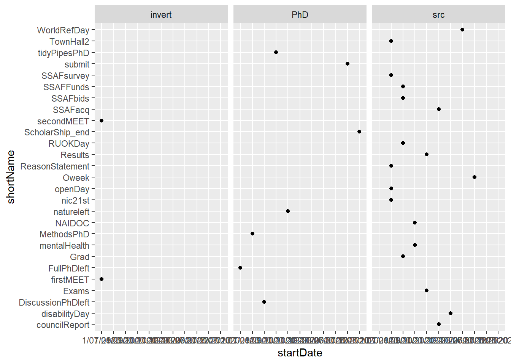

# Overall outputs

## Timeline {.tabset}

One of the tricky bits about timelines is the format of the date and time of each event. This is different for each event so therefore we have four columns to incorporate this information in the following from for this repository and database. This will also mean that some of the information in other formats will have to be converted into these dimension and any other elements defined in each dataset I am combining to make a overall timeline.

By integrating these stage with some `dataspice` code/approach's allows for me to generate metadata from each sheet of the excel file quickly using R. Here are the steps to do this.


```r
#dataspice from github
library(dataspice)

#each project needs to be imported and then saved as csv in raw_data file to document variable names etc correctly into the json dataset.
# raw_data <- 
project2 <- readxl::read_excel("./data/raw_data/Sem two planning.xlsx", sheet = 4)
project2
```

```
## # A tibble: 22 x 11
##    eventCode shortName month startDate finishDate startTime          
##    <chr>     <chr>     <chr> <chr>     <chr>      <dttm>             
##  1 scr20200~ WorldRef~ june  20/06/20~ 20/06/2020 1899-12-31 09:00:00
##  2 scr20200~ Oweek     july  44039     44043      1899-12-31 09:00:00
##  3 scr20200~ ReasonSt~ augu~ 44044     <NA>       1899-12-31 09:00:00
##  4 scr20200~ SSAFsurv~ augu~ 44044     <NA>       1899-12-31 09:00:00
##  5 scr20200~ TownHall2 augu~ 44044     <NA>       1899-12-31 09:00:00
##  6 scr20200~ openDay   augu~ 44044     <NA>       1899-12-31 09:00:00
##  7 scr20200~ nic21st   augu~ 44044     <NA>       NA                 
##  8 scr20200~ SSAFbids  sept~ 44075     <NA>       1899-12-31 09:00:00
##  9 scr20200~ Grad      sept~ 44075     <NA>       1899-12-31 09:00:00
## 10 scr20200~ SSAFFunds sept~ 44075     <NA>       NA                 
## # ... with 12 more rows, and 5 more variables: endTime <dttm>,
## #   description <chr>, src <lgl>, ucX <lgl>, week <lgl>
```

```r
#date
data_actions <- readxl::read_excel("./data/raw_data/Sem two planning.xlsx", sheet = 1)
```

```
## New names:
## * `` -> ...7
## * `` -> ...8
## * `` -> ...9
## * `` -> ...10
## * `` -> ...11
## * ...
```

```r
data_names <- readxl::read_excel("./data/raw_data/Sem two planning.xlsx", sheet = 3)
#time

#location
```


#### Past Outcomes


### Action timeline

These sources of data are combined for my general timeline below. These summarised actions are also the flagged tasks from outlook calendar to catch up with this information but this can be automated in the future.


```r
# DT::datatable(emailsCalender1)
## handmade data
DT::datatable(data_actions)
```

<!--html_preserve--><div id="htmlwidget-2d4dd8fc66d5b916593c" style="width:100%;height:auto;" class="datatables html-widget"></div>
<script type="application/json" data-for="htmlwidget-2d4dd8fc66d5b916593c">{"x":{"filter":"none","data":[["1","2","3","4","5","6","7","8","9","10","11","12","13","14","15","16","17","18","19","20","21","22","23","24","25","26","27","28","29","30","31","32","33","34","35","36","37","38","39","40","41","42","43","44","45","46","47","48","49","50","51","52","53","54","55","56","57","58","59","60","61","62","63","64","65","66","67","68","69","70","71","72","73","74","75","76","77","78","79","80","81","82","83","84","85","86","87","88","89","90","91","92","93","94","95","96","97","98","99","100","101","102","103","104","105","106","107","108","109","110","111","112","113","114","115","116","117","118","119","120","121","122","123","124","125","126","127","128","129","130","131","132","133","134","135","136","137","138","139","140","141","142","143","144","145","146","147","148","149","150","151","152","153","154","155","156","157","158","159","160","161","162","163","164","165","166","167","168","169","170","171","172","173","174","175","176","177","178","179","180","181","182","183","184","185","186","187","188","189","190","191","192","193","194","195","196","197","198","199","200","201","202","203","204","205","206","207","208","209","210","211","212","213","214","215","216","217","218","219","220","221","222","223","224","225","226","227","228","229","230","231","232","233","234","235","236","237","238","239","240","241","242","243","244","245","246","247","248"],[1,2,3,4,5,6,7,8,9,10,11,12,13,14,15,16,17,18,19,20,21,22,23,24,25,26,27,28,29,30,31,1,2,3,4,5,6,7,8,9,10,11,12,13,14,15,16,17,18,19,20,21,22,23,24,25,26,27,28,29,30,31,1,2,3,4,5,6,7,8,9,10,11,12,13,14,15,16,17,18,19,20,21,22,23,24,25,26,27,28,29,30,31,1,2,3,4,5,6,7,8,9,10,11,12,13,14,15,16,17,18,19,20,21,22,23,24,25,26,27,28,29,30,31,1,2,3,4,5,6,7,8,9,10,11,12,13,14,15,16,17,18,19,20,21,22,23,24,25,26,27,28,29,30,31,1,2,3,4,5,6,7,8,9,10,11,12,13,14,15,16,17,18,19,20,21,22,23,24,25,26,27,28,29,30,31,1,2,3,4,5,6,7,8,9,10,11,12,13,14,15,16,17,18,19,20,21,22,23,24,25,26,27,28,29,30,31,1,2,3,4,5,6,7,8,9,10,11,12,13,14,15,16,17,18,19,20,21,22,23,24,25,26,27,28,29,30,31],[null,null,"Academic Board (Majid/Josh)","Academic Integrity Mtg (Lola/Hamish/Nick)                               Student Equity &amp; Advisory Group (TBD)",null,null,null,null,null,null,"Grades Released","WT Census",null,null,null,null,"UEC (Josephine)",null,null,"World Refugee Day",null,null,null,null,null,"Council (Emma/Anthony)",null,null,null,null,null,null,null,null,null,null,null,null,null,"URC",null,null,null,null,null,"UEC (Josephine)","UAC (Josephine)",null,null,null,null,null,null,null,null,null,null,"Orientation Sem 2",null,null,null,null,null,null,"Wk 1",null,"Academic Board (Majid/Josh)",null,null,null,null,null,null,null,null,null,null,null,null,null,null,null,"council reading","council reading","council reading","council reading","council reading","council reading","council reading","Council (Emma/Anthony)",null,null,null,null,"urc reading","URC","Census Date",null,null,null,null,"UEC (Josephine)","UAC (Josephine) RUOK Day",null,null,null,null,null,null,null,null,null,null,null,null,null,null,null,null,null,null,null,"Academic Board (Josh/Majid)",null,null,null,null,null,null,null,null,null,null,"Mental Health Day",null,null,null,null,null,null,null,null,null,null,null,"URC","Council (Emma/Anthony)",null,null,null,null,"UEC (Josephine)","UAC (Josephine)",null,null,null,null,null,null,null,null,null,null,null,null,null,null,null,null,null,null,null,null,null,null,null,null,null,null,null,null,null,null,null,null,null,null,null,null,null,null,null,null,"NAIDOC WEEK",null,null,null,null,null,null,null,null,null,"Academic Board (Josh/Majid)",null,null,null,null,null,null,null,null,null,null,null,null,null,null,"UEC (Josephine)",null,null,null,null,null,null,null,null,"Council (Emma/Anthony)",null,null,null,null,null,null,null,null,null,null,null,null,null,null,null,null,null,null,null,null],["june","june","june","june","june","june","june","june","june","june","june","june","june","june","june","june","june","june","june","june","june","june","june","june","june","june","june","june","june","june","june","july","july","july","july","july","july","july","july","july","july","july","july","july","july","july","july","july","july","july","july","july","july","july","july","july","july","july","july","july","july","july","august","august","august","august","august","august","august","august","august","august","august","august","august","august","august","august","august","august","august","august","august","august","august","august","august","august","august","august","august","august","august","september","september","september","september","september","september","september","september","september","september","september","september","september","september","september","september","september","september","september","september","september","september","september","september","september","september","september","september","september","september","september","october","october","october","october","october","october","october","october","october","october","october","october","october","october","october","october","october","october","october","october","october","october","october","october","october","october","october","october","october","october","october","october","october","october","october","october","october","october","october","october","october","october","october","october","october","october","october","october","october","october","october","october","october","october","october","october","october","october","october","october","october","october","november","november","november","november","november","november","november","november","november","november","november","november","november","november","november","november","november","november","november","november","november","november","november","november","november","november","november","november","november","november","november","december","december","december","december","december","december","december","december","december","december","december","december","december","december","december","december","december","december","december","december","december","december","december","december","december","december","december","december","december","december","december"],[null,null,"Majid; Josh","Lola; Hamish; Nick",null,null,null,null,null,null,"students","census",null,null,null,null,"Josephine",null,null,"census",null,null,null,null,null,"Anthony; Emma",null,null,null,null,null,null,null,null,null,null,null,null,null,null,null,null,null,null,null,null,null,null,null,null,null,null,null,null,null,null,null,null,null,null,null,null,null,null,null,null,null,null,null,null,null,null,null,null,null,null,null,null,null,null,null,null,null,null,null,null,null,null,null,null,null,null,null,null,null,null,null,null,null,null,null,null,null,null,null,null,null,null,null,null,null,null,null,null,null,null,null,null,null,null,null,null,null,null,null,null,null,null,null,null,null,null,null,null,null,null,null,null,null,null,null,null,null,null,null,null,null,null,null,null,null,null,null,null,null,null,null,null,null,null,null,null,null,null,null,null,null,null,null,null,null,null,null,null,null,null,null,null,null,null,null,null,null,null,null,null,null,null,null,null,null,null,null,null,null,null,null,null,null,null,null,null,null,null,null,null,null,null,null,null,null,null,null,null,null,null,null,null,null,null,null,null,null,null,null,null,null,null,null,null,null,null,null,null,null,null,null,null,null,null,null,null,null,null,null,null,null,null],[null,null,null,null,null,null,null,null,null,null,null,null,null,null,null,null,null,null,null,null,null,null,null,null,null,null,null,null,null,null,null,null,null,null,null,null,null,null,null,null,null,null,null,null,null,null,null,null,null,null,null,null,null,null,null,null,null,null,null,null,null,null,null,null,null,null,null,null,null,null,null,null,null,null,null,null,null,null,null,null,null,null,null,null,null,null,null,null,null,null,null,null,null,null,null,null,null,null,null,null,null,null,null,null,null,null,null,null,null,null,null,null,null,null,null,null,null,null,null,null,null,null,null,null,null,null,null,null,null,null,null,null,null,null,null,null,null,null,null,null,null,null,null,null,null,null,null,null,null,null,null,null,null,null,null,null,null,null,null,null,null,null,null,null,null,null,null,null,null,null,null,null,null,null,null,null,null,null,null,null,null,null,null,null,null,null,null,null,null,null,null,null,null,null,null,null,null,null,null,null,null,null,null,null,null,null,null,null,null,null,null,null,null,null,null,null,null,null,null,null,null,null,null,null,null,null,null,null,null,null,null,null,null,null,null,null,null,null,null,null,null,null,null,null,null,null,null,null],[null,null,null,null,null,null,null,null,null,null,null,null,null,null,null,null,null,null,null,null,null,null,null,null,null,null,null,null,null,null,null,null,null,null,null,null,null,null,null,null,null,null,null,null,null,null,null,null,null,null,null,null,null,null,null,null,null,null,null,null,null,null,null,null,null,null,null,null,null,null,null,null,null,null,null,null,null,null,null,null,null,null,null,null,null,null,null,null,null,null,null,null,null,null,null,null,null,null,null,null,null,null,null,null,null,null,null,null,null,null,null,null,null,null,null,null,null,null,null,null,null,null,null,null,null,null,null,null,null,null,null,null,null,null,null,null,null,null,null,null,null,null,null,null,null,null,null,null,null,null,null,null,null,null,null,null,null,null,null,null,null,null,null,null,null,null,null,null,null,null,null,null,null,null,null,null,null,null,null,null,null,null,null,null,null,null,null,null,null,null,null,null,null,null,null,null,null,null,null,null,null,null,null,null,null,null,null,null,null,null,null,null,null,null,null,null,null,null,null,null,null,null,null,null,null,null,null,null,null,null,null,null,null,null,null,null,null,null,null,null,null,null,null,null,null,null,null,null],[null,null,null,null,null,null,null,null,null,null,null,null,null,null,null,null,null,null,null,null,null,null,null,null,null,null,null,null,null,null,null,null,null,null,null,null,null,null,null,null,null,null,null,null,null,null,null,null,null,null,null,null,null,null,null,null,null,null,null,null,null,null,null,null,null,null,null,null,null,null,null,null,null,null,null,null,null,null,null,null,null,null,null,null,null,null,null,null,null,null,null,null,null,null,null,null,null,null,null,null,null,null,null,null,null,null,null,null,null,null,null,null,null,null,null,null,null,null,null,null,null,null,null,null,null,null,null,null,null,null,null,null,null,null,null,null,null,null,null,null,null,null,null,null,null,null,null,null,null,null,null,null,null,null,null,null,null,null,null,null,null,null,null,null,null,null,null,null,null,null,null,null,null,null,null,null,null,null,null,null,null,null,null,null,null,null,null,null,null,null,null,null,null,null,null,null,null,null,null,null,null,null,null,null,null,null,null,null,null,null,null,null,null,null,null,null,null,null,null,null,null,null,null,null,null,null,null,null,null,null,null,null,null,null,null,null,null,null,null,null,null,null,null,null,null,null,null,null],[null,null,null,null,null,null,null,null,null,null,null,null,null,null,null,null,null,null,null,null,null,null,null,null,null,null,null,null,null,null,null,null,null,null,null,null,null,null,null,null,null,null,null,null,null,null,null,null,null,null,null,null,null,null,null,null,null,null,null,null,null,null,null,null,null,null,null,null,null,null,null,null,null,null,null,null,null,null,null,null,null,null,null,null,null,null,null,null,null,null,null,null,null,null,null,null,null,null,null,null,null,null,null,null,null,null,null,null,null,null,null,null,null,null,null,null,null,null,null,null,null,null,null,null,null,null,null,null,null,null,null,null,null,null,null,null,null,null,null,null,null,null,null,null,null,null,null,null,null,null,null,null,null,null,null,null,null,null,null,null,null,null,null,null,null,null,null,null,null,null,null,null,null,null,null,null,null,null,null,null,null,null,null,null,null,null,null,null,null,null,null,null,null,null,null,null,null,null,null,null,null,null,null,null,null,null,null,null,null,null,null,null,null,null,null,null,null,null,null,null,null,null,null,null,null,null,null,null,null,null,null,null,null,null,null,null,null,null,null,null,null,null,null,null,null,null,null,null],[null,null,null,null,null,null,null,null,null,null,null,null,null,null,null,null,null,null,null,null,null,null,null,null,null,null,null,null,null,null,null,null,null,null,null,null,null,null,null,null,null,null,null,null,null,null,null,null,null,null,null,null,null,null,null,null,null,null,null,null,null,null,null,null,null,null,null,null,null,null,null,null,null,null,null,null,null,null,null,null,null,null,null,null,null,null,null,null,null,null,null,null,null,null,null,null,null,null,null,null,null,null,null,null,null,null,null,null,null,null,null,null,null,null,null,null,null,null,null,null,null,null,null,null,null,null,null,null,null,null,null,null,null,null,null,null,null,null,null,null,null,null,null,null,null,null,null,null,null,null,null,null,null,null,null,null,null,null,null,null,null,null,null,null,null,null,null,null,null,null,null,null,null,null,null,null,null,null,null,null,null,null,null,null,null,null,null,null,null,null,null,null,null,null,null,null,null,null,null,null,null,null,null,null,null,null,null,null,null,null,null,null,null,null,null,null,null,null,null,null,null,null,null,null,null,null,null,null,null,null,null,null,null,null,null,null,null,null,null,null,null,null,null,null,null,null,null,null],[null,null,null,null,null,null,null,null,null,null,null,null,null,null,null,null,null,null,null,null,null,null,null,null,null,null,null,null,null,null,null,null,null,null,null,null,null,null,null,null,null,null,null,null,null,null,null,null,null,null,null,null,null,null,null,null,null,null,null,null,null,null,null,null,null,null,null,null,null,null,null,null,null,null,null,null,null,null,null,null,null,null,null,null,null,null,null,null,null,null,null,null,null,null,null,null,null,null,null,null,null,null,null,null,null,null,null,null,null,null,null,null,null,null,null,null,null,null,null,null,null,null,null,null,null,null,null,null,null,null,null,null,null,null,null,null,null,null,null,null,null,null,null,null,null,null,null,null,null,null,null,null,null,null,null,null,null,null,null,null,null,null,null,null,null,null,null,null,null,null,null,null,null,null,null,null,null,null,null,null,null,null,null,null,null,null,null,null,null,null,null,null,null,null,null,null,null,null,null,null,null,null,null,null,null,null,null,null,null,null,null,null,null,null,null,null,null,null,null,null,null,null,null,null,null,null,null,null,null,null,null,null,null,null,null,null,null,null,null,null,null,null,null,null,null,null,null,null],[null,null,null,null,null,null,null,null,null,null,null,null,null,null,null,null,null,null,null,null,null,null,null,null,null,null,null,null,null,null,null,null,null,null,null,null,null,null,null,null,null,null,null,null,null,null,null,null,null,null,null,null,null,null,null,null,null,null,null,null,null,null,null,null,null,null,null,null,null,null,null,null,null,null,null,null,null,null,null,null,null,null,null,null,null,null,null,null,null,null,null,null,null,null,null,null,null,null,null,null,null,null,null,null,null,null,null,null,null,null,null,null,null,null,null,null,null,null,null,null,null,null,null,null,null,null,null,null,null,null,null,null,null,null,null,null,null,null,null,null,null,null,null,null,null,null,null,null,null,null,null,null,null,null,null,null,null,null,null,null,null,null,null,null,null,null,null,null,null,null,null,null,null,null,null,null,null,null,null,null,null,null,null,null,null,null,null,null,null,null,null,null,null,null,null,null,null,null,null,null,null,null,null,null,null,null,null,null,null,null,null,null,null,null,null,null,null,null,null,null,null,null,null,null,null,null,null,null,null,null,null,null,null,null,null,null,null,null,null,null,null,null,null,null,null,null,null,null],[null,null,null,null,null,null,null,null,null,null,null,null,null,null,null,null,null,null,null,null,null,null,null,null,null,null,null,null,null,null,null,null,null,null,null,null,null,null,null,null,null,null,null,null,null,null,null,null,null,null,null,null,null,null,null,null,null,null,null,null,null,null,null,null,null,null,null,null,null,null,null,null,null,null,null,null,null,null,null,null,null,null,null,null,null,null,null,null,null,null,null,null,null,null,null,null,null,null,null,null,null,null,null,null,null,null,null,null,null,null,null,null,null,null,null,null,null,null,null,null,null,null,null,null,null,null,null,null,null,null,null,null,null,null,null,null,null,null,null,null,null,null,null,null,null,null,null,null,null,null,null,null,null,null,null,null,null,null,null,null,null,null,null,null,null,null,null,null,null,null,null,null,null,null,null,null,null,null,null,null,null,null,null,null,null,null,null,null,null,null,null,null,null,null,null,null,null,null,null,null,null,null,null,null,null,null,null,null,null,null,null,null,null,null,null,null,null,null,null,null,null,null,null,null,null,null,null,null,null,null,null,null,null,null,null,null,null,null,null,null,null,null,null,null,null,null,null,null],[null,null,null,null,null,null,null,null,null,null,null,null,null,null,null,null,null,null,null,null,null,null,null,null,null,null,null,null,null,null,null,null,null,null,null,null,null,null,null,null,null,null,null,null,null,null,null,null,null,null,null,null,null,null,null,null,null,null,null,null,null,null,null,null,null,null,null,null,null,null,null,null,null,null,null,null,null,null,null,null,null,null,null,null,null,null,null,null,null,null,null,null,null,null,null,null,null,null,null,null,null,null,null,null,null,null,null,null,null,null,null,null,null,null,null,null,null,null,null,null,null,null,null,null,null,null,null,null,null,null,null,null,null,null,null,null,null,null,null,null,null,null,null,null,null,null,null,null,null,null,null,null,null,null,null,null,null,null,null,null,null,null,null,null,null,null,null,null,null,null,null,null,null,null,null,null,null,null,null,null,null,null,null,null,null,null,null,null,null,null,null,null,null,null,null,null,null,null,null,null,null,null,null,null,null,null,null,null,null,null,null,null,null,null,null,null,null,null,null,null,null,null,null,null,null,null,null,null,null,null,null,null,null,null,null,null,null,null,null,null,null,null,null,null,null,null,null,null],[null,null,null,"z",null,null,null,null,null,null,null,null,null,null,null,null,null,null,null,null,null,null,null,null,null,null,null,null,null,null,null,null,null,null,null,null,null,null,null,null,null,null,null,null,null,null,null,null,null,null,null,null,null,null,null,null,null,null,null,null,null,null,null,null,null,null,null,null,null,null,null,null,null,null,null,null,null,null,null,null,null,null,null,null,null,null,null,null,null,null,null,null,null,null,null,null,null,null,null,null,null,null,null,null,null,null,null,null,null,null,null,null,null,null,null,null,null,null,null,null,null,null,null,null,null,null,null,null,null,null,null,null,null,null,null,null,null,null,null,null,null,null,null,null,null,null,null,null,null,null,null,null,null,null,null,null,null,null,null,null,null,null,null,null,null,null,null,null,null,null,null,null,null,null,null,null,null,null,null,null,null,null,null,null,null,null,null,null,null,null,null,null,null,null,null,null,null,null,null,null,null,null,null,null,null,null,null,null,null,null,null,null,null,null,null,null,null,null,null,null,null,null,null,null,null,null,null,null,null,null,null,null,null,null,null,null,null,null,null,null,null,null,null,null,null,null,null,null]],"container":"<table class=\"display\">\n  <thead>\n    <tr>\n      <th> <\/th>\n      <th>Day<\/th>\n      <th>action<\/th>\n      <th>month<\/th>\n      <th>person<\/th>\n      <th>notes<\/th>\n      <th>eventCode<\/th>\n      <th>...7<\/th>\n      <th>...8<\/th>\n      <th>...9<\/th>\n      <th>...10<\/th>\n      <th>...11<\/th>\n      <th>...12<\/th>\n      <th>...13<\/th>\n      <th>...14<\/th>\n    <\/tr>\n  <\/thead>\n<\/table>","options":{"columnDefs":[{"className":"dt-right","targets":1},{"orderable":false,"targets":0}],"order":[],"autoWidth":false,"orderClasses":false}},"evals":[],"jsHooks":[]}</script><!--/html_preserve-->

```r
# there should be an actions...
data_actions
```

```
## # A tibble: 248 x 14
##      Day action month person notes eventCode ...7  ...8  ...9  ...10 ...11 ...12
##    <dbl> <chr>  <chr> <chr>  <lgl> <lgl>     <lgl> <lgl> <lgl> <lgl> <lgl> <lgl>
##  1     1 <NA>   june  <NA>   NA    NA        NA    NA    NA    NA    NA    NA   
##  2     2 <NA>   june  <NA>   NA    NA        NA    NA    NA    NA    NA    NA   
##  3     3 Acade~ june  Majid~ NA    NA        NA    NA    NA    NA    NA    NA   
##  4     4 Acade~ june  Lola;~ NA    NA        NA    NA    NA    NA    NA    NA   
##  5     5 <NA>   june  <NA>   NA    NA        NA    NA    NA    NA    NA    NA   
##  6     6 <NA>   june  <NA>   NA    NA        NA    NA    NA    NA    NA    NA   
##  7     7 <NA>   june  <NA>   NA    NA        NA    NA    NA    NA    NA    NA   
##  8     8 <NA>   june  <NA>   NA    NA        NA    NA    NA    NA    NA    NA   
##  9     9 <NA>   june  <NA>   NA    NA        NA    NA    NA    NA    NA    NA   
## 10    10 <NA>   june  <NA>   NA    NA        NA    NA    NA    NA    NA    NA   
## # ... with 238 more rows, and 2 more variables: ...13 <lgl>, ...14 <chr>
```

### Future targets


#### Plot current data


```r
library(ggplot2)
```

```
## Warning: package 'ggplot2' was built under R version 4.0.2
```

```r
library(scales)
```

```
## Warning: package 'scales' was built under R version 4.0.2
```

```r
library(lubridate)
```

```
## Warning: package 'lubridate' was built under R version 4.0.2
```

```
## 
## Attaching package: 'lubridate'
```

```
## The following objects are masked from 'package:base':
## 
##     date, intersect, setdiff, union
```

```r
source("./R/importDATAscript.R")
```

```
## Warning: package 'readxl' was built under R version 4.0.2
```

```
## 
## Attaching package: 'dplyr'
```

```
## The following objects are masked from 'package:stats':
## 
##     filter, lag
```

```
## The following objects are masked from 'package:base':
## 
##     intersect, setdiff, setequal, union
```

```
## Parsed with column specification:
## cols(
##   eventCode = col_character(),
##   shortName = col_character(),
##   month = col_character(),
##   startDate = col_character(),
##   finishDate = col_character(),
##   startTime = col_time(format = ""),
##   endTime = col_time(format = ""),
##   description = col_character(),
##   project = col_character(),
##   ucX = col_logical(),
##   week = col_logical()
## )
## Parsed with column specification:
## cols(
##   eventCode = col_character(),
##   shortName = col_character(),
##   month = col_character(),
##   startDate = col_character(),
##   finishDate = col_character(),
##   startTime = col_time(format = ""),
##   endTime = col_time(format = ""),
##   description = col_character(),
##   project = col_character(),
##   ucX = col_logical(),
##   week = col_logical()
## )
## Parsed with column specification:
## cols(
##   eventCode = col_character(),
##   shortName = col_character(),
##   month = col_character(),
##   startDate = col_character(),
##   finishDate = col_character(),
##   startTime = col_time(format = ""),
##   endTime = col_time(format = ""),
##   description = col_character(),
##   project = col_character(),
##   ucX = col_logical(),
##   week = col_logical()
## )
```

```r
# Now let’s load in some data
#milestones is the demo data
#actions is my data

df <- readr::read_csv('./data/milestones.csv')
```

```
## Parsed with column specification:
## cols(
##   month = col_double(),
##   year = col_double(),
##   milestone = col_character(),
##   status = col_character()
## )
```

```r
df
```

```
## # A tibble: 22 x 4
##    month  year milestone    status   
##    <dbl> <dbl> <chr>        <chr>    
##  1     6  2017 Milestone 1  Complete 
##  2     7  2017 Milestone 2  Complete 
##  3    10  2017 Milestone 3  Complete 
##  4    12  2017 Milestone 4  Complete 
##  5     1  2018 Milestone 5  Complete 
##  6     1  2018 Milestone 6  Complete 
##  7     2  2018 Milestone 7  Complete 
##  8     5  2018 Milestone 8  Complete 
##  9     6  2018 Milestone 9  On Target
## 10     6  2018 Milestone 10 On Target
## # ... with 12 more rows
```

#### Subset dataframe

to correct ggplot subset


```r
df$date <- with(df, ymd(sprintf('%04d%02d%02d', year, month, 1)))
df <- df[with(df, order(date)), ]
head(df)
```

```
## # A tibble: 6 x 5
##   month  year milestone   status   date      
##   <dbl> <dbl> <chr>       <chr>    <date>    
## 1     6  2017 Milestone 1 Complete 2017-06-01
## 2     7  2017 Milestone 2 Complete 2017-07-01
## 3    10  2017 Milestone 3 Complete 2017-10-01
## 4    12  2017 Milestone 4 Complete 2017-12-01
## 5     1  2018 Milestone 5 Complete 2018-01-01
## 6     1  2018 Milestone 6 Complete 2018-01-01
```

```r
text_offset <- 0.05

#factoring
status_levels <- c("Complete", "On Target", "At Risk", "Critical")

status_colors <- c("#0070C0", "#00B050", "#FFC000", "#C00000")

df$status <- factor(df$status, levels=status_levels, ordered=TRUE)

#direction
positions <- c(0.5, -0.5, 1.0, -1.0, 1.5, -1.5)
directions <- c(1, -1)

line_pos <- data.frame(
    "date"=unique(df$date),
    "position"=rep(positions, length.out=length(unique(df$date))),
    "direction"=rep(directions, length.out=length(unique(df$date)))
)

df <- merge(x=df, y=line_pos, by="date", all = TRUE)
df <- df[with(df, order(date, status)), ]

df$month_count <- ave(df$date==df$date, df$date, FUN=cumsum)
df$text_position <- (df$month_count * text_offset * df$direction) + df$position
head(df)
```

```
##         date month year   milestone   status position direction month_count
## 1 2017-06-01     6 2017 Milestone 1 Complete      0.5         1           1
## 2 2017-07-01     7 2017 Milestone 2 Complete     -0.5        -1           1
## 3 2017-10-01    10 2017 Milestone 3 Complete      1.0         1           1
## 4 2017-12-01    12 2017 Milestone 4 Complete     -1.0        -1           1
## 5 2018-01-01     1 2018 Milestone 5 Complete      1.5         1           1
## 6 2018-01-01     1 2018 Milestone 6 Complete      1.5         1           2
##   text_position
## 1          0.55
## 2         -0.55
## 3          1.05
## 4         -1.05
## 5          1.55
## 6          1.60
```

#### Counts


```r
text_offset <- 0.05

df$month_count <- ave(df$date==df$date, df$date, FUN=cumsum)
df$text_position <- (df$month_count * text_offset * df$direction) + df$position
head(df)
```

```
##         date month year   milestone   status position direction month_count
## 1 2017-06-01     6 2017 Milestone 1 Complete      0.5         1           1
## 2 2017-07-01     7 2017 Milestone 2 Complete     -0.5        -1           1
## 3 2017-10-01    10 2017 Milestone 3 Complete      1.0         1           1
## 4 2017-12-01    12 2017 Milestone 4 Complete     -1.0        -1           1
## 5 2018-01-01     1 2018 Milestone 5 Complete      1.5         1           1
## 6 2018-01-01     1 2018 Milestone 6 Complete      1.5         1           2
##   text_position
## 1          0.55
## 2         -0.55
## 3          1.05
## 4         -1.05
## 5          1.55
## 6          1.60
```

#### Buffering times


```r
month_buffer <- 2

month_date_range <- seq(min(df$date) - months(month_buffer), max(df$date) + months(month_buffer), by='month')
month_format <- format(month_date_range, '%b')
month_df <- data.frame(month_date_range, month_format)
```

### December/January only


```r
year_date_range <- seq(min(df$date) - months(month_buffer), max(df$date) + months(month_buffer), by='year')
year_date_range <- as.Date(
    intersect(
        ceiling_date(year_date_range, unit="year"),
        floor_date(year_date_range, unit="year")
    ),  origin = "1970-01-01"
)
year_format <- format(year_date_range, '%Y')
year_df <- data.frame(year_date_range, year_format)
```

#### Plot simple


```r
# names(datBASE)
# datBASE$project

ggplot(datBASE, aes(x = startDate, y = shortName)) +
  geom_point() + 
  facet_wrap(~project)
```



#### Final plot option 1

See Ben Alex Keen's blog with the following output: 


```r
timeline_plot<-ggplot(df,aes(x=date,y=0, col=status, label=milestone))
timeline_plot<-timeline_plot+labs(col="Milestones")
timeline_plot<-timeline_plot+scale_color_manual(values=status_colors, labels=status_levels, drop = FALSE)
timeline_plot<-timeline_plot+theme_classic()

# Plot horizontal black line for timeline
timeline_plot<-timeline_plot+geom_hline(yintercept=0, 
                color = "black", size=0.3)

# Plot vertical segment lines for milestones
timeline_plot<-timeline_plot+geom_segment(data=df[df$month_count == 1,], aes(y=position,yend=0,xend=date), color='black', size=0.2)

# Plot scatter points at zero and date
timeline_plot<-timeline_plot+geom_point(aes(y=0), size=3)

# Don't show axes, appropriately position legend
timeline_plot<-timeline_plot+theme(axis.line.y=element_blank(),
                 axis.text.y=element_blank(),
                 axis.title.x=element_blank(),
                 axis.title.y=element_blank(),
                 axis.ticks.y=element_blank(),
                 axis.text.x =element_blank(),
                 axis.ticks.x =element_blank(),
                 axis.line.x =element_blank(),
                 legend.position = "bottom"
                )

# Show text for each month
timeline_plot<-timeline_plot+geom_text(data=month_df, aes(x=month_date_range,y=-0.1,label=month_format),size=2.5,vjust=0.5, color='black', angle=90)
# Show year text
timeline_plot<-timeline_plot+geom_text(data=year_df, aes(x=year_date_range,y=-0.2,label=year_format, fontface="bold"),size=2.5, color='black')
# Show text for each milestone
timeline_plot<-timeline_plot+geom_text(aes(y=text_position,label=milestone),size=2.5)
print(timeline_plot)
```


### Individual projects

Each of my tasks come from a collection of overall projects I collaborate on and develop code with on timeframes that range from monthly to undefined. The current projects I have integrated into my timeline are:

### PhD

Over the duration of my PhD I have currently developed my thesis and publications to align with a 6 month hand-in date from the 1st July 2020.


```r
project1 <- readxl::read_excel("./data/raw_data/Sem two planning.xlsx", sheet = 3)

DT::datatable(head(project1))
```

<!--html_preserve--><div id="htmlwidget-0cd54f0f8f05215e6e26" style="width:100%;height:auto;" class="datatables html-widget"></div>
<script type="application/json" data-for="htmlwidget-0cd54f0f8f05215e6e26">{"x":{"filter":"none","data":[["1","2","3","4","5","6"],["phd20200701001","phd20200701013","phd20200701002","phd20200701003","phd20200701004","phd20200701005"],["FullPhDleft","ScholarShip_end","MethodsPhD","DiscussionPhDleft","tidyPipesPhD","natureleft"],["july","june","august","september","october","november"],["2020-07-01T00:00:00Z","2020-07-07T00:00:00Z","2020-08-01T00:00:00Z","2020-09-01T00:00:00Z","2020-10-01T00:00:00Z","2020-11-01T00:00:00Z"],["2020-12-31T00:00:00Z","2020-07-09T00:00:00Z","2020-08-03T00:00:00Z","2020-03-06T00:00:00Z","2019-10-08T00:00:00Z","2019-05-11T00:00:00Z"],["1899-12-31T09:00:00Z",null,"1899-12-31T09:00:00Z","1899-12-31T09:00:00Z","1899-12-31T09:00:00Z","1899-12-31T09:00:00Z"],["1899-12-31T15:00:00Z",null,"1899-12-31T15:00:00Z","1899-12-31T15:00:00Z","1899-12-31T15:00:00Z","1899-12-31T15:00:00Z"],["Just the full length of time I need to finish my PhD project",null,null,null,null,null],[null,null,null,null,null,null],[null,null,null,null,null,null],[null,null,null,null,null,null]],"container":"<table class=\"display\">\n  <thead>\n    <tr>\n      <th> <\/th>\n      <th>eventCode<\/th>\n      <th>shortName<\/th>\n      <th>month<\/th>\n      <th>startDate<\/th>\n      <th>finishDate<\/th>\n      <th>startTime<\/th>\n      <th>endTime<\/th>\n      <th>description<\/th>\n      <th>src<\/th>\n      <th>ucX<\/th>\n      <th>week<\/th>\n    <\/tr>\n  <\/thead>\n<\/table>","options":{"order":[],"autoWidth":false,"orderClasses":false,"columnDefs":[{"orderable":false,"targets":0}]}},"evals":[],"jsHooks":[]}</script><!--/html_preserve-->


#### Introduction

#### Methods

#### Conclusion

#### Discussion


### Previous achievements and tasks


### Council tasks {.tabset}

Being nominated to represent the Graduate community on the University of Canberra Council in November 2019 was a great honour. At the time I did understand the impact of 


```r
project2 <- readxl::read_excel("./data/raw_data/Sem two planning.xlsx", sheet = 4)

DT::datatable(head(project2))
```

<!--html_preserve--><div id="htmlwidget-af0d27ad690458cda977" style="width:100%;height:auto;" class="datatables html-widget"></div>
<script type="application/json" data-for="htmlwidget-af0d27ad690458cda977">{"x":{"filter":"none","data":[["1","2","3","4","5","6"],["scr20200701001","scr20200701002","scr20200701003","scr20200701004","scr20200701005","scr20200701006"],["WorldRefDay","Oweek","ReasonStatement","SSAFsurvey","TownHall2","openDay"],["june","july","august","august","august","august"],["20/06/2020","44039","44044","44044","44044","44044"],["20/06/2020","44043",null,null,null,null],["1899-12-31T09:00:00Z","1899-12-31T09:00:00Z","1899-12-31T09:00:00Z","1899-12-31T09:00:00Z","1899-12-31T09:00:00Z","1899-12-31T09:00:00Z"],["1899-12-31T15:00:00Z","1899-12-31T22:00:00Z","1899-12-31T15:00:00Z","1899-12-31T15:00:00Z","1899-12-31T15:00:00Z","1899-12-31T15:00:00Z"],["World Refugee Day","O week for semester two","Statement of reasons due (late Aug)","SSAF Survey","Town HAll","Open Day 22nd"],[null,null,null,null,null,null],[null,null,null,null,null,null],[null,null,null,null,null,null]],"container":"<table class=\"display\">\n  <thead>\n    <tr>\n      <th> <\/th>\n      <th>eventCode<\/th>\n      <th>shortName<\/th>\n      <th>month<\/th>\n      <th>startDate<\/th>\n      <th>finishDate<\/th>\n      <th>startTime<\/th>\n      <th>endTime<\/th>\n      <th>description<\/th>\n      <th>src<\/th>\n      <th>ucX<\/th>\n      <th>week<\/th>\n    <\/tr>\n  <\/thead>\n<\/table>","options":{"order":[],"autoWidth":false,"orderClasses":false,"columnDefs":[{"orderable":false,"targets":0}]}},"evals":[],"jsHooks":[]}</script><!--/html_preserve-->

#### UC-Council

Generally it is regarded that there will be about a week (40hrs) of background reading and investigation before each council meeting. Under covid19 conditions I think this may be much greater.

Here are the general tasks and overall timetable of the Council obligations in 2020:


```r
dataCouncil <- readxl::read_excel("./data/raw_data/Sem two planning.xlsx", sheet = 3)

DT::datatable(head(dataCouncil))
```

<!--html_preserve--><div id="htmlwidget-9154f3f3c7a0808eca72" style="width:100%;height:auto;" class="datatables html-widget"></div>
<script type="application/json" data-for="htmlwidget-9154f3f3c7a0808eca72">{"x":{"filter":"none","data":[["1","2","3","4","5","6"],["phd20200701001","phd20200701013","phd20200701002","phd20200701003","phd20200701004","phd20200701005"],["FullPhDleft","ScholarShip_end","MethodsPhD","DiscussionPhDleft","tidyPipesPhD","natureleft"],["july","june","august","september","october","november"],["2020-07-01T00:00:00Z","2020-07-07T00:00:00Z","2020-08-01T00:00:00Z","2020-09-01T00:00:00Z","2020-10-01T00:00:00Z","2020-11-01T00:00:00Z"],["2020-12-31T00:00:00Z","2020-07-09T00:00:00Z","2020-08-03T00:00:00Z","2020-03-06T00:00:00Z","2019-10-08T00:00:00Z","2019-05-11T00:00:00Z"],["1899-12-31T09:00:00Z",null,"1899-12-31T09:00:00Z","1899-12-31T09:00:00Z","1899-12-31T09:00:00Z","1899-12-31T09:00:00Z"],["1899-12-31T15:00:00Z",null,"1899-12-31T15:00:00Z","1899-12-31T15:00:00Z","1899-12-31T15:00:00Z","1899-12-31T15:00:00Z"],["Just the full length of time I need to finish my PhD project",null,null,null,null,null],[null,null,null,null,null,null],[null,null,null,null,null,null],[null,null,null,null,null,null]],"container":"<table class=\"display\">\n  <thead>\n    <tr>\n      <th> <\/th>\n      <th>eventCode<\/th>\n      <th>shortName<\/th>\n      <th>month<\/th>\n      <th>startDate<\/th>\n      <th>finishDate<\/th>\n      <th>startTime<\/th>\n      <th>endTime<\/th>\n      <th>description<\/th>\n      <th>src<\/th>\n      <th>ucX<\/th>\n      <th>week<\/th>\n    <\/tr>\n  <\/thead>\n<\/table>","options":{"order":[],"autoWidth":false,"orderClasses":false,"columnDefs":[{"orderable":false,"targets":0}]}},"evals":[],"jsHooks":[]}</script><!--/html_preserve-->

#### UC-SRC

This is a short demo site to help with planning for the SRC for semester 2 2020.


#### Supporting Reproducibility at UC

My Phd studies put me in a unique situation where I can apply the tools and computational development I have done with my PhD and conceptually test the framework for the application in the education sector. 

- `UCdown`
- `councilCOMOS`
- `UCSRC covid support`

### UC-Invertebrates {.tabset}

This work has its own repository so far.


```r
project3 <- readxl::read_excel("./data/raw_data/Sem two planning.xlsx", sheet = 5)
```

```
## New names:
## * `` -> ...1
```

```r
DT::datatable(head(project3))
```

<!--html_preserve--><div id="htmlwidget-6e5f6295282164b5217c" style="width:100%;height:auto;" class="datatables html-widget"></div>
<script type="application/json" data-for="htmlwidget-6e5f6295282164b5217c">{"x":{"filter":"none","data":[["1","2","3","4","5","6"],["ACTIVITIES",null,null,null,null,null],["World Refugee Day",null,null,null,null,null],["O week",null,null,null,null,null],["Statement of reasons due (late Aug)","SSAF Survey","Town HAll","Open Day 22nd","Nicks 21st Birthday",null],["SSAF Bids Due","Graduation","SSAF Committeess","RUOKDay",null,null],["NAIDOC","Mental Health Day/Month",null,null,null,null],["Exams","Results",null,null,null,null],["Council Report","SSAF Acquittal",null,null,null,null]],"container":"<table class=\"display\">\n  <thead>\n    <tr>\n      <th> <\/th>\n      <th>...1<\/th>\n      <th>Jun<\/th>\n      <th>July<\/th>\n      <th>Aug<\/th>\n      <th>Sept<\/th>\n      <th>Oct<\/th>\n      <th>Nov<\/th>\n      <th>Dec<\/th>\n    <\/tr>\n  <\/thead>\n<\/table>","options":{"order":[],"autoWidth":false,"orderClasses":false,"columnDefs":[{"orderable":false,"targets":0}]}},"evals":[],"jsHooks":[]}</script><!--/html_preserve-->

## Feedback loop

To create the feedback loop (to get information back from supervisors) I have began to develop a interactive shiny app within the same structure as the baseline dataset so that there is limited coding needed to create the tidypipes "cycle" of community engagement.


```r
library(knitr)
```

```
## Warning: package 'knitr' was built under R version 4.0.2
```

```r
knitr::include_graphics(path = "./img/preview.png")
```


As computational work takes over our regular management of time over the tradional hard copy "diary". I like this because important information can not be left in the "local cafe" however as I have used "gmail", "outlook" and there suites of applications and tools for calenders I have muddled everything up and missed appointments etc. 

There is alot of my development work in this section because I have attempted to combine these two packages in a way to document all the council emails and other work that I have undertaken as part of the `COVID19` pandemic in Australia.

To try and counter this I have developed a `tidypipes` workflow for my tasks, projects and other collarorations. See presentation [here](./assets/TidyPipes-calenderJUL2020.pptx).


