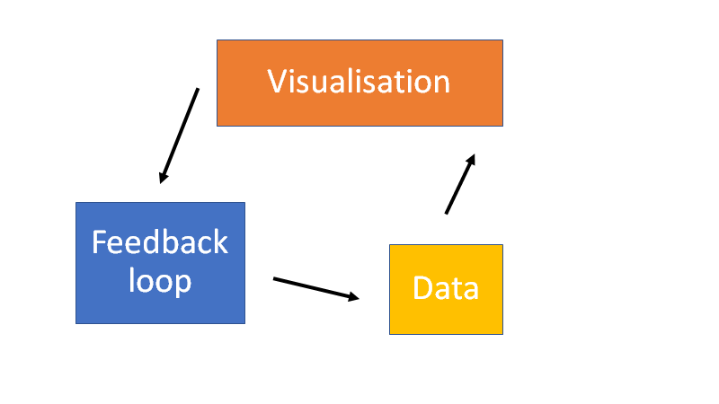

# Overview {#over}

<!-- ## Libraries needed -->

I find a challenging aspect of academic research is assoicated with organising both my work and personal time management. Now that I am attempting to work with the skills obtained during my PhD I have so many different projects running at/in different levels of development and collaboration. This repository is a draft approach to my time management using `tidyPipes` workflow.

> NOTE: This is my first attempt to apply my `tidyPipes` workflow (Figure above) to my project management and integrate this into my normal workflow. 

Generally, this work is focused on writing the scripts to automate the intergration between emails, PhD timeline and other projects. To do this we need to import datasets and modify the structure of these imputs to match the information needed to contruct a timeline of tasks and objectives.
