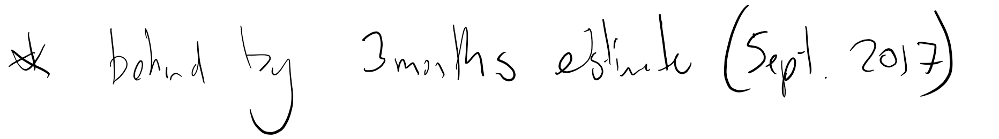

The original timeline

The original timeline

![Untitled picture.emf Machine generated alternative text: Academic timeline April Year O ne Year Two Year Three March 7th March 2016 Start date Leave: 17th Feb - 17th March Leave: 17th Feb - 17th March Project Ka ka data May NZTrip One NZ Trip Four Beech seed results June NZ Trip On ntro uct10 Sem inar: Thursday 30t June Pu blication one draft NZ Calving J uly plotting package cod e Ch apter Th ree Start with MPD dat August Confirmation seminar NZ Trip Two Abstract for AWMS (31st Aug) 'PM course... Europe Conference ?? September NZ Trip Two NZ Trip Five U niversityof Canberra progress report Project Kaka publication subm itted p rogress repo rt October ublication one submi November NZTrip Three NZES Conference MPD preliminary res ults NZSRW pub2 subm itted Decem ber AWMS Conference 5th to 7th AWMS conference 5th to 7th AWMS conference January NZ Trip Three February Proposal submission HDR conference nfirmatio of Leave: 17th Feb - 17th March Koala paper su bmitted ?? NZTrip Si MPD publication s ubmitted u mit 12t Feb 2019 CODE DONE In progress M issed deadline FAILED C demography interval paper paper accepted su bm itted Project Kaka preliminary results (NA) DONE Ink Drawings Ink Drawings Ink Drawings Ink Drawings Ink Drawings Ink Drawings Ink Drawings Ink Drawings Ink Drawings Ink Drawings Ink Drawings Ink Drawings Ink Drawings Ink Drawings Ink Drawings Ink Drawings Ink Drawings Ink Drawings Ink Drawings Ink Drawings Ink Drawings Ink Drawings Ink Drawings Ink Drawings Ink Drawings Ink Drawings Ink Drawings Ink Drawings Ink Drawings Ink Drawings Ink Drawings Ink Drawings Ink Drawings     Ink Drawings Ink Drawings Ink Drawings Ink Drawings](../../_resources/13316c201da545674828c217e072159d.png)

Now I am behind by about 1 year I reckon realistically. I am hoping to get this back in the following way: