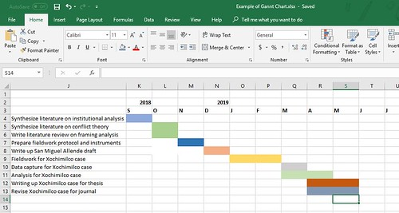

# Planning the timeline and progress of your doctoral dissertation (or Masters/undergraduate thesis) – 

Modified from [Raul Pacheco-Vega] PhD

**[Raul Pacheco-Vega, PhD](http://www.raulpacheco.org/)**

Understanding and solving intractable resource governance problems.

- [About Me](http://www.raulpacheco.org/)
    - [CV](http://www.raulpacheco.org/about/cv/)
- [Blog](http://www.raulpacheco.org/blog/)
- [Contact](http://www.raulpacheco.org/contact/)
- [In the Press](http://www.raulpacheco.org/media-press-coverage/)
- [My Research](http://www.raulpacheco.org/my-research-2/)
    - [Conferences and Talks](http://www.raulpacheco.org/my-research-2/presentations/)
    - [Current projects](http://www.raulpacheco.org/my-research-2/current-projects/)
        - [Exploring models of electronic wastes governance in the United States and Mexico: Recycling, risk and environmental justice](http://www.raulpacheco.org/my-research-2/current-projects/exploring-models-of-electronic-wastes-governance-in-the-united-states-and-mexico-recycling-risk-and-environmental-justice/)
        - [The Collaborative Resource Governance Lab (CoReGovLab)](http://www.raulpacheco.org/my-research-2/current-projects/the-collaborative-resource-governance-lab-coregovlab/)
        - [Water Conflicts in Mexico: A Multi-Method Approach](http://www.raulpacheco.org/my-research-2/current-projects/water-conflicts-in-mexico-a-multi-method-approach/)
    - [Past projects](http://www.raulpacheco.org/my-research-2/past-projects/)
    - [Publications and scholarly output](http://www.raulpacheco.org/my-research-2/publications-and-scholarly-output/)
    - [Research Interests](http://www.raulpacheco.org/my-research-2/my-research/)
    - [Research trajectory](http://www.raulpacheco.org/my-research-2/my-research-trajectory/)
- [Publications](http://www.raulpacheco.org/publications/)
- [Research Posts](http://www.raulpacheco.org/research-blog-posts/)
    - [Higher education and academia](http://www.raulpacheco.org/research-blog-posts/higher-education-and-academia-blog-posts/)
    - [Public administration, public policy and public management research](http://www.raulpacheco.org/research-blog-posts/public-administration-public-policy-and-public-management-research/)
    - [Research-oriented blog posts](http://www.raulpacheco.org/research-blog-posts/research-related-blog-posts/)
    - [Stuff about research methods](http://www.raulpacheco.org/research-blog-posts/research-methods/)
- [Resources](http://www.raulpacheco.org/resources/)
    - [Academic Writing (#AcWri)](http://www.raulpacheco.org/resources/academic-writing-acwri/)
        - [Publishing strategies](http://www.raulpacheco.org/resources/academic-writing-acwri/strategies-for-publication/)
        - [Writing a book manuscript](http://www.raulpacheco.org/resources/academic-writing-acwri/writing-a-book-manuscript/)
        - [Writing a research paper, book chapter or dissertation/thesis chapter](http://www.raulpacheco.org/resources/academic-writing-acwri/writing-a-research-paper-book-chapter/)
    - [Literature Reviews](http://www.raulpacheco.org/resources/literature-reviews/)
    - [My Reading Notes of Books](http://www.raulpacheco.org/resources/reading-notes/)
    - [Note-Taking Techniques](http://www.raulpacheco.org/resources/note-taking-techniques/)
    - [Organization and Time Management](http://www.raulpacheco.org/resources/organization-and-time-management/)
    - [Planning and Processing Protocols](http://www.raulpacheco.org/resources/planning-and-processing-protocols/)
    - [Reading Strategies](http://www.raulpacheco.org/resources/reading-strategies/)
    - [Resources for Educators](http://www.raulpacheco.org/resources/resources-for-educators/)
    - [Resources for Graduate Students](http://www.raulpacheco.org/resources/resources-for-graduate-students/)
        - [My Reading Notes of Books on How to Write a Doctoral Dissertation/How to Conduct PhD Research](http://www.raulpacheco.org/resources/resources-for-graduate-students/writing-a-doctoral-phd-dissertation/)
    - [Resources for Undergraduate Students](http://www.raulpacheco.org/resources/resources-for-undergraduate-students/)
        - [Reading strategies for undergraduates](http://www.raulpacheco.org/resources/resources-for-undergraduate-students/reading-strategies-for-undergraduates/)
    - [Social Media in Academia](http://www.raulpacheco.org/resources/social-media-in-academia/)
    - [Surviving and Thriving in Academia](http://www.raulpacheco.org/resources/surviving-and-thriving-in-academia/)
        - [Resources for Job Seekers in the Academic Market](http://www.raulpacheco.org/resources/surviving-and-thriving-in-academia/resources-for-job-seekers-in-the-academic-market/)
    - [Teaching Public Policy, Public Administration and Public Management](http://www.raulpacheco.org/resources/teaching-public-policy-public-administration-and-public-management/)
    - [The Everything Notebook](http://www.raulpacheco.org/resources/the-everything-notebook/)
- [Talks](http://www.raulpacheco.org/talks/)
- [Teaching](http://www.raulpacheco.org/teaching/)
    - [Academic year 2012-2013](http://www.raulpacheco.org/teaching/2012-2013/)
    - [Fall 2015](http://www.raulpacheco.org/teaching/fall-2015/)
        - [Regional Development (Fall 2015)](http://www.raulpacheco.org/teaching/fall-2015/regional-development-fall-2015/)
        - [State and Local Government (Fall 2015)](http://www.raulpacheco.org/teaching/fall-2015/state-and-local-government-fall-2015/)
    - [Fall 2016](http://www.raulpacheco.org/teaching/teaching-2016-2017/)
        - [Public Policy Analysis (Fall 2016)](http://www.raulpacheco.org/teaching/teaching-2016-2017/public-policy-analysis-fall-2016/)
        - [Regional Development (Fall 2016)](http://www.raulpacheco.org/teaching/teaching-2016-2017/regional-development-fall-2016/)
    - [Fall 2018](http://www.raulpacheco.org/teaching/fall-2018/)
        - [Public Policy Analysis (Fall 2018)](http://www.raulpacheco.org/teaching/fall-2018/public-policy-analysis-fall-2018/)
    - [Fall 2019](http://www.raulpacheco.org/teaching/public-policy-analysis-fall-2019/)
        - [Public Policy Analysis (Fall 2019)](http://www.raulpacheco.org/teaching/public-policy-analysis-fall-2019/public-policy-analysis-fall-2019/)
    - [Spring 2016](http://www.raulpacheco.org/teaching/spring-2016/)
        - [Public Policy Analysis (Spring 2016)](http://www.raulpacheco.org/teaching/spring-2016/public-policy-analysis-spring-2016/)
    - [Summer 2011](http://www.raulpacheco.org/teaching/summer-2011/)
        - [POLI 351 Environmental Policy and Politics (Summer Session 2011)](http://www.raulpacheco.org/teaching/summer-2011/poli-351-environmental-policy-and-politics-summer-session-2011/)
    - [Winter 2009](http://www.raulpacheco.org/teaching/winter-2009/)
        - [POLI 352 Comparative Politics of Public Policy (Term 2)](http://www.raulpacheco.org/teaching/winter-2009/poli-352-comparative-politics-of-public-policy/)
        - [POLI 375A Global Environmental Politics (Term 2)](http://www.raulpacheco.org/teaching/winter-2009/poli-372-global-environmental-politics/)
    - [Winter 2010](http://www.raulpacheco.org/teaching/winter-2010/)
        - [POLI 350A Public Policy (Term 2)](http://www.raulpacheco.org/teaching/winter-2010/poli-350a-public-policy-term-2/)
        - [POLI 351 Environmental Policy and Politics (Term 1)](http://www.raulpacheco.org/teaching/winter-2010/poli-351-environmental-policy-and-politics-term-1/)
        - [POLI 375A Global Environmental Politics (Term 2)](http://www.raulpacheco.org/teaching/winter-2010/poli-375a-global-environmental-politics-term-2/)
    - [Winter 2011](http://www.raulpacheco.org/teaching/winter-2011/)
        - [POLI 332 Latin American Environmental Politics (Term 2, Spring 2012)](http://www.raulpacheco.org/teaching/winter-2011/poli-332-latin-american-environmental-politics-term-2-spring-2012/)
        - [POLI 350A Public Policy (Term 1, Sep-Dec 2011)](http://www.raulpacheco.org/teaching/winter-2011/poli-350a-public-policy-term-1-sep-dec-2011/)
        - [POLI 375A Global Environmental Politics (Term 1, Sep-Dec 2011)](http://www.raulpacheco.org/teaching/winter-2011/poli-375a-global-environmental-politics-term-1-sep-dec-2011/)
- [Log in](http://www.raulpacheco.org/wp-login.php)

# [Planning the timeline and progress of your doctoral dissertation (or Masters/undergraduate thesis)](http://www.raulpacheco.org/2018/10/planningtheses/ "Permanent link to Planning the timeline and progress of your doctoral dissertation (or Masters/undergraduate thesis)")

One of my PhD students lamented this week with me that she had a lot to juggle (taking children to and from schools and to and from activities, etc.) and that she needed a strategy to make her research move forward. I had been planning to write this blog post for a while, since this is the one question I get asked the most by doctoral students (“*how do I plan my unstructured time over the summer*” being the other one).

I had to rush to get this blog post done because my student is 2 years away from the deadline her university has imposed for her thesis defence, which is why I sat down with her last night to show her how I do things. I have two other PhD students at exactly the same stage (2 years to defense) so I figured I might as well finish this blog post.

While I’ve suggested that people read one (or more) of the books that I’ve digested myself (check my [**Writing a Doctoral Dissertation**](http://www.raulpacheco.org/resources/resources-for-graduate-students/writing-a-doctoral-phd-dissertation/) page), one of the main things I teach my students is how to apply [backcasting techniques to develop a project plan](http://www.raulpacheco.org/2016/12/reverse-planning-backcasting-a-paper-or-a-research-project/). I was trained as a project manager, and I worked in that capacity for a number of years, so I understand exactly the kind of work that needs to be done to develop good project plans.

There are a few resources for students, which I mentioned on Twitter earlier today (October 5th, 2018), many of which are listed in the thread that will appear if you click anywhere on the tweet shown below. Thanks to everyone who responded to my query, though I think many of them were professors describing their own process, which is not the same as having a doctoral dissertation (ONE GOAL) to finish in X number of years. My students are doing theirs in the 3 papers’ model, which is a bit closer to the day-to-day life of a professor, but still, the trajectory is quite different. Anyhow, here are some recommendations (click on the tweet to expand the entire thread).

The core planning strategy I would thus recommend doctoral, masters and undergraduate students is to engage in a combination of **Gantt Chart Design** and **[project backcasting techniques](http://www.raulpacheco.org/2016/12/reverse-planning-backcasting-a-paper-or-a-research-project/).**

The Gantt chart is a technique I learned in graduate school when I took project management courses. This is a hypothetical Gantt chart for my doctoral student, covering about 15 months.

For Gantt Chart templates, you can see Dr. Emma Sheppard’s here.

Here is another resource that you can use to create Gantt Charts.

Hugh Kearns and Maria Gardiner have lots of resources on their site, and have published books on this as well.

Dr. Patrick Dunleavy’s book “[Authoring a PhD](http://www.raulpacheco.org/2018/05/authoring-a-phd-thesis-how-to-plan-draft-write-and-finish-a-doctoral-dissertation-my-reading-notes/)” is incredible and really does help students who are planning their PhD process. I recommend it to my own doctoral students.

And of course I would be remiss if I forgot to recommend **Dr. Ellie Mackin Roberts** [(my coauthor for a forthcoming book on research planning) and her website. Ellie has A TON of downloadable printables for you to plan your own research. She is fantastic.](http://www.elliemackin.net/research-planning.html)

In the end, the process I recommended to my students and that I do myself is – set a target defense date and then work backwards and plan tasks, activities, and intermediate goals. For example, I have asked my students to plan submission dates for their 3 papers (to be sent to journals) and then schedule fieldwork and data analysis accordingly. This process has worked well, and I hope my description of the process will help my students and others!

In a subsequent blog post I’ll describe how to go from long-term goals (submit paper X by Y date) to daily tasks. That blog post will definitely apply to doctoral students and post-PhD folks.

> If you liked this blog post, you may also be interested in my [**Resources for Graduate Students**](http://www.raulpacheco.org/resources/resources-for-graduate-students/) page, and on [my reading notes of books I’ve read on how to do a doctoral degree.](http://www.raulpacheco.org/resources/resources-for-graduate-students/writing-a-doctoral-phd-dissertation/)

You can share this blog post on the following social networks by clicking on their icon.

- [Share0](https://www.facebook.com/sharer/sharer.php?u=http%3A%2F%2Fwww.raulpacheco.org%2F2018%2F10%2Fplanningtheses%2F&t=Planning%20the%20timeline%20and%20progress%20of%20your%20doctoral%20dissertation%20%28or%20Masters%2Fundergraduate%20thesis%29)
- [Tweet](https://twitter.com/intent/tweet?text=Planning%20the%20timeline%20and%20progress%20of%20your%20doctoral%20dissertation%20%28or%20Masters%2Fundergraduate%20thesis%29&url=http%3A%2F%2Fwww.raulpacheco.org%2F2018%2F10%2Fplanningtheses%2F)
- [Pin4](#)
- [LinkedIn](https://www.linkedin.com/shareArticle?url=http%3A%2F%2Fwww.raulpacheco.org%2F2018%2F10%2Fplanningtheses%2F&title=Planning%20the%20timeline%20and%20progress%20of%20your%20doctoral%20dissertation%20%28or%20Masters%2Fundergraduate%20thesis%29&mini=true)
- [Email](mailto:?subject=Planning%20the%20timeline%20and%20progress%20of%20your%20doctoral%20dissertation%20%28or%20Masters%2Fundergraduate%20thesis%29&body=http%3A%2F%2Fwww.raulpacheco.org%2F2018%2F10%2Fplanningtheses%2F)
- [Print](#)

4shares

Posted in [academia](http://www.raulpacheco.org/category/academia/).

[No comments](http://www.raulpacheco.org/2018/10/planningtheses/#respond)

By [Raul Pacheco-Vega](http://www.raulpacheco.org/author/admin/ "View all posts by Raul Pacheco-Vega") – October 6, 2018

## 0 Responses

Stay in touch with the conversation, subscribe to the [RSS feed for comments on this post](http://www.raulpacheco.org/2018/10/planningtheses/feed/).

Leave a Reply  
*Some HTML is OK*

Name *(required)*

Email *(required, but never shared)*

Web

or, reply to this post via [trackback](http://www.raulpacheco.org/2018/10/planningtheses/trackback/).

« [Lateral Writing: A strategy to fight “writer’s block”](http://www.raulpacheco.org/2018/10/lateral-writing-a-strategy-to-fight-writers-block/) [Writing topic sentences and crafting paragraphs](http://www.raulpacheco.org/2018/10/writing-topic-sentences-and-crafting-paragraphs/) »

## Subscribe

## About Raul Pacheco-Vega, PhD

I am an Assistant Professor in the Public Administration Division of the Centre for Economic Research and Teaching, CIDE (Centro de Investigacion y Docencia Economicas, CIDE, AC) based out of CIDE Region Centro in Aguascalientes, Mexico. My research is interdisciplinary by nature, although I consider myself more of a political scientist and geographer, as those \[…\][more →](http://www.raulpacheco.org/)

## Find Me Online

**My Research Output**

- [Google Scholar Profile](http://scholar.google.com/citations?user=7mn6g3oAAAAJ&hl=en)
- [E-mail](http://www.raulpacheco.org/contact/)
- [Academia.Edu](http://cide.academia.edu/RaulPachecoVega/About)
- [ResearchGate](https://www.researchgate.net/profile/Raul_Pacheco-vega)
- [Mendeley](http://www.mendeley.com/profiles/raul-pacheco-vega/)
- [ORCID](http://orcid.org/0000-0003-3468-5477)

**My Social Networks**

- [Twitter](http://www.twitter.com/raulpacheco)
- [Facebook](http://www.facebook.com/drpachecovega)
- [Google](http://gplus.to/raulpachecovega) Plus
- [LinkedIn](https://mx.linkedin.com/in/raulpacheco)
- [Publons](https://publons.com/author/1205672/raul-pacheco-vega#profile)

## Recent Posts

- [Time spent “on the runway” is time well spent](http://www.raulpacheco.org/2020/05/time-spent-on-the-runway-is-time-well-spent/)
- [Writing to understand: A personal tale of my journey to become an academic writer and overcome impostor syndrome](http://www.raulpacheco.org/2020/05/writing-to-understand-a-personal-tale-of-my-journey-to-become-an-academic-writer-and-overcome-impostor-syndrome/)
- [On why I love libraries so much (an ode to librarians, libraries, and library science)](http://www.raulpacheco.org/2020/05/on-why-i-love-libraries-so-much-an-ode-to-librarians-libraries-and-library-science/)
- [Writing by memorandums](http://www.raulpacheco.org/2020/04/writing-by-memorandums/)
- [Toilet paper hoarding, reverse quarantining and individual responses to governmental inaction](http://www.raulpacheco.org/2020/04/toilet-paper-hoarding-reverse-quarantining-and-individual-responses-to-governmental-inaction/)

## Recent Comments

- [Rashida L. Weaver](http://www.rashedaweaver.com) on [Time spent “on the runway” is time well spent](http://www.raulpacheco.org/2020/05/time-spent-on-the-runway-is-time-well-spent/comment-page-1/#comment-1678210)
- Raul Pacheco-Vega on [Writing journal articles from a doctoral dissertation](http://www.raulpacheco.org/2018/09/writing-journal-articles-from-a-doctoral-dissertation/comment-page-1/#comment-1678077)
- Raul Pacheco-Vega on [How to write a book chapter](http://www.raulpacheco.org/2018/07/how-to-write-a-book-chapter/comment-page-1/#comment-1678075)
- Roslyn on [Time spent “on the runway” is time well spent](http://www.raulpacheco.org/2020/05/time-spent-on-the-runway-is-time-well-spent/comment-page-1/#comment-1677888)
- Paramita Guha on [How to write a book chapter](http://www.raulpacheco.org/2018/07/how-to-write-a-book-chapter/comment-page-1/#comment-1677040)

## Follow me on Twitter:

Proudly powered by [WordPress](http://wordpress.org/) and [Carrington](http://carringtontheme.com "Carrington theme for WordPress").

[Carrington Theme by Crowd Favorite](http://crowdfavorite.com "Custom WordPress development, design and backup services.")

4shares