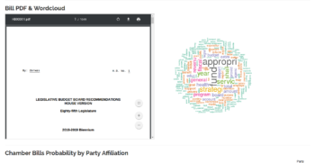
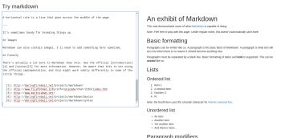

Show Me Shiny - Gallery of R Web Apps

# [Show Me Shiny](https://www.showmeshiny.com/ "Show Me Shiny")

Gallery of R Web Apps

### USER SURVEY

Please take 3 minutes to [answer a survey](https://docs.google.com/forms/d/e/1FAIpQLSdzOyHHJ6GhFqD7CUkxhBCt513mJ0nsr0Qd52GVFvcY1RyAIQ/viewform?usp=sf_link) to help us improve Show Me Shiny!

### Shiny Stuff

*   [Applied Shiny Tutorials / Courses](https://www.showmeshiny.com/learn-shiny/)
*   [Consulting / Training](https://www.showmeshiny.com/shiny-consultants/)
*   [Submit an App](https://www.showmeshiny.com/submit-an-app/)
*   [@showmeshiny](https://twitter.com/showmeshiny)
*   [About](https://www.showmeshiny.com/about/)

### Filter Apps

Filter Apps

## [Texas Legislative Bill Analysis](https://www.showmeshiny.com/1012-2/ "Texas Legislative Bill Analysis")

Texas legislative bill analysis

  

## [Try Markdown](https://www.showmeshiny.com/try-markdown/ "Try Markdown")

Shiny application wrapping pandoc inside to live-preview markdown in HTML on a split screen.

  

## [NBA Visualizations](https://www.showmeshiny.com/nba-visualizations/ "NBA Visualizations")

Lots of NBA statistical visualizations and player comparisons

  

## [Hack Profiler](https://www.showmeshiny.com/hack-profiler/ "Hack Profiler")

This is a profiler of hackers for people participating at hackathon. The goal is to facilitate teammate discovery.

  

## [Stack Overflow Tag Pairs](https://www.showmeshiny.com/stack-overflow-tag-pairs/ "Stack Overflow Tag Pairs")

A simple app to explore the tag pair in R questions published on Stack Overflow.

  

## [Sochi Live Medal Tracker](https://www.showmeshiny.com/sochi-live-medal-tracker/ "Sochi Live Medal Tracker")

Keep up with gold, silver, and bronze medal counts from the 2014 Winter Olympics in Sochi, Russia.

  

## [Odds Ratios vs Risk Ratios](https://www.showmeshiny.com/odds-ratios-vs-risk-ratios/ "Odds Ratios vs Risk Ratios")

Graphically explore how odds ratios relate to risk ratios and their probabilities.

  

## [Paris Car Accidents](https://www.showmeshiny.com/paris-car-accidents/ "Paris Car Accidents")

Car accidents in Paris in 2012-2013.

  

## [Catalan Opinions](https://www.showmeshiny.com/catalan-opinions/ "Catalan Opinions")

Catalan opinion surveys

  

## [Bivariate Regression](https://www.showmeshiny.com/bivariate-regression/ "Bivariate Regression")

Application designed to assist in the teaching of basic regression concepts.

  

## [US Politician Voting](https://www.showmeshiny.com/us-politician-voting/ "US Politician Voting")

70 years of US politician voting records

  

## [Screening Test Evaluation](https://www.showmeshiny.com/screening-test-evaluation/ "Screening Test Evaluation")

This web-based app helps you to evaluate screening tool by calculating various diagnostic efficiency statistics.

  

## [Optimize Windpark](https://www.showmeshiny.com/optimize-windpark/ "Optimize Windpark")

Optimize wind park layouts for given terrain and wind conditions.

  

## [Sales Analytics](https://www.showmeshiny.com/sales-analytics/ "Sales Analytics")

The Sales Analytics Dashboard uses Shiny to monitor simulated bicycle sales for a bicycle manufacturer, Cannondale. The app is designed to showcase d3 graphics capabilities and R programming for organizational data visualizations to assist in executive decision making.

  

## [Visualising Aid to the Pacific Region](https://www.showmeshiny.com/visualising-aid-to-the-pacific-region/ "Visualising Aid to the Pacific Region")

Visualisation of donor contributions to the Pacific region.

  

## [Wittgenstein Centre Data Explorer](https://www.showmeshiny.com/wittgenstein-centre-data-explorer/ "Wittgenstein Centre Data Explorer")

Results of the recent Wittgenstein Centre global population projections.

  

## [Course of Subsidies](https://www.showmeshiny.com/course-of-subsidies/ "Course of Subsidies")

The course of agricultural subsidies in Greece, based on Greek Payment Agency’s data

  

## [Statistical Power Calculator](https://www.showmeshiny.com/statistical-power-calculator/ "Statistical Power Calculator")

Interactive calculator to illustrate the power of a statistical hypothesis test for a two-sided symmetrical test.

  

## [Interactive Statistical Distributions](https://www.showmeshiny.com/interactive-statistical-distributions/ "Interactive Statistical Distributions")

Explore several basic statistical distributions, with variable number of observations, optional density estimation, and data download.

  

## [Study Abroad Globe](https://www.showmeshiny.com/study-abroad-globe/ "Study Abroad Globe")

Display of students studying abroad, as well as international students studying in the US.

  

## [Personality-Based Music](https://www.showmeshiny.com/personality-based-music/ "Personality-Based Music")

An attempt to suggest songs based on personality traits.

  

## [Shiny GEM](https://www.showmeshiny.com/shiny-gem/ "Shiny GEM")

General exploratory methods, simplifying basic EDA tasks.

  

## [PaleoFlow](https://www.showmeshiny.com/paleoflow/ "PaleoFlow")

Tree-ring reconstructions of streamflow

  

## [Knowledge Lab](https://www.showmeshiny.com/knowledge-lab/ "Knowledge Lab")

Childhood development scenario simulator

  

## [Distribution of Sample Means](https://www.showmeshiny.com/distribution-of-sample-means/ "Distribution of Sample Means")

Illustration of sample means from different distributions.

  

## [Tweet Sentiment Analysis](https://www.showmeshiny.com/tweet-sentiment-analysis/ "Tweet Sentiment Analysis")

Dashboard performs sentiment analysis of tweets on some of the main data science hashtags and visualizes results.

  

## [Monetary Policy](https://www.showmeshiny.com/monetary-policy/ "Monetary Policy")

Determine if US monetary policy has been too loose or too tight based on user-defined targets.

  

## [Hungarian Interbank Lending](https://www.showmeshiny.com/hungarian-interbank-lending/ "Hungarian Interbank Lending")

Network analysi​s of the Hungarian interbank lending market

  

## [Transcriptome Analysis](https://www.showmeshiny.com/transcriptome-analysis/ "Transcriptome Analysis")

Visualize and interact with gene expression data.

  

## [machLearn](https://www.showmeshiny.com/machlearn/ "machLearn")

A machine learning dashboard. Use to train, tune and compare ML algorithms.

  

## [RiverWare RDF Explorer](https://www.showmeshiny.com/riverware-rdf-explorer/ "RiverWare RDF Explorer")

Dashboard to view future projections for reservoir and stream conditions within the Colorado River basin.

  

## [Catch-22](https://www.showmeshiny.com/catch-22/ "Catch-22")

An interactive visualization of Joseph Heller’s novel Catch-22. Explore locations, character mentions, character co-occurrence and clustering.

  

## [Power in A/B Testing](https://www.showmeshiny.com/power-in-ab-testing/ "Power in A/B Testing")

Demonstration of the relationship of statistical power, effect size, and false positives

  

## [French Imports](https://www.showmeshiny.com/french-imports/ "French Imports")

Visualize French imports from countries around the world.

  

## [Disease Dynamics](https://www.showmeshiny.com/disease-dynamics/ "Disease Dynamics")

ODE models of disease dynamics, allows for births and deaths, latent periods, and seasonal fluctuations.

  

## [Mimic Google Forms](https://www.showmeshiny.com/mimic-google-forms/ "Mimic Google Forms")

Demonstrates how to create forms and save/load submissions with shiny.

  

## [MovieStats](https://www.showmeshiny.com/moviestats/ "MovieStats")

Statistics and visualizations about movies, directors and actors.

  

## [Flu Season Dynamic Programming](https://www.showmeshiny.com/flu-season-dynamic-programming/ "Flu Season Dynamic Programming")

Demonstrates the dynamics involved in a susceptible, infected, and recovering (SIR) model of flu season.

  

## [Age of Coins](https://www.showmeshiny.com/age-of-coins/ "Age of Coins")

This app implements a simulator for the Central Limit Theorem (CLT) based on the example of the age of euro coins.

  

## [Value Spots in Amsterdam](https://www.showmeshiny.com/value-spots-in-amsterdam/ "Value Spots in Amsterdam")

Best locations in Amsterdam for a McDonald’s, Starbucks, Albert Heijn, etc.

  

## [DIDAT](https://www.showmeshiny.com/didat/ "DIDAT")

Dynamic and interactive data analysis tool.

  

## [Manning’s Equation](https://www.showmeshiny.com/mannings-equation/ "Manning’s Equation")

App performs Monte Carlo analysis of Manning’s equation for open channel flow. User input ranges for input variables using slider bars and the app demonstrates the resulting distributions of flow and intermediate computed variables.

  

## [Geographic data visualisation New Zealand](https://www.showmeshiny.com/geographic-data-visualisation-new-zealand/ "Geographic data visualisation New Zealand")

Geographic data visualization for New Zealand

  

## [401k Simulator](https://www.showmeshiny.com/401k-simulator/ "401k Simulator")

Simulate growth of a 401k over time with multiple inputs.

  

## [ggplot My Data](https://www.showmeshiny.com/ggplot-my-data/ "ggplot My Data")

A simple interface of ggplot where user can upload their csv file and chose how to plot it.

  

## [Stock Market Heat Map Calendar](https://www.showmeshiny.com/stock-market-heat-map-calendar/ "Stock Market Heat Map Calendar")

Visualize stock prices over time with a heat map showing daily price movements.

  

## [Predator Prey Model](https://www.showmeshiny.com/predator-prey-model/ "Predator Prey Model")

The Lotka-Volterra equations, also known as the predator-prey equations.

  

## [R Package Stats](https://www.showmeshiny.com/r-package-stats/ "R Package Stats")

Explore R package downloads by time and location

  

## [Melbourne Housing](https://www.showmeshiny.com/melbourne-housing/ "Melbourne Housing")

House prices in Melbourne

  

## [Wind Rose](https://www.showmeshiny.com/wind-rose/ "Wind Rose")

Buildwind roses and pollution roses with your own data, or a sample data set.

  

## [RTide](https://www.showmeshiny.com/rtide/ "RTide")

Visualize and download tide data

  

## [Enron Email Analytics](https://www.showmeshiny.com/enron-email-analytics/ "Enron Email Analytics")

Investigate relative frequency of keywords in the Enron email text.

  

## [Globe Population](https://www.showmeshiny.com/globe-population/ "Globe Population")

Global population represented as bars rising from a 3-D globe created with the shinyGlobe package.

  

## [Online Clinical Data Mining](https://www.showmeshiny.com/online-clinical-data-mining/ "Online Clinical Data Mining")

OCDM provides a simply way to analyze tumor data to get an individual evaluation of tumor response.

  

## [DieselGate](https://www.showmeshiny.com/dieselgate/ "DieselGate")

This app visualizes the effect of the so-called “DieselGate” on stock returns of German car OEMs (VW Group others).

  

## [typeRight](https://www.showmeshiny.com/typeright/ "typeRight")

App for next word prediction and autocompletion

  

## [Leeds Cycle Accidents](https://www.showmeshiny.com/leeds-cycle-accidents/ "Leeds Cycle Accidents")

Cycle Routes, cycle bays & cycle accidents in the Leeds (UK) areahttps://www.showmeshiny.com/wp-admin/media-upload.php?post\_id=1184&type=image&TB\_iframe=1

  

## [Financial Calculations](https://www.showmeshiny.com/financial-calculations/ "Financial Calculations")

Calculate present value, future value, net present value of a project and do a loan amortization.

  

## [KCRW Most Played Artists](https://www.showmeshiny.com/kcrw-most-played-artists/ "KCRW Most Played Artists")

The most played artists on KCRW (an NPR station in Santa Monica, CA), with time and artist filters.

  

## [Outlier Analysis](https://www.showmeshiny.com/outlier-analysis/ "Outlier Analysis")

Explore how different algorithms identify outliers in data.

  

## [PM10 Emilia-Romagna](https://www.showmeshiny.com/pm10-emilia-romagna/ "PM10 Emilia-Romagna")

Daily mean PM10 concentration in the Italian region Emilia-Romagna.

  

## [Comtrade](https://www.showmeshiny.com/comtrade/ "Comtrade")

Plot inter-country shipping data from the United Nations Comtrade DB

  

## [Computer Vision](https://www.showmeshiny.com/computer-vision/ "Computer Vision")

Returns information about visual content found in an image. The algorithms use tagging, descriptions and domain-specific models to identify content.

  

## [HomebrewR](https://www.showmeshiny.com/homebrewr/ "HomebrewR")

Shiny app for exploring homebrew recipes and beer styles.

  

## [Drag n Drop](https://www.showmeshiny.com/drag-n-drop/ "Drag n Drop")

Demo of how to add drag and drop elements in a shiny app using the package ShinyDND

  

## [Historical English Soccer](https://www.showmeshiny.com/historical-english-soccer/ "Historical English Soccer")

Explore data from nearly 200,000 English soccer games spanning the years 1888-2014.

  

## [Tweet Analyzer](https://www.showmeshiny.com/tweet-analyzer/ "Tweet Analyzer")

Analyzes tweets extracted through Twitter API (timeline).

  

## [Illegal Immigration](https://www.showmeshiny.com/illegal-immigration/ "Illegal Immigration")

Analysis of illegal immigration data.

  

## [Natural Selection](https://www.showmeshiny.com/natural-selection/ "Natural Selection")

Simulate natural selection of genotypes and alleles over multiple generations, with customizable fitness levels.

  

## [Financial Aid Estimate](https://www.showmeshiny.com/financial-aid-estimate/ "Financial Aid Estimate")

College students can estimate how much financial aid they can receive.

  

## [Live Pig Transport](https://www.showmeshiny.com/live-pig-transport/ "Live Pig Transport")

Live pig transport across Europe in 2013

  

## [Quadrant](https://www.showmeshiny.com/quadrant/ "Quadrant")

Analyze customer behavior, purchasing patterns and segmentation

  

## [Campaign Finance Contributions](https://www.showmeshiny.com/campaign-finance-contributions/ "Campaign Finance Contributions")

Campaign contributions for the 2015-2016 election cycle through December 2015.

  

## [Overseas Security](https://www.showmeshiny.com/overseas-security/ "Overseas Security")

An interactive tool to understand the value of U.S. overseas security commitments.

  

## [Breast Cancer Across Continents](https://www.showmeshiny.com/breast-cancer-across-continents/ "Breast Cancer Across Continents")

View breast cancer rates by continent and country, with a data table and map.

  

## [Permutation Test](https://www.showmeshiny.com/permutation-test/ "Permutation Test")

Demonstration of hypothesis testing using permutation test.

  

## [Global Sea Surface Temperature](https://www.showmeshiny.com/global-sea-surface-temperature/ "Global Sea Surface Temperature")

Visualise and explore global sea surface temperature.

  

## [Search Facebook](https://www.showmeshiny.com/search-facebook/ "Search Facebook")

Search Facebook for pages, posts, and comments about a given topic.

  

## [Meta Analysis Via Shiny (MAVIS)](https://www.showmeshiny.com/meta-analysis-via-shiny-mavis/ "Meta Analysis Via Shiny (MAVIS)")

Conduct meta-analyses easily, with numerical and graphical output.

  
")

## [Global Terrorism](https://www.showmeshiny.com/global-terrorism/ "Global Terrorism")

Detailed analysis of global terrorism by types and location, including predictive features.

  

## [Classifier 101](https://www.showmeshiny.com/classifier-101/ "Classifier 101")

Playground to understand the notions of prevision/accuracy of a classifier.

  

## [Population of Ukraine](https://www.showmeshiny.com/population-of-ukraine/ "Population of Ukraine")

Interactive population map of Ukraine created using the leaflet and googlevis packages.

  

## [Google Analytics](https://www.showmeshiny.com/google-analytics/ "Google Analytics")

Google Analytics in R

  

## [Hurricane and Typhoon Risk Model](https://www.showmeshiny.com/hurricane-and-typhoon-risk-model/ "Hurricane and Typhoon Risk Model")

US Hurricane and Asia Typhoon Risk Model

  

## [Model for Publication Bias](https://www.showmeshiny.com/model-for-publication-bias/ "Model for Publication Bias")

User-friendly version of the Vevea and Hedges weight-function model for publication bias

  

## [College Finder Tool](https://www.showmeshiny.com/college-finder-tool/ "College Finder Tool")

Create a table of US colleges sorted to match admissions criteria.

  

## [Bootstrap Resampling](https://www.showmeshiny.com/bootstrap-resampling/ "Bootstrap Resampling")

Demonstration of hypothesis testing using bootstrap resampling

  

## [French Health Monitor](https://www.showmeshiny.com/french-health-monitor/ "French Health Monitor")

Disease monitor, in routine use at the French national public health agency. Disease mapping, statistical alarms and dynamic charts.

  

## [Dallas Police Live Tracker](https://www.showmeshiny.com/dallas-police-live-tracker/ "Dallas Police Live Tracker")

Keep up with Dallas police calls in real time, with a map and table.

  

## [Linked Statistical Data Analysis](https://www.showmeshiny.com/linked-statistical-data-analysis/ "Linked Statistical Data Analysis")

Federated SPARQL queries to collect statistical data from different endpoints, generates and stores analysis and visualisations.

  

## [3D Grapher](https://www.showmeshiny.com/3d-grapher/ "3D Grapher")

Make 3D graphs of mathematical functions. Select a function from the list of functions provided, or enter your own function.

  

## [Principal Component Analysis](https://www.showmeshiny.com/principal-component-analysis/ "Principal Component Analysis")

Principal component analysis, with graphical output.

  

## [drinkR](https://www.showmeshiny.com/drinkr/ "drinkR")

drinkR, estimate your Blood Alcohol Concentration (BAC) over time by entering drinks with time stamps.

  

## [Visualize Change](https://www.showmeshiny.com/visualize-change/ "Visualize Change")

Contribution to #VisualizeChange the World Humanitarian Summit Data Challenge 2015

  

## [Genetic Map Comparison](https://www.showmeshiny.com/genetic-map-comparison/ "Genetic Map Comparison")

Compare genetic maps according to their key statistics and the relative positions of common markers.

  

## [Influence Analysis](https://www.showmeshiny.com/influence-analysis/ "Influence Analysis")

Demonstrates the leverage and influence of an adjustable point on a regression line.

  

## [NRL Dashboard](https://www.showmeshiny.com/nrl-dashboard/ "NRL Dashboard")

Dashboard for National Rugby League statistics and Twitter followers since 2009.

  

## [Hypothesis Testing Power](https://www.showmeshiny.com/hypothesis-testing-power/ "Hypothesis Testing Power")

Power of a statistical test.

  

## [Correlation](https://www.showmeshiny.com/correlation/ "Correlation")

Visualize sample data with varying correlation coefficients (in Spanish).

  

## [Labor Force Statistics Explorer](https://www.showmeshiny.com/labor-force-statistics-explorer/ "Labor Force Statistics Explorer")

Interactive visualizations of US labor force statistics by race, gender and industry

  

## [Item Response Theory](https://www.showmeshiny.com/item-response-theory/ "Item Response Theory")

Item response theory for dichotomous and polytomous models.

  

## [Greener Change](https://www.showmeshiny.com/greener-change/ "Greener Change")

Access data and charts on the environmental performance of publicly traded companies.

  

## [Portender](https://www.showmeshiny.com/portender/ "Portender")

Forecasts different types of inflation pertinent to the construction industry.

  

## [easyPlot](https://www.showmeshiny.com/easyplot/ "easyPlot")

Experiment plotting different types of graphs by simply clicking your way through options, with code generated automatically.

  

## [Non-Farm Payrolls](https://www.showmeshiny.com/non-farm-payrolls/ "Non-Farm Payrolls")

Predict monthly non-farm payroll numbers based on a distribution collected from tweets with the hashtag #NFPGuesses.

  

## [Weather Compare](https://www.showmeshiny.com/weather-compare/ "Weather Compare")

Compare historical temperature distributions across American cities.

  

## [FC Dashboard](https://www.showmeshiny.com/fc-dashboard/ "FC Dashboard")

Exploratory analysis of the public Funding Circle loan book

  

## [SpatialEpiApp](https://www.showmeshiny.com/spatialepiapp/ "SpatialEpiApp")

Allows users to visualize spatial and spatio-temporal disease data, estimate disease risk and detect clusters.

  

## [Predictive Value](https://www.showmeshiny.com/predictive-value/ "Predictive Value")

Predictive value of clinical tests

  

## [Intervene](https://www.showmeshiny.com/intervene/ "Intervene")

Intersection and visualization of multiple genomic region and gene sets

  

## [Housing Market Trends](https://www.showmeshiny.com/housing-market-trends/ "Housing Market Trends")

Housing market analyzer using Google’s Material design standards

  

## [Analytic Health](https://www.showmeshiny.com/analytic-health/ "Analytic Health")

UK Pharmaceutical market prescribing trends, regional mapping and analysis

  

## [shinyGEO](https://www.showmeshiny.com/shinygeo/ "shinyGEO")

Download the expression and sample data from a Gene Expression Omnibus dataset, select a gene of interest, and perform a survival or differential expression analysis

  

## [Power Eval](https://www.showmeshiny.com/power-eval/ "Power Eval")

Enables interactive computation of the sample size required or evaluation of the power for a test.

  

## [LetterFreq!](https://www.showmeshiny.com/letterfreq/ "LetterFreq!")

Plot the distribution of English letter frequencies of input text, and optionally show a reference distribution.

  

## [Worldwide Earthquakes](https://www.showmeshiny.com/worldwide-earthquakes/ "Worldwide Earthquakes")

Visualize earthquakes worldwide, filtered by magnitude and depth.

  

## [Moment-Free Sharpe Ratios](https://www.showmeshiny.com/moment-free-sharpe-ratios/ "Moment-Free Sharpe Ratios")

Sharpe ratio: a robust and moment-free method

  

## [Fracking Growth](https://www.showmeshiny.com/fracking-growth/ "Fracking Growth")

Explore the economic and geographic impact of shale oil and gas discovery/exploration in the United States.

  

## [Kulturstøtten](https://www.showmeshiny.com/kulturstotten/ "Kulturstøtten")

A Shiny app in Danish showing how the Danish municipalities and the Danish government uses funds for cultural subsidies.

  

## [World Unemployment](https://www.showmeshiny.com/world-unemployment/ "World Unemployment")

3-D globe visualization of world unemployment rates by country.

  

## [Patents Explorer](https://www.showmeshiny.com/patents-explorer/ "Patents Explorer")

Explore patent application data.

  

## [Response Times](https://www.showmeshiny.com/response-times/ "Response Times")

Interactive exploration of the false-start ruling problems in elite athletics.

  

## [Blue Mussel Oversettlement](https://www.showmeshiny.com/blue-mussel-oversettlement/ "Blue Mussel Oversettlement")

Display and predict blue mussel (Mytilus galloprovincialis) spat over-settlement in green-lipped mussel (Perna canaliculus) farms in New Zealand.

  

## [Genetic Drift](https://www.showmeshiny.com/genetic-drift/ "Genetic Drift")

Simulate genetic drift over generations, with variable number of alleles and population size.

  

## [Software for Longitudinal Data Exploration](https://www.showmeshiny.com/software-for-longitudinal-data-exploration/ "Software for Longitudinal Data Exploration")

Interactive tool for exploratory analysis of longitudinal data.

  

## [Beatles Live Performances](https://www.showmeshiny.com/beatles-live-performances/ "Beatles Live Performances")

Explore the Beatles’ live performances from August 1960 to August 1966

  

## [Trajectories of Populations](https://www.showmeshiny.com/trajectories-of-populations/ "Trajectories of Populations")

Create clusters of cities according to their temporal population evolution.

  

## [Arctic Sea Ice Coverage](https://www.showmeshiny.com/arctic-sea-ice-coverage/ "Arctic Sea Ice Coverage")

Explore historic and projected extent and concentration models of polar sea ice.

  

## [Lyrics Explorer](https://www.showmeshiny.com/lyrics-explorer/ "Lyrics Explorer")

What are the most used words in English and French songs?

  

## [Rain Dashboard](https://www.showmeshiny.com/rain-dashboard/ "Rain Dashboard")

Collect and analyze rainfall data.

  

## [Stochastic Dominance](https://www.showmeshiny.com/stochastic-dominance/ "Stochastic Dominance")

Testing stochastic dominance (in Spanish).

  

## [NetAssess Air Monitoring](https://www.showmeshiny.com/netassess-air-monitoring/ "NetAssess Air Monitoring")

App to assist state and local air quality agencies in completing their 2015 five-year air monitoring network assessment.

  

## [Economic Dashboard](https://www.showmeshiny.com/economic-dashboard/ "Economic Dashboard")

Automated macroeconomic data analysis and forecasting, including automated commentary.

  

## [Sample Size Calculator](https://www.showmeshiny.com/sample-size-calculator/ "Sample Size Calculator")

A simple web application that will allow you to calculate a sample size to estimate a mean or a proportion.

  

## [Careerscore](https://www.showmeshiny.com/careerscore/ "Careerscore")

A data visualization of over 35,000 web developer job postings across the US from 2015 to 2016.

  

## [Red Light Camera Analysis](https://www.showmeshiny.com/red-light-camera-analysis/ "Red Light Camera Analysis")

Analyze accident and ticket data for red light cameras in Chicago.

  

## [Web Scraper](https://www.showmeshiny.com/web-scraper/ "Web Scraper")

A simple interface to retrieve data from the internet.

  

## [What’s Next](https://www.showmeshiny.com/whats-next/ "What’s Next")

Predict the next word given text input, or calculate the probability of a given trigram.

  

## [Uncertainty Analysis](https://www.showmeshiny.com/uncertainty-analysis/ "Uncertainty Analysis")

Illustration of uncertainty propagation and global parameter sensitivity analysis.

  

## [Heart Disease Classifier](https://www.showmeshiny.com/heart-disease-classifier/ "Heart Disease Classifier")

The app uses a K-nearest neighbors algorithm to classify heart disease data available at the UCI repository.

  

## [Mexican Earthquakes](https://www.showmeshiny.com/mexican-earthquakes/ "Mexican Earthquakes")

Map the locations and magnitudes of earthquakes in Mexico.

  

## [Text Analysis](https://www.showmeshiny.com/text-analysis/ "Text Analysis")

Text analysis of an uploaded .txt file.

  

## [d3Tree](https://www.showmeshiny.com/d3tree/ "d3Tree")

Binds d3js collapsible trees to R and Shiny

  

## [Climate Change in Major Cities](https://www.showmeshiny.com/climate-change-in-major-cities/ "Climate Change in Major Cities")

Fast and easy way to explore the “Earth Surface Temperature Data” published on Kaggle.

  

## [Housing Prices](https://www.showmeshiny.com/housing-prices/ "Housing Prices")

Graphically analyze/compare housing price indexes by region.

  

## [Irish Financial Crisis](https://www.showmeshiny.com/irish-financial-crisis/ "Irish Financial Crisis")

Visualise the causes and effects of the recession in Ireland

  

## [Imports and Exports](https://www.showmeshiny.com/imports-and-exports/ "Imports and Exports")

International import/export data (Spanish)

  

## [Global Weather Comparison](https://www.showmeshiny.com/400/ "Global Weather Comparison")

Compare climates from around the world based on NOAA temperature and precipitation data for the past 50 years.

  

## [StadtRAD](https://www.showmeshiny.com/stadtrad/ "StadtRAD")

Bike sharing usage of StadtRAD, the bike sharing system in Hamburg, Germany

  

## [ggplot Live](https://www.showmeshiny.com/ggplot-live/ "ggplot Live")

Develop your ggplot2 code in a live environment, as well as downloadable code and plot files

  

## [ggplot GUI](https://www.showmeshiny.com/ggplot-gui/ "ggplot GUI")

Online GUI for ggplot2

  

## [London Road Casualties](https://www.showmeshiny.com/london-road-casualties/ "London Road Casualties")

Road casualties reported in Greater London between 2005 and 2014.

  

## [Agricultural Commodities](https://www.showmeshiny.com/agricultural-commodities/ "Agricultural Commodities")

Create plots and statistics with raw agricultural commodities data.

  

## [College Explorer](https://www.showmeshiny.com/college-explorer/ "College Explorer")

Filter colleges on a map or in a table by selectivity, tuition, applicants, and enrollment.

  

## [OpenTED](https://www.showmeshiny.com/opented/ "OpenTED")

Web interface to explore European public procurement data.

  

## [Trungeotrac](https://www.showmeshiny.com/trungeotrac/ "Trungeotrac")

Truncate Geo Tracks

  

## [NEO Fireball Tracking](https://www.showmeshiny.com/neo-fireball-tracking/ "NEO Fireball Tracking")

Near Earth Object close approaches and fireballs

  

## [ggplot2 Theme Builder](https://www.showmeshiny.com/ggplot2-theme-builder/ "ggplot2 Theme Builder")

Visually construct a theme for ggplot2 graphics, with ability to download the script for use.

  

## [CED Catalunya](https://www.showmeshiny.com/ced-catalunya/ "CED Catalunya")

Aquesta aplicació permet als usuaris explorar de manera interactiva la composició de la població resident a Catalunyal\\’any

  

## [Length/Coverage Optimal Confidence Interval](https://www.showmeshiny.com/lengthcoverage-optimal-confidence-interval/ "Length/Coverage Optimal Confidence Interval")

Generates binomial confidence intervals using the Length/Coverage Optimal (LCO) algorithm by Schilling and Doi (2014).

  

## [Smartphone Brand Sentiment](https://www.showmeshiny.com/smartphone-brand-sentiment/ "Smartphone Brand Sentiment")

Sentiment about smartphones released in India over a past time period.

  

## [Nepal Earthquakes](https://www.showmeshiny.com/nepal-earthquakes/ "Nepal Earthquakes")

A simple implementation of Shiny dashboard to explore the Nepal earthquake using USGS data.

  

## [Explore ID Models](https://www.showmeshiny.com/explore-id-models/ "Explore ID Models")

Dynamics of infectious disease models

  

## [Analyzing Reincarceration](https://www.showmeshiny.com/analyzing-reincarceration/ "Analyzing Reincarceration")

Uses national data to simulate 1,000 people released from prison at the same time.

  

## [Sentiment and Emotion Analysis](https://www.showmeshiny.com/sentiment-and-emotion-analysis/ "Sentiment and Emotion Analysis")

A simple sentiment analysis tool for all the user comments on the Sydney Morning Herald website.

  

## [Patent Analytics](https://www.showmeshiny.com/patent-analytics/ "Patent Analytics")

Analysis of patent data

  

## [How StackOverflow Sees You](https://www.showmeshiny.com/how-stackoverflow-sees-you/ "How StackOverflow Sees You")

Visualize how StackOverflow sees you.

  

## [Simple Backtest](https://www.showmeshiny.com/simple-backtest/ "Simple Backtest")

Simple back-testing app for a 4-asset portfolio.

  

## [Crop Calendar](https://www.showmeshiny.com/crop-calendar/ "Crop Calendar")

Visualize key dates for various crops

  

## [Shiny Snowfall](https://www.showmeshiny.com/shiny-snowfall/ "Shiny Snowfall")

Look up snowfall records by ZIP code to see the date of first snowfall each year, and the distribution of those dates.

  

## [Car Models in France](https://www.showmeshiny.com/car-models-in-france/ "Car Models in France")

Visualize characteristics of car models sold in France.

  

## [Paris Bikes](https://www.showmeshiny.com/paris-bikes/ "Paris Bikes")

Visualize Paris Vélib’ bike station status, both number of free bikes and number of free stands.

  

## [Bayes Rule Calculator](https://www.showmeshiny.com/bayes-rule-calculator/ "Bayes Rule Calculator")

Simple way of eliciting a prior distribution, asking about the likelihood of an event under the prior distribution, and then returning an updated probability distribution.

  

## [Serial Phone Logs](https://www.showmeshiny.com/serial-phone-logs/ "Serial Phone Logs")

Interactive timeline and map of the infamous call log from the podcast Serial

  

## [Persistent Data Storage](https://www.showmeshiny.com/persistent-data-storage/ "Persistent Data Storage")

Demonstrates how to store and retrieve persistent data in Shiny

  

## [Applied Statistics Problems](https://www.showmeshiny.com/applied-statistics-problems/ "Applied Statistics Problems")

Interactive lessons in applied statistics: frequency tables, intervals, centrality measures, percentiles, correlation, etc. (in Spanish).

  

## [Sectarian Violence in Pakistan](https://www.showmeshiny.com/sectarian-violence-in-pakistan/ "Sectarian Violence in Pakistan")

Explore and visualize sectarian violence against Shia community in Pakistan.

  

## [Humane League](https://www.showmeshiny.com/humane-league/ "Humane League")

Visualizing Factory Farms for The Humane League’s 88% campaign

  

## [R Science Explorer 2016](https://www.showmeshiny.com/r-science-explorer-2016/ "R Science Explorer 2016")

Tool designed to aid the visualization, analysis and exploration of biomedical terms that were published in 2016

  

## [Plot.ly in Shiny](https://www.showmeshiny.com/plot-ly-in-shiny/ "Plot.ly in Shiny")

Link ggplot2 plots to Plotly to create interactive, web-based plots drawn with D3.js and rendered with Shiny.

  

## [Monthly Car Sales](https://www.showmeshiny.com/monthly-car-sales/ "Monthly Car Sales")

Select a car company to look at monthly car sales.

  

## [Visualizing SNAP](https://www.showmeshiny.com/visualizing-snap/ "Visualizing SNAP")

Given a set of financial and nutritional constraints, creates a weekly meal plan to minimize cost, calories, fat, sugar, or sodium.

  

## [US Government Budget](https://www.showmeshiny.com/us-government-budget/ "US Government Budget")

Looks at the debt, deficit, outlays, and receipts from the U.S. Budget, FY 2017.

  

## [Github Traffic](https://www.showmeshiny.com/github-traffic/ "Github Traffic")

Repository view and clone stats for the app creator’s Github account

  

## [Euro-US Risk Shocks and Divergence](https://www.showmeshiny.com/euro-us-risk-shocks-and-divergence/ "Euro-US Risk Shocks and Divergence")

Explore divergence of European and US economies since the recession of 2008-09.

  

## [Baseball Pitch Analysis](https://www.showmeshiny.com/baseball-pitch-analysis/ "Baseball Pitch Analysis")

Baseball pitch analysis utilizing gglot2.

  

## [Human Mortality Explorer](https://www.showmeshiny.com/human-mortality-explorer/ "Human Mortality Explorer")

The Human Mortality Explorer. Visualizing Death across Time and Space.

  

## [Dynamic Security Analysis](https://www.showmeshiny.com/dynamic-security-analysis/ "Dynamic Security Analysis")

Calculate and visualize important financial metrics for any publicly traded security.

  

## [ggvis maps](https://www.showmeshiny.com/ggvis-maps/ "ggvis maps")

This is a showcase app, demonstrating how to build maps with ggvis and Shiny.

  

## [Pokemon Go](https://www.showmeshiny.com/pokemon-go/ "Pokemon Go")

Exploratory data analysis on the historical data of Pokemon appearance

  

## [Los Angeles Drought Sentiment](https://www.showmeshiny.com/los-angeles-drought-sentiment/ "Los Angeles Drought Sentiment")

Classify and localize Twitter sentiment towards the drought in Los Angeles

  

## [London Income Map](https://www.showmeshiny.com/london-income-map/ "London Income Map")

Map of income statistics in London.

  

## [Google Maps Voronoi](https://www.showmeshiny.com/google-maps-voronoi/ "Google Maps Voronoi")

Create Voronoi diagrams overlaid on Google Maps by clicking and dragging points. 

  

## [Data Generation](https://www.showmeshiny.com/data-generation/ "Data Generation")

Generate fake data of numeric, character, and date types.

  

## [UK Electorate Map](https://www.showmeshiny.com/uk-electorate-map/ "UK Electorate Map")

Dot density map of the UK electorate

  

## [Women Candidates](https://www.showmeshiny.com/women-candidates/ "Women Candidates")

Search a database of women potentially running for US Congressional and State Executive offices.

  

## [GlioVis](https://www.showmeshiny.com/gliovis/ "GlioVis")

Explore brain tumors expression datasets

  

## [R Graph Catalog](https://www.showmeshiny.com/r-graph-catalog/ "R Graph Catalog")

ggplot2 graphs, mostly from \\”Creating More Effective Graphs\\” by Naomi Robbins, with visual overview and ability to put graph and code side-by-side

  

## [3D French Theatre PCA](https://www.showmeshiny.com/3d-french-theatre-pca/ "3D French Theatre PCA")

Visualization of the syntactic structure of 17th-century French theatre.

  

## [Crime Map](https://www.showmeshiny.com/crime-map/ "Crime Map")

Simulation of an app that display crimes of San Francisco in real-time

  

## [Time Series Forecasting](https://www.showmeshiny.com/time-series-forecasting/ "Time Series Forecasting")

Compare different smoothing models in forecasting, namely simple exponential smoothing , linear exponential smoothing and Holt-Winter method

  

## [Hierarchical Models](https://www.showmeshiny.com/hierarchical-models/ "Hierarchical Models")

Learn about hierarchical models through case studies and analyze your own data!

  

## [Write My Congress](https://www.showmeshiny.com/write-my-congress/ "Write My Congress")

Simplify the process of writing to the people who represent you in Congress.

  

## [EPL Fantasy](https://www.showmeshiny.com/epl-fantasy/ "EPL Fantasy")

Fantasy Premier League squad optimization.

  

## [Healthcare Professions Map](https://www.showmeshiny.com/healthcare-professions-map/ "Healthcare Professions Map")

Thematic maps of healthcare professions by state, using data from the US government Bureau of Labor Statistics database.

  

## [Fantasy Premier League](https://www.showmeshiny.com/fantasy-premier-league/ "Fantasy Premier League")

Fantasy Premier League game week fantasy score and match predictions

  

## [Time Series Dashboard](https://www.showmeshiny.com/time-series-dashboard/ "Time Series Dashboard")

Time Series Forecasting methods utilzing ggplot2, forecast and plotly

  

## [Mapping Toronto](https://www.showmeshiny.com/mapping-toronto/ "Mapping Toronto")

Map population and economic characteristic in Toronto by neighborhood.

  

## [Radio Playlist 2013](https://www.showmeshiny.com/radio-playlist-2013/ "Radio Playlist 2013")

Choose an artist, and see plays per day of their most popular songs throughout 2013 on CD 102.5 FM in Columbus, Ohio.

  

## [NBA Shot Plot](https://www.showmeshiny.com/nba-shot-plot/ "NBA Shot Plot")

Visualize and analyze shots for 300+ NBA players for 2 seasons.

  

## [Mapping Migration](https://www.showmeshiny.com/mapping-migration/ "Mapping Migration")

View maps of worldwide migration flows to and from regions, based on UN data.

  

## [ggedit](https://www.showmeshiny.com/ggedit/ "ggedit")

Convert any ggplot shiny output into an editable plot

  

## [Australian Employment](https://www.showmeshiny.com/australian-employment/ "Australian Employment")

Australian monthly employment flows, 2000-present.

  

## [Tuberculosis Incidence](https://www.showmeshiny.com/tuberculosis-incidence/ "Tuberculosis Incidence")

Tuberculosis incidence in England and Wales

  

## [DIY ANOVA](https://www.showmeshiny.com/diy-anova/ "DIY ANOVA")

Check assumptions for ANOVA and perform the analysis

  

## [Longest Losing Sequence](https://www.showmeshiny.com/longest-losing-sequence/ "Longest Losing Sequence")

Calculate the longest losing sequence, primarily for use in understanding horse racing systems.

  

## [CAGED](https://www.showmeshiny.com/caged/ "CAGED")

Cadastro geral de empregados e desempregados

  

## [WPP 2015 Explorer](https://www.showmeshiny.com/wpp-2015-explorer/ "WPP 2015 Explorer")

Explore demographic indicators for all countries published by the UN Population Division in the World Population Prospects 2015.

  

## [GoWvis](https://www.showmeshiny.com/gowvis/ "GoWvis")

GoWvis represents any piece of text inputted by the user as a graph-of-words and leverages graph degeneracy and community detection to generate an extractive summary (keyphrases and sentences) of the inputted text in an unsupervised fashion. The entire analysis can be fully customized via the tuning of many text preprocessing, graph building, and graph mining parameters.

  

## [Decision Boundaries](https://www.showmeshiny.com/decision-boundaries/ "Decision Boundaries")

Interactive visualization of non-linear logistic regression decision boundaries.

  

## [Boat Run Explorer](https://www.showmeshiny.com/boat-run-explorer/ "Boat Run Explorer")

Visualize data from long running Delaware Estuary water quality monitoring program

  

## [Bahrain Parks](https://www.showmeshiny.com/bahrain-parks/ "Bahrain Parks")

Data and maps of Bahrain’s public parks

  

## [GeoExplorer](https://www.showmeshiny.com/geoexplorer/ "GeoExplorer")

An interactive spatial analysis platform using ggvis and leaflet.

  

## [Histograms](https://www.showmeshiny.com/histograms/ "Histograms")

Histograms demonstrating distribution symmetry and kurtosis (in Spanish).

  

## [eAnalytics](https://www.showmeshiny.com/598/ "eAnalytics")

Interactive and dynamic web analytics for the energy industry.​

  

## [Average Age By Name](https://www.showmeshiny.com/average-age-by-name/ "Average Age By Name")

Choose a set of names, and see the average age of people with those names over time.

  

## [Pasa Segura Medellin](https://www.showmeshiny.com/pasa-segura-medellin/ "Pasa Segura Medellin")

Proveer información estadística de algunos aspectos de la seguridad vial en Medellín

  

## [shinyHome](https://www.showmeshiny.com/shinyhome/ "shinyHome")

Real estate analytics, prediction modeling and forecasting for over 20,000 U.S. real estate markets.

  

## [Probability Distributions](https://www.showmeshiny.com/probability-distributions/ "Probability Distributions")

Inspect probability distributions

  

## [Visualizing ggplot2](https://www.showmeshiny.com/visualizing-ggplot2/ "Visualizing ggplot2")

Visualize the internal structure of ggplot2 objects, with a live editor and output pane.

  

## [Prophet Explore](https://www.showmeshiny.com/prophet-explore/ "Prophet Explore")

Explore Facebook’s Prophet forecasting package.

  

## [World Bank Indicators](https://www.showmeshiny.com/world-bank-indicators/ "World Bank Indicators")

Visualization of World Bank Indicators provided by the World Bank Institution.

  

## [SQL Connection](https://www.showmeshiny.com/sql-connection/ "SQL Connection")

Connect to a SQL or MySQL database to perform SQL queries and download the results

  

## [Text Complete](https://www.showmeshiny.com/text-complete/ "Text Complete")

Suggests a list of the most likely next word given a string of words

  

## [Sums of Squares](https://www.showmeshiny.com/sums-of-squares/ "Sums of Squares")

Explore how sums of squares are calculated in simple linear regressions.

  

## [ShinyChat](https://www.showmeshiny.com/shinychat/ "ShinyChat")

Chat about Shiny, in a chatroom written in Shiny.

  

## [DataTau Who’s Hiring](https://www.showmeshiny.com/datatau-whos-hiring/ "DataTau Who’s Hiring")

Hiring listings from Data Tau Who’s Hiring.

  

## [ERP Data Analysis](https://www.showmeshiny.com/erp-data-analysis/ "ERP Data Analysis")

Forecasting & Time Series Decomposition. Lets users input & explore their time series data.

  

## [Risk Network](https://www.showmeshiny.com/risk-network/ "Risk Network")

Risk network modeling and analysis

  

## [Estimating Pi](https://www.showmeshiny.com/estimating-pi/ "Estimating Pi")

Pi can be approximated, for large number of simulated points, as the ratio between the number of points inside the circle and the total number of points inside the square.

  

## [Italian Population Pyramid](https://www.showmeshiny.com/italian-population-pyramid/ "Italian Population Pyramid")

Watch the age and sex distribution of Italy change from 2002-2011.

  

## [NBA Player Comparison](https://www.showmeshiny.com/nba-player-comparison/ "NBA Player Comparison")

Compare stats for up to three NBA players across their careers.

  

## [Patton College of Education](https://www.showmeshiny.com/patton-college-of-education/ "Patton College of Education")

Patton College of Education dashboard with important key metrics.

  

## [Cancer Data in the US](https://www.showmeshiny.com/cancer-data-in-the-us/ "Cancer Data in the US")

Explore data about number of cancer cases and deaths for different types of cancers over the years in the US.

  

## [Catalonia](https://www.showmeshiny.com/catalonia/ "Catalonia")

Population composition of each Catalan municipality between 2000 and 2014.

  

## [Timeline of World War II](https://www.showmeshiny.com/timeline-of-world-war-ii/ "Timeline of World War II")

Display a visual timeline of events and leaders of World War II.

  

© 2019 Show Me Shiny. Proudly powered by WordPress.

[Pieces](http://csthemes.com/theme/pieces) by csThemes