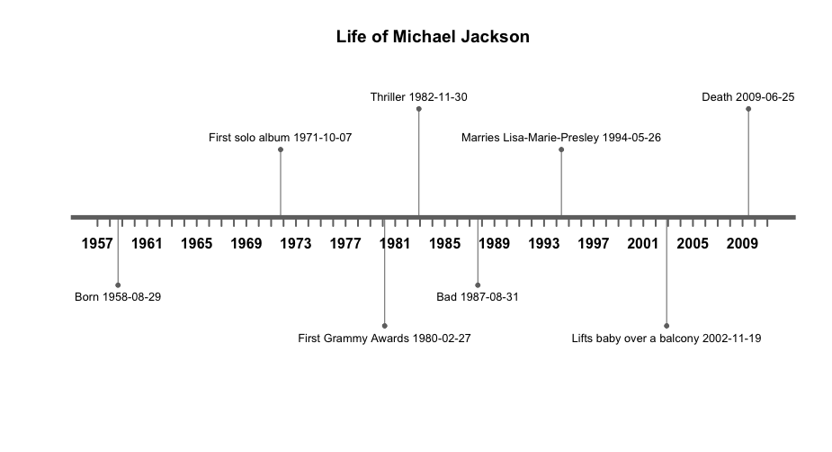
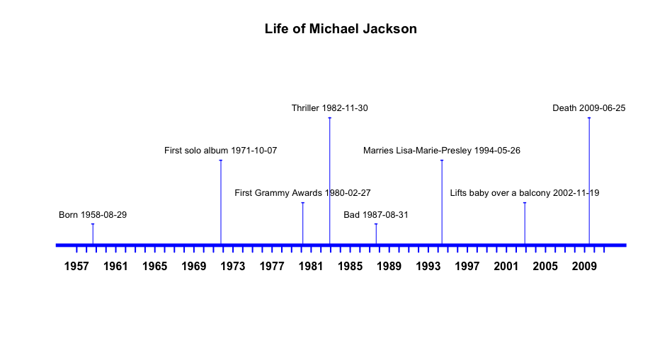
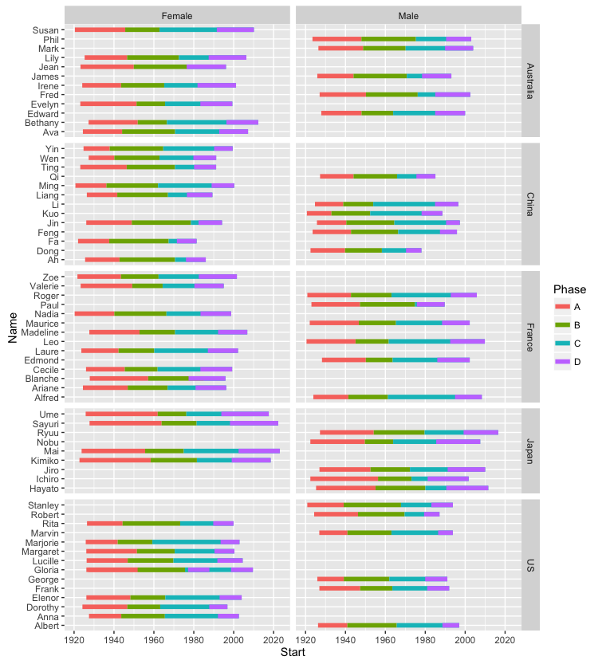
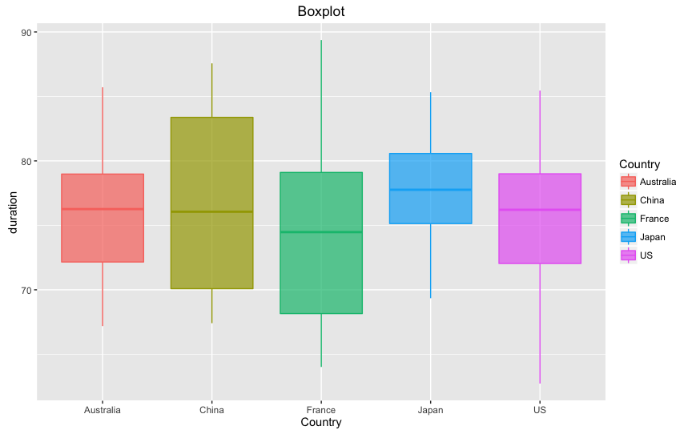
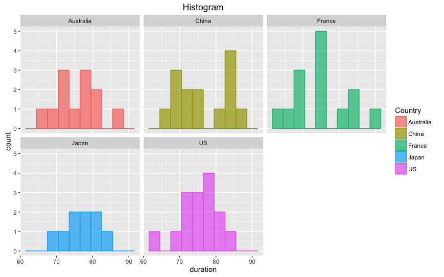
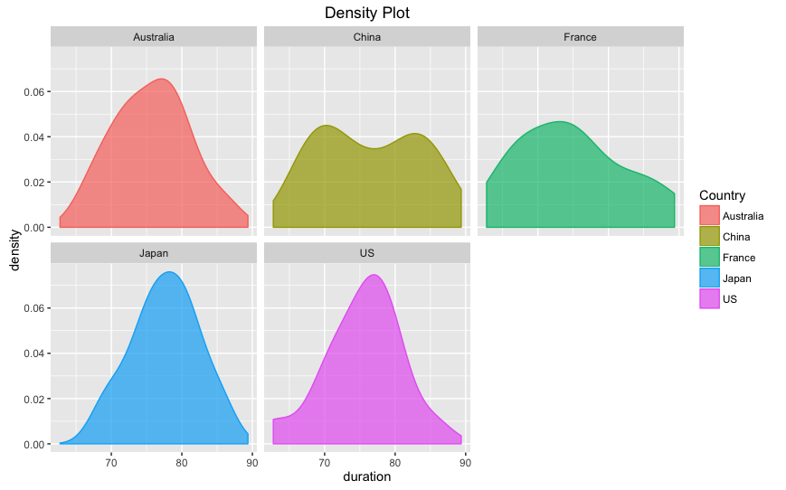
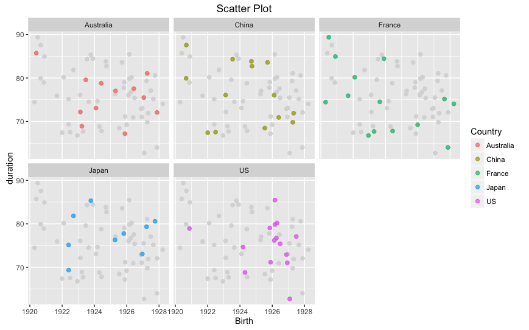
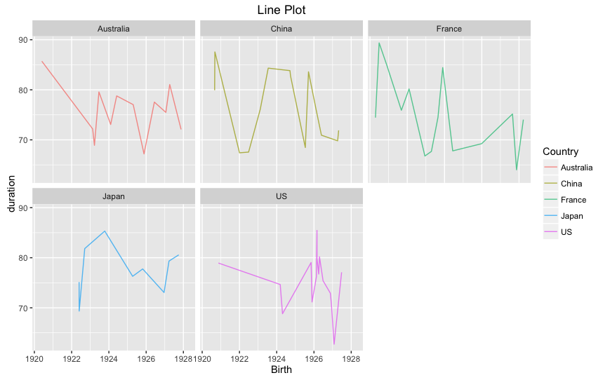

timelineS package | R Documentation

[RDocumentation](https://www.rdocumentation.org/)

- [R Enterprise Training](https://www.datacamp.com/groups/business)
- [R package](https://github.com/datacamp/Rdocumentation)
- [Leaderboard](https://www.rdocumentation.org/trends)
- [Sign in](https://www.rdocumentation.org/login?rdr=%2Fpackages%2FtimelineS%2Fversions%2F0.1.1)

# timelineS v0.1.1

NaN

Monthly downloads

99.99th

Percentile

by [Dahee Lee](https://www.rdocumentation.org/collaborators/name/Dahee%20Lee) [View Source](https://www.rdocumentation.org/packages/timelineS/versions/0.1.1/source)

https://www.rdocumentation.org/packages/timelineS

## Timeline and Time Duration-Related Tools

An easy tool for plotting annotated timelines, grouped timelines, and exploratory graphics (boxplot/histogram/density plot/scatter plot/line plot). Filter, summarize date data by duration and convert to calendar units.  

## Readme

# timelineS

> An easy tool for visualizing, annotating, and stratifying time series data.

[](https://travis-ci.org/daheelee/timelineS) [](http://cran.r-project.org/package=timelineS)[](https://cran.r-project.org/package=timelineS)[](http://cran.r-project.org/package=timelineS)

This package contains five functions as below.

- `timelineS`: Plots a horizontal timeline with event descriptions at corresponding dates.
- `timelineG`: Plots faceted timelines for grouped data.
- `durPlot`: Plots boxplot, histogram, density plot, scatter plot, line plot and prints summary statistics for date duration data.
- `durCalc`: Calculates the duration between two dates, use it as a filter to select rows that satisfy the length criteria. Returns the dataset with additional columns regarding the length of durations in different units.
- `durSummary`: Returns summary statistics for date duration data.

## Install

- from [CRAN](https://cran.r-project.org/package=timelineS):

```
install.packages("timelineS")

```

- latest version on [GitHub](https://github.com/daheelee/timelineS):

```
devtools::install_github("daheelee/timelineS")

```

## Usage example

### timelineS

`timelineS` plots an annotated timeline.

```
timelineS(mj_life, main = "Life of Michael Jackson")

```



You can also change the aesthetics.

```
timelineS(mj_life, main = "Life of Michael Jackson", 
label.direction = "up", label.length = c(0.2,0.8,0.4,1.2), label.position = 3, 
line.color = "blue", label.color = "blue", point.color = "blue", pch = "-")

```



### timelineG

`timelineG` creates stacked timelines, faceted by groups.

```
timelineG(df=life_country, start="Start", end="End", names="Name", 
phase="Phase", group1="Country", group2="Gender")

```



### durPlot

`durPlot` function gives five different plots by default. You can set `facet=TRUE` to get faceted plots.

```
durPlot(life_exp, start="Birth", end="Death", group="Country", timeunit="years", facet=TRUE, binwidth=3, alpha=0.7, title=TRUE)

```

 

`durPlot` also gives a summary of the duration lengths with the plots.

### durSummary

`durSummary` is a simpler function if you only want the summary.

```
durSummary(life_exp, start="Birth", end="Death", group="Country", timeunit="years")

```

```
    Country   min   Qt1 median  mean   Qt3   max   sd
1 Australia 67.19 72.16  76.26 75.72 78.98 85.71 5.30
2     China 67.41 70.09  76.06 76.44 83.38 87.56 7.14
3    France 64.02 68.16  74.48 74.89 79.10 89.37 7.59
4     Japan 69.35 75.14  77.76 77.63 80.57 85.33 4.82
5        US 62.73 72.04  76.21 75.35 79.00 85.45 5.49

```

### durCalc

`durCalc` filters a data frame using duration lengths. Let's say we have a dataset that has dates of birth and death of people. We can filter out people(rows) who lived longer than 85 years. You can also do `filterlonger=FALSE` to select rows that are shorter than some time length.

```
durCalc(life_exp, start="Birth", end="Death", timeunit="years", filterlength=85)

```

The output has a few extra duration information in specified `timeunit` and also in calendar units.

```
     Name   Country Gender      Birth      Death  days diff_years            diff_length             longer_by
8   Susan Australia Female 1920-05-26 2006-02-10 31306      85.71 85years 8months 16days        8months 16days
19    Mai     Japan Female 1923-10-12 2009-02-07 31165      85.33 85years 3months 27days        3months 27days
24    Leo    France   Male 1920-06-28 2009-11-09 32641      89.37 89years 4months 12days 4years 4months 12days
48 Gloria        US Female 1926-03-01 2011-08-14 31212      85.45 85years 5months 14days        5months 14days
60   Ming     China Female 1920-09-06 2008-03-31 31983      87.56 87years 6months 24days 2years 6months 24days

```

If you want to know how old each person would be as of January 1, 2000, you can do:

```
durCalc(life_exp, start="Birth", end=as.Date("2000-1-1"), timeunit="years")

```

```
      Name   Country Gender      Birth      Death  days             diff_length
1    Edward Australia   Male 1927-11-17 1999-12-16 26343   72years 1month 15days
2     James Australia   Male 1925-11-20 1993-01-27 27070   74years 1month 11days
3      Mark Australia   Male 1926-06-11 2003-12-26 26867  73years 6months 21days
4      Fred Australia   Male 1927-01-22 2002-07-19 26642  72years 11months 9days
5      Phil Australia   Male 1923-06-20 2003-01-15 27954  76years 6months 12days
...

```

Or you can simply use this as a unit-converter between two dates.

```
durCalc(start=as.Date("2010-12-1"), end=as.Date("2015-4-26"), timeunit="weeks")

```

```
 days diff_weeks           diff_length
1 1607     229.57 4years 4months 24days

```

## Release History

- 0.1.0
    - First upload

## Meta

Dahee Lee – [dhlee99@gmail.com](https://github.com/daheelee/timelineS/blob/master/mailto:dhlee99@gmail.com)

Distributed under the GPL-2 license.

[https://github.com/daheelee/timelineS](https://github.com/daheelee/)

## Functions in timelineS

| Name | Description |
| --- | --- |
| [timelineS](https://www.rdocumentation.org/packages/timelineS/versions/0.1.1/topics/timelineS) | Timeline with Event Labels |
| [durSummary](https://www.rdocumentation.org/packages/timelineS/versions/0.1.1/topics/durSummary) | Summary for Date Duration Data |
| [mj_life](https://www.rdocumentation.org/packages/timelineS/versions/0.1.1/topics/mj_life) | Data for timelineS function example in timelineS package |
| [durCalc](https://www.rdocumentation.org/packages/timelineS/versions/0.1.1/topics/durCalc) | Filter Dataset by Date Duration |
| [durPlot](https://www.rdocumentation.org/packages/timelineS/versions/0.1.1/topics/durPlot) | Graphs and Summary for Date Durations |
| [timelineG](https://www.rdocumentation.org/packages/timelineS/versions/0.1.1/topics/timelineG) | Faceted Timelines for Grouped Data |
| [life_country](https://www.rdocumentation.org/packages/timelineS/versions/0.1.1/topics/life_country) | Data for timelineGroup function example in timelineS package |
| [life_exp](https://www.rdocumentation.org/packages/timelineS/versions/0.1.1/topics/life_exp) | Data for examples in timelineS package |

## Last month downloads

No Data Available.

## Details

|     |     |
| --- | --- |
| Type | Package |
| Date | 2016-08-21 |
| URL | [https://github.com/daheelee/timelineS](https://github.com/daheelee/timelineS) |
| BugReports | [https://github.com/daheelee/timelineS/issues](https://github.com/daheelee/timelineS/issues) |
| License | GPL-2 |
| LazyData | TRUE |
| RoxygenNote | 5.0.1 |
| NeedsCompilation | no  |
| Packaged | 2016-08-22 03:40:55 UTC; Dahee |
| Repository | CRAN |
| Date/Publication | 2016-08-22 14:13:31 |

|     |     |
| --- | --- |
| imports | [base](https://www.rdocumentation.org/packages/base) , [dplyr](https://www.rdocumentation.org/packages/dplyr) , [ggplot2](https://www.rdocumentation.org/packages/ggplot2) , [graphics](https://www.rdocumentation.org/packages/graphics) , [lubridate](https://www.rdocumentation.org/packages/lubridate) , [magrittr](https://www.rdocumentation.org/packages/magrittr) , [stats](https://www.rdocumentation.org/packages/stats) |
| depends | [R (>= 3.1.0)](https://www.rdocumentation.org/packages/R) |
| Contributors | [Dustin Tingley](https://www.rdocumentation.org/collaborators/name/Dustin%20Tingley), [Dahee Lee](https://www.rdocumentation.org/collaborators/name/Dahee%20Lee) |

#### Include our badge in your README

#### 


`[](http://www.rdocumentation.org/packages/timelineS)`

[API documentation](https://www.rdocumentation.org/docs)

[R package](https://github.com/datacamp/rdocumentation)

[Rdocumentation.org](https://github.com/datacamp/rdocumentation-app)

Created by [DataCamp.com](https://www.datacamp.com)

Put your R skills to the test [Start Now](https://www.datacamp.com/signal)