Refereed Publications | Georges Lab

 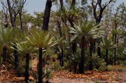 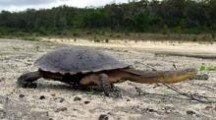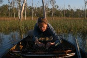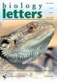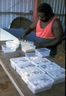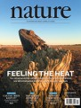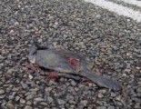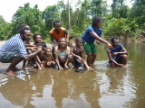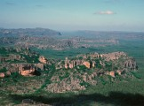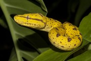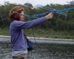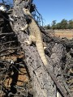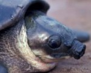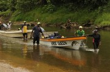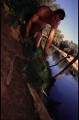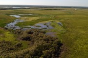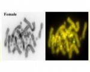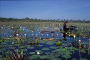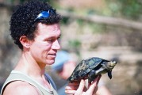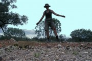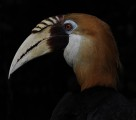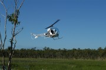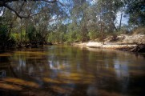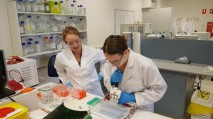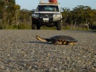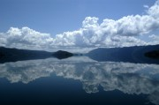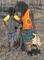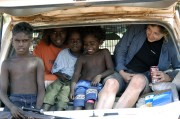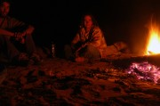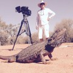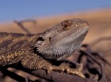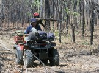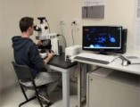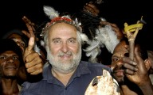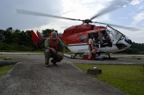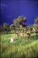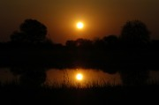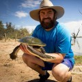

  

*   [Home](http://georges.biomatix.org)
*   [NewsBlog](http://georges.biomatix.org/blog)
*   [People](http://georges.biomatix.org/people)
*   [Publications](http://georges.biomatix.org/publications)
*   [Grants](http://georges.biomatix.org/grants)
*   [Projects](http://georges.biomatix.org/projects)
*   [Resources](http://georges.biomatix.org/resources)
*   [Links](http://georges.biomatix.org/links)
*   [Contact](http://georges.biomatix.org/contact)

[View All Research Outputs](http://georges.biomatix.org/publications/all)

## Refereed Publications

*   [2019](#year-2019)
*   [2018](#year-2018)
*   [2017](#year-2017)
*   [2016](#year-2016)
*   [2015](#year-2015)
*   [2014](#year-2014)
*   [2013](#year-2013)
*   [2012](#year-2012)
*   [2011](#year-2011)
*   [2010](#year-2010)
*   [2009](#year-2009)
*   [2008](#year-2008)
*   [2007](#year-2007)
*   [2006](#year-2006)
*   [2005](#year-2005)
*   [2004](#year-2004)
*   [2003](#year-2003)
*   [2002](#year-2002)
*   [2001](#year-2001)
*   [2000](#year-2000)
*   [1999](#year-1999)
*   [1998](#year-1998)
*   [1997](#year-1997)
*   [1996](#year-1996)
*   [1995](#year-1995)
*   [1994](#year-1994)
*   [1993](#year-1993)
*   [1992](#year-1992)
*   [1991](#year-1991)
*   [1990](#year-1990)
*   [1989](#year-1989)
*   [1988](#year-1988)
*   [1986](#year-1986)
*   [1985](#year-1985)
*   [1983](#year-1983)
*   [1982](#year-1982)
*   [1979](#year-1979)

### 2019

Bower, D., Lips, K.R., Amepou, Y., Richards, S., Dahl, C., Nagombi, E., Supima, M., Dabek, L., Alford, R., Schwarzkopf, L., Ziembicki, M., Noro, J.N., Hamidy, Gillespie, G.R., A., Berger, L., Eisemberg, C., Li, Y., Lui, X., Jennings. C.K., Tjaturadi, B., Peters, A., Krockenberger, A.K., Nason, D., Kusrini, M.D., Webb, R.J., Skerratt, L.F., Banks, C., Mack, A.L., Georges, A., Clulow, S. 2019. Island of Opportunity: Can New Guinea protect amphibians from a globally emerging pathogen? Frontiers in Ecology and the Environment 17:348-354. \[[pdf](http://georges.biomatix.org/storage/app/uploads/public/5cf/acf/6f6/5cfacf6f6abc3254683027.pdf)\]

Capraro, A., O'Meally, D., Waters, S.A., Patel, H.R., Georges, A. and Waters, P.D. 2019. Waking the sleeping dragon: transcriptional profiling of a hibernating reptile. BMC Genomics 20:460. \[[pdf](http://georges.biomatix.org/storage/app/uploads/public/5cf/ac9/f58/5cfac9f58a47b557469234.pdf)\]

Castelli, M., Whiteley, S., Georges, A. and Holleley, C.E. 2019. Cellular calcium and redox regulation: The mediator of vertebrate environmental sex determination? Submitted.

Chessman, B.C., McGilvray, G., Rumming, S., Jones, H.A., Petrov, K., Fielder, D.P., Spencer, R-J and Georges, A. 2019. On a razor’s edge: status and prospects of the critically endangered Bellinger River snapping turtle, &lt;i&gt;Myuchelys georgesi&lt;/i&gt; Aquatic Conservation, in press.

Doucette, L., Duncan, R.P., Osborne, W.S., Evans, M., Georges, A., Gruber, B. and Sarre, S.D. 2019. Warming reduces activity time and increases vulnerability to climate change in a temperate lizard submitted

Georges, A., Doody, J.S., Young, J. and Beggs, K. 2019. Reptiles with TSD: How the physical and the physiological can combine to overcome climate change. Submitted.

Jones, M.E.H., Pistevos, J.C.A., Cooper, N.H., Lappin, A.K., Georges, A., Hutchinson, M.N. and Holleley, C.E. 2019. Reproductive phenotype predicts adult bite-force performance in sex-reversed dragons. In review.

Kehlmaier, C., Zhang, X., Georges, A., Campbell, P.D., Thomson, S. and Fritz, U. 2019. Mitogenomics of historical type specimens of Australasian turtles: clarification of taxonomic confusion and old mitochondrial introgression. Scientific Reports 9:5841. \[[pdf](http://georges.biomatix.org/storage/app/uploads/public/5cf/ad1/785/5cfad1785e311485008229.pdf)\]

Matsubara, K., O’Meally, D., Sarre, S.D., Georges, A., Matsuda, Y., Graves, J.A.M., Srikulnath, K., Ezaz, T. 2019. ZW sex chromosomes in Australian dragon lizards (Agamidae) originated from a combination of duplication and translocation in the nucleolar organizing region. Genes 10:861 \[[pdf](http://georges.biomatix.org/storage/app/uploads/public/5db/aaf/f25/5dbaaff250275167430808.pdf)\]

Schwanz, L.E., Georges, A., Holleley, C.E. and Sarre, S.D. 2019. Climate change, sex reversal and lability of sex determining mechanisms Journal of Evolutionary Biology, in review.

Stanford, C. et al. 2019. Turtles in Trouble: Overexploitation and habitat loss are driving the world's turtles and tortoises toward extinction. Submitted.

Talamantes-Becerra, B., Carling, J., Kennedy, K., and Gahan, M., Georges, A. 2019. Identification of bacterial isolates from a public hospital in Australia using complexity-reduced genotyping. Microbiological Methods 160:11-19. \[[pdf](http://georges.biomatix.org/storage/app/uploads/public/5cf/ad4/bb8/5cfad4bb8fcd7753154164.pdf)\]

Unmack, P., Adams, M., Bylemans, J., Hardy, C., Hammer, M. and Georges, A. 2019. Perspectives on the clonal persistence of presumed ‘ghost’ genomes in unisexual or allopolyploid taxa arising via hybridization Scientific Reports 9:4730. \[[pdf](http://georges.biomatix.org/storage/app/uploads/public/5cf/ad3/9be/5cfad39bedd22972853870.pdf)\]

Unmack, P.J., Adams, M., Hammer, M.P., Johnson, J.B., Gruber, B., Gilles, A. and Georges, A. 2019. Plotting for change: an analytic framework to aid decisions on which lineages are candidate species in phylogenomic species discovery. Submitted

Unmack, P.J., Young, M.J., Gruber, B., White, D., Kilian, A., Zhang, X. and Georges, A. 2019. Phylogeography and species delimitation of &lt;i&gt;Cherax destructor&lt;/i&gt; (Decapoda: Parastacidae) using Genome-wide SNPs. Marine and Freshwater Research 70:857–869. \[[pdf](http://georges.biomatix.org/storage/app/uploads/public/5cf/ad4/0f4/5cfad40f452ab988729140.pdf)\]

van Dyke, J.U., Spencer, R-J., Thompson, M.B., Chessman, B., Howard, K. and Georges, A. 2019. Conservation implications of turtle declines in Australia’s Murray River system. Scientific Reports 9:1998. \[[pdf](http://georges.biomatix.org/storage/app/uploads/public/5cf/ad2/09b/5cfad209b7299971855752.pdf)\]

### 2018

Alam, S.M.I, Sarre, S.D., Gleeson, D., Georges,A. and Ezaz, T. 2018. Did Lizards Follow Unique Pathways in Sex Chromosome Evolution? Genes 2018 9(5):239

Georges, A. 2018. Book Review: “Freshwater Turtles of Australia” by John Cann and Ross Sadlier. CSIRO Publishing, Australia. Australian Journal of Zoology 66:84–87. \[[pdf](http://georges.biomatix.org/storage/app/uploads/public/5bd/52b/99c/5bd52b99c4165806504971.pdf)\]

Georges, A. and Holleley, C.E. 2018. How does temperature determine sex? Temperature-responsive epigenetic regulation clarifies a 50-year-old mystery in reptiles. Science 360:601-602 \[[pdf](http://georges.biomatix.org/storage/app/uploads/public/5af/558/608/5af558608d62b538785853.pdf)\]

Georges, A., Gruber, B., Pauly, G.B., White, D., Young, M.J., Kilian, A., Zhang, X., Shaffer, H.B. and Unmack, P.J. 2018. Genome-wide SNP markers breathe new life into phylogeography and species delimitation for the problematic short-necked turtles (Chelidae: Emydura) of eastern Australia. Molecular Ecology 27:5195-5213 \[[pdf](http://georges.biomatix.org/storage/app/uploads/public/5ce/31d/464/5ce31d464fed3159371065.pdf)\]

Georges, A., Spencer, R-J., Killian, A. and Zhang, X. 2018. Assault from all sides: hybridization and introgression threaten the already critically endangered &lt;i&gt;Myuchelys georgesi&lt;/i&gt; (Chelonia: Chelidae) Endangered Species Research 37: 239–247. \[[pdf](http://georges.biomatix.org/storage/app/uploads/public/5c0/078/193/5c0078193909a781891139.pdf)\]

Gruber, B., Unmack, P.J., Berry, O. and Georges, A. 2018. dartR: an R package to facilitate analysis of SNP data generated from reduced representation genome sequencing. Molecular Ecology Resources, 18:691–699 \[[pdf](http://georges.biomatix.org/storage/app/uploads/public/5a5/c55/eaa/5a5c55eaad9e1711293969.pdf)\]

Johnson, R.N., O’Meally, D., Chen, Z., Etherington, G.J., Ho, S.Y.W., Nash, W.J., Grueber, C.E., Cheng, Y., Whittington, C.M., Dennison, S., Peel, E., Haerty, W., O’Neill, R.J., Colgan, D, Russell, T.L., Alquezar-Planas, D.E., Attenbrow, V., Bragg, J.G., Brandies, P.A., Chong, A.Y-Y., Deakin, J.E., di Palma, F., Duda, Z., Eldridge, M.D.B., Ewart, K.M., Hogg, C.J., Frankham, G.J., Georges, A., Gillett, A.K., Govendir, M., Greenwood, A.D., Hayakawa, T., Helgen, K.M, Hobbs, M., Holleley, C.E., Heider, T.N., Jones, E.A., King, A., Madden, D., Graves, J.A.M., Morris, K.M., Neaves, L.E., Patel, H.R., Polkinghorne, A.P., Renfree, M.B.R., Robin, C., Salinas, R., Tsangaras, K., Waters, P.D., Waters, S.A., Wright, B., Wilkins, M.R., Timms, P. and Belov, K. 2018. Adaptation and conservation insights from the koala genome. Nature Genetics 50:1102–1111. \[[pdf](http://georges.biomatix.org/storage/app/uploads/public/5d0/a22/d59/5d0a22d59a638782391618.pdf)\]

Richards, S., Clulow, S., Bower D. and Georges, A. 2018. Herpetofauna of the Wau Creek proposed Wildlife Management Area, Gulf Province, Papua New Guinea. Pp. 83-96 In: Richards, S.J. (Editor). Rapid biological assessments of Wau Creek, Uro Creek and Lake Kutubu: documenting biodiversity values to promote forest conservation in the Kikori River basin, Papua New Guinea. ExxonMobil PNG Limited. Port Moresby. \[[pdf](http://georges.biomatix.org/storage/app/uploads/public/5c0/230/acd/5c0230acd0853584363832.pdf)\]

Spencer, R-J., van Dyke, J., Petrov, K., Ferronato, B., McDougall, F., Austin, M., Keitel, C. and Georges, A. 2018. Profiling a possible rapid extinction event in a long-lived species. Biological Conservation 221:190-197. \[[pdf](http://georges.biomatix.org/storage/app/uploads/public/5aa/88c/433/5aa88c433fcaf804185344.pdf)\]

Stanford, C.B., Rhodin, A.G.J., van Dijk, P.P., Horne', B.D., Blank, T., Goode, E.V., Hudson, R., Mittermeier, R.A., Currylow, A., Eisemberg, C., Frankel, M., Georges, A., Gibbons, P.M., Juvik, J.Ol, Kuchling, G., Luiselli, L., Haitao, S., Singh, S. and Walde, A. 2018. Turtles in Trouble. The World's 25+ Most Endangered Tortoises and Freshwater Turtles -- 2018. Turtle Conservancy, Ojai, California, USA \[[pdf](http://georges.biomatix.org/storage/app/uploads/public/5aa/891/7b4/5aa8917b401a8837066757.pdf)\]

Warner, D., Du, W. and Georges, A. 2018. Developmental plasticity in reptiles: Physiological mechanisms and ecological consequences. Journal of Experimental Zoology 329:153-161 \[[pdf](http://georges.biomatix.org/storage/app/uploads/public/5b4/d4a/0b5/5b4d4a0b5e4e3082006003.pdf)\]

Whiteley, S., Weisbecker, V., Georges, A., Gauthier, A.R.G., Whitehead, D.L. and Holleley, C.E. 2018. Developmental asynchrony and antagonism of sex determination pathways in a lizard with temperature-induced sex reversal. Scientific Reports 8:14892 \[[pdf](http://georges.biomatix.org/storage/app/uploads/public/5cf/ad2/978/5cfad2978e731050921551.pdf)\]

### 2017

Bower, D.S., Lips, K.R., Schwartzkopf, L., Georges, A. and Clulow, S. 2017. Amphibians on the brink. Preemptive policies can protect amphibians from devastating fungal diseases. Science 357:454-455. \[[pdf](http://georges.biomatix.org/storage/app/uploads/public/598/570/20d/59857020d1d14542924636.pdf)\]

Deveson, I.W., Holleley, C.E., Blackburn, J., Graves, J.A.M., Mattick, J.S., Waters, P.D. and Georges, A. 2017. Differential intron retention in Jumonji chromatin modifier genes is implicated in reptile temperature-dependent sex determination Science Advances 3:e1700731. \[[pdf](http://georges.biomatix.org/storage/app/uploads/public/595/451/729/595451729c017118092507.pdf)\]

Ferronato, B.O., Roe, J.H. and Georges, A. 2017. Responses of an Australian freshwater turtle to drought-flood cycles along a natural to urban gradient Austral Ecology 42:442–455 \[[pdf](http://georges.biomatix.org/storage/app/uploads/public/595/e20/5d3/595e205d3a178154551033.pdf)\]

Georges, A. and Guarino, F. 2017. Turtles of Cooper Creek -- Life in the slow lane. Pp. 55-62 in Kingsford, R. (Ed.). Lake Eyre Basin Rivers. Environmental, Social and Economic Importance. CSIRO Publishing, Canberra, Australia. \[[pdf](http://georges.biomatix.org/storage/app/uploads/public/5a0/917/0cc/5a09170cc0146695795117.pdf)\]

Rhodin, A.G.J., Iverson, J.B., Bour, R., Fritz, U, Georges, A, Shaffer, H.B. and van Dijk, P.P \[Turtle Taxonomy Working Group\]. 2017. Turtles of the World: Annotated Checklist and Atlas of Taxonomy, Synonymy, Distribution, and Conservation Status (8th Edition) Chelonian Conservation Monographs 7:1-292. \[[pdf](http://georges.biomatix.org/storage/app/uploads/public/598/525/d26/598525d266c50880989684.pdf)\]

Welsh, M., Doody, J.S. and Georges, A. 2017. Resource partitioning among five sympatric species of freshwater turtles from the wet–dry tropics of northern Australia Wildlife Research 44:219-229. \[[pdf](http://georges.biomatix.org/storage/app/uploads/public/598/15e/434/59815e434669d256568897.pdf)\]

Whiteley, S.L., Holleley, C.E., Ruscoe, W., Castelli, M., Whitehead, D., Lei, J., Georges, A. and Weisbecker, V. 2017. Sex determination mode does not affect body or genital development of the central bearded dragon (Pogona vitticeps). EvoDevo 8:25. \[[pdf](http://georges.biomatix.org/storage/app/uploads/public/5a2/5a9/e97/5a25a9e971dd3644478667.pdf)\]

Zhang, X., Unmack, P., Kuchling, G., Wang, Y. and Georges, A. 2017. Resolution of the enigmatic phylogenetic relationship of the critically endangered Western Swamp Tortoise Pseudemydura umbrina (Pleurodira: Chelidae) using a complete mitochondrial genome. Molecular Phylogenetics and Evolution 115:58–61. \[[pdf](http://georges.biomatix.org/storage/app/uploads/public/598/15d/176/59815d176e75d956805291.pdf)\]

### 2016

Bower, D., Scheltinga, D., Clulow, S., Clulow, J., Franklin, C. and Georges, A. 2016. Salinity tolerances of two Australian freshwater turtles, Chelodina expansa and Emydura macquarii (Testudinata:Chelidae). Conservation Physiology 4: cow42, 1-9. \[[pdf](http://georges.biomatix.org/storage/app/uploads/public/5a0/d2a/5ae/5a0d2a5aeeecc172815356.pdf)\]

Boyle, M., Schwanz, L., Hone, J. and Georges, A. 2016. Dispersal and climate warming determine range shift in model reptile populations. Ecological Modelling 328:34-43. \[[pdf](http://georges.biomatix.org/storage/app/uploads/public/5a0/d2d/544/5a0d2d5443d5f890590376.pdf)\]

Deakin, J., Edwards, M.J., Patel, H., O'Meally, D., Lian, J., Stenhouse, R., Ryan, S., Livernois, A., Azad, B., Holleley, C., Li, Q. and Georges, A. 2016. Anchoring genome sequence to chromosomes of the central bearded dragon (Pogona vitticeps) enables reconstruction of ancestral squamate macrochromosomes and identifies sequence content of the Z chromosome. BMC Genomics 17:447. \[[pdf](http://georges.biomatix.org/storage/app/uploads/public/58a/956/8bb/58a9568bb7ca9423052254.pdf)\]

Famelli, S., Souza, F.L., Georges, A. and Bertoluci, J. 2016. Movement patterns and activity of the Brazilian snake-necked turtle Hydromedusa maximiliani (Testudines: Chelidae) in southeastern Brazil. Amphibia-Reptilia 37:215-228. \[[pdf](http://georges.biomatix.org/storage/app/uploads/public/5a0/d2e/19a/5a0d2e19a654a972942298.pdf)\]

Ferronato, B.O., Marques, T.S., Lara, N.R.F., Masrtinelli, L.A., Verdade, L.M., Comargo, P.B., Roe, J.H. and Georges, A. 2016. Isotopic niche in the eastern long-necked turtle Chelodina longicollis (Testudines: Chelidae) along a natural-urban gradient in southeastern Australia. Herpetological Journal 26:297-304. \[[pdf](http://georges.biomatix.org/storage/app/uploads/public/58a/0f9/e17/58a0f9e17d95a081917555.pdf)\]

Ferronato, B.O., Roe, J.H. and Georges, A. 2016. Urban hazards: Spatial ecology and survivorship of a turtle in an expanding suburban environment. Urban Ecosystems 19:415-428. \[[pdf](http://georges.biomatix.org/storage/app/uploads/public/5a0/d2f/349/5a0d2f3494bca035569632.pdf)\]

Holleley, CE, Sarre, SD, O'Meally, D. and Georges, A. 2016. Sex reversal in reptiles: reproductive oddity or powerful driver of evolutionary change? Sexual Development doi:10.1159/000450972. \[[pdf](http://georges.biomatix.org/storage/app/uploads/public/5ce/5de/7f6/5ce5de7f61ab5394779748.pdf)\]

Li, H., Holleley, C.E., Elphick, M., Georges, A. and Shine, R. 2016. The behavioural consequences of sex reversal in dragons. Proceedings of the Royal Society London, Series B 283: 20160217. \[[pdf](http://georges.biomatix.org/storage/app/uploads/public/58a/955/6d2/58a9556d22a59169206581.pdf)\]

Livernois, A., Hardy, K. Domaschenz, R, Papankilaou, A, Georges, A., Sarre, S., Rao, S., Ezaz, T. and Deakin, J. 2016. Identification of interleukin genes in Pogona vitticeps using a de novo transcriptome assembly from RNA-Seq data Immunogenetics 68:719–731. \[[pdf](http://georges.biomatix.org/storage/app/uploads/public/58a/953/1f3/58a9531f33ab3584954525.pdf)\]

Matsubara, K., O'Meally, D., Azad, B., Georges, A., Sarre, S.D., Graves, J.A.M., Matsuda, Y. and Ezaz, T. 2016. Amplification of microsatellite repeat motifs is associated with the evolutionary differentiation and heterochromatinization of sex chromosomes in Sauropsida. Chromosoma 125:111-123. \[[pdf](http://georges.biomatix.org/storage/app/uploads/public/58a/951/edc/58a951edcb73d706527375.pdf)\]

Sun, B.J., Li, T., Mu, Y., McGlashan, J.K., Georges, A., Shine, R. and Du, W.G. 2016. Thyroid hormone modulates offspring sex ratio in a turtle with temperature-dependent sex determination. Proceedings of the Royal Society, London, Series B 283:20161026. \[[pdf](http://georges.biomatix.org/storage/app/uploads/public/5a0/d2d/c77/5a0d2dc77cb0d320244018.pdf)\]

Thomson, S. and Georges, A. 2016. A new species of freshwater turtle of the genus Elseya (Testudinata: Pleurodira: Chelidae) from the Northern Territory of Australia. Zootaxa 4061:18-28. \[[pdf](http://georges.biomatix.org/storage/app/uploads/public/5a0/d2e/a00/5a0d2ea008fba588374598.pdf)\]

### 2015

Cann, J., Spencer, R-J., Welsh, M. and Georges, A. 2015. Myuchelys georgesi (Cann, 1997) -- Bellinger River Turtle. Chelonian Research Monographs 5, doi:10.3854/crm.5.091.georgesi.v1.2015. \[[pdf](http://georges.biomatix.org/storage/app/uploads/public/5a0/d2f/df3/5a0d2fdf32cd3263397345.pdf)\]

Eisemberg, C., Rose, M., Yaru, B., Amepou, Y. and Georges, A. 2015. Salinity of the coastal nesting environment and its association with body size in the estuarine pig-nosed turtle. Journal of Zoology, London 295:65-74 \[[pdf](http://georges.biomatix.org/storage/app/uploads/public/5a0/d30/3eb/5a0d303ebf4b2291083901.pdf)\]

Eisemberg, C.C., Amepou, Y., Rose, M., Yaru, B. and Georges, A. 2015. Defining priority areas through social and biological data for the pig-nosed turtle (Carettochelys insculpta) conservation program in the Kikori Region, Papua New Guinea. Journal for Nature Conservation 28:19-25. \[[pdf](http://georges.biomatix.org/storage/app/uploads/public/5a0/d30/809/5a0d3080990c6695440102.pdf)\]

Eisemberg, C.C., Rose, M., Yaru, B. and Georges, A. 2015. Spatial and temporal trends in pig-nosed turtle (Carettochelys insculpta) harvest in Papua New Guinea. Oryx 49:659-668. \[[pdf](http://georges.biomatix.org/storage/app/uploads/public/5a0/d30/e8e/5a0d30e8e3e0b425189570.pdf)\]

Ellis, R. and Georges, A. 2015. An annotated type catalogue of the turtles (Testudines: Pleurodira: Chelidae) in the collection of the Western Australian Museum. Records of the Western Australian Museum 30:52-60 \[[pdf](http://georges.biomatix.org/storage/app/uploads/public/5a0/bb0/1e1/5a0bb01e1eed1290845659.pdf)\]

Ferronato, B.O., Roe, J.H. and Georges, A. 2015. First record of hatchling overwintering in a chelid turtle. Australian Journal of Zoology 63, 287-291. \[[pdf](http://georges.biomatix.org/storage/app/uploads/public/58a/0f9/a52/58a0f9a52857a190777290.pdf)\]

Fielder, D., Chessman, B.C. and Georges, A. 2015. Myuchelys bellii (Gray, 1844) -- Western Saw-shelled Turtle, Bell's Turtle. Chelonian Research Monographs 5(8):088.7, doi:10.3854/crm.5.088.bellii.v1.2015. \[[pdf](http://georges.biomatix.org/storage/app/uploads/public/5a0/d31/893/5a0d31893a127106470461.pdf)\]

Georges, A., Li, Q., Lian, J., O'Meally, D., Deakin, J., Wang, Z., Zhang, P., Fujita, M., Patel, H.R., Holleley, C.E., Zhou, Y., Zhang, X., Matsurbara, K., Waters, P., Graves, J.A.M., Sarre, S.D. and Zhang, G. 2015. High-coverage sequencing and annotated assembly of the genome of the Australian dragon lizard Pogona vitticeps. GigaScience 4:45 \[[pdf](http://georges.biomatix.org/storage/app/uploads/public/58a/956/38f/58a95638f3f3f731183619.pdf)\]

Georges, A., Li, Q., Lian, J., O'Meally, D., Deakin, J., Wang, Z., Zhang, P., Fujita, M., Patel, H.R., Holleley, C.E., Zhou, Y., Zhang, X., Matsurbara, K., Waters, P., Graves, J.A.M., Sarre, S.D. and Zhang, G. 2015. The genome of the Australian dragon lizard Pogona vitticeps. GigaScience Database \[http://gigadb.org/dataset/100166\]

Gonzalez-Orozco, C.E., Mishler, B.D., Miller, J.T., Laffan, S.W., Knerr, N., Unmack, P., Georges, A., Thornhill, A.H., Rosauer, D.F. and Gruber, B. 2015. Assessing biodiversity and endemism using phylogenetic methods across multiple taxonomic groups. Ecology and Evolution 5:5177-5192. \[[pdf](http://georges.biomatix.org/storage/app/uploads/public/5a0/d32/0cd/5a0d320cd34f8052424694.pdf)\]

Hodges, K., Donnellan, S and Georges, A. 2015. Significant genetic structure despite high vagility revealed through mitochondrial phylogeography of an Australian freshwater turtle, Chelodina longicollis. Marine and Freshwater Research 66:1045-1056. \[[pdf](http://georges.biomatix.org/storage/app/uploads/public/5a0/d32/6b9/5a0d326b946b2657359390.pdf)\]

Holleley, C.E., O'Meally, D., Sarre, S.D., Graves, J.A.M., Ezaz, T., Matsubara, K., Azad, B., Zhang, X. and Georges, A. 2015. Sex reversal triggers the rapid transition from genetic to temperature-dependent sex. Nature 523:79-82. \[[pdf](http://georges.biomatix.org/storage/app/uploads/public/58a/94d/40a/58a94d40a1d34803714369.pdf)\]

Koepfli, K.P., Paten, B., Genome 10K Community of Scientists \[incl. Georges, A.\], and OBrien, S.J. 2015. The Genome 10K Project -- A Way Forward. Annual Review of Animal Biosciences 3:57-111 \[[pdf](http://georges.biomatix.org/storage/app/uploads/public/5a0/d32/b85/5a0d32b85be3b484931320.pdf)\]

Rhodin, A.G.J., Kaiser, H., van Dijk, P.P., Wüster, W., O’Shea and Thomson, S. with 74 other authors, including Georges, A. 2015. Comment on Spracklandus Hoser, 2009 (Reptilia, Serpentes, ELAPIDAE): request for confirmation of the availability of the generic name and for the nomenclatural validation of the journal in which it was published (Case 3601; BZN 70:234-237; 71:30-38; 133-1 Bulletin of Zoological Nomenclature 72(1):65-78. \[[pdf](http://georges.biomatix.org/storage/app/uploads/public/5a0/d35/986/5a0d3598607b6515874532.pdf)\]

Spinks, P.Q., Georges, A. and Shaffer, H.B. 2015. Phylogenetic uncertainty and taxonomic re-revisions: an example from the Australian short-necked turtles (Testudines: Chelidae). Copeia 103:536-540 \[[pdf](http://georges.biomatix.org/storage/app/uploads/public/5a0/d35/e0b/5a0d35e0b68ae051717819.pdf)\]

Thomson, S.A., Amepou, Y., Anamiato, J. and Georges, A. 2015. A new species and subgenus of Elseya (Testudines: Pleurodira: Chelidae) from New Guinea. Zootaxa 4006:59-82. \[[pdf](http://georges.biomatix.org/storage/app/uploads/public/5a0/d36/3a8/5a0d363a8b470633651821.pdf)\]

### 2014

Adams, M., Raadik, T., Burridge, C. and Georges, A. 2014. Global biodiversity assessment and hyper-cryptic species complexes: more than one species of elephant in the room? Systematic Biology 63:518-533. \[[pdf](http://georges.biomatix.org/storage/app/uploads/public/5a0/d37/3d0/5a0d373d0ecf1947645164.pdf)\]

Bower, D. and Hodges, K. 2014. Chelodina expansa Gray 1857 -- Broad-Shelled Turtle, Giant Snake-Necked Turtle Chelonian Research Monographs 5: doi:10.3854/crm.5.071.expansa.v1.2014 \[[pdf](http://georges.biomatix.org/storage/app/uploads/public/5a0/d69/228/5a0d69228208f233931154.pdf)\]

Boyle, M., Schwanz, L., Hone, J. and Georges, A. 2014. Under what conditions do climate-driven sex ratios enhance versus diminish population persistence. Ecology and Evolution 4:4522-4533. \[[pdf](http://georges.biomatix.org/storage/app/uploads/public/5a0/d6a/950/5a0d6a9505a82053011937.pdf)\]

Boyle, M., Schwanz, L.E., Hone, J. and Georges, A. 2014. How do climate-linked sex ratios and dispersal limit range boundaries? BMC Ecology 14:19. \[[pdf](http://georges.biomatix.org/storage/app/uploads/public/5a0/d6b/1fb/5a0d6b1fb214c013797802.pdf)\]

Ferronato, B., Roe, J.H. and Georges, A. 2014. Reptile bycatch in a pest-exclusion fence established for wildlife reintroductions Journal for Nature Conservation 22:577-585 \[[pdf](http://georges.biomatix.org/storage/app/uploads/public/5a0/d6b/85d/5a0d6b85dd231277342447.pdf)\]

Georges, A., Zhang, X., Unmack, P., Reid, B.N., Le, M. and McCord, W.P. 2014. Contemporary genetic structure of an endemic freshwater turtle reflects Miocene orogenesis of New Guinea. Biological Journal of the Linnean Society 111:192-208 \[[pdf](http://georges.biomatix.org/storage/app/uploads/public/5a0/d6c/2dd/5a0d6c2dd8d16016416427.pdf)\]

Hodges, K., Donnellan, S and Georges, A. 2014. Phylogeography of the Australian freshwater turtle Chelodina expansa reveals complex relationships among inland and coastal bioregions. Biological Journal of the Linnean Society 111:789-805. \[[pdf](http://georges.biomatix.org/storage/app/uploads/public/5a0/d81/1f6/5a0d811f646df082687623.pdf)\]

Janes, D.E., Organ, C.L., Stiglec, R., O'Meally, D.O., Sarre, S.D., Georges, A., Graves, J.A.M., Valenzuela, N., Literman, R.A., Rutherford, K., Gemmell, N., Iverson, J.B., Tamplin, J.W., Edwards, S.V. and Ezaz, T.E. 2014. Molecular evolution of Dmrt1 accompanies change of sex determining mechanisms in Reptilia. Biology Letters 10:20140809. \[[pdf](http://georges.biomatix.org/storage/app/uploads/public/58a/94f/a81/58a94fa815919208359778.pdf)\]

Kennett, R., Fordham, D.A., Alacs, E., Corey, B. and Georges, A. 2014. Chelodina oblonga Gray 1841 -- Northern Snake-necked Turtle Chelonian Research Monographs 5: doi:10.3854/crm.5.077.oblonga.v1.2014. \[[pdf](http://georges.biomatix.org/storage/app/uploads/public/5a0/d7f/1ad/5a0d7f1ad8c23582712042.pdf)\]

Matsubara K., Gamble T., Matsuda Y., Zarkower D., Sarre S., Georges A., Marshal Graves J. and Ezaz T. 2014. Non-homologous sex chromosomes in two geckos (Gekkonidae: Gekkota) with female heterogamety. Cytogenetic and Genome Research 143:251-258. \[[pdf](http://georges.biomatix.org/storage/app/uploads/public/58a/94e/897/58a94e897f0ee697218910.pdf)\]

Matsubara, K., Sarre, S.D., Georges, A. Matsuda, Y., Graves, J.A.M. and Ezaz, T. 2014. Highly differentiated ZW sex microchromosomes in the Australian Varanus species evolved through rapid amplification of repetitive sequences PLoS One 9(4): e95226. \[[pdf](http://georges.biomatix.org/storage/app/uploads/public/5a0/d82/433/5a0d824335388593562319.pdf)\]

Spencer, R-J, Lim, D., Georges, A., Welsh, M. and Reid, A.M. 2014. The risk of inter-specific competition in Australian short-necked turtles. Ecological Research 29:767-777. \[[pdf](http://georges.biomatix.org/storage/app/uploads/public/5a0/d82/8e0/5a0d828e0b95b118830937.pdf)\]

Todd, E.V., Blair, D., Georges, A., Lukoschek, V. and Jerry, D.R. 2014. A biogeographical history and timeline for the evolution of Australian snapping turtles (Elseya: Chelidae) in Australia and New Guinea. Journal of Biogeography 41:905-918. \[[pdf](http://georges.biomatix.org/storage/app/uploads/public/5a0/d83/fae/5a0d83faee921142396829.pdf)\]

Zhang, X. and Georges, A. 2014. A complete mitochondrial genome sequence for the Australian turtle, Chelodina longicollis obtained using 454-pyrosequencing. Conservation Genetics Resources 6:555-557 \[[pdf](http://georges.biomatix.org/storage/app/uploads/public/5a0/d83/4bb/5a0d834bb630d307529435.pdf)\]

### 2013

Bohm,M., Collen, B., Baillie, J.E.M., Chanson, J., Cox, N., Hammerson, G., Hoffmann, M., Livingstone, S.R., Ram, M., Rhodin, A.G.J., Stuart, S.N., van Dijk, P.P., Young, Y. and 203 additional authors listed in alphabetical order including Georges, A. 2013. The Conservation Status of the World's Reptiles. Biological Conservation 157:372-385. \[[pdf](http://georges.biomatix.org/storage/app/uploads/public/5a0/d87/a07/5a0d87a0719af805086413.pdf)\]

Bower, D.S., Hodges, K.M. and Georges, A. 2013. Salinity of incubation media influences embryonic development of a freshwater turtle. Journal of Comparative Physiology Series B 183:235-241. \[[pdf](http://georges.biomatix.org/storage/app/uploads/public/5a0/d81/54d/5a0d8154d0eeb796878244.pdf)\]

Ezaz, T., Azad, B., O'Meally, D., Young, M.J., Matsubara, K., Edwards, M.J., Zhang, X., Holleley, C.E., Deakin, J.E., Marshall-Graves, J.A., Georges, A., Edwards, S.V. and Sarre, S.D. 2013. Sequence and gene content of a large fragment of a lizard sex chromosome and evaluation of candidate sex differentiating gene R-spondin1. BMC Genomics 14, 899. \[[pdf](http://georges.biomatix.org/storage/app/uploads/public/58a/94d/e48/58a94de48da55165582302.pdf)\]

Ferronato, B.O. and Cruzado, G. 2013. Uses, beliefs and conservation of turtles by Ashaninka indigenous people, central Peru. Chelonian Conservation and Biology 12:308-313. \[[pdf](http://georges.biomatix.org/storage/app/uploads/public/5a0/d88/3b8/5a0d883b811d5546984398.pdf)\]

Ferronato, B.deO, PIГ‘A, C.I., Molina, F.C., Espinosa, R.A. and Morales, V.R. 2013. Feeding habits of Amazonian freshwater turtles (Podocnemididae and Chelidae) from Peru. Chelonian Conservation and Biology 12:119-126. \[[pdf](http://georges.biomatix.org/storage/app/uploads/public/5a0/d88/8ec/5a0d888ecc6d9275149541.pdf)\]

Georges, A. 2013. Commentary: For reptiles with temperature-dependent sex determination, thermal variability may be as important as thermal averages. Animal Conservation 16, 493-494. \[[pdf](http://georges.biomatix.org/storage/app/uploads/public/5a0/d88/ec7/5a0d88ec7e63e613890079.pdf)\]

Le, M., Reid, B., McCord, W., Naro-Maciel, E., Raxworthy, C., Amato, G., Georges, A. 2013. Resolving the phylogenetic history of the short-necked turtles, genera Elseya and Myuchelys (Testudines: Chelidae) from Australia and New Guinea. Molecular Phylogenetics and Evolution, 68:251-258. \[[pdf](http://georges.biomatix.org/storage/app/uploads/public/5a1/930/38c/5a193038c4fb9891855257.pdf)\]

Matsubara, K., Knopp, T., Sarre, S.D., Georges, A. and Ezaz, T. 2013. Karyotypic analysis and FISH mapping of microsatellite motifs reveal highly differentiated XX/XY sex chromosomes in the pink-tailed worm-lizard (Aprasia parapulchella, Pygopodidae, Squamata). Molecular Cytogenetics 6:60. \[[pdf](http://georges.biomatix.org/storage/app/uploads/public/5a0/d81/f43/5a0d81f4364db890036223.pdf)\]

Schwanz, L.E., Ezaz, T., Gruber, B. and Georges, A. 2013. Novel evolutionary pathways of sex determining mechanisms. Journal of Evolutionary Biology 26:2544-2557. \[[pdf](http://georges.biomatix.org/storage/app/uploads/public/5ce/5e3/71b/5ce5e371befaf534608529.pdf)\]

Todd, E.V., Blair, D., Farley, S., Farrington, L., FitzSimmons, N.N., Georges, A., Limpus, C.J. and Jerry, D.R 2013. Contemporary genetic structure reflects historical drainage isolation in an Australian snapping turtle, Elseya albagula. Zoological Journal of the Linnean Society, London, 169, 200-214. \[[pdf](http://georges.biomatix.org/storage/app/uploads/public/5a0/d83/917/5a0d83917c121342255242.pdf)\]

Young, M.J., O'Meally, D., Sarre, S.D., Georges, A. and Ezaz, T. 2013. Molecular cytogenetic map of the central bearded dragon Pogona vitticeps (Squamata: Agamidae). Chromosome Research 21:361-374. \[[pdf](http://georges.biomatix.org/storage/app/uploads/public/58a/94f/df4/58a94fdf48a32298900181.pdf)\]

### 2012

Bower, D., Hutchinson, M. and Georges, A. 2012. Movement and habitat use of Australia's largest snake-necked turtle: implications for water management. Journal of Zoology, London 287:76-80 \[[pdf](http://georges.biomatix.org/storage/app/uploads/public/5a1/930/e84/5a1930e84b568680201860.pdf)\]

Bower, D.S., Death, C. and Georges, A. 2012. Ecological and physiological impacts of salinisation on freshwater turtles of the lower Murray River. Wildlife Research 39:705-710. \[[pdf](http://georges.biomatix.org/storage/app/uploads/public/5a1/931/082/5a19310829c0c301094471.pdf)\]

Ferronato, B.O. and Morales, V.M. 2012. Biology and conservation of the freshwater turtles and tortoises of Peru. IRCF Reptiles and Amphibians 19:103-116.

Fielder, D. and Georges, A. 2012. Mary River Turtle Elusor macrurus Cann and Legler, 1994 In Curtis, L.K. Dennis, A.J., McDonald, K.R., Kyne P.K. and Debus, S.J.S. (Eds) Queensland’s Threatened Animals. (Eds) pp. 201-202. CSIRO Publishing, Melbourne.

Fielder, D., Vernes, K., Alacs, E. and Georges, A. 2012. Mitochondrial variation among Australian freshwater turtles (genus Myuchelys), with special reference to the Endangered M. bellii. Endangered Species Research 17:63-71.

Frere, C.H., Prentis, P.J., Ezaz, T. and Georges, A. 2012. Isolation and characterisation of novel microsatellite and mitochondrial DNA markers for the Eastern Water Dragon (Physignathus lesueurii). Conservation Genetics Resources 4:13-116. \[[pdf](http://georges.biomatix.org/storage/app/uploads/public/58a/950/69f/58a95069f2eaa208301076.pdf)\]

O'Meally, D., Ezaz, T., Georges, A., Sarre, S.D. and Graves, J.A.M. 2012. Are some chromosomes particularly good at sex? Insights from amniotes. Chromosome Research 20:7-19. \[[pdf](http://georges.biomatix.org/storage/app/uploads/public/58a/951/626/58a951626d750504817444.pdf)\]

### 2011

Eisemberg, C.C., Rose, M., Yaru, B. and Georges, A. 2011. Demonstrating decline of an iconic species under sustained indigenous harvest - the pig-nosed turtle (Carettochelys insculpta) in Papua New Guinea. Biological Conservation 144:2282-2288.

Georges, A., Spencer, R.J., Welsh, M., Shaffer, H.B., Walsh, R. and Zhang, X. 2011. Application of the precautionary principle to taxa of uncertain status-the case of the Bellinger River Turtle. Endangered Species Research 14:127-134. \[[pdf](http://georges.biomatix.org/storage/app/uploads/public/5a0/d82/d36/5a0d82d3679d4192352557.pdf)\]

Pusey, B., Cook, B. and Georges, A. 2011. Amphibians and reptiles. Chp 8 in BJ Pusey (Ed.), Aquatic Biodiversity in Northern Australia: Patterns, threats and future. Charles Darwic University Press: Darwin pp 93-110

Quinn, A.E., Sarre, S.D., Ezaz, T., Graves, J.A.M. and Georges, A. 2011. Evolutionary transitions between mechanisms of sex determination in vertebrates. Biology Letters 7:443-448 \[[pdf](http://georges.biomatix.org/storage/app/uploads/public/58a/951/13d/58a95113d25ed268180080.pdf)\]

Reid, B., Le, M., McCord, W., Iverson, J., Georges, A., Bergmann, T., Amato, G., DeSalle, R. and Naro-Maciel, E. 2011. Comparing and combining distance-based and character-based approaches for barcoding turtles. Molecular Ecology Resources 11:956-967.

Roe, J.H., Rees, M. and Georges, A. 2011. Suburbs: Dangers or Drought Refugia for Freshwater Turtle Populations? Journal of Wildlife Management 75:1544-1552. \[[pdf](http://georges.biomatix.org/storage/app/uploads/public/58a/0f7/138/58a0f713866c3140910498.pdf)\]

Sarre, S.D., Ezaz, T. and Georges, A. 2011. Transitions between sex determining systems in reptiles and amphibians. Annual Review of Genomics and Human Genetics 12:391-406. \[[pdf](http://georges.biomatix.org/storage/app/uploads/public/58a/94c/87d/58a94c87dad6a441208804.pdf)\]

Thomson, S., Kennett, R., Tucker, A., Fitzsimmons, N.N., Featherston, P., Alacs, E.A. and Georges, A. 2011. Chelodina burrungandjii Thomson, Kennett and Georges 2000 - Sandstone Snake-necked Turtle. Chelonian Conservation Monographs 5, doi:10.3854/crm.5.056.burrungandjii.v1.2011 \[[pdf](http://georges.biomatix.org/storage/app/uploads/public/5a0/d80/01e/5a0d8001ef1ad717012979.pdf)\]

Wilson-Wilde, L., Norman, J., Robertson, J., Sarre, S.D. and Georges, A. 2011. Australian marsupial species identification. Forensic Science International Genetics Supplement Series 3:e543-e544

### 2010

Alacs, E.A., FitzSimmons, N.N., Robertson, J. and Georges, A. 2010. DNA Detective: A Review of Molecular Approaches to Wildlife Forensics. Forensic Science, Medicine and Pathology 6:180-194

Doody, J.S., Pauza, M., Stewart, B. and Camacho, C. 2010. Nesting behaviour of the Pig-Nosed Turtle, Carettochelys insculpta, in Australia Chelonian Conservation and Biology, 8:185-191

Ezaz, T., Sarre, S.D., O'Meally, D., Graves, J.A.M. and Georges, A. 2010. Sex chromosome evolution in lizards: independent origins and rapid transitions. Cytogenetic and Genome Research 127:249-260. \[[pdf](http://georges.biomatix.org/storage/app/uploads/public/58a/94d/892/58a94d892f7a4095970056.pdf)\]

Georges, A. and Thomson, S. 2010. Diversity of Australasian freshwater turtles, with an annotated synonymy and keys to species. Zootaxa 2496:1-37. \[[pdf](http://georges.biomatix.org/storage/app/uploads/public/5a0/baf/bce/5a0bafbce07ef779715384.pdf)\]

Georges, A., Ezaz, T., Quinn, A.E. and Sarre, S.D. 2010. Are reptiles predisposed to temperature-dependent sex determination? Sexual Development 4:7-15

O'Meally, D., Patel, H.R., Stiglec, R., Sarre, S.D., Georges, A., Graves, J.A.M. and Ezaz, T. 2010. Non-homologous sex chromosomes of birds and snakes share repetitive sequences. Chromosome Research 18:787-800. \[[pdf](http://georges.biomatix.org/storage/app/uploads/public/58a/94e/538/58a94e53833b5312218387.pdf)\]

Quinn, A.E., Ezaz, T., Sarre, S.D., Graves, J.A.M. and Georges, A. 2010. Extension, single-locus conversion and physical mapping of sex chromosome sequences identify the Z microchromosome and pseudo-autosomal region in a dragon lizard, Pogona vitticeps. Heredity 104:410-417 \[[pdf](http://georges.biomatix.org/storage/app/uploads/public/58a/950/e7e/58a950e7ed599194103770.pdf)\]

Roe, J.H. and Georges, A. 2010. Responses of freshwater turtles to drought: The past, present and implications for future climate change in Australia. Chapter 11:175-190 in Gow, K. (Ed). Meltdown: Climate Change, Natural Disasters and other Catastropes-Fears and Concerns for the Future. Nova Science Publishers, New York.

Wilson-Wilde, L., Norman, J., Robertson, J., Sarre, S.D. and Georges, A. 2010. Current issues in species identification for forensic science and the validity of using the cytochrome oxidase I (COI) gene. Forensic Science, Medicine and Pathology 6:233-241.

### 2009

Alacs, E.A., Hillyer, M.J., Georges, A., FitzSimmons, N.N. and Hughes, J.M. 2009. Development of microsatellite markers in the Australasian snake-necked turtle Chelodina rugosa, and cross-species amplification Molecular Ecology Resources 9:350-353.

Buhlmann, K.A., Akre, T.S.B., Iverson, J.B., Karapatakis, D., Mittermeier, R.A., Georges, A., Rhodin, A.G.J., van Dijk, P.P. and Gibbons, J.W. 2009. A global analysis of tortoise and freshwater turtle distributions with identification of priority conservation areas. Chelonian Conservation and Biology 8:116-149

Doody, J.S. 2009. Superficial lizards in cold climates: Nest site choice along an elevational gradient. Austral Ecology 34:7733-779

Doody, J.S., Green, B., Rhind, D., Castellano, C.M., Sims R. and Robinson, T. 2009. Population-level declines in Australian predators caused by an invasive species. Animal conservation 12:46-53

Doody, J.S., Roe, J.H., Mayes, P. and Ishiyama, L. 2009. Telemetry tagging methods for some freshwater reptiles. Marine and Freshwater Research 60:293-298.

Ezaz, T., Moritz, B., Waters, P.D., Graves, J.A.M., Georges, A. and Sarre, S.D. 2009. The ZW sex microchromosomes of an Australian dragon lizard share no homology with those of other reptiles or birds. Chromosome Research 17:965-973 \[[pdf](http://georges.biomatix.org/storage/app/uploads/public/58a/94c/bd4/58a94cbd465fb345309111.pdf)\]

Ezaz, T., Quinn, T.E., Sarre, S.D., O'Meally, D., Georges, A., and Graves, J.A.M. 2009. Molecular marker suggests rapid changes of sex-determining mechanisms in Australian dragon lizards. Chromosome Research 17:91-98. \[[pdf](http://georges.biomatix.org/storage/app/uploads/public/58a/94e/dc6/58a94edc6eaa3647957499.pdf)\]

Fordham, D., Georges, A. and Brook, B. 2009. Experimental evidence for density dependent responses to mortality of snake-necked turtles. Oecologia 159:271-281.

Georges, A. 2009. Comment on the proposed precedence of Chelodina rugosa Ogilby, 1890 (currently Macrochelodina rugosa; Reptilia, Testudines) over Chelodina oblonga Gray, 1841 (Case 3351; see BZN 63: 187-193, 64: 68, 127-128). Bulletin of Zoological Nomenclature 66:in press.

Kennett, R., Roe, J.H., Hodges, K. and Georges, A. 2009. Chelodina longicollis (Shaw 1784): Eastern Long-necked Turtle. Chelonian Research Monographs 5:doi:10.3854/crm.5.031.longicollis.v1.2009.. \[[pdf](http://georges.biomatix.org/storage/app/uploads/public/5a0/d80/4fb/5a0d804fbc21d161869605.pdf)\]

Praschag, P. Holloway, R., Georges, A., Packert, M., Hundsdorfer, A.K. and Fritz, U. 2009. A new subspecies of Batagur affinis (Cantor, 1847), one of the world's most critically endangered chelonians (Testudines: Geoemydidae). Zootaxa 2233:57-68

Quinn, A.E., Radder, R.,S., Sarre, S.D., Georges, A., Ezaz, T. and Shine, R. 2009. Isolation and development of a molecular sex marker for Bassiana duperreyi, a lizard with XX/XY sex chromosomes and temperature-induced sex reversal. Molecular Genetics and Genomics 281:665-672

Rees, M., Roe, J.H. and Georges, A. 2009. Life in the suburbs: behavior and survival of a freshwater turtle in response to drought and urbanization Biological Conservation 142:3172-3181. \[[pdf](http://georges.biomatix.org/storage/app/uploads/public/58a/56a/d10/58a56ad106141067575757.pdf)\]

Roe, J.H., Brinton, A.C. and Georges, A. 2009. Temporal and spatial variation in landscape connectivity for an Australian freshwater turtle in a temporally dynamic wetland system. Ecological Applications 19:1288-1299. \[[pdf](http://georges.biomatix.org/storage/app/uploads/public/58a/0f6/2b4/58a0f62b4f797987096425.pdf)\]

Sarre, S.D. and Georges, A. 2009. Genetics in conservation and wildlife management: A revolution since Caughley. Wildlife Research 36:70-80.

Thomson, S. and Georges, A. 2009. A new genus for Elseya latisternum and related forms of Australian freshwater turtle (Testudines: Pleurodira: Chelidae). Zootaxa 2053:32-42 \[[pdf](http://georges.biomatix.org/storage/app/uploads/public/5aa/886/3fa/5aa8863fa15ec518980371.pdf)\]

### 2008

Alacs, E.A., and Georges, A. 2008. Wildlife across our borders: A review of the illegal trade in Australia. Australian Journal of Forensic Science 40:199-212.

Ezaz, T., O'Meally, D., Quinn, A.E., Sarre, S.D., Georges, A. and Graves, J.A.M. 2008. A simple non-invasive protocol to establish primary cell lines from tail and toe explants for cytogenetic studies in Australian dragon lizards (Squamata: Agamidae). Cytotechnology 58:135-139 \[[pdf](http://georges.biomatix.org/storage/app/uploads/public/58a/952/168/58a952168bffa434368016.pdf)\]

Fordham, D., Georges, A. and Brook, B.W. 2008. Indigenous harvest, exotic pig predation and local persistence of a long-lived vertebrate: managing a tropical freshwater turtle for sustainability and conservation. Journal of Applied Ecology 45:52-62.

Georges, A., Alacs, E.,Pauza, M. Kinginapi, F., Ona, A. and Eisemberg, C. 2008. Freshwater turtles of the Kikori Drainage, Papua New Guinea, with special reference to the pig-nosed turtle, Carettochelys insculpta. Wildlife Research 35:700-711.

Georges, A., Doody, J.S., Eisemberg, C., Alacs, E.A. and Rose, M. 2008. Carettochelys insculpta Ramsay 1886: Pig-nosed Turtle, Fly River Turtle. Chelonian Research Monographs 5:9.1-9.17 \[doi:103854/crm.5.009.insculpta.v1.2008\] \[[pdf](http://georges.biomatix.org/storage/app/uploads/public/5a0/fe6/000/5a0fe60004d4d864849010.pdf)\]

Georges, A., Hone, L.J., and Norris, R.H. 2008. Applied Ecology. Pp. 227-232 in S.E. Jorgensen and B.D. Fath (Eds). &lt;em&gt;Encyclopedia of Ecology&lt;/em&gt;, Volume 1, 1st Edition. Oxford: Elsevier.

Martinez, P. A., Ezaz, T., Valenzuela, N., Georges, A. and Graves, J.A.M. 2008. An XX/XY heteromorphic sex chromosome system in the Australian chelid turtle Emydura macquarii : A new piece in the puzzle of sex chromosome evolution in turtles. Chromosome Research 16:815-825.

Radder, R.S., Quinn, A.E., Georges, A., Sarre, S.D. and Shine, R. 2008. Genetic evidence for the co-occurrence of chromosomal and thermal sex determining systems in a lizard. Biology Letters 4:176-178

Roe, J.H. 2008. Chelodina longicollis (Eastern Long-necked Turtle). Drinking Behavior. Herpetoligical Review 39:212-213. \[[pdf](http://georges.biomatix.org/storage/app/uploads/public/58a/0f7/df7/58a0f7df7a8c8172276341.pdf)\]

Roe, J.H. and Georges, A. 2008. Terrestrial activity, movements, and spatial ecology of an Australian freshwater turtle, Chelodina longicollis in a temporally dynamic wetland system. Austral Ecology 33:1045-1056. \[[pdf](http://georges.biomatix.org/storage/app/uploads/public/58a/0f5/9c1/58a0f59c1be88813740299.pdf)\]

Roe, J.H. and Georges, A. 2008. Maintenance of variable responses for coping with wetland drying in freshwater turtles. Ecology 89:485-494. \[[pdf](http://georges.biomatix.org/storage/app/uploads/public/58a/0f6/770/58a0f67702614357909664.pdf)\]

Roe, J.H., Georges, A. and Green, B. 2008. Energy and water flux during terrestrial estivation and overland movement in a freshwater turtle. Physiological and Biochemical Zoology 81:570-583. \[[pdf](http://georges.biomatix.org/storage/app/uploads/public/58a/0f7/acf/58a0f7acf0285046822872.pdf)\]

### 2007

Alacs, E., Janzen, F.J., Scribner, K.T. 2007. Genetic Issues in Freshwater Turtle and Tortoise Conservation. Chelonian Research Monographs 4:107-123

Doody, J.S., Sims, R.A. and Letnic, M. 2007. Environmental manipulation to avoid a unique predator: Drinking hole excavation in the Agile Wallaby, Macropus agilis Ethology 113:128-136.

Fordham, D., Georges, A. and Brook, B.W. 2007. Demographic response of snake-necked turtles correlates with indigenous harvest and feral pig predation in tropical northern Australia. Journal of Animal Ecology 76:1231-1243.

Fordham, D., Georges, A. and Corey, B. 2007. Optimal conditions for egg storage, incubation and post-hatching growth for the freshwater turtle, Chelodina rugosa: Science in support of an indigenous enterprise. Aquaculture 270:105-114.

McGaugh, S.E., Alacs, A.A., Edwards, S.V., Feldman, C.R.,Georges, A., Sites, J.W. and Valenzuela, N. 2007. From molecules to organisms: Research applications of modern genetic tools for turtle biology and conservation. Chelonian Research Monographs 4:47-72.

Quinn, A.E. 2007. How is the gender of some reptiles determined by temperature? Scientific American, June 2007.

Quinn, A.E., Georges, A., Sarre, S.D., Guarino, F., Ezaz, T., and Graves, J.A.M. 2007. Temperature sex reversal implies sex gene dosage in a reptile. Science 316:411, plus supplement. \[[pdf](http://georges.biomatix.org/storage/app/uploads/public/58a/94c/ef4/58a94cef4db20970556768.pdf)\]

Roe, J.H. and Georges, A. 2007. Heterogeneous wetland complexes, buffer zones and travel corridors: Landscape management for freshwater reptiles. Biological Conservation 135:67-76. \[[pdf](http://georges.biomatix.org/storage/app/uploads/public/58a/0f6/c2e/58a0f6c2e642d933195795.pdf)\]

Shaffer, H.B., Fitzsimmons, N.N., Georges, A. and Rhodin, A. (Eds). 2007. Defining Turtle Diversity: Proceedings of a Workshop on Genetics, Ethics, and Taxonomy of Freshwater Turtles and Tortoises. Executive Summary. Chelonian Research Monographs 4:13-14.

### 2006

Doody, J.S., Green, B., Sims, R., Rhind, D., West, P. and Steer, D. 2006. Indirect impacts of invasive cane toads (Bufo marinus) on nest survival of Pig-nosed Turtles (Carettochelys insculpta). Wildlife Research 33:349-354.

Doody, J.S., Guarino, F., Georges, A., Corey, B., Murray, G. and Ewert, M.W. 2006. Nest site choice compensates for climate effects on sex ratios in a lizard with environmental sex determination. Evolutionary Ecology 20:307-330.

Doody, S., Guarino, E., Harlow, P., Corey, B. and Murray, G. 2006. Quantifying nest site choice in reptiles using hemispherical photography and gap light analysis. Herpetological Review 37:49-52

Ezaz, T., Valenzuela, N., GrГјtzner, F., Miura, I., Burke, R., Georges, A. and Graves, J.A.M. 2006. An XX/XY sex micro-chromosome system in a freshwater turtle, Chelodina longicollis (Testudines: Chelidae) with genotypic sex determination Chromosome Research 14:139-150.

Fordham, D., Georges, A. and Corey, B. 2006. Compensation for inundation-induced embryonic diapause in a freshwater turtle: Achieving predictability in the face of environmental stochasticity. Functional Ecology 20:670-677.

Fordham, D., Georges, A., Corey, B. and Brook, B.W. 2006. Feral pig predation threatens the indigenous harvest and local persistence of snake-necked turtles in northern Australia. Biological Conservation 133:379-388.

Georges, A. and Thomson,, S. 2006. Evolution and Zoogeography of Australian Freshwater Turtles. In: Merrick, J.R., Archer, M., Hickey, G. and Lee, M.S.Y. (eds). Evolution and Biogeography of Australasian Vertebrates. AUSCIPUB (Australian Scientific Publishing) Pty Ltd, Sydney. ISBN 0 9757790 0 1.

Georges, A., Guarino, F. and Bito, B. 2006. Freshwater turtles of the TransFly Region of Papua New Guinea - Notes on diversity, distribution, reproduction, harvest and trade. Wildlife Research 33:373-384.

Georges, A., Guarino, F. and White, M. 2006. Sex ratio variation across populations of a turtle species with genotypic sex determination. Wildlife Research 33:475-480

Kingsford R.T., Georges, A. and Unmack, P.J. 2006. Vertebrates of desert rivers: meeting the challenges of temporal and spatial unpredictability. Pp. 154-200 &lt;em&gt;in&lt;/em&gt; Kingsford, R.T. (Ed). Ecology of Desert Rivers. Cambridge University Press, ISBN-10: 0521818257.

Thomson, S., Georges, A. and Limpus, C.L. 2006. A new species of freshwater turtle in the genus Elseya (Testudines: Chelidae) from central coastal Queensland, Australia. Chelonian Conservation and Biology 5:74-86.

Thomson, S.A. 2006. Case 3351: Chelodina rugosa Ogilby, 1890 (currently Macrochelodina rugosa; Reptilia, Testudines): proposed precedence over Chelodina oblonga Gray, 1841. Bulletin of Zoological Nomenclature 63:187-193.

### 2005

Doody, J.E. and Welsh, M. 2005. First glimpses into the ecology of the red-faced turtle, Emydura victoriae, in tropical Australia. Herpetofauna 35:11-14

Ezaz, T., Quinn, A.E., Miura, I., Sarre, S.D., Georges, A. and Graves, J.A.M. 2005. The dragon lizard Pogona vitticeps has ZZ/ZW micro-sex chromosomes. Chromosome Research 13:763-776. \[[pdf](http://georges.biomatix.org/storage/app/uploads/public/58a/94c/59a/58a94c59a5382697606586.pdf)\]

Georges, A., Beggs, K., Young, J.E. and Doody, J.S. 2005. Modelling reptilian development under fluctuating temperature regimes. Physiological and Biochemical Zoology 78:18-30. \[[pdf](http://georges.biomatix.org/storage/app/uploads/public/5a0/f4c/383/5a0f4c38377ab011321252.pdf)\]

Trembath, D. F. and Freier, D. 2005. Accidental ingestion of barbecue scraps leads to death of a varanid in the northern territory. Herpetofauna 35: 48-49.

Trembath, D.F. and Rowley, J. 2005. An observation of the foraging behaviour of the black whip snake Demansia vestigiata (Serpentes: Elapidae): Succesful predation of a frog Limnodynastes ornatus (Anura: Myobatrachidae) buried underground Herpetofauna. 35: 114-115.

### 2004

Doody, J.S., Georges, A. and Young J.E. 2004. Determinants of reproductive success and offpring sex in a turtle with environmental sex determination. Biological Journal of the Linnean Society, London, 80:1-16.

Georges, A., Doody, J.S., Beggs, K. and Young J.E. 2004. Thermal models of TSD under laboratory and field conditions. Pp. 79-89 in Valenzuela, N. and Lance, V. (Eds). Temperature dependent sex determination in reptiles. Smithsonian Institute, Washington. \[[pdf](http://georges.biomatix.org/storage/app/uploads/public/5a0/f4b/80b/5a0f4b80b3949532240273.pdf)\]

Holloway, R. and H. Sovannara 2004. Geographic Distribution: Batagur baska. Herpetological Review. 35:284.

Sarre, S., Georges, A. and Quinn, A. 2004. The ends of a continuum: Genetic and temperature-dependent sex determination in reptiles. Bioessays 26:639-645.

Trembath, D., Freier, D. and Elliott, J. 2004. Sexual-size dimorphism in Emydura krefftii (Testudines: Chelidae) from Ross River, Townsville, Australia. Herpetological Review 35: 31-34.

Young, J.E., Georges, A., Doody J.S., West P.B. and Alderman R.L. 2004. Pivotal range and thermosensitive period of the pig-nosed turtle, Carettochelys insculpta (Testudines: Carettochelydidae) from northern Australia. Canadian Journal of Zoology 82:1251-1257.

### 2003

Doody, J.S., Georges, A. and Young, J.E. 2003. Twice every second year reproduction in the pig-nosed turtle, Carettochelys insculpta, in the wet-dry tropics of Australia. Journal of Zoology, London 259:179-188. \[[pdf](http://georges.biomatix.org/storage/app/uploads/public/5a1/366/396/5a13663966265743272911.pdf)\]

Doody, J.S., Sims, R. and Georges, A. 2003. Gregarious behaviour does not dilute predation risk in pig-nosed turtles. Copeia 2003:894-898.

Doody, J.S., West, P. and Georges, A. 2003. Beach selection in nesting pig-nosed turtles, Carettochelys insculpta. Journal of Herpetology 37:178-182

Doody, J.S., West, P., Stapley, J., Welsh, M., Tucker, A., Guarino, E., Pauza, M., Bishop, N., Head, M., Dennis, S., West, G., Pepper, A. and A. Jones. 2003. Fauna by-catch in pipeline trenches: Conservation, animal ethics, and current practises in Australia. Australian Zoologist 32:410-419.

Georges, A., Arthington, A.A. and Horwitz, P. 2003. Special Issue: Freshwater Biodiversity in Australia Aquatic Ecosystem Health and Management 6:3-4.

Holloway, R. H. P. 2003. Domestic trade of tortoises and freshwater turtles in Cambodia. Chelonian Biology and Conservation 4:733-734.

### 2002

Doody, J.S., Young, J.E. and Georges, A. 2002. Sex differences in activity and movements in the Pig-Nosed turtle, Carettochelys insculpta, in the wet-dry tropics of Australia. Copeia. 2002:93-103

Georges, A., Adams, M. and McCord, W.P. 2002. Electrophoretic delineation of species boundaries within the genus Chelodina (Testudines: Chelidae) of Australia, New Guinea and Indonesia. Zoological Journal of the Linnean Society 134:401-21.

Guarino, F. 2002. Spatial ecology of a large carnivorous lizard, Varanus varius (Squamata: Varanidae). Journal of Zoology 258:449-57.

Guarino, F., Georges, A. and Green, B. 2002. Variation in energy metabolism and water flux of free-ranging male lace monitors, Varanus varius (Squmata: Varanidae). Physiological and Biochemical Zoology 75:294-304

McCord, W.P. and Thomson, S.A. 2002. A new species of Chelodina (Testudines: Pleurodira: Chelidae) from Northern Australia. Journal of Herpetology. 36:255-67.

### 2001

Doody, J.S., Georges, A., Young, J.E., Pauza, M.D., Pepper, A.L., Alderman, R.L. and Welsh, M.A. 2001. Embryonic aestivation and emergence behaviour in the pig-nosed turtle, Carettochelys insculpta. Canadian Journal of Zoology 79:1062-1072

Doody, J.S., Sims, R.A. and Georges, A. 2001. Use of localized thermal springs to elevate body temperatures by the pig-nosed turtle, Carettochelys insculpta. Chelonian Conservation and Biology 4:81-87

Iverson, J.B., Thomson, S.A. and Georges, A. 2001. Validity of taxonomic changes for turtles proposed by Wells and Wellington Journal of Herpetology. 35:361-368

### 2000

Beggs, K., Young, J., Georges, A. and West, P. 2000. Ageing the eggs and nests of the pig-nosed turtle Carettochelys insculpta from northern Australia. Canadian Journal of Zoology 78:373-392.

Doody, J.S. 2000. Do development equivalents produce phenotypic equivalents? A test of the comparative influences of constant and fluctuating incubation temperatures on phenotypes of hatchling turtles. Chelonian Conservation and Biology, 3:529-531

Doody, J.S. and Georges, A. 2000. A novel technique for gathering turtle nesting and emergence phenology data. Herpetological Review 31:220-222

Thomson S.A. 2000. On the identification of the holotype of Chelodina oblonga (Testudinata: Chelidae) with a discussion of the taxonomic implications. Chelonian Conservation and Biology 3:745-749.

Thomson, S., Kennett, R. and Georges, A. 2000. A new species of long necked turtle (Chelidae:Chelodina) from the sandstone plateau of Arnhem Land, Northern Australia. Chelonian Conservation and Biology 3:675-685 \[[pdf](http://georges.biomatix.org/storage/app/uploads/public/5a0/d7f/c71/5a0d7fc71f6f3733783862.pdf)\]

Thomson, S.A. 2000. A revision of the fossil chelid turtles (Pleurodira) described by C.W. De Vis (1897). Memoirs of the Queensland Museum 45:593-598

### 1999

Allanson, M. and Georges, A. 1999. Diet of a sibling species pair of freshwater turtles, Elseya purvisi and Elseya georgesi (Testudinata: chelidae), from eastern Australia. Chelonian Conservation and Biology 3:473-476.

Georges, A., Birrell, J., Saint, K., McCord, W.P. and Donnellan, S. 1999. A phylogeny for side-necked turtles (Chelonia: Pleurodira) based on mitochondrial and nuclear gene sequence variation. Biological Journal of the Linnean Society, London 67:213-246. \[[pdf](http://georges.biomatix.org/storage/app/uploads/public/5c5/03d/635/5c503d63520df392457616.pdf)\]

Thomson S.A. and Mackness B.S. 1999. Fossil turtles from the early pliocene bluff downs local fauna, with a description of a new species of Elseya Transactions of the Royal Society of South Australia 123:101-105

### 1998

Georges, A. and McInnes, S. 1998. Temperature fails to influence hatchling sex in another genus and species of chelid turtle, Elusor macrurus. Journal of Herpetology 32:596-598.

Podreka, S., Georges, A., Maher, W.A. and Limpus, C.J. 1998. The environmental contaminant DDE fails to influence the outcome of sexual differentiation in the marine turtle Chelonia mydas. Environmental Health Perspectives 106:185-188.

Seddon, J.M., Baverstock, P.R. and Georges, A. 1998. The rate of mitochondrial 12S rRNA gene evolution is similar in freshwater turtles and marsupials. Journal of Molecular Evolution 46:460-464.

### 1997

Barratt, D.G. 1997. Predation by house cats, Felis catus in Canberra, Australia. Prey composition and preference. Wildlife Research 24:263-277.

Doody, J.S. and Taylor, R. 1997. A note on the foraging behaviour of Dendrolaphis punctulatus in the Northern Territory. Herpetofauna. 27:55-56.

Mak, A. and Georges, A. 1997. Benefits of self-paced learning modules for teaching quantitiative methods in environmental science. International Journal of Science Education 19:835-848.

Seddon, J.M., Georges, A., Baverstock, P.R. and McCord, W. 1997. Phylogenetic relationships of chelid turtles (Pleurodira: Chelidae) based on mitochondrial 12S rRNA gene sequence variation. Molecular Phylogenetics and Evolution 7:55-61.

Thomson, S., White, A. and Georges, A. 1997. Re-evaluation of Emydura lavarackorum: Identification of a living fossil. Memoirs of the Queensland Museum 42:327-336.

### 1996

Fortescue, M.E. 1996. Biology of the Little Penguin Eudyptula minor on Bowen Island and other Australian colonies. Pp. 364-394 in Dann, P., Norman, I. and Reilly, P. (eds) The Penguins. Ecology and Management. Surrey Beatty, Chipping North, Sydney

Fortescue, M.E. 1996. Breeding success and foraging patterns of the Little Penguin Eudyptula minor on the east coast of Australia. Pp. 16-17 proceedings of the Third Interantional Penguin Conference, Capetown, South Africa, 2-6 September 1996. African Seabird Group

Georges, A. and Adams, M. 1996. Electrophoretic delineation of species boundaries within the short-necked chelid turtles of Australia. Zoological Journal of the Linnean Society, London 118:241-260.

Graham, T., Georges, A. and McElhinney, N. 1996. Terrestrial migration by the eastern long-necked turtle, Chelodina longicollis from Australia. Journal of Herpetology 30:467-477. \[[pdf](http://georges.biomatix.org/storage/app/uploads/public/589/fdf/3b6/589fdf3b6c238156382889.pdf)\]

Thomson, S. and Georges, A. 1996. Neural bones in chelid turtles. Chelonian Conservation and Biology 2:82-86.

Thomson, S.A., Littlejohn, M.J., Robinson, W.A. and Osborne, W.S. 1996. Taxonomy of the Litoria aurea comples: A re-evaluation of the Southern Tableland populations of the ACT and NSW. In: Pyke, G.H. and Osborne, W.S. (eds). Biology and Conservation of the Green and Golden Bell Frog (Litoria aurea). Australian Zoologist 30:158-169.

### 1995

Barratt, D. 1995. Ecological impacts of domestic cats in the ACT suggested from predation and movement data. Pp. 182-187 in Proceedings of the 10th Australian Vertebrate Pest Control Conference, Hobart, Tasmania, 29 May-2 June 1995

Barratt, D.G. 1995. Predation and movement by house-based domestic cats (Felis catus L.) in suburban and rural habitats: preliminary findings. Pp:181-187 in Bennett, A., Backhouse, G. and Clark, T. (eds). People and Nature Conservation. Perspectives on private land use and endangered species recovery. Beatty and Sons, Sydney.

Cho, G., Georges, A., Worboys, G. Jacoby, C. and Stoutjesdijk, R. 1995. Conservation management and the future. Pp. 179-188, in Cho, G., Stoutjesdijk, R. and Georges, A. (eds) Jervis Bay: A Cultural, Scientific, and Educational Resource. Kowari 5.

Kennett, R. and Georges, A. 1995. The Eastern Long-necked Turtle: Dispersal is the key to survival. Pp. 104-106 in Cho, G., Georges, A. and Stoujesdijk, R. (Eds) (1995). Jervis Bay: A place of cultural, scientific and educational value. Australian Nature Conservation Agency, Canberra.

Meek, P. and Nazer, C. 1995. Vertebrate pests and weeds. Pp. 115-122 in Cho, G., Georges, A, & Stoutjesdijk, R. (eds). Jervis Bay: A Cultural, Scientific and Educational Resource. Kowari 5.

Meek, P.D., Jenkins, D.J., Morris, B., Ardler, A.J. and Hawksby, R.J. 1995. Use of two humane leg-hold traps for catching pest species. Wildlife Research 22:733-739.

### 1994

Fortescue, M.E. 1994. Biology of the Little Penguin Eudyptula minor on Bowen Island and at other Australian colonies: a case for scientific reference reserves. In: Penguins of the World. Surrey Beatty and Sons, Chipping North, NSW.

Georges, A. 1994. Setting conservation priorities for Australian freshwater turtles. In: Lunney, D. and Ayers, D. Herpetology in Australia: A diverse discipline. Trans. Roy. Soc. NSW. Surrey Beatty and Sons, Chipping North.

Georges, A. 1994. The influence of fluctuating temperatures on hatchling sex ratios: a model and proposed test. Pp. 156-162 in James, R. (Ed.). Proceedings of the Australian Marine Turtle Conservation Workshop, Gold Coast, 14-17 November, 1990. Australian Nature Conservation Agency, Canberra.

Georges, A., Limpus, C.J. and Stoutjesdijk, R. 1994. Proportion of development at a temperature, not daily duration of exposure, determines sex in the marine turtle Caretta caretta. Journal of Experimental Zoology 270:432-444. \[[pdf](http://georges.biomatix.org/storage/app/uploads/public/5a0/f50/1c3/5a0f501c33f61116951600.pdf)\]

Sarre, S., Dearn, J. and Georges, A. 1994. The application of fluctuating asymmetry in the monitoring of wildlife populations. Pacific Conservation Biology 1:118-122.

### 1993

Georges, A. and Rose, M. 1993. Conservation biology of the pig-nosed turtle, Carettochelys insculpta. Chelonian Conservation and Biology 1:1-12. \[[pdf](http://georges.biomatix.org/storage/app/uploads/public/5c4/eb3/800/5c4eb3800f132276084800.pdf)\]

Georges, A. and Wombey, J. 1993. Family Carettochelyidae. Pp. 153-156 in Godsell, J. (ed). Fauna of Australia, Volume 2: Amphibia, Reptilia, Aves. Australian Biological Resources Study, DASETT, Canberra. \[[pdf](http://georges.biomatix.org/storage/app/uploads/public/5c4/eb1/038/5c4eb10383011311083767.pdf)\]

Georges, A., Limpus, C.J. and Parmenter, C.J. 1993. Natural History. Pp. 120-128 in Godsell, J. (ed). Fauna of Australia, Volume 2: Amphibia, Reptilia, Aves. Australian Biological Resources Study, DASETT, Canberra. \[[pdf](http://georges.biomatix.org/storage/app/uploads/public/5c4/eb0/cf9/5c4eb0cf9f868076435216.pdf)\]

Kennett, R., Georges, A. and Palmer-Allen, M. 1993. Early developmental arrest during immersion of eggs of a tropical freshwater turtle, Chelodina rugosa (Testudinata: Chelidae), from northern Australia. Australian Journal of Zoology 41:37-45. \[[pdf](http://georges.biomatix.org/storage/app/uploads/public/5a0/d7e/81d/5a0d7e81d86bb642526391.pdf)\]

Legler, J.M. and Georges, A. 1993. Biogeography and Phylogeny. Pp. 129-138 in Godsell, J. (ed). Fauna of Australia, Volume 2: Amphibia, Reptilia, Aves. Australian Biological Resources Study, DASETT, Canberra. \[[pdf](http://georges.biomatix.org/storage/app/uploads/public/5c4/eb1/7b2/5c4eb17b2acf0808975261.pdf)\]

Legler, J.M. and Georges, A. 1993. Chelidae. Pp. 142-152 in Godsell, J. (ed). Fauna of Australia, Volume 2: Amphibia, Reptilia, Aves. Australian Biological Resources Study, DASETT, Canberra. \[[pdf](http://georges.biomatix.org/storage/app/uploads/public/5c4/eb1/b44/5c4eb1b44076d550480903.pdf)\]

Norris, R.H. and Georges, A. 1993. Analysis and interpretation of benthic surveys. In: Resh, V.H. and Rosenberg, D.M., Biomonitoring and Freshwater Benthic Invertebrates. Chapman and Hall, N.Y.

Olsen, J. and Georges, A. 1993. Do peregrine falcon fledglings reach independence during peak abundance of their main prey? Journal of Raptor Research 27:149-153.

### 1992

Fortescue, M.E. 1992. Management of Little Penguin Eudyptula minor nesting habitat. Corella 16:137-154.

Georges, A. 1992. Thermal characteristics and sex determination in field nests of the pig-nosed turtle Carettochelys insculpta (Chelonia: Carettochelydidae) from northern Australia. Australian Journal of Zoology 40:511-521.

Georges, A. and Adams, M. 1992. A phylogeny for Australian chelid turtles based on allozyme electrophoresis. Australian Journal of Zoology 40:453-476.

Kennett, R.M., Georges, A., Thomas, K. and Georges, T.C. 1992. Distribution of the long-necked freshwater turtle Chelodina novaeguineae and information on its ecology. Memoirs of the Queensland Museum 32:179-182. \[[pdf](http://georges.biomatix.org/storage/app/uploads/public/5a0/d80/954/5a0d809540724948534482.pdf)\]

### 1991

Palmer-Allen, M., Beynon, F. and Georges, A. 1991. Hatchling sex ratios are independent of temperature in field nests of the long-necked turtle Chelodina longicollis (Testudinata: Chelidae). Australian Wildlife Research 18:225-231.

### 1990

Kennett, R. and Georges, A. 1990. Habitat utilization and its relationship to growth and reproduction of the eastern long-necked turtle Chelodina longicollis (Testudinata: Chelidae). Herpetologica 46:22-33. \[[pdf](http://georges.biomatix.org/storage/app/uploads/public/5a0/d7e/560/5a0d7e560d15c227009989.pdf)\]

Sarre, S., Schwaner, T.D. and Georges, A. 1990. Genetic variation among populations of the sleepy lizard Trachydosaurus rugosus (Squamata: Scincidae). Australian Journal of Zoology 38:603-616.

### 1989

Georges, A. 1989. Female turtles from hot nests: Is it amount of development or duration of incubation at high temperatures that matters? Oecologia (Berlin) 81:323-328. \[[pdf](http://georges.biomatix.org/storage/app/uploads/public/5db/666/d49/5db666d492cb1296295904.pdf)\]

Georges, A. and Kennett, R. 1989. Dry season distribution and ecology of Carettochelys insculpta (Chelonia: Carettochelydidae) in Kakadu National Park, northern Australia. Australian Wildlife Research 16:323-335. \[[pdf](http://georges.biomatix.org/storage/app/uploads/public/5a0/d7e/ae6/5a0d7eae68e1a775950330.pdf)\]

### 1988

Georges, A. 1988. Sex-determination is independent of temperature in another chelid turtle: Chelodina longicollis. Copeia 1988:248-254. \[[pdf](http://georges.biomatix.org/storage/app/uploads/public/58a/57d/45b/58a57d45b639d066999626.pdf)\]

### 1986

Georges, A., Norris, R.H. and Wensing, L. 1986. Diet of the Eastern Long-necked Tortoise, Chelodina longicollis, from the coastal dune lakes of the Jervis Bay Nature Reserves. Austalian Wildlife Research 13:301-308.

Norris, R.H. and Georges, A. 1986. Design and analysis for assessment of water quality. Pp. 555-572 in Limnology in Australia ed. by P. DeDekker and W.D. Williams. C.S.I.R.O. & Dr W.R. Junk.

### 1985

Georges, A. 1985. Reproduction and reduced body size of reptiles in unproductive insular environments. Pp. 311-318 in Biology of Australasian Frogs and Reptiles ed. by G. Grigg, R. Shine and H. Ehmann. Surrey Beatty & Sons, Sydney. \[[pdf](http://georges.biomatix.org/storage/app/uploads/public/5a1/b6d/3d6/5a1b6d3d6a435463710690.pdf)\]

Hamley, T. and Georges, A. 1985. The Australian Snapping Tortoise Elseya latisternum: A successful predator on the Introduced Cane Toad? Australian Zoologist 21:605-608.

### 1983

Georges, A. 1983. Reproduction of the Australian Freshwater Tortoise, Emydura krefftii (Chelonia: Chelidae). Journal of Zoolology, London 201:331-350.

### 1982

Georges, A. 1982. Diet of the Australian Freshwater Turtle Emydura krefftii (Chelonia: Chelidae), in an unproductive lentic environment. Copeia 1982:331-336.

### 1979

Georges, A. 1979. Head-body temperate differences in the Australian Blue-tongued Lizard, Tiliqua scincoides, during radiant heating. Journal of Thermal Biology 4:213-217.

*   ##### Home
    
*   [Back to Wildlife Genomics](http://wildlifegenomics.biomatix.org)
*   [Publications](http://georges.biomatix.org/publications)
*   [Grants](http://georges.biomatix.org/grants)

*   ##### Projects
    
*   [Sex in Dragons](http://georges.biomatix.org/project/sex-dragons)
*   [Chelid Phylogeography](http://georges.biomatix.org/project/chelid-phylogeography)
*   [Others](http://georges.biomatix.org/projects)

*   ##### Resources
    
*   [Pogona Genome](http://georges.biomatix.org/genomics-uc)
*   [dartR](http://georges.biomatix.org/dartR)
*   [Others](http://georges.biomatix.org/resources)

Provide feedback

[Powered by ](https://octobercms.com)