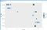
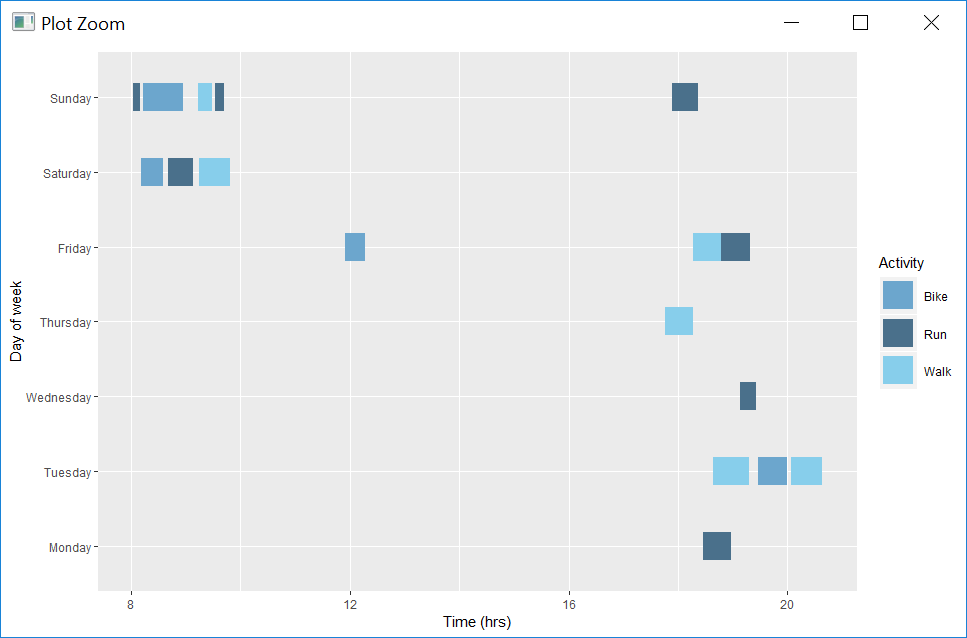
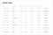
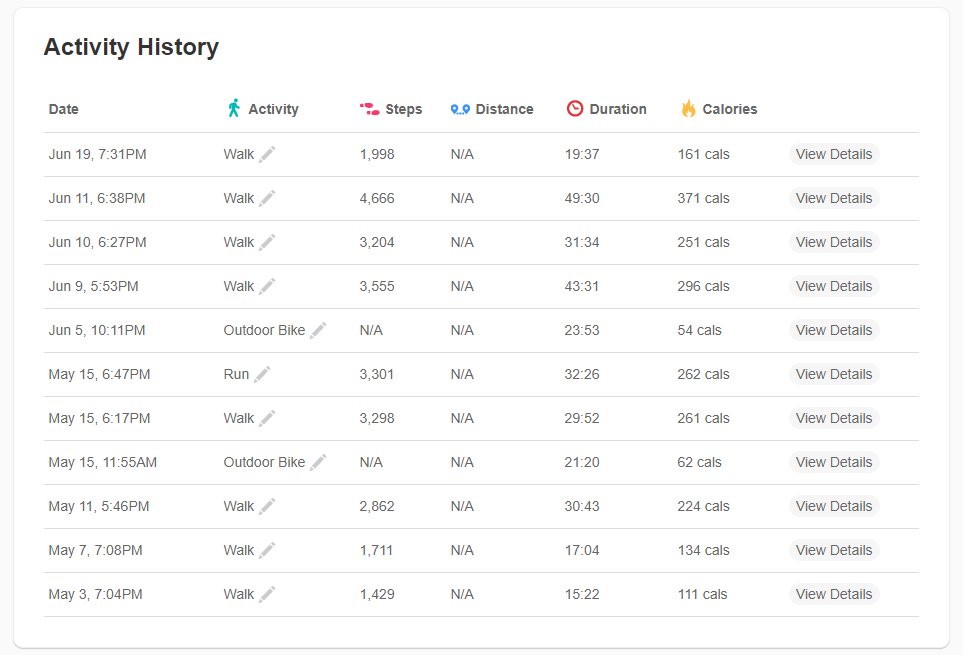

```{r setup, include = FALSE}
knitr::opts_chunk$set(
  collapse = TRUE,
  comment = "#>"
)
```

# My fitness activity

[]

![][(../data/_resources/be2ce28275d64f39b1574975ea5c9bbb.png)](https://medium.com/@jeffgriesemer?source=post_page-----58eeb14af3df----------------------)

Timeline charts are powerful visual tools that display succession of events in chronological order. Several layers of detail can be added to these charts using shapes, labels, colors and shading. Depending on the timeframes, there charts can be designed to look at long term horizons (years) or drill down into an event to provide minute by minute details.

In this article, we will look at how to create timeline charts using R with a sample dataset from Fitbit activity tracking. Fitbit’s web dashboards provide a summary of one’s activity or details of a specific workout session. However, I was more interested in the intraday activity details. Over the course of a week, what are the times when I am active? Are there specific slots where I can be more active? This was the motivation behind my work with the timeline charts.

The finished chart looks like this

```{r}




```

Now, let’s dive into the details

##### Getting the data

The activity history section on the Fitbit’s web page displays duration of activities with their start timestamps. This data can be copied from the webpage into an Excel file. The next step is to import this Excel file into R with the *read_xlsx* function. This will be stored as a data frame. **r*eadxl*** package is required to call this function.

<a id="45ed"></a>d2 <- read\_xlsx(“C:/TImelineCharts2/activityExport.xlsx”,col\_names = TRUE,sheet=2)





##### Data Transformation

The end goal of this step is to get a day of week, start time, end time, calories and activity type from our data frame. *lubridate* and *chron* packages are a great in dealing with timestamp conversations. Name of the day can be derived from the ‘date’ field. Time and duration give us the start and end times of activities.

##### Changing to appropriate data types

<a id="f6c4"></a>d2$Start_time <- chron(times. = format(strptime(d2$Time,”%I:%M %p”),format = “%H:%M:%S”))<a id="36b6"></a>d2$cals <- as.numeric(d2$cals)

#### Converting time to hours

<a id="c412"></a>d2$duration <- hours(d2$Duration)+(minutes(d2$Duration)/60)+(seconds(d2$Duration)/3600)<a id="051d"></a>d2$start\_time <- hours(d2$Start\_time)+(minutes(d2$Start\_time)/60)+(seconds(d2$Start\_time)/3600)

#### End time calculation from start time and duration of activity

<a id="c754"></a>d2$end\_time <- d2$start\_time+d2$duration


geom_segment : creates each activity block

scale\_color\_manual : adds colors by activity type; color types have to be provided manually

scale\_color\_gradient2 : adds color gradient based on calories burnt; more the calories burnt, the darker the shade

<!-- geom\_label\_repel : adds labels to the plot -->

<!-- ggtitle : adds a title to the chart -->

<!-- <a id="13a5"></a>ggplot(d2) +    -->
<!-- geom\_segment(aes(x=start\_time,xend=end_time, y=Day, yend=Day, color=Activity),size=10)+    -->
<!-- scale\_color\_manual(values=colors)+labs(x = “Time (hrs)”)+   -->
<!-- labs(y = “Day of week”) +<a id="afc0"></a>geom\_text\_repel(aes(x=((d2$start_time)+(d2$duration/2)),y=d2$Day,label=round((d2$duration*60),digits=0)), box.padding=1, point.padding=1) +   -->
<!-- ggtitle(“Workout Activity Timeline”) +   -->
<!-- theme(plot.title=element\_text(hjust=0.5),text=element\_text(size=20) -->

<!--  -->

<!-- Zoomed view of a timeline with activity types and duration (min) as labels -->

<!--  -->

## Vignette info

Vignettes are long form documentation commonly included in packages. Because they are part of the distribution of the package, they need to be as compact as possible. The `html_vignette` output type provides a custom style sheet (and tweaks some options) to ensure that the resulting html is as small as possible. The `html_vignette` format:

- Never uses retina figures
- Has a smaller default figure size
- Uses a custom CSS stylesheet instead of the default Twitter Bootstrap style

## Vignette Info

Note the various macros within the `vignette` section of the metadata block above. These are required in order to instruct R how to build the vignette. Note that you should change the `title` field and the `\VignetteIndexEntry` to match the title of your vignette.

## Styles

The `html_vignette` template includes a basic CSS theme. To override this theme you can specify your own CSS in the document metadata as follows:

    output: 
      rmarkdown::html_vignette:
        css: mystyles.css

## Figures

The figure sizes have been customised so that you can easily put two images side-by-side. 

```{r, fig.show='hold'}
plot(1:10)
plot(10:1)
```

You can enable figure captions by `fig_caption: yes` in YAML:

    output:
      rmarkdown::html_vignette:
        fig_caption: yes

Then you can use the chunk option `fig.cap = "Your figure caption."` in **knitr**.

## More Examples

You can write math expressions, e.g. $Y = X\beta + \epsilon$, footnotes^[A footnote here.], and tables, e.g. using `knitr::kable()`.

```{r, echo=FALSE, results='asis'}
knitr::kable(head(mtcars, 10))
```

Also a quote using `>`:

> "He who gives up [code] safety for [code] speed deserves neither."
([via](https://twitter.com/hadleywickham/status/504368538874703872))
